<title>2 Code and project organization</title> <link href="../../page_styles.css" rel="stylesheet" type="text/css"> <link href="../../stylesheet.css" rel="stylesheet" type="text/css">

# 2 Code and project organization

This chapter covers

*   Organizing our code idiomatically
*   Dealing efficiently with abstractions: interfaces and generics
*   Best practices regarding how to structure a project

Organizing a Go codebase in a clean, idiomatic, and maintainable manner isn’t an easy task. It requires experience and even mistakes to understand all the best practices related to code and project organization. What are the traps to avoid (for example, variable shadowing and nested code abuse)? How do we structure packages? When and where do we use interfaces or generics, init functions, and utility packages? In this chapter, we examine common organizational mistakes.

## 2.1 #1: Unintended variable shadowing

The scope of a variable refers to the places a variable can be referenced: in other words, the part of an application where a name binding is valid. In Go, a variable name declared in a block can be redeclared in an inner block. This principle, called *variable shadowing*, is prone to common mistakes.

The following example shows an unintended side effect because of a shadowed variable. It creates an HTTP client in two different ways, depending on the value of a `tracing` Boolean:

```
var client *http.Client                          ❶
if tracing {
    client, err := createClientWithTracing()     ❷
    if err != nil {
        return err
    }
    log.Println(client)
} else {
    client, err := createDefaultClient()         ❸
    if err != nil {
        return err
    }
    log.Println(client)
}
// Use client
```

❶ Declares a client variable

❷ Creates an HTTP client with tracing enabled. (The client variable is shadowed in this block.)

❸ Creates a default HTTP client. (The client variable is also shadowed in this block.)

In this example, we first declare a `client` variable. Then, we use the short variable declaration operator (`:=`) in both inner blocks to assign the result of the function call to the inner `client` variables—not the outer one. As a result, the outer variable is always `nil`.

NOTE This code compiles because the inner `client` variables are used in the logging calls. If not, we would have compilation errors such as `client declared` `and` `not` `used`.

How can we ensure that a value is assigned to the original `client` variable? There are two different options.

The first option uses temporary variables in the inner blocks this way:

```
var client *http.Client
if tracing {
    c, err := createClientWithTracing()    ❶
    if err != nil {
        return err
    }
    client = c                             ❷
} else {
    // Same logic
}
```

❶ Creates a temporary variable c

❷ Assigns this temporary variable to client

Here, we assign the result to a temporary variable, `c`, whose scope is only within the `if` block. Then, we assign it back to the `client` variable. Meanwhile, we do the same for the `else` part.

The second option uses the assignment operator (`=`) in the inner blocks to directly assign the function results to the `client` variable. However, this requires creating an `error` variable because the assignment operator works only if a variable name has already been declared. For example:

```
var client *http.Client
var err error                                  ❶
if tracing {
    client, err = createClientWithTracing()    ❷
    if err != nil {
        return err
    }
} else {
    // Same logic
}
```

❶ Declares an err variable

❷ Uses the assignment operator to assign the *http.Client returned to the client variable directly

Instead of assigning to a temporary variable first, we can directly assign the result to `client`.

Both options are perfectly valid. The main difference between the two alternatives is that we perform only one assignment in the second option, which may be considered easier to read. Also, with the second option, we can mutualize and implement error handling outside the `if`/`else` statements, as this example shows:

```
if tracing {
    client, err = createClientWithTracing()
} else {
    client, err = createDefaultClient()
}
if err != nil {
    // Common error handling
}
```

Variable shadowing occurs when a variable name is redeclared in an inner block, but we saw that this practice is prone to mistakes. Imposing a rule to forbid shadowed variables depends on personal taste. For example, sometimes it can be convenient to reuse an existing variable name like `err` for errors. Yet, in general, we should remain cautious because we now know that we can face a scenario where the code compiles, but the variable that receives the value is not the one expected. Later in this chapter, we will also see how to detect shadowed variables, which may help us spot possible bugs.

The following section shows why it is important to avoid abusing nested code.

## 2.2 #2: Unnecessary nested code

A mental model applied to software is an internal representation of a system’s behavior. While programming, we need to maintain mental models (about overall code interactions and function implementations, for example). Code is qualified as readable based on multiple criteria such as naming, consistency, formatting, and so forth. Readable code requires less cognitive effort to maintain a mental model; hence, it is easier to read and maintain.

A critical aspect of readability is the number of nested levels. Let’s do an exercise. Suppose that we are working on a new project and need to understand what the following `join` function does:

```
func join(s1, s2 string, max int) (string, error) {
    if s1 == "" {
        return "", errors.New("s1 is empty")
    } else {
        if s2 == "" {
            return "", errors.New("s2 is empty")
        } else {
            concat, err := concatenate(s1, s2)     ❶
            if err != nil {
                return "", err
            } else {
                if len(concat) > max {
                    return concat[:max], nil
                } else {
                    return concat, nil
                }
            }
        }
    }
}

func concatenate(s1 string, s2 string) (string, error) {
    // ...
}
```

❶ Calls a concatenate function to perform some specific concatenation but may return errors

This `join` function concatenates two strings and returns a substring if the length is greater than `max`. Meanwhile, it handles checks on `s1` and `s2` and whether the call to `concatenate` returns an error.

From an implementation perspective, this function is correct. However, building a mental model encompassing all the different cases is probably not a straightforward task. Why? Because of the number of nested levels.

Now, let’s try this exercise again with the same function but implemented differently:

```
func join(s1, s2 string, max int) (string, error) {
    if s1 == "" {
        return "", errors.New("s1 is empty")
    }
    if s2 == "" {
        return "", errors.New("s2 is empty")
    }
    concat, err := concatenate(s1, s2)
    if err != nil {
        return "", err
    }
    if len(concat) > max {
        return concat[:max], nil
    }
    return concat, nil
}

func concatenate(s1 string, s2 string) (string, error) {
    // ...
}
```

You probably noticed that building a mental model of this new version requires less cognitive load despite doing the same job as before. Here we maintain only two nested levels. As mentioned by Mat Ryer, a panelist on the *Go Time* podcast ([`medium.com/@matryer/line-of-sight-in-code-186dd7cdea88`](https://medium.com/@matryer/line-of-sight-in-code-186dd7cdea88)):

Align the happy path to the left; you should quickly be able to scan down one column to see the expected execution flow.

It was difficult to distinguish the expected execution flow in the first version because of the nested `if`/`else` statements. Conversely, the second version requires scanning down one column to see the expected execution flow and down the second column to see how the edge cases are handled, as figure 2.1 shows.

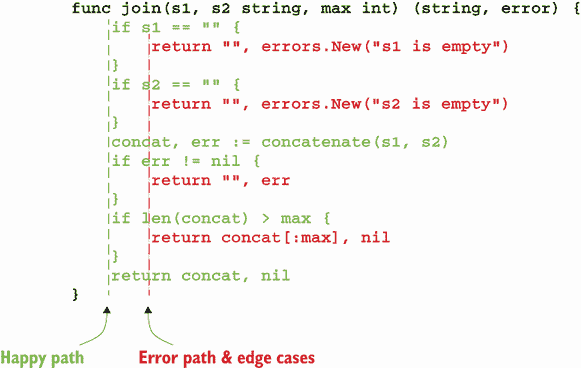

Figure 2.1 To understand the expected execution flow, we just have to scan the happy path column.

In general, the more nested levels a function requires, the more complex it is to read and understand. Let’s see some different applications of this rule to optimize our code for readability:

*   When an `if` block returns, we should omit the `else` block in all cases. For example, we shouldn’t write

    ```
    if foo() {
        // ...
        return true
    } else {
        // ...
    }
    ```

    Instead, we omit the `else` block like this:

    ```
    if foo() {
        // ...
        return true
    }
    // ...
    ```

    With this new version, the code living previously in the `else` block is moved to the top level, making it easier to read.

*   We can also follow this logic with a non-happy path:

    ```
    if s != "" {
        // ...
    } else {
        return errors.New("empty string")
    }
    ```

    Here, an empty `s` represents the non-happy path. Hence, we should flip the condition like so:

    ```
    if s == "" {                           ❶
        return errors.New("empty string")
    }
    // ...
    ```

    ❶ Flips the if condition

    This new version is easier to read because it keeps the happy path on the left edge and reduces the number of blocks.

Writing readable code is an important challenge for every developer. Striving to reduce the number of nested blocks, aligning the happy path on the left, and returning as early as possible are concrete means to improve our code’s readability.

In the next section, we discuss a common misuse in Go projects: init functions.

## 2.3 #3: Misusing init functions

Sometimes we misuse init functions in Go applications. The potential consequences are poor error management or a code flow that is harder to understand. Let’s refresh our minds about what an init function is. Then, we will see when its usage is or isn’t recommended.

### 2.3.1 Concepts

An init function is a function used to initialize the state of an application. It takes no arguments and returns no result (a `func()` function). When a package is initialized, all the constant and variable declarations in the package are evaluated. Then, the init functions are executed. Here is an example of initializing a `main` package:

```
package main

import "fmt"

var a = func() int {
    fmt.Println("var")        ❶
    return 0
}()

func init() {
    fmt.Println("init")       ❷
}

func main() {
    fmt.Println("main")       ❸
}
```

❶ Executed first

❷ Executed second

❸ Executed last

Running this example prints the following output:

```
var
init
main
```

An init function is executed when a package is initialized. In the following example, we define two packages, `main` and `redis`, where `main` depends on `redis`. First, main .go from the `main` package:

```
package main

import (
    "fmt"

    "redis"
)

func init() {
    // ...
}

func main() {
    err := redis.Store("foo", "bar")    ❶
    // ...
}
```

❶ A dependency on the redis package

And then redis.go from the `redis` package:

```
package redis

// imports

func init() {
    // ...
}

func Store(key, value string) error {
    // ...
}
```

Because `main` depends on `redis`, the `redis` package’s init function is executed first, followed by the init of the `main` package, and then the `main` function itself. Figure 2.2 shows this sequence.

We can define multiple init functions per package. When we do, the execution order of the init function inside the package is based on the source files’ alphabetical order. For example, if a package contains an a.go file and a b.go file and both have an init function, the a.go init function is executed first.

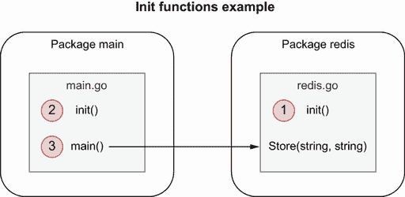

Figure 2.2 The init function of the `redis` package is executed first, then the init function of `main`, and finally the `main` function.

We shouldn’t rely on the ordering of init functions within a package. Indeed, it can be dangerous as source files can be renamed, potentially impacting the execution order.

We can also define multiple init functions within the same source file. For example, this code is perfectly valid:

```
package main

import "fmt"

func init() {               ❶
    fmt.Println("init 1")
}

func init() {               ❷
    fmt.Println("init 2")
}

func main() {
}
```

❶ First init function

❷ Second init function

The first init function executed is the first one in the source order. Here’s the output:

```
init 1
init 2
```

We can also use init functions for side effects. In the next example, we define a `main` package that doesn’t have a strong dependency on `foo` (for example, there’s no direct use of a public function). However, the example requires the `foo` package to be initialized. We can do that by using the `_` operator this way:

```
package main

import (
    "fmt"

    _ "foo"    ❶
)

func main() {
    // ...
}
```

❶ Imports foo for side effects

In this case, the `foo` package is initialized before `main`. Hence, the init functions of `foo` are executed.

Another aspect of an init function is that it can’t be invoked directly, as in the following example:

```
package main

func init() {}

func main() {
    init()       ❶
}
```

❶ Invalid reference

This code produces the following compilation error:

```
$ go build .
./main.go:6:2: undefined: init
```

Now that we’ve refreshed our minds about how init functions work, let’s see when we should use or not use them. The following section sheds some light on this.

### 2.3.2 When to use init functions

First, let’s look at an example where using an init function can be considered inappropriate: holding a database connection pool. In the `init` function in the example, we open a database using `sql.Open`. We make this database a global variable that other functions can later use:

```
var db *sql.DB

func init() {
    dataSourceName :=
        os.Getenv("MYSQL_DATA_SOURCE_NAME")       ❶
    d, err := sql.Open("mysql", dataSourceName)
    if err != nil {
        log.Panic(err)
    }
    err = d.Ping()
    if err != nil {
        log.Panic(err)
    }
    db = d                                        ❷
}
```

❶ Environment variable

❷ Assigns the DB connection to the global db variable

In this example, we open the database, check whether we can ping it, and then assign it to the global variable. What should we think about this implementation? Let’s describe three main downsides.

First, error management in an init function is limited. Indeed, as an init function doesn’t return an error, one of the only ways to signal an error is to panic, leading the application to be stopped. In our example, it might be OK to stop the application anyway if opening the database fails. However, it shouldn’t necessarily be up to the package itself to decide whether to stop the application. Perhaps a caller might have preferred implementing a retry or using a fallback mechanism. In this case, opening the database within an init function prevents client packages from implementing their error-handling logic.

Another important downside is related to testing. If we add tests to this file, the init function will be executed before running the test cases, which isn’t necessarily what we want (for example, if we add unit tests on a utility function that doesn’t require this connection to be created). Therefore, the init function in this example complicates writing unit tests.

The last downside is that the example requires assigning the database connection pool to a global variable. Global variables have some severe drawbacks; for example:

*   Any functions can alter global variables within the package.

*   Unit tests can be more complicated because a function that depends on a global variable won’t be isolated anymore.

In most cases, we should favor encapsulating a variable rather than keeping it global.

For these reasons, the previous initialization should probably be handled as part of a plain old function like so:

```
func createClient(dsn string) (*sql.DB, error) {    ❶
    db, err := sql.Open("mysql", dsn)
    if err != nil {
        return nil, err                             ❷
    }
    if err = db.Ping(); err != nil {
        return nil, err
    }
    return db, nil
}
```

❶ Accepts a data source name and returns an *sql.DB and an error

❷ Returns an error

Using this function, we tackled the main downsides discussed previously. Here’s how:

*   The responsibility of error handling is left up to the caller.

*   It’s possible to create an integration test to check that this function works.

*   The connection pool is encapsulated within the function.

Is it necessary to avoid init functions at all costs? Not really. There are still use cases where init functions can be helpful. For example, the official Go blog ([`mng.bz/PW6w`](http://mng.bz/PW6w)) uses an init function to set up the static HTTP configuration:

```
func init() {
    redirect := func(w http.ResponseWriter, r *http.Request) {
        http.Redirect(w, r, "/", http.StatusFound)
    }
    http.HandleFunc("/blog", redirect)
    http.HandleFunc("/blog/", redirect)

    static := http.FileServer(http.Dir("static"))
    http.Handle("/favicon.ico", static)
    http.Handle("/fonts.css", static)
    http.Handle("/fonts/", static)

    http.Handle("/lib/godoc/", http.StripPrefix("/lib/godoc/",
        http.HandlerFunc(staticHandler)))
}
```

In this example, the init function cannot fail (`http.HandleFunc` can panic, but only if the handler is `nil`, which isn’t the case here). Meanwhile, there’s no need to create any global variables, and the function will not impact possible unit tests. Therefore, this code snippet provides a good example of where init functions can be helpful. In summary, we saw that init functions can lead to some issues:

*   They can limit error management.

*   They can complicate how to implement tests (for example, an external dependency must be set up, which may not be necessary for the scope of unit tests).

*   If the initialization requires us to set a state, that has to be done through global variables.

We should be cautious with init functions. They can be helpful in some situations, however, such as defining static configuration, as we saw in this section. Otherwise, and in most cases, we should handle initializations through ad hoc functions.

## 2.4 #4: Overusing getters and setters

In programming, data encapsulation refers to hiding the values or state of an object. Getters and setters are means to enable encapsulation by providing exported methods on top of unexported object fields.

In Go, there is no automatic support for getters and setters as we see in some languages. It is also considered neither mandatory nor idiomatic to use getters and setters to access struct fields. For example, the standard library implements structs in which some fields are accessible directly, such as the `time.Timer` struct:

```
timer := time.NewTimer(time.Second)
<-timer.C                             ❶
```

❶ C is a

Although it’s not recommended, we could even modify `C` directly (but we wouldn’t receive events anymore). However, this example illustrates that the standard Go library doesn’t enforce using getters and/or setters even when we shouldn’t modify a field.

On the other hand, using getters and setters presents some advantages, including these:

*   They encapsulate a behavior associated with getting or setting a field, allowing new functionality to be added later (for example, validating a field, returning a computed value, or wrapping the access to a field around a mutex).

*   They hide the internal representation, giving us more flexibility in what we expose.

*   They provide a debugging interception point for when the property changes at run time, making debugging easier.

If we fall into these cases or foresee a possible use case while guaranteeing forward compatibility, using getters and setters can bring some value. For example, if we use them with a field called `balance`, we should follow these naming conventions:

*   The getter method should be named `Balance` (not `GetBalance`).

*   The setter method should be named `SetBalance`.

Here’s an example:

```
currentBalance := customer.Balance()     ❶
if currentBalance < 0 {
    customer.SetBalance(0)               ❷
}
```

❶ Getter

❷ Setter

In summary, we shouldn’t overwhelm our code with getters and setters on structs if they don’t bring any value. We should be pragmatic and strive to find the right balance between efficiency and following idioms that are sometimes considered indisputable in other programming paradigms.

Remember that Go is a unique language designed for many characteristics, including simplicity. However, if we find a need for getters and setters or, as mentioned, foresee a future need while guaranteeing forward compatibility, there’s nothing wrong with using them.

Next, we will discuss the problem of overusing interfaces.

## 2.5 #5: Interface pollution

Interfaces are one of the cornerstones of the Go language when designing and structuring our code. However, like many tools or concepts, abusing them is generally not a good idea. Interface pollution is about overwhelming our code with unnecessary abstractions, making it harder to understand. It’s a common mistake made by developers coming from another language with different habits. Before delving into the topic, let’s refresh our minds about Go’s interfaces. Then, we will see when it’s appropriate to use interfaces and when it may be considered pollution.

### 2.5.1 Concepts

An interface provides a way to specify the behavior of an object. We use interfaces to create common abstractions that multiple objects can implement. What makes Go interfaces so different is that they are satisfied implicitly. There is no explicit keyword like `implements` to mark that an object `X` implements interface `Y`.

To understand what makes interfaces so powerful, we will dig into two popular ones from the standard library: `io.Reader` and `io.Writer`. The `io` package provides abstractions for I/O primitives. Among these abstractions, `io.Reader` relates to reading data from a data source and `io.Writer` to writing data to a target, as represented in figure 2.3.

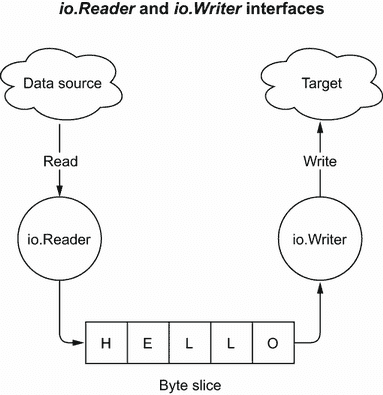

Figure 2.3 `io.Reader` reads from a data source and fills a byte slice, whereas `io.Writer` writes to a target from a byte slice.

The `io.Reader` contains a single `Read` method:

```
type Reader interface {
    Read(p []byte) (n int, err error)
}
```

Custom implementations of the `io.Reader` interface should accept a slice of bytes, filling it with its data and returning either the number of bytes read or an error.

On the other hand, `io.Writer` defines a single method, `Write`:

```
type Writer interface {
    Write(p []byte) (n int, err error)
}
```

Custom implementations of `io.Writer` should write the data coming from a slice to a target and return either the number of bytes written or an error. Therefore, both interfaces provide fundamental abstractions:

*   `io.Reader` reads data from a source.

*   `io.Writer` writes data to a target.

What is the rationale for having these two interfaces in the language? What is the point of creating these abstractions?

Let’s assume we need to implement a function that should copy the content of one file to another. We could create a specific function that would take as input two `*os.File`s. Or, we can choose to create a more generic function using `io.Reader` and `io.Writer` abstractions:

```
func copySourceToDest(source io.Reader, dest io.Writer) error {
    // ...
}
```

This function would work with `*os.File` parameters (as `*os.File` implements both `io.Reader` and `io.Writer`) and any other type that would implement these interfaces. For example, we could create our own `io.Writer` that writes to a database, and the code would remain the same. It increases the genericity of the function; hence, its reusability.

Furthermore, writing a unit test for this function is easier because, instead of having to handle files, we can use the `strings` and `bytes` packages that provide helpful implementations:

```
func TestCopySourceToDest(t *testing.T) {
    const input = "foo"
    source := strings.NewReader(input)            ❶
    dest := bytes.NewBuffer(make([]byte, 0))      ❷

    err := copySourceToDest(source, dest)         ❸
    if err != nil {
        t.FailNow()
    }

    got := dest.String()
    if got != input {
        t.Errorf("expected: %s, got: %s", input, got)
    }
}
```

❶ Creates an io.Reader

❷ Creates an io.Writer

❸ Calls copySourceToDest from a *strings.Reader and a *bytes.Buffer

In the example, `source` is a `*strings.Reader`, whereas `dest` is a `*bytes.Buffer`. Here, we test the behavior of `copySourceToDest` without creating any files.

While designing interfaces, the granularity (how many methods the interface contains) is also something to keep in mind. A known proverb in Go ([`www.youtube.com/watch?v=PAAkCSZUG1c&t=318s`](https://www.youtube.com/watch?v=PAAkCSZUG1c&t=318s)) relates to how big an interface should be:

The bigger the interface, the weaker the abstraction.

—Rob Pike

Indeed, adding methods to an interface can decrease its level of reusability. `io.Reader` and `io.Writer` are powerful abstractions because they cannot get any simpler. Furthermore, we can also combine fine-grained interfaces to create higher-level abstractions. This is the case with `io.ReadWriter`, which combines the reader and writer behaviors:

```
type ReadWriter interface {
    Reader
    Writer
}
```

NOTE As Einstein said, “Everything should be made as simple as possible, but no simpler.” Applied to interfaces, this denotes that finding the perfect granularity for an interface isn’t necessarily a straightforward process.

Let’s now discuss common cases where interfaces are recommended.

### 2.5.2 When to use interfaces

When should we create interfaces in Go? Let’s look at three concrete use cases where interfaces are usually considered to bring value. Note that the goal isn’t to be exhaustive because the more cases we add, the more they would depend on the context. However, these three cases should give us a general idea:

*   Common behavior

*   Decoupling

*   Restricting behavior

Common behavior

The first option we will discuss is to use interfaces when multiple types implement a common behavior. In such a case, we can factor out the behavior inside an interface. If we look at the standard library, we can find many examples of such a use case. For example, sorting a collection can be factored out via three methods:

*   Retrieving the number of elements in the collection

*   Reporting whether one element must be sorted before another

*   Swapping two elements

Hence, the following interface was added to the `sort` package:

```
type Interface interface {
    Len() int               ❶
    Less(i, j int) bool     ❷
    Swap(i, j int)          ❸
}
```

❶ Number of elements

❷ Checks two elements

❸ Swaps two elements

This interface has a strong potential for reusability because it encompasses the common behavior to sort any collection that is index-based.

Throughout the `sort` package, we can find dozens of implementations. If at some point we compute a collection of integers, for example, and we want to sort it, are we necessarily interested in the implementation type? Is it important whether the sorting algorithm is a merge sort or a quicksort? In many cases, we don’t care. Hence, the sorting behavior can be abstracted, and we can depend on the `sort.Interface`.

Finding the right abstraction to factor out a behavior can also bring many benefits. For example, the `sort` package provides utility functions that also rely on `sort.Interface`, such as checking whether a collection is already sorted. For instance,

```
func IsSorted(data Interface) bool {
    n := data.Len()
    for i := n - 1; i > 0; i-- {
        if data.Less(i, i-1) {
            return false
        }
    }
    return true
}
```

Because `sort.Interface` is the right level of abstraction, it makes it highly valuable.

Let’s now see another main use case when using interfaces.

Decoupling

Another important use case is about decoupling our code from an implementation. If we rely on an abstraction instead of a concrete implementation, the implementation itself can be replaced with another without even having to change our code. This is the Liskov Substitution Principle (the *L* in Robert C. Martin’s SOLID design principles).

One benefit of decoupling can be related to unit testing. Let’s assume we want to implement a `CreateNewCustomer` method that creates a new customer and stores it. We decide to rely on the concrete implementation directly (let’s say a `mysql.Store` struct):

```
type CustomerService struct {
    store mysql.Store          ❶
}

func (cs CustomerService) CreateNewCustomer(id string) error {
    customer := Customer{id: id}
    return cs.store.StoreCustomer(customer)
}
```

❶ Depends on the concrete implementation

Now, what if we want to test this method? Because `customerService` relies on the actual implementation to store a `Customer`, we are obliged to test it through integration tests, which requires spinning up a MySQL instance (unless we use an alternative technique such as `go-sqlmock`, but this isn’t the scope of this section). Although integration tests are helpful, that’s not always what we want to do. To give us more flexibility, we should decouple `CustomerService` from the actual implementation, which can be done via an interface like so:

```
type customerStorer interface {      ❶
    StoreCustomer(Customer) error
}

type CustomerService struct {
    storer customerStorer            ❷
}

func (cs CustomerService) CreateNewCustomer(id string) error {
    customer := Customer{id: id}
    return cs.storer.StoreCustomer(customer)
}
```

❶ Creates a storage abstraction

❷ Decouples CustomerService from the actual implementation

Because storing a customer is now done via an interface, this gives us more flexibility in how we want to test the method. For instance, we can

*   Use the concrete implementation via integration tests

*   Use a mock (or any kind of test double) via unit tests

*   Or both

Let’s now discuss another use case: to restrict a behavior.

Restricting behavior

The last use case we will discuss can be pretty counterintuitive at first sight. It’s about restricting a type to a specific behavior. Let’s imagine we implement a custom configuration package to deal with dynamic configuration. We create a specific container for `int` configurations via an `IntConfig` struct that also exposes two methods: `Get` and `Set`. Here’s how that code would look:

```
type IntConfig struct {
    // ...
}

func (c *IntConfig) Get() int {
    // Retrieve configuration
}

func (c *IntConfig) Set(value int) {
    // Update configuration
}
```

Now, suppose we receive an `IntConfig` that holds some specific configuration, such as a threshold. Yet, in our code, we are only interested in retrieving the configuration value, and we want to prevent updating it. How can we enforce that, semantically, this configuration is read-only, if we don’t want to change our configuration package? By creating an abstraction that restricts the behavior to retrieving only a config value:

```
type intConfigGetter interface {
    Get() int
}
```

Then, in our code, we can rely on `intConfigGetter` instead of the concrete implementation:

```
type Foo struct {
    threshold intConfigGetter
}

func NewFoo(threshold intConfigGetter) Foo {    ❶
    return Foo{threshold: threshold}
}

func (f Foo) Bar()  {
    threshold := f.threshold.Get()              ❷
    // ...
}
```

❶ Injects the configuration getter

❷ Reads the configuration

In this example, the configuration getter is injected into the `NewFoo` factory method. It doesn’t impact a client of this function because it can still pass an `IntConfig` struct as it implements `intConfigGetter`. Then, we can only read the configuration in the `Bar` method, not modify it. Therefore, we can also use interfaces to restrict a type to a specific behavior for various reasons, such as semantics enforcement.

In this section, we saw three potential use cases where interfaces are generally considered as bringing value: factoring out a common behavior, creating some decoupling, and restricting a type to a certain behavior. Again, this list isn’t exhaustive, but it should give us a general understanding of when interfaces are helpful in Go.

Now, let’s finish this section and discuss the problems with interface pollution.

### 2.5.3 Interface pollution

It’s fairly common to see interfaces being overused in Go projects. Perhaps the developer’s background was C# or Java, and they found it natural to create interfaces before concrete types. However, this isn’t how things should work in Go.

As we discussed, interfaces are made to create abstractions. And the main caveat when programming meets abstractions is remembering that abstractions *should be discovered, not created*. What does this mean? It means we shouldn’t start creating abstractions in our code if there is no immediate reason to do so. We shouldn’t design with interfaces but wait for a concrete need. Said differently, we should create an interface when we need it, not when we foresee that we could need it.

What’s the main problem if we overuse interfaces? The answer is that they make the code flow more complex. Adding a useless level of indirection doesn’t bring any value; it creates a worthless abstraction making the code more difficult to read, understand, and reason about. If we don’t have a strong reason for adding an interface and it’s unclear how an interface makes a code better, we should challenge this interface’s purpose. Why not call the implementation directly?

NOTE We may also experience performance overhead when calling a method through an interface. It requires a lookup in a hash table’s data structure to find the concrete type an interface points to. But this isn’t an issue in many contexts as the overhead is minimal.

In summary, we should be cautious when creating abstractions in our code—abstractions should be discovered, not created. It’s common for us, software developers, to overengineer our code by trying to guess what the perfect level of abstraction is, based on what we think we might need later. This process should be avoided because, in most cases, it pollutes our code with unnecessary abstractions, making it more complex to read.

Don’t design with interfaces, discover them.

—Rob Pike

Let’s not try to solve a problem abstractly but solve what has to be solved now. Last, but not least, if it’s unclear how an interface makes the code better, we should probably consider removing it to make our code simpler.

The following section continues with this thread and discusses a common interface mistake: creating interfaces on the producer side.

## 2.6 #6: Interface on the producer side

We saw in the previous section when interfaces are considered valuable. But Go developers often misunderstand one question: where should an interface live?

Before delving into this topic, let’s make sure the terms we use throughout this section are clear:

*   *Producer side*—An interface defined in the same package as the concrete implementation (see figure 2.4).

    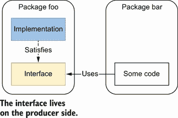

    Figure 2.4 The interface is defined alongside the concrete implementation.

*   *Consumer side*—An interface defined in an external package where it’s used (see figure 2.5).

    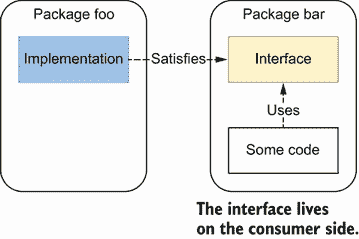

    Figure 2.5 The interface is defined where it’s used.

It’s common to see developers creating interfaces on the producer side, alongside the concrete implementation. This design is perhaps a habit from developers having a C# or a Java background. But in Go, in most cases this is not what we should do.

Let’s discuss the following example. Here, we create a specific package to store and retrieve customer data. Meanwhile, still in the same package, we decide that all the calls have to go through the following interface:

```
package store

type CustomerStorage interface {
    StoreCustomer(customer Customer) error
    GetCustomer(id string) (Customer, error)
    UpdateCustomer(customer Customer) error
    GetAllCustomers() ([]Customer, error)
    GetCustomersWithoutContract() ([]Customer, error)
    GetCustomersWithNegativeBalance() ([]Customer, error)
}
```

We might think we have some excellent reasons to create and expose this interface on the producer side. Perhaps it’s a good way to decouple the client code from the actual implementation. Or, perhaps we can foresee that it will help clients in creating test doubles. Whatever the reason, this isn’t a best practice in Go.

As mentioned, interfaces are satisfied implicitly in Go, which tends to be a game-changer compared to languages with an explicit implementation. In most cases, the approach to follow is similar to what we described in the previous section: *abstractions should be discovered, not created*. This means that it’s not up to the producer to force a given abstraction for all the clients. Instead, it’s up to the client to decide whether it needs some form of abstraction and then determine the best abstraction level for its needs.

In the previous example, perhaps one client won’t be interested in decoupling its code. Maybe another client wants to decouple its code but is only interested in the `GetAllCustomers` method. In this case, this client can create an interface with a single method, referencing the `Customer` struct from the external package:

```
package client

type customersGetter interface {
    GetAllCustomers() ([]store.Customer, error)
}
```

From a package organization, figure 2.6 shows the result. A couple of things to note:

*   Because the `customersGetter` interface is only used in the `client` package, it can remain unexported.

*   Visually, in the figure, it looks like circular dependencies. However, there’s no dependency from `store` to `client` because the interface is satisfied implicitly. This is why such an approach isn’t always possible in languages with an explicit implementation.

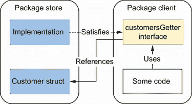

Figure 2.6 The `client` package defines the abstraction it needs by creating its own interface.

The main point is that the `client` package can now define the most accurate abstraction for its need (here, only one method). It relates to the concept of the Interface-Segregation Principle (the *I* in SOLID), which states that no client should be forced to depend on methods it doesn’t use. Therefore, in this case, the best approach is to expose the concrete implementation on the producer side and let the client decide how to use it and whether an abstraction is needed.

For the sake of completeness, let’s mention that this approach—interfaces on the producer side—is sometimes used in the standard library. For example, the `encoding` package defines interfaces implemented by other subpackages such as `encoding/json` or `encoding/binary`. Is the `encoding` package wrong about this? Definitely not. In this case, the abstractions defined in the `encoding` package are used across the standard library, and the language designers knew that creating these abstractions up front was valuable. We are back to the discussion in the previous section: don’t create an abstraction if you think it might be helpful in an imaginary future or, at least, if you can’t prove this abstraction is valid.

An interface should live on the consumer side in most cases. However, in particular contexts (for example, when we know—not foresee—that an abstraction will be helpful for consumers), we may want to have it on the producer side. If we do, we should strive to keep it as minimal as possible, increasing its reusability potential and making it more easily composable.

Let’s continue the discussion about interfaces in the context of function signatures.

## 2.7 #7: Returning interfaces

While designing a function signature, we may have to return either an interface or a concrete implementation. Let’s understand why returning an interface is, in many cases, considered a bad practice in Go.

We just presented why interfaces live, in general, on the consumer side. Figure 2.7 shows what would happen dependency-wise if a function returns an interface instead of a struct. We will see that it leads to issues.

We will consider two packages:

*   `client`, which contains a `Store` interface

*   `store`, which contains an implementation of `Store`

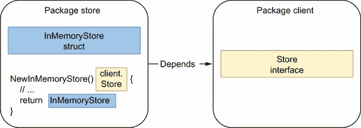

Figure 2.7 There’s a dependency from the `store` package to the `client` package.

In the `store` package, we define an `InMemoryStore` struct that implements the `Store` interface. Meanwhile, we create a `NewInMemoryStore` function to return a `Store` interface. There’s a dependency from the implementation package to the client package in this design, and that may already sound a bit odd.

For example, the `client` package can’t call the `NewInMemoryStore` function anymore; otherwise, there would be a cyclic dependency. A possible solution could be to call this function from another package and to inject a `Store` implementation to `client`. However, being obliged to do that means that the design should be challenged.

Furthermore, what happens if another client uses the `InMemoryStore` struct? In that case, perhaps we would like to move the `Store` interface to another package, or back to the implementation package—but we discussed why, in most cases, this isn’t a best practice. It looks like a code smell.

Hence, in general, returning an interface restricts flexibility because we force all the clients to use one particular type of abstraction. In most cases, we can get inspiration from Postel’s law ([`datatracker.ietf.org/doc/html/rfc761`](https://datatracker.ietf.org/doc/html/rfc761)):

Be conservative in what you do, be liberal in what you accept from others.

—Transmission Control Protocol

If we apply this idiom to Go, it means

*   Returning structs instead of interfaces

*   Accepting interfaces if possible

Of course, there are some exceptions. As software engineers, we are familiar with the fact that rules are never true 100% of the time. The most relevant one concerns the `error` type, an interface returned by many functions. We can also examine another exception in the standard library with the `io` package:

```
func LimitReader(r Reader, n int64) Reader {
    return &LimitedReader{r, n}
}
```

Here, the function returns an exported struct, `io.LimitedReader`. However, the function signature is an interface, `io.Reader`. What’s the rationale for breaking the rule we’ve discussed so far? The `io.Reader` is an up-front abstraction. It’s not one defined by clients, but it’s one that is forced because the language designers knew in advance that this level of abstraction would be helpful (for example, in terms of reusability and composability).

All in all, in most cases, we shouldn’t return interfaces but concrete implementations. Otherwise, it can make our design more complex due to package dependencies and can restrict flexibility because all the clients would have to rely on the same abstraction. Again, the conclusion is similar to the previous sections: if we know (not foresee) that an abstraction will be helpful for clients, we can consider returning an interface. Otherwise, we shouldn’t force abstractions; they should be discovered by clients. If a client needs to abstract an implementation for whatever reason, it can still do that on the client’s side.

In the next section, we will discuss a common mistake related to using `any`.

## 2.8 #8: any says nothing

In Go, an interface type that specifies zero methods is known as the empty interface, `interface{}`. With Go 1.18, the predeclared type `any` became an alias for an empty interface; hence, all the `interface{}` occurrences can be replaced by `any`. In many cases, `any` can be considered an overgeneralization; and as mentioned by Rob Pike, it doesn’t convey anything ([`www.youtube.com/watch?v=PAAkCSZUG1c&t=7m36s`](https://www.youtube.com/watch?v=PAAkCSZUG1c&t=7m36s)). Let’s first remind ourselves of the core concepts, and then we can discuss the potential problems.

An `any` type can hold any value type:

```
func main() {
    var i any

    i = 42           ❶
    i = "foo"        ❷
    i = struct {     ❸
        s string
    }{
        s: "bar",
    }
    i = f            ❹

    _ = i            ❺
}

func f() {}
```

❶ An int

❷ A string

❸ A struct

❹ A function

❺ Assignment to the blank identifier so that the example compiles

In assigning a value to an `any` type, we lose all type information, which requires a type assertion to get anything useful out of the `i` variable, as in the previous example. Let’s look at another example, where using `any` isn’t accurate. In the following, we implement a `Store` struct and the skeleton of two methods, `Get` and `Set`. We use these methods to store the different struct types, `Customer` and `Contract`:

```
package store

type Customer struct{
    // Some fields
}
type Contract struct{
    // Some fields
}

type Store struct{}

func (s *Store) Get(id string) (any, error) {     ❶
    // ...
}

func (s *Store) Set(id string, v any) error {     ❷
    // ...
}
```

❶ Returns any

❷ Accepts any

Although there is nothing wrong with `Store` compilation-wise, we should take a minute to think about the method signatures. Because we accept and return `any` arguments, the methods lack expressiveness. If future developers need to use the `Store` struct, they will probably have to dig into the documentation or read the code to understand how to use these methods. Hence, accepting or returning an `any` type doesn’t convey meaningful information. Also, because there is no safeguard at compile time, nothing prevents a caller from calling these methods with whatever data type, such as an `int`:

```
s := store.Store{}
s.Set("foo", 42)
```

By using `any`, we lose some of the benefits of Go as a statically typed language. Instead, we should avoid `any` types and make our signatures explicit as much as possible. Regarding our example, this could mean duplicating the `Get` and `Set` methods per type:

```
func (s *Store) GetContract(id string) (Contract, error) {
    // ...
}

func (s *Store) SetContract(id string, contract Contract) error {
    // ...
}

func (s *Store) GetCustomer(id string) (Customer, error) {
    // ...
}

func (s *Store) SetCustomer(id string, customer Customer) error {
    // ...
}
```

In this version, the methods are expressive, reducing the risk of incomprehension. Having more methods isn’t necessarily a problem because clients can also create their own abstraction using an interface. For example, if a client is interested only in the `Contract` methods, it could write something like this:

```
type ContractStorer interface {
    GetContract(id string) (store.Contract, error)
    SetContract(id string, contract store.Contract) error
}
```

What are the cases when `any` is helpful? Let’s take a look at the standard library and see two examples where functions or methods accept `any` arguments. The first example is in the `encoding/json` package. Because we can marshal any type, the `Marshal` function accepts an `any` argument:

```
func Marshal(v any) ([]byte, error) {
    // ...
}
```

Another example is in the `database/sql` package. If the query is parameterized (for example, `SELECT` `*` `FROM` `FOO` `WHERE` `id` `=` `?`), the parameters could be any kind. Hence, it also uses `any` arguments:

```
func (c *Conn) QueryContext(ctx context.Context, query string,
    args ...any) (*Rows, error) {
    // ...
}
```

In summary, `any` can be helpful if there is a genuine need for accepting or returning any possible type (for instance, when it comes to marshaling or formatting). In general, we should avoid overgeneralizing the code we write at all costs. Perhaps a little bit of duplicated code might occasionally be better if it improves other aspects such as code expressiveness.

Next, we will discuss another type of abstraction: generics.

## 2.9 #9: Being confused about when to use generics

Go 1.18 adds generics to the language. In a nutshell, this allows writing code with types that can be specified later and instantiated when needed. However, it can be confusing about when to use generics and when not to. Throughout this section, we will describe the concept of generics in Go and then look at common uses and misuses.

### 2.9.1 Concepts

Consider the following function that extracts all the keys from a `map[string]int` type:

```
func getKeys(m map[string]int) []string {
    var keys []string
    for k := range m {
        keys = append(keys, k)
    }
    return keys
}
```

What if we want to use a similar feature for another map type such as a `map[int]string`? Before generics, Go developers had a few options: using code generation, reflection, or duplicating code. For example, we could write two functions, one for each map type, or even try to extend `getKeys` to accept different map types:

```
func getKeys(m any) ([]any, error) {                      ❶
    switch t := m.(type) {
    default:
        return nil, fmt.Errorf("unknown type: %T", t)     ❷
    case map[string]int:
        var keys []any
        for k := range t {
            keys = append(keys, k)
        }
        return keys, nil
    case map[int]string:
        // Copy the extraction logic
    }
}
```

❶ Accepts and returns any arguments

❷ Handles run-time errors if a type isn’t implemented yet

With this example, we start to notice a few issues. First, it increases boilerplate code. Indeed, when we want to add a case, it requires duplicating the `range` loop. Meanwhile, the function now accepts an `any` type, which means we lose some of the benefits of Go as a typed language. Indeed, checking whether a type is supported is done at run time instead of compile time. Hence, we also need to return an error if the provided type is unknown. Finally, because the key type can be either `int` or `string`, we are obliged to return a slice of `any` type to factor out key types. This approach increases the effort on the caller side because the client may also need to perform a type check of the keys or an extra conversion. Thanks to generics, we can now refactor this code using type parameters.

Type parameters are generic types that we can use with functions and types. For example, the following function accepts a type parameter:

```
func foo[T any](t T) {     ❶
    // ...
}
```

❶ T is a type parameter.

When calling `foo`, we pass a type argument of `any` type. Supplying a type argument is called *instantiation*, and the work is done at compile time. This keeps type safety as part of the core language features and avoids run-time overhead.

Let’s get back to the `getKeys` function and use type parameters to write a generic version that would accept any kind of map:

```
func getKeys[K comparable, V any](m map[K]V) []K {   ❶
    var keys []K                                     ❷
    for k := range m {
        keys = append(keys, k)
    }
    return keys
}
```

❶ The keys are comparable, whereas values are of the any type.

❷ Creates the keys slice

To handle the map, we define two kinds of type parameters. First, the values can be of the `any` type: `V any`. However, in Go, the map keys can’t be of the `any` type. For example, we cannot use slices:

```
var m map[[]byte]int
```

This code leads to a compilation error: `invalid` `map` `key` `type` `[]byte`. Therefore, instead of accepting any key type, we are obliged to restrict type arguments so that the key type meets specific requirements. Here, the requirement is that the key type must be comparable (we can use `==` or `!=`). Hence, we defined `K` as `comparable` instead of `any`.

Restricting type arguments to match specific requirements is called a *constraint*. A constraint is an interface type that can contain

*   A set of behaviors (methods)

*   Arbitrary types

Let’s check out a concrete example for the latter. Imagine we don’t want to accept any `comparable` type for the `map` key type. For instance, we want to restrict it to either `int` or `string` types. We can define a custom constraint this way:

```
type customConstraint interface {
    ~int | ~string                   ❶
}

func getKeys[K customConstraint,     ❷
         V any](m map[K]V) []K {
    // Same implementation
}
```

❶ Defines a custom type that restricts types to int and string

❷ Changes the type parameter K to be a customConstraint type

First, we define a `customConstraint` interface to restrict the types to be either `int` or `string` using the union operator `|` (we will discuss the use of `~` a bit later). `K` is now a `customConstraint` instead of a `comparable` as before.

The signature of `getKeys` enforces that we can call it with a map of any value type, but the key type has to be an `int` or a `string`—for example, on the caller side:

```
m = map[string]int{
    "one":   1,
    "two":   2,
    "three": 3,
}
keys := getKeys(m)
```

Note that Go can infer that `getKeys` is called with a `string` type argument. The previous call is equivalent to this:

```
keys := getKeys[string](m)
```

~int vs. int

What’s the difference between a constraint using `~int` or one using `int`? Using `int` restricts it to that type, whereas `~int` restricts all the types whose underlying type is an `int`. To illustrate, let’s imagine a constraint where we would like to restrict a type to any `int` type implementing the `String()` `string` method:

```
type customConstraint interface {
    ~int
    String() string
}
```

Using this constraint restricts type arguments to custom types. For example,

```
type customInt int

func (i customInt) String() string {
    return strconv.Itoa(int(i))
}
```

Because `customInt` is an `int` and implements the `String() string` method, the `customInt` type satisfies the defined constraint. However, if we change the constraint to contain an `int` instead of an `~int`, using `customInt` leads to a compilation error because the `int` type doesn’t implement `String() string`.

So far, we have discussed examples using generics for functions. However, we can also use generics with data structures. For example, we can create a linked list containing values of any type. For this, we will write an `Add` method to append a node:

```
type Node[T any] struct {                ❶
    Val  T
    next *Node[T]
}

func (n *Node[T]) Add(next *Node[T]) {   ❷
    n.next = next
}
```

❶ Uses a type parameter

❷ Instantiates a type receiver

In the example, we use type parameters to define `T` and use both fields in `Node`. Regarding the method, the receiver is instantiated. Indeed, because `Node` is generic, it has to follow the defined type parameter as well.

One last thing to note about type parameters is that they can’t be used with method arguments, only with function arguments or method receivers. For example, the following method won’t compile:

```
type Foo struct {}

func (Foo) bar[T any](t T) {}
./main.go:29:15: methods cannot have type parameters
```

If we want to use generics with methods, it’s the receiver that needs to be a type parameter.

Now, let’s examine concrete cases where we should and shouldn’t use generics.

### 2.9.2 Common uses and misuses

When are generics useful? Let’s discuss a few common uses where generics are recommended:

*   *Data structures*—We can use generics to factor out the element type if we implement a binary tree, a linked list, or a heap, for example.

*   *Functions working with slices, maps, and channels of any type*—A function to merge two channels would work with any channel type, for example. Hence, we could use type parameters to factor out the channel type:

    ```
    func merge[T any](ch1, ch2 <-chan T) <-chan T {
        // ...
    }
    ```

*   *Factoring out behaviors instead of types*—The `sort` package, for example, contains a `sort.Interface` interface with three methods:

    ```
    type Interface interface {
        Len() int
        Less(i, j int) bool
        Swap(i, j int)
    }
    ```

    This interface is used by different functions such as `sort.Ints` or `sort .Float64s`. Using type parameters, we could factor out the sorting behavior (for example, by defining a struct holding a slice and a comparison function):

    ```
    type SliceFn[T any] struct {    ❶
        S       []T
        Compare func(T, T) bool     ❷
    }

    func (s SliceFn[T]) Len() int           { return len(s.S) }
    func (s SliceFn[T]) Less(i, j int) bool { return s.Compare(s.S[i], s.S[j]) }
    func (s SliceFn[T]) Swap(i, j int)      { s.S[i], s.S[j] = s.S[j], s.S[i] }
    ```

    ❶ Uses a type parameter

    ❷ Compares twoT elements

    Then, because the `SliceFn` struct implements `sort.Interface`, we can sort the provided slice using the `sort.Sort(sort.Interface)` function:

    ```
    s := SliceFn[int]{
        S: []int{3, 2, 1},
        Compare: func(a, b int) bool {
            return a < b
        },
    }
    sort.Sort(s)
    fmt.Println(s.S)
    [1 2 3]
    ```

    In this example, factoring out a behavior allows us to avoid creating one function per type.

Conversely, when is it recommended that we not use generics?

*   *When calling a method of the type argument*—Consider a function that receives an `io.Writer` and calls the `Write` method, for example:

    ```
    func foo[T io.Writer](w T) {
        b := getBytes()
        _, _ = w.Write(b)
    }
    ```

    In this case, using generics won’t bring any value to our code whatsoever. We should make the `w` argument an `io.Writer` directly.

*   *When it makes our code more complex*—Generics are never mandatory, and as Go developers, we have lived without them for more than a decade. If we’re writing generic functions or structures and we figure out that it doesn’t make our code clearer, we should probably reconsider our decision for that particular use case.

Although generics can be helpful in particular conditions, we should be cautious about when to use them and when not to use them. In general, if we want to answer when not to use generics, we can find similarities with when not to use interfaces. Indeed, generics introduce a form of abstraction, and we have to remember that unnecessary abstractions introduce complexity.

Again, let’s not pollute our code with needless abstractions, and let’s focus on solving concrete problems for now. This means that we shouldn’t use type parameters prematurely. Let’s wait until we are about to write boilerplate code to consider using generics.

In the following section, we will discuss the possible problems while using type embedding.

## 2.10 #10: Not being aware of the possible problems with type embedding

When creating a struct, Go offers the option to embed types. But this can sometimes lead to unexpected behaviors if we don’t understand all the implications of type embedding. Throughout this section, we look at how to embed types, what these bring, and the possible issues.

In Go, a struct field is called *embedded* if it’s declared without a name. For example,

```
type Foo struct {
    Bar              ❶
}

type Bar struct {
    Baz int
}
```

❶ Embedded field

In the `Foo` struct, the `Bar` type is declared without an associated name; hence, it’s an embedded field.

We use embedding to *promote* the fields and methods of an embedded type. Because `Bar` contains a `Baz` field, this field is promoted to `Foo` (see figure 2.8). Therefore, `Baz` becomes available from `Foo`:

```
foo := Foo{}
foo.Baz = 42
```

Note that `Baz` is available from two different paths: either from the promoted one using `Foo.Baz` or from the nominal one via `Bar`, `Foo.Bar.Baz`. Both relate to the same field.

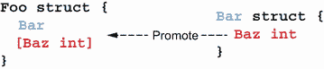

Figure 2.8 `baz` is promoted, hence accessible directly from `S`.

Interfaces and embedding

Embedding is also used within interfaces to compose an interface with others. In the following example, `io.ReadWriter` is composed of an `io.Reader` and an `io.Writer`:

```
type ReadWriter interface {
    Reader
    Writer
}
```

But the scope of this section is only related to embedded fields in structs.

Now that we’ve reminded ourselves what embedded types are, let’s look at an example of a wrong usage. In the following, we implement a struct that holds some in-memory data, and we want to protect it against concurrent accesses using a mutex:

```
type InMem struct {
    sync.Mutex         ❶
    m map[string]int
}

func New() *InMem {
    return &InMem{m: make(map[string]int)}
}
```

❶ Embedded field

We decided to make the map unexported so that clients can’t interact with it directly but only via exported methods. Meanwhile, the mutex field is embedded. Therefore, we can implement a `Get` method this way:

```
func (i *InMem) Get(key string) (int, bool) {
    i.Lock()                     ❶
    v, contains := i.m[key]
    i.Unlock()                   ❷
    return v, contains
}
```

❶ Accesses the Lock method directly

❷ The same goes for the Unlock method.

Because the mutex is embedded, we can directly access the `Lock` and `Unlock` methods from the `i` receiver.

We mentioned that such an example is a wrong usage of type embedding. What’s the reason for this? Since `sync.Mutex` is an embedded type, the `Lock` and `Unlock` methods will be promoted. Therefore, both methods become visible to external clients using `InMem`:

```
m := inmem.New()
m.Lock() // ??
```

This promotion is probably not desired. A mutex is, in most cases, something that we want to encapsulate within a struct and make invisible to external clients. Therefore, we shouldn’t make it an embedded field in this case:

```
type InMem struct {
    mu sync.Mutex      ❶
    m map[string]int
}
```

❶ Specifies that the sync.Mutex field is not embedded

Because the mutex isn’t embedded and is unexported, it can’t be accessed from external clients. Let’s now look at another example, but this time where embedding can be considered a correct approach.

We want to write a custom logger that contains an `io.WriteCloser` and exposes two methods, `Write` and `Close`. If `io.WriteCloser` wasn’t embedded, we would need to write it like so:

```
type Logger struct {
    writeCloser io.WriteCloser
}

func (l Logger) Write(p []byte) (int, error) {
    return l.writeCloser.Write(p)     ❶
}

func (l Logger) Close() error {
    return l.writeCloser.Close()      ❶
}
func main() {
    l := Logger{writeCloser: os.Stdout}
    _, _ = l.Write([]byte("foo"))
    _ = l.Close()
}
```

❶ Forwards the call to writeCloser

`Logger` would have to provide both a `Write` and a `Close` method that would *only* forward the call to `io.WriteCloser`. However, if the field now becomes embedded, we can remove these forwarding methods:

```
type Logger struct {
    io.WriteCloser       ❶
}

func main() {
    l := Logger{WriteCloser: os.Stdout}
    _, _ = l.Write([]byte("foo"))
    _ = l.Close()
}
```

❶ Makes io.Writer embedded

It remains the same for clients with two exported `Write` and `Close` methods. But the example prevents implementing these additional methods simply to forward a call. Also, as `Write` and `Close` are promoted, it means that `Logger` satisfies the `io.WriteCloser` interface.

Embedding vs. OOP subclassing

Differentiating embedding from OOP subclassing can sometimes be confusing. The main difference is related to the identity of the receiver of a method. Let’s look at the following figure. The left-hand side represents a type `X` being embedded in `Y`, whereas on the right-hand side, `Y` extends `X`.

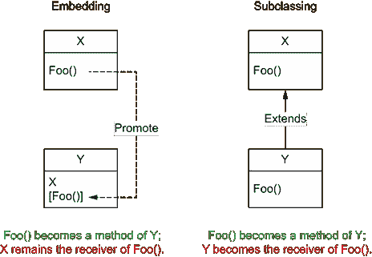

With embedding, the embedded type remains the receiver of a method. Conversely, with subclassing, the subclass becomes the receiver of a method.

With embedding, the receiver of `Foo` remains `X`. However, with subclassing, the receiver of `Foo` becomes the subclass, `Y`. Embedding is about composition, not inheritance.

What should we conclude about type embedding? First, let’s note that it’s rarely a necessity, and it means that whatever the use case, we can probably solve it as well without type embedding. Type embedding is mainly used for convenience: in most cases, to promote behaviors.

If we decide to use type embedding, we need to keep two main constraints in mind:

*   It shouldn’t be used solely as some syntactic sugar to simplify accessing a field (such as `Foo.Baz()` instead of `Foo.Bar.Baz()`). If this is the only rationale, let’s not embed the inner type and use a field instead.

*   It shouldn’t promote data (fields) or a behavior (methods) we want to hide from the outside: for example, if it allows clients to access a locking behavior that should remain private to the struct.

NOTE Some may also argue that using type embedding could lead to extra efforts in terms of maintenance in the context of exported structs. Indeed, embedding a type inside an exported struct means remaining cautious when this type evolves. For example, if we add a new method to the inner type, we should ensure it doesn’t break the latter constraint. Hence, to avoid this extra effort, teams can also prevent type embedding in public structs.

Using type embedding consciously by keeping these constraints in mind can help avoid boilerplate code with additional forwarding methods. However, let’s make sure we don’t do it solely for cosmetics and not promote elements that should remain hidden.

In the next section, we’ll discuss common patterns to deal with optional configurations.

## 2.11 #11: Not using the functional options pattern

When designing an API, one question may arise: how do we deal with optional configurations? Solving this problem efficiently can improve how convenient our API will become. This section goes through a concrete example and covers different ways to handle optional configurations.

For this example, let’s say we have to design a library that exposes a function to create an HTTP server. This function would accept different inputs: an address and a port. The following shows the skeleton of the function:

```
func NewServer(addr string, port int) (*http.Server, error) {
    // ...
}
```

The clients of our library have started to use this function, and everyone is happy. But at some point, our clients begin to complain that this function is somewhat limited and lacks other parameters (for example, a write timeout and a connection context). However, we notice that adding new function parameters breaks the compatibility, forcing the clients to modify the way they call `NewServer`. In the meantime, we would like to enrich the logic related to port management this way (figure 2.9):

*   If the port isn’t set, it uses the default one.

*   If the port is negative, it returns an error.

*   If the port is equal to 0, it uses a random port.

*   Otherwise, it uses the port provided by the client.

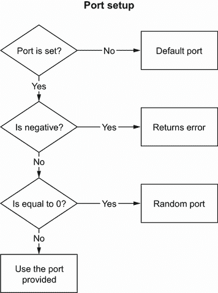

Figure 2.9 Logic related to the port option

How can we implement this function in an API-friendly way? Let’s look at the different options.

### 2.11.1 Config struct

Because Go doesn’t support optional parameters in function signatures, the first possible approach is to use a configuration struct to convey what’s mandatory and what’s optional. For example, the mandatory parameters could live as function parameters, whereas the optional parameters could be handled in the `Config` struct:

```
type Config struct {
    Port        int
}

func NewServer(addr string, cfg Config) {
}
```

This solution fixes the compatibility issue. Indeed, if we add new options, it will not break on the client side. However, this approach doesn’t solve our requirement related to port management. Indeed, we should bear in mind that if a struct field isn’t provided, it’s initialized to its zero value:

*   0 for an integer

*   0.0 for a floating-point type

*   `""` for a string

*   Nil for slices, maps, channels, pointers, interfaces, and functions

Therefore, in the following example, both structs are equal:

```
c1 := httplib.Config{
    Port: 0,              ❶
}
c2 := httplib.Config{
                          ❷
}
```

❶ Initializes Port to 0

❷ Port is missing, so it’s initialized to 0.

In our case, we need to find a way to distinguish between a port purposely set to 0 and a missing port. Perhaps one option might be to handle all the parameters of the configuration struct as pointers in this way:

```
type Config struct {
    Port        *int
}
```

Using an integer pointer, semantically, we can highlight the difference between the value `0` and a missing value (a nil pointer).

This option would work, but it has a couple of downsides. First, it’s not handy for clients to provide an integer pointer. Clients have to create a variable and then pass a pointer this way:

```
port := 0
config := httplib.Config{
    Port: &port,             ❶
}
```

❶ Provides an integer pointer

It’s not a showstopper as such, but the overall API becomes a bit less convenient to use. Also, the more options we add, the more complex the code becomes.

The second downside is that a client using our library with the default configuration will need to pass an empty struct this way:

```
httplib.NewServer("localhost", httplib.Config{})
```

This code doesn’t look great. Readers will have to understand what this magical struct’s meaning is.

Another option is to use the classic builder pattern, as presented in the next section.

### 2.11.2 Builder pattern

Originally part of the Gang of Four design patterns, the builder pattern provides a flexible solution to various object-creation problems. The construction of `Config` is separated from the struct itself. It requires an extra struct, `ConfigBuilder`, which receives methods to configure and build a `Config`.

Let’s see a concrete example and how it can help us in designing a friendly API that tackles all our requirements, including port management:

```
type Config struct {                                 ❶
    Port int
}

type ConfigBuilder struct {                          ❷
    port *int
}

func (b *ConfigBuilder) Port(
    port int) *ConfigBuilder {                       ❸
    b.port = &port
    return b
}

func (b *ConfigBuilder) Build() (Config, error) {    ❹
    cfg := Config{}

    if b.port == nil {                               ❺
        cfg.Port = defaultHTTPPort
    } else {
        if *b.port == 0 {
            cfg.Port = randomPort()
        } else if *b.port < 0 {
            return Config{}, errors.New("port should be positive")
        } else {
            cfg.Port = *b.port
        }
    }

    return cfg, nil
}

func NewServer(addr string, config Config) (*http.Server, error) {
    // ...
}
```

❶ Config struct

❷ Config builder struct, containing an optional port

❸ Public method to set up the port

❹ Build method to create the config struct

❺ Main logic related to port management

The `ConfigBuilder` struct holds the client configuration. It exposes a `Port` method to set up the port. Usually, such a configuration method returns the builder itself so that we can use method chaining (for example, `builder.Foo("foo").Bar("bar")`). It also exposes a `Build` method that holds the logic on initializing the port value (whether the pointer was `nil`, etc.) and returns a `Config` struct once created.

NOTE There isn’t a single possible implementation of the builder pattern. For example, some may favor an approach where the logic to define the final port value is inside the `Port` method instead of `Build`. This section’s scope is to present an overview of the builder pattern, not to look at all the different possible variations.

Then, a client would use our builder-based API in the following manner (we assume that we have put our code in an `httplib` package):

```
builder := httplib.ConfigBuilder{}                   ❶
builder.Port(8080)                                   ❷
cfg, err := builder.Build()                          ❸
if err != nil {
    return err
}

server, err := httplib.NewServer("localhost", cfg)   ❹
if err != nil {
    return err
}
```

❶ Creates a builder config

❷ Sets the port

❸ Builds the config struct

❹ Passes the config struct

First, the client creates a `ConfigBuilder` and uses it to set up an optional field, such as the port. Then, it calls the `Build` method and checks for errors. If OK, the configuration is passed to `NewServer`.

This approach makes port management handier. It’s not required to pass an integer pointer, as the `Port` method accepts an integer. However, we still need to pass a config struct that can be empty if a client wants to use the default configuration:

```
server, err := httplib.NewServer("localhost", nil)
```

Another downside, in some situations, is related to error management. In programming languages where exceptions are thrown, builder methods such as `Port` can raise exceptions if the input is invalid. If we want to keep the ability to chain the calls, the function can’t return an error. Therefore, we have to delay the validation in the `Build` method. If a client can pass multiple options, but we want to handle precisely the case that a port is invalid, it makes error handling more complex.

Let’s now look at another approach called the functional options pattern, which relies on variadic arguments.

### 2.11.3 Functional options pattern

The last approach we will discuss is the functional options pattern (figure 2.10). Although there are different implementations with minor variations, the main idea is as follows:

*   An unexported struct holds the configuration: `options`.

*   Each option is a function that returns the same type: `type Option func(options *options) error`. For example, `WithPort` accepts an `int` argument that represents the port and returns an `Option` type that represents how to update the `options` struct.

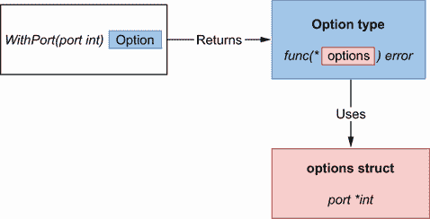

Figure 2.10 The `WithPort` option updates the final `options` struct.

Here’s the Go implementation for the `options` struct, the `Option` type, and the `WithPort` option:

```
type options struct {                          ❶
    port *int
}

type Option func(options *options) error       ❷

func WithPort(port int) Option {               ❸
    return func(options *options) error {
        if port < 0 {
            return errors.New("port should be positive")
        }
        options.port = &port
        return nil
    }
}
```

❶ Configuration struct

❷ Represents a function type that updates the configuration struct

❸ A configuration function that updates the port

Here, `WithPort` returns a closure. A *closure* is an anonymous function that references variables from outside its body; in this case, the `port` variable. The closure respects the `Option` type and implements the port-validation logic. Each config field requires creating a public function (that starts with the `With` prefix by convention) containing similar logic: validating inputs if needed and updating the config struct.

Let’s look at the last part on the provider side: the `NewServer` implementation. We’ll pass the options as variadic arguments. Hence, we must iterate over these options to mutate the `options` config struct:

```
func NewServer(addr string, opts ...Option) (     ❶
    *http.Server, error) {
    var options options                           ❷
    for _, opt := range opts {                    ❸
        err := opt(&options)                      ❹
        if err != nil {
            return nil, err
        }
    }

    // At this stage, the options struct is built and contains the config
    // Therefore, we can implement our logic related to port configuration
    var port int
    if options.port == nil {
        port = defaultHTTPPort
    } else {
        if *options.port == 0 {
            port = randomPort()
        } else {
            port = *options.port
        }
    }

    // ...
}
```

❶ Accepts variadic Option arguments

❷ Creates an empty options struct

❸ Iterates over all the input options

❹ Calls each option, which results in modifying the common options struct

We start by creating an empty `options` struct. Then, we iterate over each `Option` argument and execute them to mutate the `options` struct (bear in mind that the `Option` type is a function). Once the `options` struct is built, we can implement the final logic regarding port management.

Because `NewServer` accepts variadic `Option` arguments, a client can now call this API by passing multiple options following the mandatory address argument. For example,

```
server, err := httplib.NewServer("localhost",
        httplib.WithPort(8080),
        httplib.WithTimeout(time.Second))
```

However, if the client needs the default configuration, it doesn’t have to provide an argument (for example, an empty struct, as we saw with the previous approaches). The client’s call now might look something like this:

```
server, err := httplib.NewServer("localhost")
```

This pattern is the functional options pattern. It provides a handy and API-friendly way to handle options. Although the builder pattern can be a valid option, it has some minor downsides that tend to make the functional options pattern the idiomatic way to deal with this problem in Go. Let’s also note that this pattern is used in different Go libraries such as gRPC.

The next section will discuss another common mistake: misorganization.

## 2.12 #12: Project misorganization

Organizing a Go project isn’t an easy task. Because the Go language provides a lot of freedom in designing packages and modules, the best practices are not quite as ubiquitous as they should be. This section first discusses a common way of structuring a project and then discusses a few best practices, showing ways to improve how we organize a project.

### 2.12.1 Project structure

The Go language maintainer has no strong convention about structuring a project in Go. However, one layout has emerged over the years: project-layout ([`github.com/golang-standards/project-layout`](https://github.com/golang-standards/project-layout)).

If our project is small enough (only a few files), or if our organization has already created its standard, it may not be worth using or migrating to project-layout. Otherwise, it might be worth considering. Let’s look at this layout and see what the main directories are:

*   */cmd*—The main source files. The main.go of a `foo` application should live in /cmd/foo/main.go.

*   */internal*—Private code that we don’t want others importing for their applications or libraries.

*   */pkg*—Public code that we want to expose to others.

*   */test*—Additional external tests and test data. Unit tests in Go live in the same package as the source files. However, public API tests or integration tests, for example, should live in /test.

*   */configs*—Configuration files.

*   */docs*—Design and user documents.

*   */examples*—Examples for our application and/or a public library.

*   */api*—API contract files (Swagger, Protocol Buffers, etc.).

*   */web*—Web application-specific assets (static files, etc.).

*   */build*—Packaging and continuous integration (CI) files.

*   */scripts*—Scripts for analysis, installation, and so on.

*   */vendor*—Application dependencies (for example, Go modules dependencies).

There’s no /src directory like in some other languages. The rationale is that /src is too generic; hence, this layout favors directories such as /cmd, /internal, or /pkg.

NOTE In 2021, Russ Cox, one of the core maintainers of Go, criticized this layout. Mainly, a project lives under the GitHub golang-standards organization despite not being an official standard. In any case, we must bear in mind that, regarding project structure, there’s no mandatory convention. This layout may be helpful for you or not, but what’s important here is that indecision is the only wrong decision. Hence, agree on a layout to keep things consistent in your organization so that developers don’t waste time switching from one repository to another.

Now, let’s discuss how to organize the main logic of a Go repository.

### 2.12.2 Package organization

In Go, there is no concept of subpackages. However, we can decide to organize packages within subdirectories. If we take a look at the standard library, the net directory is organized this way:

```
/net
    /http
        client.go
        ...
    /smtp
        auth.go
        ...
    addrselect.go
    ...
```

`net` acts both as a package and a directory that contains other packages. But `net/http` doesn’t inherit from `net` or have specific access rights to the `net` package. Elements inside of `net/http` can only see exported `net` elements. The main benefit of subdirectories is to keep packages in a place where they live with high cohesion.

Regarding the overall organization, there are different schools of thought. For example, should we organize our application by context or by layer? It depends on our preferences. We may favor grouping code per context (such as the customer context, the contract context, etc.), or we may favor following hexagonal architecture principles and group per technical layer. If the decision we make fits our use case, it cannot be a wrong decision, as long as we remain consistent with it.

Regarding packages, there are multiple best practices that we should follow. First, we should avoid premature packaging because it might cause us to overcomplicate a project. Sometimes, it’s better to use a simple organization and have our project evolve when we understand what it contains rather than forcing ourselves to make the perfect structure up front.

Granularity is another essential thing to consider. We should avoid having dozens of nano packages containing only one or two files. If we do, it’s because we have probably missed some logical connections across these packages, making our project harder for readers to understand. Conversely, we should also avoid huge packages that dilute the meaning of a package name.

Package naming should also be considered with care. As we all know (as developers), naming is hard. To help clients understand a Go project, we should name our packages after what they provide, not what they contain. Also, naming should be meaningful. Therefore, a package name should be short, concise, expressive, and, by convention, a single lowercase word.

Regarding what to export, the rule is pretty straightforward. We should minimize what should be exported as much as possible to reduce the coupling between packages and keep unnecessary exported elements hidden. If we are unsure whether to export an element or not, we should default to not exporting it. Later, if we discover that we need to export it, we can adjust our code. Let’s also keep in mind some exceptions, such as making fields exported so that a struct can be unmarshaled with `encoding/json`.

Organizing a project isn’t straightforward, but following these rules should help make it easier to maintain. However, remember that consistency is also vital to ease maintainability. Therefore, let’s make sure that we keep things as consistent as possible within a codebase.

In the next section, we will tackle utility packages.

## 2.13 #13: Creating utility packages

This section discusses a common bad practice: creating shared packages such as `utils`, `common`, and `base`. We will examine the problems with such an approach and learn how to improve our organization.

Let’s look at an example inspired by the official Go blog. It’s about implementing a set data structure (a map where the value is ignored). The idiomatic way to do this in Go is to handle it via a `map[K]struct{}` type with `K` that can be any type allowed in a map as a key, whereas the value is a `struct{}` type. Indeed, a map whose value type is `struct{}` conveys that we aren’t interested in the value itself. Let’s expose two methods in a `util` package:

```
package util

func NewStringSet(...string) map[string]struct{} {    ❶
    // ...
}

func SortStringSet(map[string]struct{}) []string {    ❷
    // ...
}
```

❶ Creates a string set

❷ Returns a sorted list of keys

A client will use this package like this:

```
set := util.NewStringSet("c", "a", "b")
fmt.Println(util.SortStringSet(set))
```

The problem here is that `util` is meaningless. We could call it `common`, `shared`, or `base`, but it remains a meaningless name that doesn’t provide any insight about what the package provides.

Instead of a utility package, we should create an expressive package name such as `stringset`. For example,

```
package stringset

func New(...string) map[string]struct{} { ... }
func Sort(map[string]struct{}) []string { ... }
```

In this example, we removed the suffixes for `NewStringSet` and `SortStringSet`, which respectively became `New` and `Sort`. On the client side, it now looks like this:

```
set := stringset.New("c", "a", "b")
fmt.Println(stringset.Sort(set))
```

NOTE In the previous section, we discussed the idea of nano packages. We mentioned how creating dozens of nano packages in an application can make the code path more complex to follow. However, the idea itself of a nano package isn’t necessarily bad. If a small code group has high cohesion and doesn’t really belong somewhere else, it’s perfectly acceptable to organize it into a specific package. There isn’t a strict rule to apply, and often, the challenge is finding the right balance.

We could even go a step further. Instead of exposing utility functions, we could create a specific type and expose `Sort` as a method this way:

```
package stringset

type Set map[string]struct{}
func New(...string) Set { ... }
func (s Set) Sort() []string { ... }
```

This change makes the client even simpler. There would only be one reference to the `stringset` package:

```
set := stringset.New("c", "a", "b")
fmt.Println(set.Sort())
```

With this small refactoring, we get rid of a meaningless package name to expose an expressive API. As Dave Cheney (a project member of Go) mentioned, we reasonably often find utility packages that handle common facilities. For example, if we decide to have a client and a server package, where should we put the common types? In this case, perhaps one solution is to combine the client, the server, and the common code into a single package.

Naming a package is a critical piece of application design, and we should be cautious about this as well. As a rule of thumb, creating shared packages without meaningful names isn’t a good idea; this includes utility packages such as `utils`, `common`, or `base`. Also, bear in mind that naming a package after what it provides and not what it contains can be an efficient way to increase its expressiveness.

In the next section, we will discuss packages and package collisions.

## 2.14 #14: Ignoring package name collisions

Package collisions occur when a variable name collides with an existing package name, preventing the package from being reused. Let’s look at a concrete example with a library exposing a Redis client:

```
package redis

type Client struct { ... }

func NewClient() *Client { ... }

func (c *Client) Get(key string) (string, error) { ... }
```

Now, let’s jump on the client side. Despite the package name, `redis`, it’s perfectly valid in Go to also create a variable named `redis`:

```
redis := redis.NewClient()     ❶
v, err := redis.Get("foo")     ❷
```

❶ Calls NewClient from the redis package

❷ Uses the redis variable

Here, the `redis` variable name collides with the `redis` package name. Even though this is allowed, it should be avoided. Indeed, throughout the scope of the `redis` variable, the `redis` package won’t be accessible.

Suppose that a qualifier references both a variable and a package name throughout a function. In that case, it might be ambiguous for a code reader to know what a qualifier refers to. What are the options to avoid such a collision? The first option is to use a different variable name. For example,

```
redisClient := redis.NewClient()
v, err := redisClient.Get("foo")
```

This is probably the most straightforward approach. However, if for some reason we prefer to keep our variable named `redis`, we can play with package imports. Using package imports, we can use an alias to change the qualifier to reference the `redis` package. For example,

```
import redisapi "mylib/redis"    ❶

// ...

redis := redisapi.NewClient()    ❷
v, err := redis.Get("foo")
```

❶ Creates an alias for the redis package

❷ Accesses the redis package via the redisapi alias

Here, we used the `redisapi` import alias to reference the `redis` package so that we can keep our variable name `redis`.

NOTE One option could also be to use dot imports to access all the public elements of a package without the package qualifier. However, this approach tends to increase confusion and should, in most cases, be avoided.

Also note that we should avoid naming collisions between a variable and a built-in function. For example, we could do something like this:

```
copy := copyFile(src, dst)     ❶
```

❶ The copy variable collides with the copy built-in function.

In this case, the `copy` built-in function wouldn’t be accessible as long as the `copy` variable lives. In summary, we should prevent variable name collisions to avoid ambiguity. If we face a collision, we should either find another meaningful name or use an import alias.

In the next section, we will see a common mistake related to code documentation.

## 2.15 #15: Missing code documentation

Documentation is an important aspect of coding. It simplifies how clients can consume an API but can also help in maintaining a project. In Go, we should follow some rules to make our code idiomatic. Let’s examine these rules.

First, every exported element must be documented. Whether it is a structure, an interface, a function, or something else, if it’s exported, it must be documented. The convention is to add comments, starting with the name of the exported element. For example,

```
// Customer is a customer representation.
type Customer struct{}

// ID returns the customer identifier.
func (c Customer) ID() string { return "" }
```

As a convention, each comment should be a complete sentence that ends with punctuation. Also bear in mind that when we document a function (or a method), we should highlight what the function intends to do, not how it does it; this belongs to the core of a function and comments, not documentation. Furthermore, the documentation should ideally provide enough information that the consumer does not have to look at our code to understand how to use an exported element.

Deprecated elements

It’s possible to deprecate an exported element using the `// Deprecated:` comment this way:

```
// ComputePath returns the fastest path between two points.
// Deprecated: This function uses a deprecated way to compute
// the fastest path. Use ComputeFastestPath instead.
func ComputePath() {}
```

Then, if a developer uses the `ComputePath` function, they should get a warning. (Most IDEs handle deprecated comments.)

When it comes to documenting a variable or a constant, we might be interested in conveying two aspects: its purpose and its content. The former should live as code documentation to be useful for external clients. The latter, though, shouldn’t necessarily be public. For example,

```
// DefaultPermission is the default permission used by the store engine.
const DefaultPermission = 0o644 // Need read and write accesses.
```

This constant represents the default permission. The code documentation conveys its purpose, whereas the comment alongside the constant describes its actual content (read and write accesses).

To help clients and maintainers understand a package’s scope, we should also document each package. The convention is to start the comment with `// Package` followed by the package name:

```
// Package math provides basic constants and mathematical functions.
//
// This package does not guarantee bit-identical results
// across architectures.
package math
```

The first line of a package comment should be concise. That’s because it will appear in the package (figure 2.11 provides an example). Then, we can provide all the information we need in the following lines.

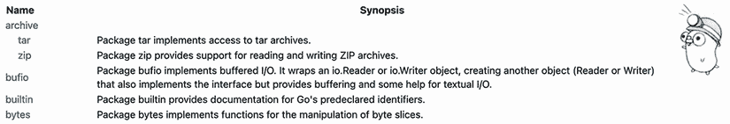

Figure 2.11 An example of the generated Go standard library

Documenting a package can be done in any of the Go files; there is no rule. In general, we should put package documentation in a relevant file with the same name as the package or in a specific file such as doc.go.

One last thing to mention regarding package documentation is that comments not adjacent to the declaration are omitted. For example, the following copyright comment will not be visible in the produced documentation:

```
// Copyright 2009 The Go Authors. All rights reserved.
// Use of this source code is governed by a BSD-style
// license that can be found in the LICENSE file.
// Package math provides basic constants and mathematical functions.
//                                                                        ❶
// This package does not guarantee bit-identical results
// across architectures.
package math
```

❶ Empty line. The previous comments will not be included in the documentation.

In summary, we should keep in mind that every exported element needs to be documented. Documenting our code shouldn’t be a constraint. We should take the opportunity to make sure it helps clients and maintainers to understand the purpose of our code.

Finally, in the last section of this chapter, we will see a common mistake regarding tooling: not using linters.

## 2.16 #16: Not using linters

A *linter* is an automatic tool to analyze code and catch errors. The scope of this section isn’t to give an exhaustive list of the existing linters; otherwise, it will become deprecated pretty quickly. But we should understand and remember why linters are essential for most Go projects.

To understand why linters are important, let’s take one concrete example. In mistake #1, “Unintended variable shadowing,” we discussed potential errors related to variable shadowing. Using `vet`, a standard linter from the Go toolset, and `shadow`, we can detect shadowed variables:

```
package main

import "fmt"

func main() {
    i := 0
    if true {
        i := 1          ❶
        fmt.Println(i)
    }
    fmt.Println(i)
}
```

❶ Shadowed variable

Because `vet` is included with the Go binary, let’s first install `shadow`, link it with Go `vet`, and then run it on the previous example:

```
$ go install \
  golang.org/x/tools/go/analysis/passes/shadow/cmd/shadow     ❶
$ go vet -vettool=$(which shadow)                             ❷
./main.go:8:3:
  declaration of "i" shadows declaration at line 6            ❸
```

❶ Installs shadow

❷ Links to Go vet using the vettol argument

❸ Go vet detects the shadow variable.

As we can see, `vet` informs us that the variable `i` is shadowed in this example. Using appropriate linters can help make our code more robust and detect potential errors.

NOTE Linters don’t cover all the mistakes in this book. Therefore, it’s recommended that you just keep reading ;).

Again, this section’s goal isn’t to list all the available linters. However, if you’re not a regular user of linters, here is a list that you may want to use daily:

*   [`golang.org/cmd/vet/`](https://golang.org/cmd/vet/)—A standard Go analyzer

*   [`github.com/kisielk/errcheck`](https://github.com/kisielk/errcheck)—An error checker

*   [`github.com/fzipp/gocyclo`](https://github.com/fzipp/gocyclo)—A cyclomatic complexity analyzer

*   [`github.com/jgautheron/goconst`](https://github.com/jgautheron/goconst)—A repeated string constants analyzer

Besides linters, we should also use code formatters to fix code style. Here is a list of some code formatters for you to try:

*   [`golang.org/cmd/gofmt/`](https://golang.org/cmd/gofmt/)—A standard Go code formatter

*   [`godoc.org/golang.org/x/tools/cmd/goimports`](https://godoc.org/golang.org/x/tools/cmd/goimports)—A standard Go imports formatter

Meanwhile, we should also look at golangci-lint ([`github.com/golangci/golangci-lint`](https://github.com/golangci/golangci-lint)). It’s a linting tool that provides a facade on top of many useful linters and formatters. Also, it allows running the linters in parallel to improve analysis speed, which is quite handy.

Linters and formatters are a powerful way to improve the quality and consistency of our codebase. Let’s take the time to understand which one we should use and make sure we automate their execution (such as a CI or Git precommit hook).

## Summary

*   Avoiding shadowed variables can help prevent mistakes like referencing the wrong variable or confusing readers.

*   Avoiding nested levels and keeping the happy path aligned on the left makes building a mental code model easier.

*   When initializing variables, remember that init functions have limited error handling and make state handling and testing more complex. In most cases, initializations should be handled as specific functions.

*   Forcing the use of getters and setters isn’t idiomatic in Go. Being pragmatic and finding the right balance between efficiency and blindly following certain idioms should be the way to go.

*   Abstractions should be discovered, not created. To prevent unnecessary complexity, create an interface when you need it and not when you foresee needing it, or if you can at least prove the abstraction to be a valid one.

*   Keeping interfaces on the client side avoids unnecessary abstractions.

*   To prevent being restricted in terms of flexibility, a function shouldn’t return interfaces but concrete implementations in most cases. Conversely, a function should accept interfaces whenever possible.

*   Only use `any` if you need to accept or return any possible type, such as `json. Marshal`. Otherwise, `any` doesn’t provide meaningful information and can lead to compile-time issues by allowing a caller to call methods with any data type.

*   Relying on generics and type parameters can prevent writing boilerplate code to factor out elements or behaviors. However, do not use type parameters prematurely, but only when you see a concrete need for them. Otherwise, they introduce unnecessary abstractions and complexity.

*   Using type embedding can also help avoid boilerplate code; however, ensure that doing so doesn’t lead to visibility issues where some fields should have remained hidden.

*   To handle options conveniently and in an API-friendly manner, use the functional options pattern.

*   Following a layout such as project-layout can be a good way to start structuring Go projects, especially if you are looking for existing conventions to standardize a new project.

*   Naming is a critical piece of application design. Creating packages such as `common`, `util`, and `shared` doesn’t bring much value for the reader. Refactor such packages into meaningful and specific package names.

*   To avoid naming collisions between variables and packages, leading to confusion or perhaps even bugs, use unique names for each one. If this isn’t feasible, use an import alias to change the qualifier to differentiate the package name from the variable name, or think of a better name.

*   To help clients and maintainers understand your code’s purpose, document exported elements.

*   To improve code quality and consistency, use linters and formatters.