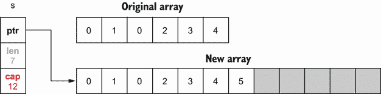
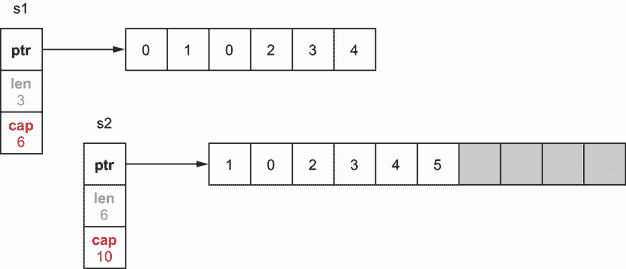

# 3 种数据类型

本章涵盖

*   与基本类型相关的常见错误
*   切片和地图的基本概念，以防止可能的错误、泄漏或不准确
*   比较数值

处理数据类型是软件工程师的一项经常性操作。本章深入探讨了与基本类型、切片和贴图相关的最常见错误。我们省略的唯一数据类型是字符串，因为后面的章节将专门讨论这种类型。

## 3.1 #17:用八进制文字制造混乱

我们先来看一个对八进制文字表示的常见误解，这种误解会导致混乱甚至 bug。您认为以下代码的输出应该是什么？

```go
sum := 100 + 010
fmt.Println(sum)
```

乍一看，我们可能期望这段代码打印出 100 + 10 = 110 的结果。但是它打印的是 108。这怎么可能呢？

在 Go 中，以 0 开头的整数文字被视为八进制整数(基数为 8)，因此基数为 8 的 10 等于基数为 10 的 8。因此，上例中的总和等于 100 + 8 = 108。这是需要记住的整数文字的一个重要属性——例如，在读取现有代码时避免混淆。

八进制整数在不同的场景中都很有用。例如，假设我们想使用`os.OpenFile`打开一个文件。这个函数需要传递一个权限作为`uint32`。如果我们想匹配一个 Linux 权限，为了可读性，我们可以传递一个八进制数，而不是十进制数:

```go
file, err := os.OpenFile("foo", os.O_RDONLY, 0644)
```

在这个例子中，`0644`代表一个特定的 Linux 权限(对所有人都是读的，对当前用户只写)。也可以在零后面添加一个`o`字符(小写字母):

```go
file, err := os.OpenFile("foo", os.O_RDONLY, 0o644)
```

使用`0o`作为前缀，而不是仅仅使用`0`，意思是一样的。但是，它有助于使代码更加清晰。

注意我们也可以使用大写的`O`字符来代替小写的`o`。但是传递`0O644`可能会增加混乱，因为根据字符字体的不同，`0`可能看起来与`O`非常相似。

我们还应该注意其他整数文字表示:

*   *二进制*——使用`0b`或`0B`前缀(例如，`0b100`在 10 进制中等于 4)

*   *十六进制*——使用`0x`或`0X`前缀(例如，`0xF`在十进制中等于 15)

*   *虚数*——使用一个`i`后缀(例如`3i`)

最后，我们还可以使用下划线字符(`_`)作为分隔符，以提高可读性。比如我们可以这样写 10 亿:`1_000_000_000`。我们也可以在其他表示中使用下划线字符(例如，`0b00_00_01`)。

总之，Go 处理二进制、十六进制、虚数和八进制数。八进制数以 0 开始。然而，为了提高可读性并避免未来代码读者的潜在错误，使用前缀`0o`使八进制数显式化。

下一节深入探讨整数，我们将讨论如何在 Go 中处理溢出。

## 3.2 #18:忽略整数溢出

不了解 Go 中如何处理整数溢出会导致严重的错误。本节将深入探讨这个主题。但首先，让我们提醒自己一些与整数相关的概念。

### 概念

Go 一共提供了 10 种整数类型。有四种有符号整数类型和四种无符号整数类型，如下表所示。

| 

有符号整数

 | 

无符号整数

 |
| `int8` (8 位) | `uint8` (8 位) |
| `int16` (16 位) | `uint16` (16 位) |
| `int32` (32 位) | `uint32` (32 位) |
| `int64` (64 位) | `uint64` (64 位) |

另外两个整数类型是最常用的:和`int`。这两种类型的大小取决于系统:在 32 位系统上是 32 位，在 64 位系统上是 64 位。

现在让我们讨论溢出。假设我们想要初始化一个`int32`到它的最大值，然后递增它。这段代码的行为应该是什么？

```go
var counter int32 = math.MaxInt32
counter++
fmt.Printf("counter=%d\n", counter)
```

这段代码可以编译，并且在运行时不会死机。然而，`counter++`语句会产生一个整数溢出:

```go
counter=-2147483648
```

当算术运算创建的值超出了可以用给定字节数表示的范围时，就会发生整数溢出。使用 32 位来表示一个`int32`。下面是最大`int32`值(`math.MaxInt32`)的二进制表示:

```go
01111111111111111111111111111111
 |------31 bits set to 1-------|
```

因为一个`int32`是一个有符号的整数，左边的位代表整数的符号:0 代表正数，1 代表负数。如果我们增加这个整数，就没有空间来表示新值了。因此，这会导致整数溢出。从二进制角度来看，新值如下:

```go
10000000000000000000000000000000
 |------31 bits set to 0-------|
```

正如我们所看到的，位号现在等于 1，意味着负。该值是用 32 位表示的有符号整数的最小可能值。

注意最小可能的负值不是`111111111111111111111111 11111111`。事实上，大多数系统依靠二进制补码运算来表示二进制数(反转每一位并加 1)。这个操作的主要目标是使`x+(–x)`等于 0，而不管`x`。

在 Go 中，可以在编译时检测到的整数溢出会产生编译错误。举个例子，

```go
var counter int32 = math.MaxInt32 + 1
constant 2147483648 overflows int32
```

然而，在运行时，整数溢出或下溢是无声的；这不会导致应用程序死机。将这种行为牢记在心是很重要的，因为它会导致偷偷摸摸的错误(例如，导致负结果的整数递增或正整数相加)。

在深入研究如何用常见操作检测整数溢出之前，让我们考虑一下什么时候应该关注它。在大多数情况下，比如处理请求的计数器或者基本的加法/乘法，如果使用了正确的整数类型，我们不应该太担心。但是在某些情况下，比如使用较小整数类型的内存受限项目，处理较大的数字，或者进行转换，我们可能想要检查可能的溢出。

请注意，1996 年阿丽亚娜 5 号发射失败（[`www.bugsnag.com/blog/bug-day-ariane-5-disaster`](https://www.bugsnag.com/blog/bug-day-ariane-5-disaster)）是由于将 64 位浮点转换为 16 位有符号整数导致溢出。T11】

### 3.2.2 递增时检测整数溢出

如果我们想在基于定义的大小(`int8`、`int16`、`int32`、`int64`、`uint8`、`uint16`、`uint32`或`uint64`)的类型的递增操作期间检测整数溢出，我们可以对照`math`常量检查该值。例如，用一个`int32`:

```go
func Inc32(counter int32) int32 {
    if counter == math.MaxInt32 {    // ❶
        panic("int32 overflow")
    }
    return counter + 1
}
```

❶与数学相比。MaxInt32

该功能检查输入是否已经等于`math.MaxInt32`。我们知道增量是否会导致溢出，如果是这样的话。

`int`和`uint`类型有哪些？在 Go 1.17 之前，我们必须手动构建这些常量。现在，`math.MaxInt`、`math.MinInt`和`math.MaxUint`是包`math`的一部分。如果我们必须在和`int`类型上测试溢出，我们可以使用`math.MaxInt`来完成:

```go
func IncInt(counter int) int {
    if counter == math.MaxInt {
        panic("int overflow")
    }
    return counter + 1
}
```

对于`uint`来说，逻辑是相同的。我们可以使用`math.MaxUint`:

```go
func IncUint(counter uint) uint {
    if counter == math.MaxUint {
        panic("uint overflow")
    }
    return counter + 1
}
```

在这一节中，我们学习了如何在增量运算后检查整数溢出。那么，加法呢？

### 3.2.3 加法期间检测整数溢出

如何检测加法运算中的整数溢出？答案是重用`math.MaxInt`:

```go
func AddInt(a, b int) int {
    if a > math.MaxInt-b {       // ❶
        panic("int overflow")
    }

    return a + b
}
```

❶检查是否会发生整数溢出

在示例中，`a`和`b`是两个操作数。如果`a`大于`math.MaxInt - b`，运算将导致整数溢出。现在，让我们看看乘法运算。

### 3.2.4 在乘法期间检测整数溢出

乘法处理起来有点复杂。我们必须根据最小整数`math.MinInt`进行检查:

```go
func MultiplyInt(a, b int) int {
    if a == 0 || b == 0 {                       // ❶
        return 0
    }

    result := a * b
    if a == 1 || b == 1 {                       // ❷
        return result
    }
    if a == math.MinInt || b == math.MinInt {   // ❸
        panic("integer overflow")
    }
    if result/b != a {                          ❹
        panic("integer overflow")
    }
    return result
}
```

❶如果其中一个操作数等于 0，它直接返回 0。

❷检查操作数之一是否等于 1

❸检查是否有一个操作数等于数学。米尼特

❹检查乘法运算是否会导致整数溢出

用乘法检查整数溢出需要多个步骤。首先，我们需要测试操作数之一是否等于`0`、`1`或`math.MinInt`。然后我们将乘法结果除以`b`。如果结果不等于原始因子(`a`，则意味着发生了整数溢出。

总之，整数溢出(和下溢)是 Go 中的无声操作。如果我们想检查溢出以避免偷偷摸摸的错误，我们可以使用本节中描述的实用函数。还要记住 Go 提供了一个处理大数的包:`math/big`。如果一个`int`还不够，这可能是一个选择。

我们将在下一节继续讨论浮点的基本 Go 类型。T17T19】

## 3.3 #19:不理解浮点

在GO中，有两种浮点类型(如果我们省略虚数的话):`float32`和`float64`。发明浮点的概念是为了解决整数的主要问题:它们不能表示小数值。为了避免糟糕的意外，我们需要知道浮点运算是实数运算的近似。让我们来看看使用近似值的影响以及如何提高精确度。为此，我们来看一个乘法示例:

```go
var n float32 = 1.0001
fmt.Println(n * n)
```

我们可能期望这段代码打印出 1.0001 * 1.0001 = 1.00020001 的结果，对吗？但是，在大多数 x86 处理器上运行它会打印出 1.0002。我们该如何解释？我们需要先了解浮点运算。

让我们以`float64`型为例。请注意，在`math.SmallestNonzeroFloat64`(最小值`float64`)和`math.MaxFloat64`(最大值`float64`)之间有无限多个实数值。相反，`float64`类型有有限的位数:64。因为让无限的值适合一个有限的空间是不可能的，我们必须使用近似值。因此，我们可能会失去精度。同样的逻辑也适用于和`float32`型。

Go 中的浮点遵循 IEEE-754 标准，一些位代表尾数，其他位代表指数。*尾数*是基值，而*指数*是应用于尾数的乘数。在单精度浮点类型(`float32`)中，8 位表示指数，23 位表示尾数。在双精度浮点类型(`float64`)中，指数和尾数的值分别是 11 位和 52 位。剩余的位用于符号。要将浮点转换为小数，我们使用以下计算方法:

```go
sign * 2^exponent * mantissa
```

图 3.1 将 1.0001 表示为一个`float32`。指数使用 8 位超额/偏差符号:01111111 指数值表示 2^0，而尾数等于 1.000100016593933。(注意，本节的范围不是解释转换是如何工作的。)因此，十进制值等于 1 × 2^0 × 1.000100016593933。因此，我们在单精度浮点值中存储的不是 1.0001，而是 1.000100016593933。缺乏精度会影响存储值的准确性。


图 3.1`float32`中 1.0001 的表示

一旦我们理解了`float32`和`float64`是近似值，这对我们作为开发者意味着什么呢？第一个含义与比较有关。使用`==`操作符来比较两个浮点数会导致不准确。相反，我们应该比较它们的差异，看它是否小于某个小错误值。例如，`testify`测试库（[`github.com/stretchr/testify`](https://github.com/stretchr/testify)）有一个`InDelta`函数来断言两个值在彼此给定的增量内。

还要记住，浮点计算的结果取决于实际的处理器。大多数处理器都有一个浮点单元(FPU)来处理这样的计算。不能保证在一台机器上执行的结果在另一台具有不同 FPU 的机器上是相同的。使用 delta 比较两个值是在不同机器上实现有效测试的一种解决方案。

浮点数的种类

Go 还有三种特殊的浮点数:

*   正无穷大

*   负无穷大

*   NaN(非数字)，其中 是未定义或不可表示的运算的结果

根据 IEEE-754，NaN 是唯一满足`f != f`的浮点数。下面是一个构建这些特殊类型的数字以及输出的示例:

```go
var a float64
positiveInf := 1 / a
negativeInf := -1 / a
nan := a / a
fmt.Println(positiveInf, negativeInf, nan)
+Inf -Inf NaN
```

我们可以用`math.IsInf`检查一个浮点数是否无穷大，用`math.IsNaN`检查它是否为 NaN。

到目前为止，我们已经看到十进制到浮点的转换会导致精度的损失。这是转换造成的错误。还要注意，错误会在一系列浮点运算中累积。

让我们来看一个例子，其中有两个函数以不同的顺序执行相同的操作序列。在我们的例子中，`f1`通过将一个`float64`初始化为 10，000 开始，然后重复地将 1.0001 加到这个结果上(`n`次)。反之，`f2`执行相同的操作，但顺序相反(最后加 10，000):

```go
func f1(n int) float64 {
    result := 10_000.
    for i := 0; i < n; i++ {
        result += 1.0001
    }
    return result
}

func f2(n int) float64 {
    result := 0.
    for i := 0; i < n; i++ {
        result += 1.0001
    }
    return result + 10_000.
}
```

现在，让我们在 x86 处理器上运行这些函数。然而这一次，我们将改变`n`。

| 

`n`

 | 

确切的结果

 | 

`f1`

 | 

`f2`

 |
| 10 | 10010.001 | 10010.000999999993 | 10010.001 |
| 1k | 11000.1 | 11000.099999999293 | 11000.099999999982 |
| 1m | 1.0101e+06 | 1.0100999999761417e+06 | 1.010099999766762 e+06 |

注意`n`越大，不精确性越大。不过我们也可以看到`f2`的精度比`f1`好。请记住，浮点计算的顺序会影响结果的准确性。

当执行一连串的加法和减法时，我们应该将运算分组，以便在加或减幅度不接近的值之前加或减幅度相似的值。因为`f2`加了 10000，最后产生的结果比`f1`更准确。

乘法和除法呢？假设我们想要计算以下内容:

```go
a × (b + c)
```

我们知道，这个计算等于

```go
a × b + a × c
```

让我们用与`b`和`c`不同数量级的`a`来运行这两个计算:

```go
a := 100000.001
b := 1.0001
c := 1.0002

fmt.Println(a * (b + c))
fmt.Println(a*b + a*c)
200030.00200030004
200030.0020003
```

精确的结果是 200，030.002。因此，第一种计算的准确性最差。事实上，当执行涉及加、减、乘或除的浮点计算时，我们必须首先完成乘法和除法运算才能获得更好的精度。有时，这可能会影响执行时间(在前面的示例中，它需要三个操作，而不是两个)。在这种情况下，这是准确性和执行时间之间的选择。

Go 的`float32`和`float64`是近似值。因此，我们必须牢记一些规则:

*   比较两个浮点数时，检查它们的差值是否在可接受的范围内。

*   在执行加法或减法时，将具有相似数量级的运算分组，以获得更高的精度。

*   为了提高准确性，如果一系列运算需要加、减、乘或除，请先执行乘法和除法运算。

下一节开始我们对切片的研究。它讨论了两个至关重要的概念:切片的长度和容量。

## 3.4 #20:不了解切片长度和容量

Go 开发者混淆切片长度和容量或者没有彻底理解它们是很常见的。吸收这两个概念对于有效处理核心操作是必不可少的，比如切片初始化和用`append`添加元素、复制或切片。这种误解可能导致次优地使用切片，甚至导致内存泄漏(我们将在后面的章节中看到)。

在 Go 中，一个切片由一个数组支持。这意味着切片的数据连续存储在一个数组数据结构中。slice 还处理在后备数组已满时添加元素或在后备数组几乎为空时收缩后备数组的逻辑。

在内部，一个片包含一个指向后备数组的指针，加上一个长度和一个容量。长度是切片包含的元素数量，而容量是支持数组中的元素数量。让我们来看几个例子，让事情更清楚。首先，让我们用给定的长度和容量初始化一个切片:

```go
s := make([]int, 3, 6)     // ❶
```

❶三长度，六容量切片

第一个参数代表长度，是必需的。但是，代表容量的第二个参数是可选的。图 3.2 显示了这段代码在内存中的结果。


图 3.2 一个三长度、六容量的切片

在本例中，`make`创建了一个包含六个元素(容量)的数组。但是因为长度被设置为`3`，Go 只初始化前三个元素。此外，因为切片是一个`[]int`类型的，前三个元素被初始化为一个`int` : `0`的零值。灰色元素已分配但尚未使用。

如果我们打印这个切片，我们得到长度范围内的元素，`[0 0 0]`。如果我们将`s[1]`设置为`1`，切片的第二个元素会更新，而不会影响其长度或容量。图 3.3 说明了这一点。


图 3.3 更新切片的第二个元素:`s[1] = 1`

然而，访问长度范围之外的元素是被禁止的，即使它已经在内存中被分配了。例如，`s[4]` `=` `0`会导致以下恐慌:

```go
panic: runtime error: index out of range [4] with length 3
```

如何利用切片剩余的空间？通过使用的`append`内置功能:

```go
s = append(s, 2)
```

这段代码向现有的`s`切片追加一个新元素。它使用第一个灰显的元素(已分配但尚未使用)来存储元素`2`，如图 3.4 所示。


图 3.4 将元素添加到`s`

切片的长度从 3 更新为 4，因为切片现在包含四个元素。现在，如果我们再添加三个元素，使得支持数组不够大，会发生什么呢？

```go
s = append(s, 3, 4, 5)
fmt.Println(s)
```

如果我们运行这段代码，我们会看到切片能够处理我们的请求:

```go
[0 1 0 2 3 4 5]
```

因为数组是固定大小的结构，所以它可以存储新元素，直到元素 4。当我们想要插入元素 5 时，数组已经满了:Go 内部通过将容量加倍，复制所有元素，然后插入元素 5 来创建另一个数组。图 3.5 显示了这个过程。



图 3.5 由于初始后备数组已满，Go 创建另一个数组并复制所有元素。

注意在 Go 中，一个切片的大小增加一倍，直到它包含 1，024 个元素，之后增长 25%。

切片现在引用新的支持数组。之前的后备阵列会怎么样？如果不再被引用，如果被分配到堆上，它最终会被垃圾收集器(GC)释放。(我们在错误#95“不理解栈和堆”中讨论堆内存，我们在错误#99“不理解 GC 如何工作”中查看 GC 如何工作)

切片会发生什么？切片是在数组或切片上做的操作，提供半开范围；包括第一个索引，而排除第二个索引。以下示例显示了影响，图 3.6 显示了内存中的结果:

```go
s1 := make([]int, 3, 6)    // ❶
s2 := s1[1:3]              // ❷
```

❶三长度，六容量切片

从索引 1 到 3 的❷切片


图 3.6 切片`s1`和`s2`引用了具有不同长度和容量的相同支持阵列。

首先，`s1`被创建为三长度、六容量的切片。当通过切片`s1`创建`s2`时，两个切片引用同一个后备数组。然而，`s2`从不同的索引 1 开始。所以它的长度和容量(一个两长度，五容量切片)和`s1`不一样。如果我们更新`s1[1]`或`s2[0]`，变化是对同一个数组进行的，因此，在两个切片中都可见，如图 3.7 所示。


图 3.7 因为`s1`和`s2`是由同一个数组支持的，更新一个公共元素会使变化在两个切片中都可见。

现在，如果我们向`s2`追加一个元素会发生什么？下面的代码也改变了`s1`吗？

```go
s2 = append(s2, 2)
```

共享后备数组被修改，但只有`s2`的长度改变。图 3.8 显示了向`s2`追加一个元素的结果。


图 3.8 将元素添加到`s2`

`s1`仍然是三长度、六容量的切片。因此，如果我们打印`s1`和`s2`，添加的元素仅对`s2`可见:

```go
s1=[0 1 0], s2=[1 0 2]
```

理解这种行为很重要，这样我们在使用`append`时就不会做出错误的假设。

注意在这些例子中，支持数组是内部的，Go 开发者不能直接使用。唯一的例外是通过对现有数组切片来创建切片。

最后要注意的一点是:如果我们一直将元素追加到`s2`直到后备数组满了会怎么样？就记忆而言，状态会是什么？让我们再添加三个元素，这样后备阵列将没有足够的容量:

```go
s2 = append(s2, 3)
s2 = append(s2, 4)
s2 = append(s2, 5)     // ❶
```

❶在这个阶段，后备阵列已经满了。

这段代码导致创建另一个后备数组。图 3.9 显示了内存中的结果。



图 3.9 将元素追加到`s2`直到后备数组已满

`s1`和`s2`现在引用了两个不同的数组。由于`s1`仍然是一个三长度、六容量的片，它仍然有一些可用的缓冲区，所以它继续引用初始数组。此外，新的支持数组是通过从`s2`的第一个索引复制初始数组制成的。这就是为什么新数组从元素`1`开始，而不是`0`。

总而言之，*切片长度*是切片中可用元素的数量，而*切片容量*是后备数组中元素的数量。将一个元素添加到一个完整的片(`length == capacity`)会导致创建一个具有新容量的新后备数组，从以前的数组中复制所有元素，并将片指针更新到新数组。

在下一节中，我们将长度和容量的概念用于片初始化。

## 3.5 #21:低效的切片初始化

在使用`make`初始化一个片时，我们看到我们必须提供一个长度和一个可选容量。忘记为这两个参数传递合适的值是一个普遍的错误。让我们精确地看看什么时候这被认为是合适的。

假设我们想要实现一个`convert`函数，将一个`Foo`的片映射到一个`Bar`的片，两个片将具有相同数量的元素。这是第一个实现:

```go
func convert(foos []Foo) []Bar {
    bars := make([]Bar, 0)                   // ❶

    for _, foo := range foos {
        bars = append(bars, fooToBar(foo))   // ❷
    }
    return bars
}
```

❶创建结果切片

❷将一个 Foo 转换成一个条，并将其添加到切片中

首先，我们使用`make([]Bar, 0)`初始化一个空的`Bar`元素片段。然后，我们使用`append`来添加`Bar`元素。起初，`bars`是空的，所以添加第一个元素会分配一个大小为 1 的后备数组。每当后备数组满了，Go 就通过加倍其容量来创建另一个数组(在上一节中讨论过)。

当我们添加第三个元素、第五个元素、第九个元素等等时，这种因为当前数组已满而创建另一个数组的逻辑会重复多次。假设输入切片有 1，000 个元素，该算法需要分配 10 个后备数组，并将总共 1，000 多个元素从一个数组复制到另一个数组。这导致了 GC 清理所有这些临时后备数组的额外工作。

就性能而言，没有什么好的理由不帮助 Go 运行时。对此有两种不同的选择。第一种选择是重用相同的代码，但分配给定容量的片:

```go
func convert(foos []Foo) []Bar {
    n := len(foos)
    bars := make([]Bar, 0, n)                // ❶

    for _, foo := range foos {
        bars = append(bars, fooToBar(foo))   // ❷
    }
    return bars
}
```

❶用零长度和给定的容量初始化

❷更新酒吧追加一个新元素

唯一的变化是创建容量等于`n`、长度为`foos`的`bars`。

在内部，Go 预分配了一个由`n`个元素组成的数组。因此，增加 n 个元素意味着重用相同的后备数组，从而大大减少分配的数量。第二种选择是分配给定长度的`bars`:

```go
func convert(foos []Foo) []Bar {
    n := len(foos)
    bars := make([]Bar, n)         // ❶

    for i, foo := range foos {
        bars[i] = fooToBar(foo)    // ❷
    }
    return bars
}
```

❶用给定的长度初始化

❷设置切片的元素 I

因为我们用长度初始化切片，所以已经分配了`n`个元素并将其初始化为零值`Bar`。因此，要设置元素，我们必须使用`bars[i]`而不是`append`。

哪个选项最好？让我们用这三个解决方案和 100 万个元素的输入片段运行一个基准测试:

```go
BenchmarkConvert_EmptySlice-4        22     49739882 ns/op     // ❶
BenchmarkConvert_GivenCapacity-4     86     13438544 ns/op     // ❷
BenchmarkConvert_GivenLength-4       91     12800411 ns/op     // ❸
```

❶第一次解决了一个空切片

使用给定容量和附加的❷第二解决方案

使用给定长度和杆的❸第三解[i]

正如我们所看到的，第一个解决方案对性能有重大影响。当我们不断分配数组和复制元素时，第一个基准测试比另外两个几乎慢了 400%。比较第二个和第三个解决方案，第三个方案大约快 4%，因为我们避免了重复调用内置的`append`函数，与直接赋值相比，它的开销很小。

如果设置一个容量并使用`append`比设置一个长度并分配给一个直接索引效率更低，为什么我们看到这种方法在 Go 项目中使用？我们来看 Pebble 中的一个具体例子，这是蟑螂实验室（[`github.com/cockroachdb/pebble`](https://github.com/cockroachdb/pebble)）开发的一个开源键值存储。

一个名为`collectAllUserKeys`的函数需要遍历一片结构来格式化一个特定的字节片。结果切片的长度将是输入切片的两倍:

```go
func collectAllUserKeys(cmp Compare,
    tombstones []tombstoneWithLevel) [][]byte {
    keys := make([][]byte, 0, len(tombstones)*2)
    for _, t := range tombstones {
        keys = append(keys, t.Start.UserKey)
        keys = append(keys, t.End)
    }
    // ...
}
```

这里，有意识的选择是使用给定的容量和`append`。有什么道理？如果我们使用给定的长度而不是容量，代码将如下所示:

```go
func collectAllUserKeys(cmp Compare,
    tombstones []tombstoneWithLevel) [][]byte {
    keys := make([][]byte, len(tombstones)*2)
    for i, t := range tombstones {
        keys[i*2] = t.Start.UserKey
        keys[i*2+1] = t.End
    }
    // ...
}
```

注意处理切片索引的代码看起来有多复杂。鉴于这个函数对性能不敏感，我们决定选择最容易读取的选项。

切片和条件

如果不能精确知道切片的未来长度会怎样？例如，如果输出切片的长度取决于某个条件，那该怎么办？

```go
func convert(foos []Foo) []Bar {
    // bars initialization

    for _, foo := range foos {
        if something(foo) {         // ❶
            // Add a bar element
        }
    }
    return bars
}
```

❶只有在特定条件有效时才添加 Foo 元素。

在这个例子中，一个`Foo`元素被转换成一个`Bar`，并仅在特定条件下(`if` `something(foo)`)被添加到切片中。我们应该将`bars`初始化为一个空片还是给定长度或容量？

这里没有严格的规定。这是一个传统的软件问题:CPU 和内存哪个更好交易？也许如果`something(foo)`在 99%的情况下为真，那么用一个长度或容量初始化`bars`是值得的。这取决于我们的用例。

将一种切片类型转换成另一种切片类型是 Go 开发人员经常进行的操作。正如我们所看到的，如果未来片的长度是已知的，就没有理由先分配一个空片。我们的选择是分配具有给定容量或给定长度的存储片。在这两种解决方案中，我们已经看到第二种方案要稍微快一些。但是在某些情况下，使用给定的容量和`append`会更容易实现和读取。

下一节将讨论 nil 和 empty 片之间的区别，以及为什么它对 Go 开发者很重要。

## 3.6 #22:对零切片和空切片感到困惑

Go 开发者相当频繁地混合 nil 和空切片。根据具体的使用情况，我们可能希望使用其中的一个。同时，一些图书馆对两者进行了区分。要精通切片，我们需要确保不混淆这些概念。在查看示例之前，让我们先讨论一些定义:

*   如果切片长度等于`0`，则切片为空。

*   如果一个片等于`nil`，则该片为零。

现在，让我们看看初始化切片的不同方法。你能猜出下面代码的输出吗？每次，我们将打印切片是空还是零:

```go
func main() {
    var s []string         // ❶
    log(1, s)

    s = []string(nil)      // ❷
    log(2, s)

    s = []string{}         // ❸
    log(3, s)

    s = make([]string, 0)  ❹
    log(4, s)
}

func log(i int, s []string) {
    fmt.Printf("%d: empty=%t\tnil=%t\n", i, len(s) == 0, s == nil)
}
```

❶选项 1(0 值)

❷备选方案 2

❸备选方案 3

❹备选方案 4

此示例打印以下内容:

```go
1: empty=true   nil=true
2: empty=true   nil=true
3: empty=true   nil=false
4: empty=true   nil=false
```

所有切片都是空的，意味着长度等于`0`。因此，零切片也是一个空切片。但是，只有前两个是 nil 切片。如果我们有多种初始化切片的方法，我们应该选择哪一种？有两件事需要注意:

*   零切片和空切片的主要区别之一是分配。初始化一个 nil 片不需要任何分配，而对于一个空的片来说就不是这样了。

*   不管一个片是否为零，调用`append`内置函数都有效。举个例子，

```go
var s1 []string
fmt.Println(append(s1, "foo")) // [foo]
```

因此，如果一个函数返回一个片，我们不应该像在其他语言中那样，出于防御原因返回一个非零集合。因为一个零片不需要任何分配，我们应该倾向于返回一个零片而不是一个空片。让我们看看这个函数，它返回一段字符串:

```go
func f() []string {
    var s []string
    if foo() {
        s = append(s, "foo")
    }
    if bar() {
        s = append(s, "bar")
    }
    return s
}
```

如果`foo`和`bar`都为假，我们得到一个空切片。为了防止在没有特殊原因的情况下分配一个空片，我们应该选择选项 1 ( `var s []string`)。我们可以将选项 4 ( `make([]string,` `0)`)与零长度字符串一起使用，但是这样做与选项 1 相比并不会带来任何价值；它需要一个分配。

但是，在我们必须生成一个已知长度的切片的情况下，我们应该使用选项 4，`s` `:=` `make([]string,` `length)`，如本例所示:

```go
func intsToStrings(ints []int) []string {
    s := make([]string, len(ints))
    for i, v := range ints {
        s[i] = strconv.Itoa(v)
    }
    return s
}
```

正如错误#21“低效的片初始化”中所讨论的，我们需要在这样的场景中设置长度(或容量)，以避免额外的分配和拷贝。现在，示例中剩下了两个选项，这两个选项研究了初始化切片的不同方法:

*   选项 2: `s := []string(nil)`

*   选项 3: `s := []string{}`

选项 2 并不是使用最广泛的。但是它作为语法糖是有帮助的，因为我们可以在一行中传递一个零切片——例如，使用`append`:

```go
s := append([]int(nil), 42)
```

如果我们使用选项 1 ( `var` `s` `[]string`)，它将需要两行代码。这可能不是有史以来最重要的可读性优化，但仍然值得了解。

请注意，在错误#24“没有正确制作切片副本”中，我们将看到一个附加到零切片的基本原理。

现在，我们来看选项 3: `s` `:=` `[]string{}`。建议使用此表单创建具有初始元素的切片:

```go
s := []string{"foo", "bar", "baz"}
```

但是，如果我们不需要用初始元素创建切片，我们就不应该使用这个选项。它带来了与选项 1 ( `var` `s` `[]string`)相同的好处，只是切片不是零；因此，它需要分配。因此，应避免没有初始要素的备选案文 3。

注意，有些 linters 可以在没有初始值的情况下捕捉选项 3，并建议将其更改为选项 1。然而，我们应该记住，这也将语义从非零片改变为零片。

我们还应该提到，一些库区分 nil 和空片。例如，`encoding/json`包装就是这种情况。下面的示例封送两个结构，一个包含 nil 切片，另一个包含非零的空切片:

```go
var s1 []float32                 // ❶
    customer1 := customer{
    ID:         "foo",
    Operations: s1,
}
b, _ := json.Marshal(customer1)
fmt.Println(string(b))

s2 := make([]float32, 0)         // ❷
    customer2 := customer{
    ID:         "bar",
    Operations: s2,
}
b, _ = json.Marshal(customer2)
fmt.Println(string(b))
```

❶零切片

❷非零，空切片

运行此示例时，请注意这两个结构的封送处理结果是不同的:

```go
{"ID":"foo","Operations":null}
{"ID":"bar","Operations":[]}
```

这里，一个 nil 片作为一个`null`元素被封送，而一个非 nil 的空片作为一个空数组被封送。如果我们在区分`null`和`[]`的严格 JSON 客户端的环境中工作，记住这种区别是很重要的。

`encoding/json`包并不是标准库中唯一做出这种区分的包。例如，如果我们比较一个 nil 和一个非零的空片，那么`reflect.DeepEqual`返回`false`，这是在单元测试的上下文中需要记住的。在任何情况下，当使用标准库或外部库时，我们应该确保当使用一个或另一个版本时，我们的代码不会导致意外的结果。

总结一下，在GO中，nil 和空切片是有区别的。零切片等于`nil`，而空切片的长度为零。零切片是空的，但空切片不一定是`nil`。同时，零切片不需要任何分配。在本节中，我们已经看到了如何通过使用

*   `var s []string`如果不确定最终长度，切片可以为空

*   `[]string(nil)`作为语法糖创建一个 nil 和空切片

*   `make([]string,` `length)`如果未来长度已知

如果我们初始化没有元素的切片，那么应该避免最后一个选项`[]string{}`。最后，让我们检查一下我们使用的库是否区分了 nil 和空片以防止意外行为。

在下一节中，我们将继续这一讨论，并了解在调用函数后检查空片的最佳方式。

## 3.7 #23:未正确检查切片是否为空

我们在上一节看到了 nil 和空切片是有区别的。记住这些概念后，检查切片是否包含元素的惯用方法是什么？没有明确的答案会导致微妙的错误。

在这个例子中，我们调用一个返回一部分`float32`的`getOperations`函数。只有当切片包含元素时，我们才希望调用一个`handle`函数。这是第一个(错误的)版本:

```go
func handleOperations(id string) {
    operations := getOperations(id)
    if operations != nil {                  // ❶
        handle(operations)
    }
}

func getOperations(id string) []float32 {
    operations := make([]float32, 0)        // ❷

    if id == "" {
        return operations                   // ❸
    }

    // Add elements to operations

    return operations
}
```

❶检查操作片是否为零

❷初始化操作片

如果提供的 id 为空，❸将返回操作

我们通过检查`operations`切片是否不是`nil`来确定切片是否有元素。但是这段代码有一个问题:`getOperations`从不返回一个 nil 片；相反，它返回一个空切片。因此，`operations` `!=` `nil`检查将始终为`true`。

在这种情况下我们该怎么办？一种方法可能是修改`getOperations`以在`id`为空时返回一个零切片:

```go
func getOperations(id string) []float32 {
    operations := make([]float32, 0)

    if id == "" {
        return nil      // ❶
    }

    // Add elements to operations

    return operations
}
```

❶返回零而不是操作

如果`id`为空，我们返回`nil`，而不是返回`operations`。这样，我们实现的关于测试片无效匹配的检查。然而，这种方法并不适用于所有情况——我们并不总是处于可以改变被调用者的环境中。例如，如果我们使用一个外部库，我们就不会创建一个 pull 请求来将 empty 变成 nil 片。

那么我们如何检查一个片是空的还是零呢？解决方法是检查长度:

```go
func handleOperations(id string) {
    operations := getOperations(id)
    if len(operations) != 0 {          // ❶
        handle(operations)
    }
}
```

❶检查切片长度

我们在上一节中提到，根据定义，空切片的长度为零。同时，nil 切片总是空的。因此，通过检查切片的长度，我们涵盖了所有场景:

*   如果切片为`nil`，`len(operations) != 0`为`false`。

*   如果切片不是`nil`而是空的，`len(operations) != 0`也是`false`。

因此，检查长度是最好的选择，因为我们不能总是控制我们调用的函数所采用的方法。与此同时，正如 Go wiki 所言，在设计接口时，我们应该避免区分 nil 和空切片，这会导致微妙的编程错误。当返回切片时，如果我们返回一个 nil 或空的切片，应该不会产生语义或技术上的差异。对于呼叫者来说，这两个词的意思应该是一样的。这个原理同样适用于地图。要检查地图是否为空，要检查它的长度，而不是它是否是`nil`。

在下一节中，我们将了解如何正确制作切片副本。

## 3.8 #24:没有正确制作切片副本

`copy`内置函数允许将元素从源片复制到目标片。虽然它是一个方便的内置函数，但 Go 开发者有时会误解它。让我们来看一个导致复制错误数量的元素的常见错误。

在下面的示例中，我们创建了一个切片，并将其元素复制到另一个切片中。这段代码的输出应该是什么？

```go
src := []int{0, 1, 2}
var dst []int
copy(dst, src)
fmt.Println(dst)
```

如果我们运行这个例子，它打印的是`[]`，而不是`[0 1 2]`。我们错过了什么？

为了有效地使用`copy`,必须了解复制到目标切片的元素数量对应于以下值中的最小值:

*   源切片的长度

*   目标切片的长度

在前面的例子中，`src`是一个三长度切片，但是`dst`是一个零长度切片，因为它被初始化为零值。因此，`copy`函数复制了最小数量的元素(在 3 和 0 之间):在这种情况下为 0。结果切片是空的。

如果我们要执行完整拷贝，目标切片的长度必须大于或等于源切片的长度。这里，我们根据源切片设置长度:

```go
src := []int{0, 1, 2}
dst := make([]int, len(src))     // ❶
copy(dst, src)
fmt.Println(dst)
```

❶创建一个 dst 时间片，但具有给定的长度

因为`dst`现在是一个长度等于 3 的初始化切片，所以它复制了三个元素。这一次，如果我们运行代码，它会打印出`[0 1 2]`。

注意另一个常见的错误是在调用`copy`时颠倒参数的顺序。请记住，目的地是前一个参数，而来源是后一个参数。

我们还要提到，使用`copy`内置函数并不是复制切片元素的唯一方式。有不同的选择，最著名的可能是下面的，它使用了`append`:

```go
src := []int{0, 1, 2}
dst := append([]int(nil), src...)
```

我们将源切片中的元素添加到一个零切片中。因此，这段代码创建了一个三长度、三容量的切片副本。这种方法的优点是可以在一行中完成。然而，使用`copy`更符合习惯，因此更容易理解，尽管它需要额外的一行。

将元素从一个片复制到另一个片是相当频繁的操作。使用`copy`时，我们必须记住复制到目的地的元素数量对应于两个切片长度之间的最小值。还要记住，复制切片还有其他选择，所以如果我们在代码库中找到它们，我们也不应该感到惊讶。

我们继续讨论使用`append`时常见错误的切片。

## 3.9 #25:使用切片附加的意外副作用

本节讨论使用`append`时的一个常见错误，在某些情况下可能会产生意想不到的副作用。在下面的例子中，我们初始化一个`s1`切片，通过切片`s1`创建`s2`，通过向`s2`追加一个元素创建`s3`:

```go
s1 := []int{1, 2, 3}
s2 := s1[1:2]
s3 := append(s2, 10)
```

我们初始化一个包含三个元素的`s1`切片，从切片`s1`中创建`s2`。然后我们在`s3`上调用`append`。这段代码结尾的这三个切片应该是什么状态？你能猜到吗？

在第二行之后，创建了`s2`之后，图 3.10 显示了内存中两个片的状态。`s1`是一个三长度、三容量的片，`s2`是一个一长度、两容量的片，两者都由我们已经提到的相同阵列支持。使用`append`添加一个元素检查切片是否已满(长度==容量)。如果未满，`append`函数通过更新后备数组并返回长度增加 1 的切片来添加元素。


图 3.10 两个存储片都由相同的阵列支持，但长度和容量不同。

在这个例子中，`s2`还没有满；它可以再接受一个元素。图 3.11 显示了这三个切片的最终状态。


图 3.11 所有切片都由同一个数组支持。

在后备数组中，我们更新了最后一个元素来存储`10`。因此，如果我们打印所有切片，我们会得到以下输出:

```go
s1=[1 2 10], s2=[2], s3=[2 10]
```

虽然我们没有直接更新`s1[2]`或`s2[1]`，但是`s1`切片的内容已经被修改。我们应该记住这一点，以避免意想不到的后果。

让我们通过将切片操作的结果传递给一个函数来看看这个原则的影响。在下面的例子中，我们用三个元素初始化一个切片，并调用一个只有前两个元素的函数:

```go
func main() {
    s := []int{1, 2, 3}

    f(s[:2])
    // Use s
}

func f(s []int) {
    // Update s
}
```

在这个实现中，如果`f`更新了前两个元素，那么这些变化对于`main`中的片是可见的。然而，如果`f`调用`append`，它会更新切片的第三个元素，尽管我们只传递了两个元素。举个例子，

```go
func main() {
    s := []int{1, 2, 3}

    f(s[:2])
    fmt.Println(s) // [1 2 10]
}

func f(s []int) {
    _ = append(s, 10)
}
```

如果我们出于防御原因想要*保护*第三个元素，意思是确保`f`不会更新它，我们有两个选择。

第一种方法是传递切片的副本，然后构造结果切片:

```go
func main() {
    s := []int{1, 2, 3}
    sCopy := make([]int, 2)
    copy(sCopy, s)                    // ❶

    f(sCopy)
    result := append(sCopy, s[2])     // ❷
    // Use result
}

func f(s []int) {
    // Update s
}
```

❶把 s 的前两个元素复制到显微镜下

❷将 s[2]附加到 sCopy 上以构建结果切片

因为我们传递了一个副本给`f`，所以即使这个函数调用了`append`，也不会导致前两个元素范围之外的副作用。这个选项的缺点是，它使代码阅读起来更复杂，并且增加了一个额外的副本，如果切片很大，这可能是一个问题。

第二个选项可用于将潜在副作用的范围仅限于前两个元素。这个选项涉及到所谓的*全切片表达式* : `s[low:high:max]`。该语句创建一个类似于用`s[low:high]`创建的片，除了产生的片的容量等于`max - low`。这里有一个调用`f`时的例子:

```go
func main() {
    s := []int{1, 2, 3}
    f(s[:2:2])            // ❶
    // Use s
}

func f(s []int) {
    // Update s
}
```

❶使用完整切片表达式传递子切片

这里，传递给`f`的切片不是`s[:2]`而是`s[:2:2]`。因此，切片的容量为 2–0 = 2，如图 3.12 所示。


图 3.12 `s[0:2]`创建了一个两长度、三容量的切片，而`s[0:2:2]`创建了一个两长度、两容量的切片。

当通过`s[:2:2]`时，我们可以将效果范围限制在前两个元素。这样做还可以避免我们必须执行切片拷贝。

使用切片时，我们必须记住，我们可能会面临导致意外副作用的情况。如果结果切片的长度小于其容量，`append`可以改变原始切片。如果我们想限制可能的副作用的范围，我们可以使用切片复制或完整切片表达式，这将阻止我们进行复制。

在下一节中，我们将继续讨论片，但是是在潜在内存泄漏的背景下。

## 3.10 #26:切片和内存泄漏

本节说明了在某些情况下，对现有切片或数组进行切片会导致内存泄漏。我们讨论两种情况:一种是容量泄漏，另一种与指针有关。

### 泄漏容量

对于第一种情况，泄漏容量，让我们设想实现一个定制的二进制协议。一条消息可以包含 100 万字节，前 5 个字节代表消息类型。在我们的代码中，我们使用这些消息，出于审计目的，我们希望在内存中存储最新的 1，000 种消息类型。这是我们功能的框架:

```go
func consumeMessages() {
    for {
        msg := receiveMessage()                  // ❶
        // Do something with msg
        storeMessageType(getMessageType(msg))    // ❷
    }
}

func getMessageType(msg []byte) []byte {         // ❸
    return msg[:5]
}
```

❶收到分配给 msg 的新[]字节片

❷在内存中存储了最新的 1000 种消息类型

❸通过对消息进行切片来计算消息类型

`getMessageType`函数通过对输入切片进行切片来计算消息类型。我们测试了这个实现，一切正常。然而，当我们部署应用程序时，我们注意到应用程序消耗了大约 1 GB 的内存。这怎么可能呢？

使用`msg[:5]`在`msg`上的切片操作创建了一个五长度切片。但是，其容量与初始切片保持不变。剩余的元素仍然分配在内存中，即使最终`msg`没有被引用。让我们看一个例子，它有一个 100 万字节的大消息，如图 3.13 所示。


图 3.13 一次新的循环迭代后，`msg`不再使用。但是它的后备数组还是会被`msg[:5]`使用。

切片操作后，切片的支持数组仍包含 100 万字节。因此，如果我们在内存中保存 1，000 条消息，而不是存储大约 5 KB，我们将保存大约 1 GB。

我们能做些什么来解决这个问题？我们可以制作切片副本来代替切片`msg`:

```go
func getMessageType(msg []byte) []byte {
    msgType := make([]byte, 5)
    copy(msgType, msg)
    return msgType
}
```

因为我们执行复制，`msgType`是一个五长度、五容量的片段，不管接收到的消息有多大。因此，我们每种消息类型只存储 5 个字节。

全切片表达式和容量泄漏

用全切片表达式来解决这个问题怎么样？让我们看看这个例子:

```go
func getMessageType(msg []byte) []byte {
    return msg[:5:5]
}
```

这里，`getMessageType`返回初始切片的缩小版本:一个五长度、五容量的切片。但是 GC 能够从字节 5 中回收不可访问的空间吗？Go 规范没有正式指定行为。然而，通过使用`runtime.Memstats`，我们可以记录关于内存分配器的统计数据，比如在堆上分配的字节数:

```go
func printAlloc() {
    var m runtime.MemStats
    runtime.ReadMemStats(&m)
    fmt.Printf("%d KB\n", m.Alloc/1024)
}
```

如果我们在调用`getMessageType`和`runtime.GC()`之后调用这个函数来强制运行垃圾收集，不可访问的空间不会被回收。整个后备数组仍然存在于内存中。因此，使用完整切片表达式不是一个有效的选项(除非 Go 的未来更新解决了这个问题)。

根据经验，记住对一个大的切片或数组进行切片可能会导致潜在的高内存消耗。剩余的空间不会被 GC 回收，我们可以保留一个大的后备数组，尽管只使用了很少的元素。使用切片拷贝是防止这种情况的解决方案。T15】

### 切片和指针

我们已经看到切片会因为切片容量而导致泄漏。但是元素呢，它们仍然是支持数组的一部分，但是在长度范围之外。GC 收集它们吗？

让我们使用一个包含字节片的`Foo`结构来研究这个问题:

```go
type Foo struct {
    v []byte
}
```

我们希望在每个步骤之后检查内存分配，如下所示:

1.  分配 1000 个`Foo`元素的切片。

2.  迭代每个`Foo`元素，对于每个元素，为`v`片分配 1 MB。

3.  调用`keepFirstTwoElementsOnly`，它使用切片只返回前两个元素，然后调用一个 GC。

我们想看看内存在调用`keepFirstTwoElementsOnly`和垃圾收集之后的表现。下面是 Go 中的场景(我们重用了前面提到的`printAlloc`函数):

```go
func main() {
    foos := make([]Foo, 1_000)              // ❶
    printAlloc()

    for i := 0; i < len(foos); i++ {        // ❷
        foos[i] = Foo{
            v: make([]byte, 1024*1024),
        }
    }
    printAlloc()

    two := keepFirstTwoElementsOnly(foos)   // ❸
    runtime.GC()                            ❹
    printAlloc()
    runtime.KeepAlive(two)                  ❺
}

func keepFirstTwoElementsOnly(foos []Foo) []Foo {
    return foos[:2]
}
```

❶分配 1000 个元素的切片

❷为每个元素分配一个 1 MB 的片

❸只保留了前两个元素

❹运行 GC 来强制清理堆

❺保留了对这两个变量的引用

在这个例子中，我们分配了`foos`片，为每个元素分配一个 1 MB 的片，然后调用`keepFirstTwoElementsOnly`和一个 GC。最后，我们使用`runtime .KeepAlive`在垃圾收集之后保留一个对`two`变量的引用，这样它就不会被收集。

我们可能期望 GC 收集剩余的 998 个`Foo`元素和为片分配的数据，因为这些元素不再能被访问。然而，事实并非如此。例如，代码可以输出以下内容:

```go
83 KB
1024072 KB
1024072 KB     // ❶
```

切片手术后的// ❶

第一个输出分配了大约 83 KB 的数据。的确，我们分配了 1000 个`Foo`的零值。第二个结果为每个片分配 1 MB，这增加了内存。但是，请注意，在最后一步之后，GC 没有收集剩余的 998 个元素。原因是什么？

使用切片时，一定要记住这条规则:如果元素是指针或带有指针字段的结构，那么元素不会被 GC 回收。在我们的例子中，因为`Foo`包含一个切片(切片是后备数组顶部的指针)，所以剩余的 998 个`Foo`元素和它们的切片没有被回收。因此，即使这 998 个元素不能被访问，只要被引用了由`keepFirstTwoElementsOnly`返回的变量，它们就留在内存中。

有哪些选项可以确保我们不会泄露剩余的`Foo`元素？同样，第一个选项是创建切片的副本:

```go
func keepFirstTwoElementsOnly(foos []Foo) []Foo {
    res := make([]Foo, 2)
    copy(res, foos)
    return res
}
```

因为我们复制了切片的前两个元素，GC 知道这 998 个元素将不再被引用，现在可以被收集了。

如果我们想要保持 1000 个元素的底层容量，还有第二个选择，就是将剩余元素的切片显式标记为`nil`:

```go
func keepFirstTwoElementsOnly(foos []Foo) []Foo {
    for i := 2; i < len(foos); i++ {
        foos[i].v = nil
    }
    return foos[:2]
}
```

这里，我们返回一个 2 长度、1000 容量的切片，但是我们将剩余元素的切片设置为`nil`。因此，GC 可以收集 998 个后备数组。

哪个选项是最好的？如果我们不想将容量保持在 1000 个元素，第一个选项可能是最好的。然而，决定也可以取决于元素的比例。图 3.14 提供了一个我们可以选择的选项的可视化例子，假设一个切片包含了我们想要保存`i`元素的`n`元素。


图 3.14 选项 1 迭代到`i`，而选项 2 从`i`开始迭代。

第一个选项创建一个`i`元素的副本。因此，它必须从元素 0 迭代到`i`。第二个选项将剩余的片设置为零，因此它必须从元素`i`迭代到`n`。如果性能很重要，并且`i`比 0 更接近于`n`，我们可以考虑第二个选项。这需要迭代更少的元素(至少，可能值得对这两个选项进行基准测试)。

在本节中，我们看到了两个潜在的内存泄漏问题。第一个是对现有存储片或阵列进行切片以保留容量。如果我们处理大的切片并重新切片以只保留一小部分，那么大量的内存将仍然被分配但未被使用。第二个问题是，当我们使用带有指针的切片操作或带有指针字段的结构时，我们需要知道 GC 不会回收这些元素。在这种情况下，有两种选择，要么执行复制，要么显式地将剩余的元素或它们的字段标记为`nil`。

现在，让我们在初始化的上下文中讨论映射。T10】

## 3.11 #27:低效的映射初始化

本节讨论了一个类似于切片初始化的问题，但是使用了贴图。但是首先，我们需要知道关于如何在 Go 中实现地图的基础知识，以理解为什么调整地图初始化是重要的。

### 概念

一个*映射*提供了一个无序的键值对集合，其中所有的键都是不同的。在 Go 中，映射是基于哈希表数据结构的。在内部，哈希表是一个桶的数组，每个桶是一个指向键值对数组的指针，如图 3.15 所示。

图 3.15 中的哈希表后面是一个由四个元素组成的数组。如果我们检查数组索引，我们会注意到一个由单个键值对(元素)组成的桶:`"two"` / `2`。每个桶有八个元素的固定大小。


图 3.15 关注桶 0 的散列表示例

每个操作(读取、更新、插入、删除)都是通过将一个键与一个数组索引相关联来完成的。这个步骤依赖于散列函数。这个函数是稳定的，因为我们希望它返回相同的桶，给定相同的键，保持一致。在前面的例子中，`hash("two")`返回 0；因此，该元素存储在数组索引 0 引用的桶中。

如果我们插入另一个元素，并且散列键返回相同的索引，Go 将另一个元素添加到相同的桶中。图 3.16 显示了这个结果。


图 3.16 `hash("six")`返回 0；因此，元素存储在同一个桶中。

在插入一个已经满了的桶(桶溢出)的情况下，Go 创建另一个包含八个元素的桶，并将前一个桶链接到它。图 3.17 给出了这个结果。


图 3.17 在桶溢出的情况下，Go 分配一个新的桶，并将前一个桶链接到它。

关于读取、更新和删除，Go 必须计算相应的数组索引。然后 Go 依次遍历所有的键，直到找到提供的键。因此，这三个操作的最坏情况时间复杂度是`O(p)`，其中`p`是桶中元素的总数(默认为一个桶，溢出时为多个桶)。

现在让我们讨论一下为什么有效地初始化地图很重要。

### 初始化

为了理解与低效的地图初始化相关的问题，让我们创建一个包含三个元素的`map[string]int`类型:

```go
m := map[string]int{
    "1": 1,
    "2": 2,
    "3": 3,
}
```

在内部，这个映射由一个包含单个条目的数组支持:因此，只有一个桶。如果我们增加 100 万个元素会发生什么？在这种情况下，单个条目是不够的，因为在最坏的情况下，找到一个键意味着要遍历数千个桶。这就是为什么地图应该能够自动增长以应对元素的数量。

当一个地图增长时，它的桶的数量会翻倍。地图成长的条件是什么？

*   桶中物品的平均数量(称为*装载系数*)大于一个恒定值。这个常数等于 6.5(但是在未来的版本中可能会改变，因为它是内部的)。

*   过多的桶溢出(包含八个以上的元素)。

当一个映射增长时，所有的键被再次分配给所有的桶。这就是为什么在最坏的情况下，插入一个键可以是一个`O(n)`操作，其中`n`是图中元素的总数。

我们看到，当使用切片时，如果我们预先知道要添加到切片中的元素数量，我们可以用给定的大小或容量初始化它。这避免了必须不断重复代价高昂的切片增长操作。这个想法对于地图来说是类似的。事实上，我们可以使用`make`内置函数来在创建地图时提供初始大小。例如，如果我们想要初始化一个包含一百万个元素的地图，可以这样做:

```go
m := make(map[string]int, 1_000_000)
```

有了地图，我们可以只给内置函数`make`一个初始大小，而不是容量，就像切片一样:因此，只有一个参数。

通过指定大小，我们提供了一个关于预期进入映射的元素数量的提示。在内部，使用适当数量的存储桶来创建映射，以存储一百万个元素。这节省了大量的计算时间，因为 map 不必动态创建存储桶和处理重新平衡存储桶。

此外，指定一个尺寸`n`并不意味着用最大数量的`n`元素来制作地图。如果需要，我们仍然可以添加多于 n 个元素。相反，这意味着要求 Go 运行时为至少`n`个元素分配一个 map 空间，如果我们事先已经知道元素的大小，这是很有帮助的。

为了理解为什么指定大小很重要，让我们运行两个基准测试。第一个示例在没有设置初始大小的情况下在一个 map 中插入一百万个元素，而我们用一个大小来初始化第二个 map:

```go
BenchmarkMapWithoutSize-4     6    227413490 ns/op
BenchmarkMapWithSize-4       13     91174193 ns/op
```

第二个版本，初始大小，大约快 60%。通过提供一个大小，我们可以防止地图增长以适应插入的元素。

因此，就像切片一样，如果我们预先知道地图将包含的元素数量，我们应该通过提供初始大小来创建它。这样做避免了潜在的地图增长，这在计算上是相当繁重的，因为它需要重新分配足够的空间和重新平衡所有的元素。

让我们继续关于地图的讨论，看看一个导致内存泄漏的常见错误。T11】

## 3.12 #28:映射和内存泄漏

在 Go 中使用地图时，我们需要了解地图如何增长和收缩的一些重要特征。让我们深入研究这个问题，以防止可能导致内存泄漏的问题。

首先，为了查看此问题的具体示例，让我们设计一个场景，其中我们将使用以下地图:

```go
m := make(map[int][128]byte)
```

`m`的每个值都是一个 128 字节的数组。我们将执行以下操作:

1.  分配一个空地图。

2.  添加 100 万个元素。

3.  移除所有元素，并运行 GC。

在每一步之后，我们想要打印堆的大小(这次使用 MB)。这向我们展示了这个例子在内存方面的表现:

```go
n := 1_000_000
m := make(map[int][128]byte)
printAlloc()

for i := 0; i < n; i++ {      // ❶
    m[i] = randBytes()
}
printAlloc()

for i := 0; i < n; i++ {      // ❷
    delete(m, i)
}

runtime.GC()                  // ❸
printAlloc()
runtime.KeepAlive(m)          ❹
```

❶增加 100 万个元素

❷删除一百万个元素

❸触发了手动 GC

❹保留了一个对 m 的引用，这样地图就不会被收集

我们分配一个空的 map，添加一百万个元素，删除一百万个元素，然后运行一个 GC。我们还确保使用`runtime .KeepAlive`保存对地图的引用，这样地图就不会被收集。让我们运行这个例子:

```go
0 MB       // ❶
461 MB     // ❷
293 MB     // ❸
```

❶在 m 被分配后

我们加入 100 万个元素后的// ❷

❸在我们移除一百万个元素后

我们能观察到什么？起初，堆的大小是最小的。然后，在地图上添加了一百万个元素后，它会显著增长。但是，如果我们期望在移除所有元素后堆的大小会减小，那么这不是 map 在 Go 中的工作方式。最后，即使 GC 已经收集了所有的元素，堆的大小仍然是 293 MB。所以内存缩小了，但并不像我们预期的那样。有什么道理？

我们在上一节中讨论了一个映射由八个元素的桶组成。在幕后，Go map 是一个指向`runtime.hmap`结构的指针。该结构包含多个字段，包括一个`B`字段，给出了映射中的桶数:

```go
type hmap struct {
    B uint8 // log_2 of # of buckets
            // (can hold up to loadFactor * 2^B items)
    // ...
}
```

添加 100 万个元素后，`B`的值等于 18，这意味着 2^18 = 262144 个桶。当我们去掉 100 万个元素，`B`的值是多少？还是 18。因此，映射仍然包含相同数量的桶。

原因是地图中的存储桶数量不能减少。因此，从地图中删除元素不会影响现有存储桶的数量；它只是将桶中的槽归零。一张地图只能成长，只能有更多的桶；它从不缩水。

在前面的例子中，我们从 461 MB 增加到 293 MB，因为收集了元素，但是运行 GC 并不影响地图本身。甚至额外桶(由于溢出而创建的桶)的数量也保持不变。

让我们后退一步，讨论一下地图不能缩小的事实何时会成为问题。想象使用`map[int][128]byte`构建一个缓存。这个映射包含每个客户 ID(T5)，一个 128 字节的序列。现在，假设我们想要保留最后 1000 名客户。地图大小将保持不变，所以我们不应该担心地图不能缩小的事实。

然而，假设我们想要存储一个小时的数据。与此同时，我们公司决定在黑色星期五进行一次大促销:一小时后，我们可能会有数百万客户连接到我们的系统。但是在黑色星期五之后的几天，我们的地图将包含与高峰时间相同数量的桶。这解释了为什么我们会经历高内存消耗，而在这种情况下不会显著减少。

如果我们不想手动重启服务来清理地图消耗的内存量，有什么解决方案？一种解决方案可以是定期重新创建当前地图的副本。比如每个小时，我们可以建立一个新的地图，复制所有的元素，释放上一个。这种方法的主要缺点是，在复制之后直到下一次垃圾收集之前，我们可能会在短时间内消耗两倍于当前的内存。

另一个解决方案是改变映射类型来存储数组指针:`map[int]*[128]byte`。它没有解决我们将会有相当数量的桶的事实；然而，每个桶条目将为该值保留指针的大小，而不是 128 字节(在 64 位系统上是 8 字节，在 32 位系统上是 4 字节)。

回到最初的场景，让我们按照每个步骤比较每个映射类型的内存消耗。下表显示了这种比较。

| 

步骤

 | 

`map[int][128]byte`

 | 

`map[int]*[128]byte`

 |
| 分配一个空地图。 | 0 MB | 0 MB |
| 添加 100 万个元素。 | 461 兆字节 | 182 兆字节 |
| 移除所有元素并运行 GC。 | 293 兆字节 | 38 兆字节 |

正如我们所看到的，删除所有元素后，使用`map[int]*[128]byte`类型所需的内存量明显减少。此外，在这种情况下，由于一些减少内存消耗的优化，高峰时间所需的内存量不太重要。

注意如果一个键或者一个值超过 128 个字节，Go 不会把它直接存储在 map bucket 中。相反，Go 存储一个指针来引用键或值。

正如我们已经看到的，向一个 map 添加`n`个元素，然后删除所有元素意味着在内存中保持相同数量的存储桶。所以，我们必须记住，因为 Go 地图的大小只会增加，所以它的内存消耗也会增加。没有自动化的策略来缩小它。如果这导致高内存消耗，我们可以尝试不同的选项，如强制 Go 重新创建地图或使用指针检查是否可以优化。

在本章的最后一节，我们来讨论在 Go 中比较数值。

## 3.13 #29:不正确地比较值

比较数值是软件开发中常见的操作。我们经常实现比较:编写一个函数来比较两个对象，测试来比较一个值和一个期望值，等等。我们的第一反应可能是在任何地方都使用`==`操作符。但是正如我们将在本节中看到的，情况不应该总是这样。那么什么时候使用`==`比较合适，有哪些替代方案呢？

要回答这些问题，我们先来看一个具体的例子。我们创建一个基本的`customer`结构并使用`==`来比较两个实例。在您看来，这段代码的输出应该是什么？

```go
type customer struct {
    id string
}

func main() {
    cust1 := customer{id: "x"}
    cust2 := customer{id: "x"}
    fmt.Println(cust1 == cust2)
}
```

比较这两个`customer`结构是 Go 中的有效操作，它会打印`true`。现在，如果我们稍微修改一下`customer`结构，添加一个 slice 字段，会发生什么呢？

```go
type customer struct {
    id         string
    operations []float64      // ❶
}

func main() {
    cust1 := customer{id: "x", operations: []float64{1.}}
    cust2 := customer{id: "x", operations: []float64{1.}}
    fmt.Println(cust1 == cust2)
}
```

❶新领域

我们可能希望这段代码也能打印出`true`。然而，它甚至不能编译:

```go
invalid operation:
    cust1 == cust2 (struct containing []float64 cannot be compared)
```

该问题与`==`和`!=`操作器的工作方式有关。这些运算符不适用于切片或贴图。因此，因为`customer`结构包含一个片，所以它不能编译。

了解如何使用`==`和`!=`进行有效的比较是非常重要的。我们可以在*可比的*操作数上使用这些操作符:

*   *布尔型*——比较两个布尔型是否相等。

*   *数值 (整数、浮点和复数类型)*——比较两个数值是否相等。

*   *字符串*——比较两个字符串是否相等。

*   *通道*——比较两个通道是否由同一个对`make`的调用创建，或者是否都是`nil`。

*   *接口*——比较两个接口是否具有相同的动态类型和相等的动态值，或者是否都是`nil`。

*   *指针*——比较两个指针是否指向内存中的同一个值或者是否都是`nil`。

*   *结构和数组*——比较它们是否由相似的类型组成。

注意我们也可以使用`⇐`、`>=`、`<`和`>`操作符，对数字类型使用这些操作符来比较值，对字符串使用这些操作符来比较它们的词汇顺序。

在最后一个例子中，我们的代码编译失败，因为结构是在不可比较的类型(片)上构成的。

我们还需要知道将`==`和`!=`与`any`类型一起使用可能出现的问题。例如，允许比较分配给`any`类型的两个整数:

```go
var a any = 3
var b any = 3
fmt.Println(a == b)
```

该代码打印:

```go
true
```

但是如果我们初始化两个`customer`类型(最新版本包含一个 slice 字段)并将值赋给`any`类型会怎么样呢？这里有一个例子:

```go
var cust1 any = customer{id: "x", operations: []float64{1.}}
var cust2 any = customer{id: "x", operations: []float64{1.}}
fmt.Println(cust1 == cust2)
```

这段代码可以编译。但是由于两种类型不能比较，因为`customer`结构包含一个 slice 字段，这导致了运行时的错误:

```go
panic: runtime error: comparing uncomparable type main.customer
```

考虑到这些行为，如果我们必须比较两个切片、两个映射或者两个包含不可比较类型的结构，有什么选择呢？如果我们坚持使用标准库，一个选择是对 `reflect`包使用运行时反射。

*反射*是元编程的一种形式，它指的是应用程序自省和修改其结构和行为的能力。比如GO，我们可以用`reflect.DeepEqual`。该函数通过递归遍历两个值来报告两个元素是否完全相等。它接受的元素是基本类型加上数组、结构、切片、映射、指针、接口和函数。

注意`reflect.DeepEqual`根据我们提供的类型有特定的行为。使用之前，请仔细阅读文档。

让我们重新运行第一个例子，添加`reflect.DeepEqual`:

```go
cust1 := customer{id: "x", operations: []float64{1.}}
cust2 := customer{id: "x", operations: []float64{1.}}
fmt.Println(reflect.DeepEqual(cust1, cust2))
```

尽管`customer`结构包含不可比较的类型(slice ),但它会像预期的那样运行，打印`true`。

但是，在使用`reflect.DeepEqual`的时候，有两点需要记住。首先，它区分了空集合和 nil 集合，正如错误#22 中所讨论的，“混淆 nil 和空切片。”这是个问题吗？不一定；这取决于我们的用例。例如，如果我们想要比较两个解组操作(比如从 JSON 到 Go struct)的结果，我们可能想要提高这个差异。但是为了有效地使用`reflect.DeepEqual`,记住这种行为是值得的。

另一个问题是在大多数语言中相当标准的东西。因为这个函数使用反射，即在运行时自省值以发现它们是如何形成的，所以它有一个性能损失。用不同大小的结构在本地做几个基准测试，平均来说，`reflect.DeepEqual`比`==`慢 100 倍左右。这可能是支持在测试环境中而不是在运行时使用它的原因。

如果性能是一个关键因素，另一个选择可能是实现我们自己的比较方法。下面是一个比较两个`customer`结构并返回布尔值的例子:

```go
func (a customer) equal(b customer) bool {
    if a.id != b.id {                             // ❶
        return false
    }
    if len(a.operations) != len(b.operations) {   // ❷
        return false
    }
    for i := 0; i < len(a.operations); i++ {      // ❸
        if a.operations[i] != b.operations[i] {
            return false
        }
    }
    return true
}
```

❶比较 id 字段

❷检查两个切片的长度

❸比较了两个切片的每个元素

在这段代码中，我们用对`customer`结构的不同字段的自定义检查来构建我们的比较方法。在由 100 个元素组成的切片上运行本地基准测试表明，我们的定制`equal`方法比`reflect.DeepEqual`快大约 96 倍。

一般来说，我们应该记住`==`操作符是非常有限的。例如，它不适用于切片和贴图。在大多数情况下，使用`reflect.DeepEqual`是一种解决方案，但是主要的问题是性能损失。在单元测试的上下文中，一些其他的选项是可能的，比如使用带有`go-cmp` （[`github.com/google/go-cmp`](https://github.com/google/go-cmp)）或者`testify` （[`github.com/stretchr/testify`](https://github.com/stretchr/testify)）的外部库。然而，如果性能在运行时至关重要，实现我们的定制方法可能是最好的解决方案。

一个额外的注意:我们必须记住标准库有一些现有的比较方法。例如，我们可以使用优化的`bytes.Compare`函数来比较两个字节片。在实现一个定制方法之前，我们需要确保我们不会重复发明轮子。

## 摘要

*   阅读现有代码时，请记住以 0 开头的整数是八进制数。此外，为了提高可读性，通过在八进制整数前面加上前缀`0o`，使它们显式。

*   因为在 Go 中整数溢出和下溢是静默处理的，所以你可以实现自己的函数来捕捉它们。

*   在给定的增量内进行浮点比较可以确保你的代码是可移植的。

*   执行加法或减法时，将具有相似数量级的运算分组，以提高精确度。还有，先做乘除，再做加减。

*   理解切片长度和容量之间的区别应该是 Go 开发人员核心知识的一部分。切片长度是切片中可用元素的数量，而切片容量是后备数组中元素的数量。

*   创建切片时，如果长度已知，用给定的长度或容量初始化切片。这减少了分配的数量并提高了性能。同样的逻辑也适用于地图，您需要初始化它们的大小。

*   如果两个不同的函数使用由同一数组支持的片，使用复制或完整片表达式是防止`append`产生冲突的一种方式。但是，如果您想要收缩一个大的切片，只有切片复制可以防止内存泄漏。

*   使用`copy`内置函数将一个切片复制到另一个切片，记住复制元素的数量对应于两个切片长度之间的最小值。

*   使用指针切片或带有指针字段的结构，可以通过将切片操作排除的元素标记为`nil`来避免内存泄漏。

*   为了防止常见的混淆，例如在使用`encoding/json`或`reflect`包时，您需要理解零切片和空切片之间的区别。两者都是零长度、零容量的片，但是只有零片不需要分配。

*   要检查切片是否不包含任何元素，请检查其长度。无论切片是`nil`还是空的，该检查都有效。地图也是如此。

*   为了设计明确的 API，你不应该区分 nil 和 empty 片。

*   一张地图在内存中可以一直增长，但永远不会缩小。因此，如果它导致一些内存问题，您可以尝试不同的选项，例如强制 Go 重新创建地图或使用指针。

*   要比较 Go 中的类型，如果两个类型是可比较的，可以使用`==`和`!=`操作符:布尔值、数字、字符串、指针、通道和结构完全由可比较的类型组成。否则，您可以使用`reflect.DeepEqual`并付出反射的代价，或者使用定制的实现和库。