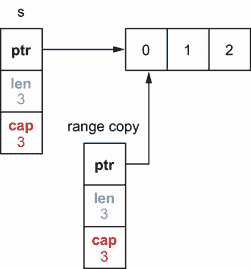
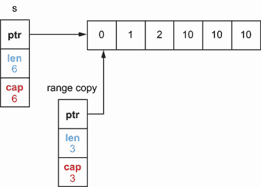
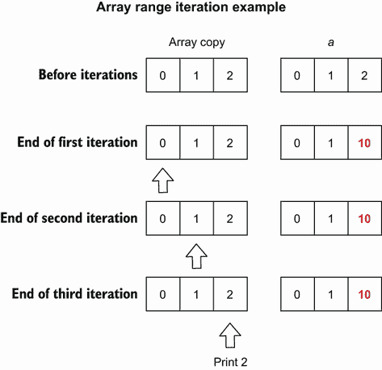
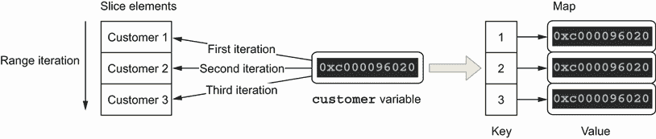
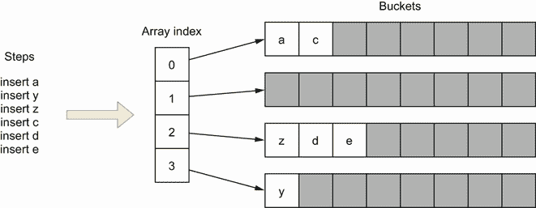

# 4 控制结构

本章涵盖

*   一个`range`循环如何分配元素值并评估所提供的表达式
*   处理`range`循环和指针
*   防止常见的映射迭代和破环错误
*   在循环内部使用`defer`

Go 中的控制结构类似于 C 或 Java 中的控制结构，但在很多方面有很大的不同。比如GO中没有`do`或`while`循环，只有一个广义的`for`。本章深入探讨与控制结构相关的最常见错误，重点关注循环`range`，这是一个常见的误解来源。

## 4.1 #30:忽略元素在范围循环中被复制的事实

`range`循环是迭代各种数据结构的便捷方式。我们不必处理索引和终止状态。Go 开发人员可能会忘记或者没有意识到`range`循环是如何赋值的，从而导致常见的错误。首先，让我们提醒自己如何使用一个`range`循环；然后我们来看看值是如何赋值的。

### 概念

一个`range`循环允许迭代不同的数据结构:

*   字符串

*   阵列

*   指向数组的指针

*   切片

*   映射

*   接收通道

与经典的`for`循环相比，`range`循环是迭代这些数据结构中所有元素的一种便捷方式，这要归功于它简洁的语法。它也更不容易出错，因为我们不必手动处理条件表达式和迭代变量，这可以避免诸如一个接一个的错误之类的错误。下面是一个对字符串片段进行迭代的示例:

```go
s := []string{"a", "b", "c"}
for i, v := range s {
    fmt.Printf("index=%d, value=%s\n", i, v)
}
```

这段代码循环遍历切片的每个元素。在每次迭代中，当我们迭代一个片时，`range`产生一对值:一个索引和一个元素值，分别分配给`i`和`v`。一般来说，`range`为每个数据结构生成两个值，除了接收通道，它为接收通道生成一个元素(值)。

在某些情况下，我们可能只对元素值感兴趣，而对索引不感兴趣。因为不使用局部变量会导致编译错误，所以我们可以使用空白标识符来替换索引变量，如下所示:

```go
s := []string{"a", "b", "c"}
for _, v := range s {
    fmt.Printf("value=%s\n", v)
}
```

多亏了空白标识符，我们通过忽略索引并只将元素值赋给`v`来迭代每个元素。

如果我们对值不感兴趣，我们可以省略第二个元素:

```go
for i := range s {}
```

既然我们已经用一个`range`循环刷新了我们的思维，让我们看看在一次迭代中返回什么样的值。

### 价值复制

理解在每次迭代中如何处理值对于有效使用`range`循环至关重要。让我们用一个具体的例子来看看它是如何工作的。

我们创建一个包含单个`balance`字段的`account`结构:

```go
type account struct {
    balance float32
}
```

接下来，我们创建一片`account`结构，并使用一个`range`循环遍历每个元素。在每次迭代中，我们递增每个`account`的`balance`:

```go
accounts := []account{
    {balance: 100.},
    {balance: 200.},
    {balance: 300.},
}
for _, a := range accounts {
    a.balance += 1000
}
```

根据这段代码，您认为以下两个选项中的哪一个显示了切片的内容？

*   `[{100} {200} {300}]`

*   `[{1100} {1200} {1300}]`

答案是`[{100} {200} {300}]`。在本例中，`range`循环不影响切片的内容。我们来看看为什么。

在 Go 中，我们分配的所有内容都是副本:

*   如果我们赋值一个函数的结果，返回一个*结构*，它执行该结构的一个拷贝。

*   如果我们赋值一个函数的结果，返回一个*指针*，它执行内存地址的复制(在 64 位架构上一个地址是 64 位长)。

牢记这一点以避免常见错误是至关重要的，包括那些与`range`循环相关的错误。事实上，当一个`range`循环遍历一个数据结构时，它会将每个元素复制到 value 变量(第二项)。

回到我们的例子，迭代每个`account`元素导致一个结构体副本被赋给值变量`a`。因此，用`a.balance += 1000`增加余额只会改变值变量(`a`)，而不会改变切片中的元素。

那么，如果我们想要更新切片元素呢？有两个主要选项。第一种选择是使用片索引访问元素。这可以通过使用索引而不是值变量的经典`for`循环或`range`循环来实现:

```go
for i := range accounts {                // ❶
    accounts[i].balance += 1000
}

for i := 0; i < len(accounts); i++ {     // ❷
    accounts[i].balance += 1000
}
```

❶ 使用索引变量来访问切片的元素

❷ 使用传统的 for 循环

两次迭代具有相同的效果:更新`accounts`切片中的元素。

我们应该支持哪一个？这要看上下文。如果我们想检查每个元素，第一个循环读写起来会更短。但是如果我们需要控制想要更新哪个元素(比如两个中的一个)，我们应该使用第二个循环。

更新切片元素:第三个选项

另一种选择是继续使用`range`循环并访问值，但是将切片类型修改为一个`account`指针切片:

```go
accounts := []*account{       // ❶
    {balance: 100.},
    {balance: 200.},
    {balance: 300.},
}
for _, a := range accounts {
    a.balance += 1000         // ❷
}
```

❶ 将切片类型更新为[]*帐户

❷ 直接更新切片元素

在这种情况下，正如我们提到的，`a`变量是存储在切片中的`account`指针的副本。但是由于两个指针引用同一个结构，`a.balance += 1000`语句更新切片元素。

然而，这种选择有两个主要缺点。首先，它需要更新切片类型，这并不总是可能的。第二，如果性能很重要，我们应该注意到，由于缺乏可预测性，迭代指针片对 CPU 来说可能效率较低(我们将在错误#91“不理解 CPU 缓存”中讨论这一点)。

一般来说，我们应该记住`range`循环中的 value 元素是一个副本。因此，如果值是我们需要变异的结构，我们将只更新副本，而不是元素本身，除非我们修改的值或字段是指针。更好的选择是使用一个`range`循环或者一个经典的`for`循环通过索引访问元素。

在下一节中，我们继续使用`range`循环，看看如何计算提供的表达式。

## 4.2 #31:忽略参数在范围循环中的求值方式

`range`循环语法需要一个表达式。比如在`for` `i,` `v` `:=` `range` `exp`，`exp`就是表达式。正如我们所见，它可以是一个字符串、一个数组、一个指向数组的指针、一个切片、一个映射或一个通道。现在，我们来讨论下面这个问题:这个表达式是如何评价的？使用`range`循环时，这是避免常见错误的要点。

让我们看看下面的例子，它将一个元素附加到我们迭代的切片上。你相信循环会终止吗？

```go
s := []int{0, 1, 2}
for range s {
    s = append(s, 10)
}
```

为了理解这个问题，我们应该知道当使用一个`range`循环时，所提供的表达式只计算一次，在循环开始之前。在这个上下文中，“求值”意味着提供的表达式被复制到一个临时变量，然后`range`迭代这个变量。在本例中，当对`s`表达式求值时，结果是一个切片副本，如图 4.1 所示。



图 4.1 `s`被复制到`range`使用的临时变量中。

`range`循环使用这个临时变量。原始切片`s`也在每次迭代期间更新。因此，在三次迭代之后，状态如图 4.2 所示。



图 4.2 临时变量仍然是一个三长度的切片；因此，迭代完成。

每一步都会追加一个新元素。然而，在三个步骤之后，我们已经检查了所有的元素。实际上，`range`使用的临时切片仍然是三长度切片。因此，循环在三次迭代后完成。

这种行为与传统的`for`循环有所不同:

```go
s := []int{0, 1, 2}
for i := 0; i < len(s); i++ {
    s = append(s, 10)
}
```

在这个例子中，循环永远不会结束。在每次迭代中，`len(s)`表达式被求值，因为我们不断添加元素，所以我们永远不会到达终止状态。为了准确地使用 Go 循环，记住这一点是很重要的。

回到`range`操作符，我们应该知道我们描述的行为(表达式只计算一次)也适用于所有提供的数据类型。作为一个例子，让我们用另外两种类型来看看这种行为的含义:通道和数组。

### 4.2.1 通道

让我们看一个基于使用`range`循环迭代一个通道的具体例子。我们创建了两个 goroutines，都将元素发送到两个不同的通道。然后，在父 goroutine 中，我们使用一个`range`循环在一个通道上实现一个消费者，该循环试图在迭代期间切换到另一个通道:

```go
ch1 := make(chan int, 3)     // ❶
go func() {
    ch1 <- 0
    ch1 <- 1
    ch1 <- 2
    close(ch1)
}()

ch2 := make(chan int, 3)     // ❷
go func() {
    ch2 <- 10
    ch2 <- 11
    ch2 <- 12
    close(ch2)
}()

ch := ch1                    // ❸
for v := range ch {          // ❹
    fmt.Println(v)
    ch = ch2                 // ❺
}
```

❶ 创建包含元素 0、1 和 2 的第一个通道

❷ 创建了包含元素 10、11 和 12 的第二个通道

❸ 将第一个通道分配给 ch

❹ 通过遍历 ch 创建了一个通道消费者

❺ 将第二通道分配给 ch

在这个例子中，同样的逻辑适用于如何评估`range`表达式。提供给`range`的表达式是一个指向`ch1`的`ch`通道。因此，`range`对`ch`求值，执行对临时变量的复制，并迭代这个通道中的元素。尽管有`ch = ch2`语句，但是`range`一直在`ch1`上迭代，而不是`ch2`:

```go
0
1
2
```

然而,`ch = ch2`声明并不是没有效果。因为我们将`ch`赋给了第二个变量，如果我们在这段代码后调用`close(ch)`，它将关闭第二个通道，而不是第一个。

现在让我们来看看`range`操作符在使用数组时只对每个表达式求值一次的影响。

### 阵列

对数组使用`range`循环有什么影响？因为`range`表达式是在循环开始之前计算的，所以分配给临时循环变量的是数组的副本。让我们通过下面的例子来看看这个原则的实际应用，这个例子在迭代过程中更新了一个特定的数组索引:

```go
a := [3]int{0, 1, 2}      // ❶
for i, v := range a {     // ❷
    a[2] = 10             // ❸
    if i == 2 {           // ❹
        fmt.Println(v)
    }
}
```

❶ 创建了一个由三个元素组成的数组

❷ 迭代数组

❸ 更新了最后一个指数

❹ 打印最后一个索引的内容

这段代码将最后一个索引更新为 10。但是，如果我们运行这段代码，它不会打印`10`；相反，它打印出`2`，如图 4.3 所示。



图 4.3 `range`迭代数组副本(左)，同时循环修改`a`(右)。

正如我们提到的，`range`操作符创建了数组的副本。同时，循环不更新副本；它更新原始数组:`a`。所以最后一次迭代时`v`的值是`2`，而不是`10`。

如果我们想打印最后一个元素的实际值，我们可以用两种方法:

*   通过从索引中访问元素:

    ```go
    a := [3]int{0, 1, 2}
    for i := range a {
        a[2] = 10
        if i == 2 {
            fmt.Println(a[2])     ❶ 
        }
    }
    ```

    ❶访问[2]而不是范围值变量

    因为我们访问的是原始数组，这段代码打印的是`2`而不是`10`。

*   使用数组指针:

    ```go
    a := [3]int{0, 1, 2}
    for i, v := range &a {     ❶ 
        a[2] = 10
        if i == 2 {
            fmt.Println(v)
        }
    }
    ```

    ❶的范围超过 1000 英镑，而不是 1000 英镑

    我们将数组指针的副本分配给`range`使用的临时变量。但是因为两个指针引用同一个数组，所以访问`v`也会返回`10`。

两个选项都有效。然而，第二个选项不会导致复制整个数组，这可能是在数组非常大的情况下需要记住的事情。

总之，`range`循环只对提供的表达式求值一次，在循环开始之前，通过复制(不考虑类型)。我们应该记住这种行为，以避免常见的错误，例如，可能导致我们访问错误的元素。

在下一节中，我们将看到如何使用带有指针的`range`循环来避免常见错误。

## 4.3 #32:忽略在范围循环中使用指针元素的影响

本节着眼于使用带有指针元素的`range`循环时的一个具体错误。如果我们不够谨慎，可能会导致我们引用错误的元素。让我们检查一下这个问题以及如何修复它。

在开始之前，让我们澄清一下使用指针元素切片或映射的基本原理。主要有三种情况:

*   就语义而言，使用指针语义存储数据意味着共享元素。例如，以下方法包含将元素插入缓存的逻辑:

    ```go
    type Store struct {
        m map[string]*Foo
    }

    func (s Store) Put(id string, foo *Foo) {
        s.m[id] = foo
        // ...
    }
    ```

    这里，使用指针语义意味着`Foo`元素由`Put`的调用者和`Store`结构共享。

*   有时我们已经在操作指针了。因此，在集合中直接存储指针而不是值会很方便。

*   如果我们存储大型结构，并且这些结构经常发生变异，我们可以使用指针来避免每次变异的复制和插入:

    ```go
    func updateMapValue(mapValue map[string]LargeStruct, id string) {
        value := mapValue[id]              // ❶
        value.foo = "bar"
        mapValue[id] = value               // ❷
    }

    func updateMapPointer(mapPointer map[string]*LargeStruct, id string) {
        mapPointer[id].foo = "bar"         // ❸
    }
    ```

    ❶拷贝

    ❷插页

    ❸直接改变了映射元素

    因为`updateMapPointer`接受指针映射，所以`foo`字段的变异可以在一个步骤中完成。

现在是时候讨论一下`range`循环中指针元素的常见错误了。我们将考虑以下两种结构:

*   一个代表客户的`Customer`结构

*   一个`Store`，它保存了一个`Customer`指针的映射

```go
type Customer struct {
    ID      string
    Balance float64
}

type Store struct {
    m map[string]*Customer
}
```

下面的方法迭代一片`Customer`元素，并将它们存储在`m`映射中:

```go
func (s *Store) storeCustomers(customers []Customer) {
    for _, customer := range customers {
        s.m[customer.ID] = &customer         // ❶
    }
}
```

❶ 将客户指针存储在映射中

在这个例子中，我们使用操作符`range`对输入切片进行迭代，并将`Customer`指针存储在映射中。但是这种方法能达到我们预期的效果吗？

让我们用三个不同的`Customer`结构来调用它，试一试:

```go
s.storeCustomers([]Customer{
    {ID: "1", Balance: 10},
    {ID: "2", Balance: -10},
    {ID: "3", Balance: 0},
})
```

如果我们打印映射，下面是这段代码的结果:

```go
key=1, value=&main.Customer{ID:"3", Balance:0}
key=2, value=&main.Customer{ID:"3", Balance:0}
key=3, value=&main.Customer{ID:"3", Balance:0}
```

正如我们所看到的，不是存储三个不同的`Customer`结构，而是存储在映射中的所有元素都引用同一个`Customer`结构:`3`。我们做错了什么？

使用`range`循环迭代`customers`片，不管元素的数量，创建一个具有固定地址的单个`customer`变量。我们可以通过在每次迭代中打印指针地址来验证这一点:

```go
func (s *Store) storeCustomers(customers []Customer) {
    for _, customer := range customers {
        fmt.Printf("%p\n", &customer)      // ❶
        s.m[customer.ID] = &customer
    }
}
0xc000096020
0xc000096020
0xc000096020
```

❶ 打印客户地址

为什么这很重要？让我们检查一下每个迭代:

*   在第一次迭代中，`customer`引用第一个元素:`Customer 1`。我们存储了一个指向`customer`结构的指针。

*   在第二次迭代中，`customer`现在引用了另一个元素:`Customer 2`。我们还存储了一个指向`customer`结构的指针。

*   最后，在最后一次迭代中，`customer`引用最后一个元素:`Customer 3`。同样，相同的指针存储在映射中。

在迭代结束时，我们已经在映射中存储了同一个指针三次(见图 4.4)。这个指针的最后一个赋值是对切片的最后一个元素的引用:`Customer 3`。这就是为什么所有映射元素都引用同一个`Customer`。



图 4.4`customer`变量有一个常量地址，所以我们在映射中存储了相同的指针。

那么，我们如何解决这个问题呢？有两种主要的解决方案。第一个类似于我们在错误 1 中看到的，“非预期的变量隐藏”它需要创建一个局部变量:

```go
func (s *Store) storeCustomers(customers []Customer) {
    for _, customer := range customers {
        current := customer                 // ❶
        s.m[current.ID] = &current          // ❷
    }
}
```

❶ 创建一个本地电流变量

❷ 将这个指针存储在映射中

在这个例子中，我们不存储引用`customer`的指针；相反，我们存储一个引用`current`的指针。`current`是在每次迭代中引用唯一`Customer`的变量。因此，在循环之后，我们在映射中存储了引用不同`Customer`结构的不同指针。另一种解决方案是使用片索引存储引用每个元素的指针:

```go
func (s *Store) storeCustomers(customers []Customer) {
    for i := range customers {
        customer := &customers[i]        // ❶
        s.m[customer.ID] = customer      // ❷
    }
}
```

❶ 给客户分配一个 I 元素的指针

❷ 存储客户指针

在这个解决方案中，`customer`现在是一个指针。因为它是在每次迭代中初始化的，所以它有一个唯一的地址。因此，我们在映射中存储不同的指针。

当使用一个`range`循环迭代一个数据结构时，我们必须记住所有的值都被分配给一个具有唯一地址的唯一变量。因此，如果我们在每次迭代中存储一个引用这个变量的指针，我们将会在这样一种情况下结束:我们存储了引用同一个元素的同一个指针:最新的元素。我们可以通过在循环范围内强制创建一个局部变量或者创建一个指针通过它的索引引用一个切片元素来解决这个问题。两种解决方案都可以。还要注意，我们将切片数据结构作为输入，但是问题与映射类似。

在下一节中，我们将看到与映射迭代相关的常见错误。

## 4.4 #33:在映射迭代过程中做出错误的假设

对映射进行迭代是误解和错误的常见来源，主要是因为开发人员做出了错误的假设。在本节中，我们讨论两种不同的情况:

*   订购

*   迭代期间的映射更新

我们将看到两个基于错误假设的常见错误。

### 订购

关于排序，我们需要了解映射数据结构的一些基本行为:

*   它不保持数据按键排序(映射不是基于二叉树)。

*   它不保留数据添加的顺序。例如，如果我们在对 B 之前插入对 A，我们不应该根据这个插入顺序做出任何假设。

此外，当迭代一个映射时，我们根本不应该做任何排序假设。让我们来看看这句话的含义。

我们将考虑图 4.5 所示的映射，由四个桶组成(元素代表键)。后备数组的每个索引引用一个给定的桶。



图 4.5 有四个桶的映射

现在，让我们使用一个`range`循环来迭代这个映射，并打印所有的键:

```go
for k := range m {
    fmt.Print(k)
}
```

我们提到过数据不是按键排序的。因此，我们不能期望这段代码打印出`acdeyz`。与此同时，我们说过映射不保留插入顺序。因此，我们也不能期望代码打印出`ayzcde`。

但是我们至少可以期望代码按照键当前存储在映射中的顺序打印键吧？不，这个也不行。在 Go 中，映射上的迭代顺序*不是*指定的。也不能保证从一次迭代到下一次迭代的顺序是相同的。我们应该记住这些映射行为，这样我们就不会把代码建立在错误的假设上。

我们可以通过运行前面的循环两次来确认所有这些语句:

```go
zdyaec
czyade
```

正如我们所看到的，每次迭代的顺序都是不同的。

注意尽管迭代顺序没有保证，但迭代分布并不均匀。这就是为什么官方的 Go 规范声明迭代是未指定的，而不是随机的。

那么为什么 Go 有如此惊人的方法来迭代映射呢？这是语言设计者有意识的选择。他们想添加一些随机性，以确保开发人员在使用映射时不会依赖任何排序假设(见 [`mng.bz/M2JW`](http://mng.bz/M2JW) )。

因此，作为 Go 开发者，我们不应该在迭代一个映射时对排序做任何假设。然而，让我们注意使用来自标准库或外部库的包会导致不同的行为。例如，当`encoding/json`包将一个映射整理到 JSON 中时，它按照键的字母顺序对数据进行重新排序，而不考虑插入顺序。但这并不是 Go映射本身的属性。如果需要排序，我们应该依赖其他数据结构，比如二进制堆(GoDS 库在 [`github.com/emirpasic/gods`](https://github.com/emirpasic/gods) 包含有用的数据结构实现)。

现在让我们看看第二个错误，它与迭代映射时更新映射有关。

### 4.4.2 迭代期间的映射插入

在 Go 中，允许在迭代过程中更新映射(插入或删除元素)；它不会导致编译错误或运行时错误。然而，在迭代过程中向映射中添加条目时，我们应该考虑另一个方面，以避免不确定的结果。

让我们来看看下面这个迭代一个`map[int]bool`的例子。如果 pair 值为真，我们添加另一个元素。你能猜到这段代码的输出是什么吗？

```go
m := map[int]bool{
    0: true,
    1: false,
    2: true,
}

for k, v := range m {
    if v {
        m[10+k] = true
    }
}

fmt.Println(m)
```

这段代码的结果是不可预测的。如果我们多次运行此代码，下面是一些结果示例:

```go
map[0:true 1:false 2:true 10:true 12:true 20:true 22:true 30:true]
map[0:true 1:false 2:true 10:true 12:true 20:true 22:true 30:true 32:true]
map[0:true 1:false 2:true 10:true 12:true 20:true]
```

为了理解其中的原因，我们必须阅读 Go 规范对迭代过程中的新映射条目的描述:

如果映射条目是在迭代过程中创建的，它可能是在迭代过程中生成的，也可能被跳过。对于创建的每个条目，以及从一次迭代到下一次迭代，选择可能会有所不同。

因此，当一个元素在迭代过程中被添加到一个映射中时，它可能会在后续的迭代过程中产生，也可能不会产生。作为 Go 开发者，我们没有任何方法来强制执行这种行为。它也可能因迭代而异，这就是为什么我们三次得到不同的结果。

记住这种行为以确保我们的代码不会产生不可预测的输出是很重要的。如果我们想在迭代时更新映射，并确保添加的条目不是迭代的一部分，一种解决方案是处理映射的副本，如下所示:

```go
m := map[int]bool{
    0: true,
    1: false,
    2: true,
}
m2 := copyMap(m)            // ❶

for k, v := range m {
    m2[k] = v
    if v {
        m2[10+k] = true     // ❷
    }
}

fmt.Println(m2)
```

❶ 创建了初始映射的副本

❷ 更新 m2 而不是 m

在本例中，我们将正在读取的映射与正在更新的映射分离开来。事实上，我们一直在迭代`m`，但是更新是在`m2`完成的。这个新版本创建了可预测和可重复的输出:

```go
map[0:true 1:false 2:true 10:true 12:true]
```

总而言之，当我们使用映射时，我们不应该依赖以下内容:

*   数据按键排序

*   插入顺序的保存

*   确定性迭代顺序

*   在添加元素的同一次迭代中产生的元素

记住这些行为应该有助于我们避免基于错误假设的常见错误。

在下一节中，我们将看到一个在中断循环时经常犯的错误。T17

## 4.5 #34:忽略 break 语句的工作方式

一个`break`语句是常用来终止一个循环的执行。当循环与`switch`或`select`一起使用时，开发人员经常会犯破坏错误语句的错误。

让我们看看下面的例子。我们在和`for`循环中实现了一个`switch`。如果循环索引的值为`2`，我们想要中断循环:

```go
for i := 0; i < 5; i++ {
    fmt.Printf("%d ", i)

    switch i {
    default:
    case 2:
        break      // ❶
    }
}
```

❶ 如果我等于 2，就叫休息。

这段代码乍一看可能没错；然而，它并没有做我们所期望的。`break`语句没有终止循环:相反，它终止了语句`switch`。因此，这段代码不是从 0 迭代到 2，而是从 0 迭代到 4: `0 1 2 3 4`。

要记住的一个基本规则是，`break`语句终止最里面的`for`、`switch`或`select`语句的执行。在前面的例子中，它终止了`switch`语句。

那么我们如何编写代码来打破循环而不是`switch`语句的？最惯用的方法是使用标签:

```go
loop:                           // ❶
    for i := 0; i < 5; i++ {
        fmt.Printf("%d ", i)

        switch i {
        default:
        case 2:
            break loop          // ❷
        }
    }
```

❶ 定义了一个循环标签

❷ 终止的是附在环路标签上的环路，而不是交换机

这里，我们将标签与`for`循环联系起来。然后，因为我们向`break`语句提供了`loop`标签，所以它中断了循环，而不是切换。因此，这个新版本将打印`0 1 2`，正如我们所料。

带标签的 break 是不是跟 goto 一样？

一些开发人员可能会质疑带有标签的`break`是否是惯用的，并将它视为一个花哨的`goto`语句。然而，事实并非如此，标准库中使用了这样的代码。例如，我们在从缓冲区读取行时，在`net/http`包中看到这个:

```go
readlines:
    for {
        line, err := rw.Body.ReadString('\n')
        switch {
        case err == io.EOF:
            break readlines
        case err != nil:
            t.Fatalf("unexpected error reading from CGI: %v", err)
        }
        // ...
    }
```

这个例子使用了一个带有`readlines`的表达性标签来强调循环的目标。因此，我们应该考虑使用标签来中断语句，这是 Go 中惯用的方法。

循环内的`select`也可能会中断错误的语句。在下面的代码中，我们想在两种情况下使用`select`,如果上下文取消，则中断循环:

```go
for {
    select {
    case <-ch:
        // Do something
    case <-ctx.Done():
        break             // ❶
    }
}
```

如果上下文取消，❶会中断

这里最里面的`for`、`switch`或`select`语句是的`select`语句，而不是`for`循环。因此，循环重复。同样，为了打破循环本身，我们可以使用一个标签:

```go
loop:                          // ❶
    for {
        select {
        case <-ch:
            // Do something
        case <-ctx.Done():
            break loop         // ❷
        }
    }
```

❶ 定义了一个循环标签

❷ 终止附加到循环标签的循环，而不是 select

现在，正如预期的那样，`break`语句中断了循环，而不是`select`。

注意，我们也可以使用带标签的`continue`来进入带标签循环的下一次迭代。

在循环中使用语句`switch`或`select`时，我们应该保持谨慎。当使用`break`时，我们应该始终确保我们知道它将影响哪个陈述。正如我们所见，使用标签是强制中断特定语句的惯用解决方案。

在本章的最后一节，我们继续讨论循环，但这次是结合关键字`defer`来讨论。

## 4.6 #35:在循环中使用 defer

`defer`语句延迟一个调用的执行，直到周围的函数返回。它主要用于减少样板代码。例如，如果一个资源最终必须关闭，我们可以使用`defer`来避免在每个`return`之前重复关闭调用。然而，一个常见的错误是没有意识到在循环中使用`defer`的后果。让我们来研究一下这个问题。

我们将实现一个打开一组文件的函数，其中的文件路径是通过一个通道接收的。因此，我们必须遍历这个通道，打开文件，并处理闭包。这是我们的第一个版本:

```go
func readFiles(ch <-chan string) error {
    for path := range ch {                    // ❶
        file, err := os.Open(path)            // ❷
        if err != nil {
            return err
        }

        defer file.Close()                    // ❸

        // Do something with file
    }
    return nil
}
```

❶ 在通道上迭代

❷ 打开文件

❸ 推迟了申请。关闭()

注意我们将讨论如何处理错误#54“不处理延迟错误”中的延迟错误

这种实现有一个很大的问题。我们必须回忆一下，当包围函数返回时，`defer`调度一个函数调用。在这种情况下，延迟调用不是在每次循环迭代中执行，而是在`readFiles`函数返回时执行。如果`readFiles`没有返回，文件描述符将永远保持打开，导致泄漏。

有什么办法可以解决这个问题？一种可能是去掉`defer`，手动处理文件关闭。但是如果我们那样做，我们将不得不放弃 Go 工具集的一个方便的特性，仅仅因为我们在一个循环中。那么，如果我们想继续使用`defer`，有哪些选择呢？我们必须围绕`defer`创建另一个在每次迭代中调用的周围函数。

例如，我们可以实现一个`readFile`函数来保存接收到的每个新文件路径的逻辑:

```go
func readFiles(ch <-chan string) error {
    for path := range ch {
        if err := readFile(path); err != nil {    // ❶
            return err
        }
    }
    return nil
}

func readFile(path string) error {
    file, err := os.Open(path)
    if err != nil {
        return err
    }

    defer file.Close()                            // ❷

    // Do something with file
    return nil
}
```

❶ 调用包含主逻辑的 readFile 函数

❷ 一直呼吁推迟

在这个实现中，当`readFile`返回时，调用`defer`函数，这意味着在每次迭代结束时。因此，在父`readFiles`函数返回之前，我们不会打开文件描述符。

另一种方法是让`readFile`函数成为一个闭包:

```go
func readFiles(ch <-chan string) error {
    for path := range ch {
        err := func() error {
            // ...
            defer file.Close()
            // ...
        }()                  // ❶
        if err != nil {
            return err
        }
    }
    return nil
}
```

❶ 运行提供的闭包

但本质上，这仍然是相同的解决方案:在每次迭代中添加另一个周围函数来执行`defer`调用。普通的旧函数的优点是可能更清晰一点，我们也可以为它编写一个特定的单元测试。

当使用`defer`时，我们必须记住，当周围的函数返回时，它调度一个函数调用。因此，在一个循环中调用`defer`将会堆叠所有的调用:它们不会在每次迭代中执行，例如，如果循环没有终止，这可能会导致内存泄漏。解决这个问题最方便的方法是在每次迭代中引入另一个要调用的函数。但是如果性能是至关重要的，一个缺点是函数调用增加了开销。如果我们有这样的情况，并且我们想要防止这种开销，我们应该去掉`defer`并且在循环之前手动处理延迟调用。

## 摘要

*   循环`range`中的 value 元素是一个副本。因此，例如，要改变一个结构，可以通过它的索引或者通过一个经典的`for`循环来访问它(除非你想要修改的元素或者字段是一个指针)。

*   了解传递给`range`操作符的表达式在循环开始前只计算一次，可以帮助您避免常见的错误，如通道或片迭代中的低效赋值。

*   使用局部变量或使用索引访问元素，可以防止在循环内复制指针时出错。

*   为了在使用映射时确保可预测的输出，请记住映射数据结构

    *   不按键排序数据
    *   不保留插入顺序
    *   没有确定的迭代顺序
    *   不保证在一次迭代中添加的元素会在这次迭代中产生
*   使用带标签的`break`或`continue`强制中断特定语句。这对循环中的`switch`或`select`语句很有帮助。

*   提取函数内部的循环逻辑会导致在每次迭代结束时执行一个`defer`语句。