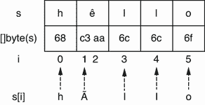
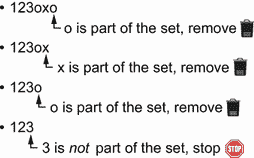

# 5 根弦

本章涵盖

*   理解GO中符文的基本概念
*   通过字符串迭代和修剪防止常见错误
*   避免因字符串连接或无用转换而导致的低效代码
*   用子字符串避免内存泄漏

在 Go 中，字符串是一种不可变的数据结构，包含以下内容:

*   指向不可变字节序列的指针

*   该序列中的总字节数

我们将在本章中看到 Go 有一个非常独特的处理字符串的方法。Go 引入了一个概念叫做*符文*；这个概念对于理解是必不可少的，可能会让新手感到困惑。一旦我们知道了字符串是如何被管理的，我们就可以避免在字符串上迭代时的常见错误。我们还将看看 Go 开发者在使用或生成字符串时所犯的常见错误。此外，我们会看到有时我们可以直接使用`[]byte`工作，避免额外的分配。最后，我们将讨论如何避免一个常见的错误，这个错误会造成子字符串的泄漏。本章的主要目的是通过介绍常见的字符串错误来帮助你理解字符串在 Go 中是如何工作的。

## 5.1 #36:不理解符文的概念

如果不讨论GO中的符文概念，我们就不能开始这一章。正如您将在接下来的部分中看到的，这个概念是彻底理解如何处理字符串和避免常见错误的关键。但是在深入研究 Go runes 之前，我们需要确保我们在一些基本的编程概念上是一致的。

我们应该理解字符集和编码之间的区别:

*   字符集，顾名思义，就是一组字符。例如，Unicode 字符集包含 2^21 字符。

*   编码是字符列表的二进制翻译。例如，UTF-8 是一种能够以可变字节数(从 1 到 4 个字节)对所有 Unicode 字符进行编码的编码标准。

我们提到字符是为了简化字符集的定义。但是在Unicode中，我们使用*码位*的概念来指代由单个值表示的项。例如，在汉字符由`U+6C49`代码点标识。使用UTF-8，汉使用三个字节编码:`0xE6`、`0xB1`和`0x89`。为什么这很重要？因为在 GO 中，一个符文*就是*一个Unicode码位。

同时，我们提到 UTF-8 将字符编码成 1 到 4 个字节，因此，最多 32 位。这就是为什么在GO中，符文是`int32`的别名:

```go
type rune = int32
```

关于 UTF-8，另一件要强调的事情是:有些人认为GO弦总是 UTF-8，但这不是真的。让我们考虑下面的例子:

```go
s := "hello"
```

我们将一个字符串文字(一个字符串常量)赋给`s`。在GO中，源代码是用 UTF 8 编码的。因此，所有的字符串都使用 UTF-8 编码成一个字节序列。然而，字符串是任意字节的序列；它不一定基于 UTF-8。因此，当我们操作一个不是从字符串初始化的变量时(例如，从文件系统中读取)，我们不能假定它使用 UTF-8 编码。

注意 [`golang.org/x`](ghttps://pkg.go.dev/golang.org/x) ，一个为标准库提供扩展的库，包含使用 UTF-16 和 UTF-32 的包。

让我们回到`hello`的例子。我们有一个由五个字符组成的字符串:`h`、`e`、`l`、 `l`和`i`。

这些*简单的*字符每个都用一个字节进行编码。这就是为什么得到`s`的长度会返回`5`:

```go
s := "hello"
fmt.Println(len(s)) // 5
```

But a character isn’t always encoded into a single byte. Coming back to the 汉 character, we mentioned that with UTF-8, this character is encoded into three bytes. We can validate this with the following example:

```go
s := "汉"
fmt.Println(len(s)) // 3
```

这个例子打印的不是`1`，而是`3`。事实上，对字符串应用的`len`内置函数不会返回字符数；它返回字节数。

Conversely, we can create a string from a list of bytes. We mentioned that the 汉 character was encoded using three bytes, 0xE6, 0xB1, and 0x89:

```go
s := string([]byte{0xE6, 0xB1, 0x89})
fmt.Printf("%s\n", s)
```

Here, we build a string composed of these three bytes. When we print the string, instead of printing three characters, the code prints a single one: 汉.

总而言之:

*   字符集是一组字符，而编码描述了如何将字符集转换成二进制。

*   在 Go 中，一个字符串引用一个不可变的任意字节片。

*   Go 源代码使用 UTF-8 编码。因此，所有字符串都是 UTF 8 字符串。但是因为一个字符串可以包含任意字节，如果它是从其他地方(不是源代码)获得的，就不能保证它是基于 UTF-8 编码的。

*   一个符文对应一个 Unicode 码点的概念，意思是用单个值表示的物品。

*   使用 UTF-8，一个 Unicode 码位可以编码成 1 到 4 个字节。

*   在 Go 中对一个字符串使用`len`返回字节数，而不是符文数。

记住这些概念是必要的，因为在GO中，符文无处不在。让我们来看看这一知识的具体应用，它涉及一个与字符串迭代相关的常见错误。

## 5.2 #37:不准确的字符串迭代

对字符串进行迭代是开发者的常用操作。也许我们希望对字符串中的每个符文执行一次操作，或者实现一个自定义函数来搜索特定的子字符串。在这两种情况下，我们都必须迭代一个字符串的不同符文。但是很容易混淆迭代是如何工作的。

我们来看一个具体的例子。这里，我们要打印字符串中不同的符文及其对应的位置:

```go
s := "hêllo"            // ❶
for i := range s {
    fmt.Printf("position %d: %c\n", i, s[i])
}
fmt.Printf("len=%d\n", len(s))
```

❶字符串文字包含一个特殊的符文:ê。

我们使用`range`操作符对进行迭代，然后我们希望使用字符串中的索引打印每个符文。以下是输出结果:

```go
position 0: h
position 1: Ã
position 3: l
position 4: l
position 5: o
len=6
```

这段代码没有做我们想要的事情。让我们强调三点:

*   第二个符文是输出中的`Ã`而不是`ê`。

*   我们从位置 1 跳到位置 3:位置 2 是什么？

*   `len`返回 6 的计数，而`s`只包含 5 个符文。

让我们从最后一个观察开始。我们已经提到过`len`返回一个字符串中的字节数，而不是符文数。因为我们给`s`分配了一个字符串文字，`s`是一个 UTF-8 字符串。同时，特殊字符`ê`不是用一个字节编码的；它需要 2 个字节。因此，调用`len(s)`会返回`6`。

计算一串符文的数量

如果我们想得到一个字符串中符文的个数，而不是字节数呢？我们如何做到这一点取决于编码。

在前面的例子中，因为我们给`s`分配了一个字符串，所以我们可以使用`unicode/utf8`包中的:

```go
fmt.Println(utf8.RuneCountInString(s)) // 5
```

让我们回到迭代中来理解剩余的惊喜:

```go
for i := range s {
    fmt.Printf("position %d: %c\n", i, s[i])
}
```

我们必须认识到，在这个例子中，我们没有迭代每个符文；相反，我们迭代一个符文的每个起始索引，如图 5.1 所示。



图 5.1 打印`s[i]`打印索引`i`处每个字节的 UTF-8 表示。

打印`s[i]`不打印第`i`个符文；它打印索引`i`处字节的 UTF-8 表示。因此，我们印了`hÃllo`而不是`hêllo`。那么，如果我们想打印所有不同的符文，我们如何修复代码呢？有两个主要选项。

我们必须使用`range`操作符的值元素:

```go
s := "hêllo"
for i, r := range s {
    fmt.Printf("position %d: %c\n", i, r)
}
```

我们使用了`r`变量，而不是使用`s[i]`来打印符文。在上使用`range`循环，字符串返回两个变量，符文的起始索引和符文本身:

```go
position 0: h
position 1: ê
position 3: l
position 4: l
position 5: o
```

另一种方法是将字符串转换成一片符文，并对其进行迭代:

```go
s := "hêllo"
runes := []rune(s)
for i, r := range runes {
    fmt.Printf("position %d: %c\n", i, r)
}
position 0: h
position 1: ê
position 2: l
position 3: l
position 4: o
```

在这里，我们使用`[]rune(s)`将`s`转换成一片符文。然后我们迭代这个切片，使用 `range`操作符的 value 元素打印所有的符文。唯一的区别与位置有关:代码直接打印符文的索引，而不是打印符文字节序列的起始索引。

请注意，与前一个解决方案相比，这个解决方案引入了运行时开销。事实上，将一个字符串转换成一片符文需要分配一个额外的片并将字节转换成符文:一个`O(n)`的时间复杂度，n 是字符串中的字节数。因此，如果我们想迭代所有的符文，我们应该使用第一种解决方案。

但是，如果我们想用第一个选项访问一个字符串的第`i`个符文，我们没有访问符文索引的权限；相反，我们知道一个符文在字节序列中的起始索引。因此，在大多数情况下，我们应该倾向于第二种选择:

```go
s := "hêllo"
r := []rune(s)[4]
fmt.Printf("%c\n", r) // o
```

这段代码打印第四个符文，首先将字符串转换成一个符文片。

访问特定符文的可能优化

如果一个字符串由单字节的符文组成，那么一个优化是可能的:例如，如果字符串包含字母`A`到`Z`和`a`到`z`。我们可以通过使用`s[i]`直接访问字节来访问第`i`个符文，而不用将整个字符串转换成一片符文:

```go
s := "hello"
fmt.Printf("%c\n", rune(s[4])) // o
```

总之，如果我们想要迭代一个字符串的符文，我们可以直接在字符串上使用`range`循环。但是我们必须记住，索引并不对应于符文索引，而是对应于符文字节序列的起始索引。因为一个符文可以由多个字节组成，所以如果我们要访问符文本身，应该使用`range`的值变量，而不是字符串中的索引。同时，如果我们对得到一个字符串的第`i`个符文感兴趣，我们应该在大多数情况下将该字符串转换成一片符文。

在下一节中，我们来看看在和`strings`包中使用 trim 函数时常见的混淆来源。

## 5.3 #38:误用微调功能

GO开发者在使用`strings`包时的一个常见错误是将的`TrimRight`和`TrimSuffix`混在一起。这两个功能的目的相似，很容易混淆。让我们来看看。

在下面的例子中，我们使用`TrimRight`。这段代码的输出应该是什么？

```go
fmt.Println(strings.TrimRight("123oxo", "xo"))
```

答案是`123`。这是你所期望的吗？如果没有，你可能期待的是`TrimSuffix`的结果。让我们回顾一下这两个函数。

移除给定集合中包含的所有尾随符文。在我们的例子中，我们作为一个集合`xo`传递，它包含两个符文:`x`和`o`。图 5.2 显示了逻辑。



图 5.2 `TrimRight`向后迭代，直到找到一个不属于集合的符文。

在每个符文上向后迭代。如果某个符文是所提供符文的一部分，该功能会将其移除。如果没有，函数停止迭代并返回剩余的字符串。这就是我们的例子返回`123`的原因。

另一方面，`TrimSuffix`返回一个没有提供尾随后缀的字符串:

```go
fmt.Println(strings.TrimSuffix("123oxo", "xo"))
```

因为`123oxo`以`xo`结尾，所以这段代码打印`123o`。此外，删除尾部后缀不是一个重复的操作，所以`TrimSuffix("123xoxo", "xo")`返回`123xo`。

对于带有`TrimLeft`和`TrimPrefix`的字符串的左侧，原理是相同的:

```go
fmt.Println(strings.TrimLeft("oxo123", "ox")) // 123
fmt.Println(strings.TrimPrefix("oxo123", "ox")) /// o123
```

`strings.TrimLeft`移除一组符文中的所有前导符文，并因此打印`123`。`TrimPrefix`删除提供的前导前缀，打印`o123`。

与这个主题相关的最后一个注意事项:`Trim`在一个字符串上同时应用`TrimLeft`和`TrimRight`。因此，它删除了集合中包含的所有前导和尾随符文:

```go
fmt.Println(strings.Trim("oxo123oxo", "ox")) // 123
```

总之，我们必须确保理解`TrimRight` / `TrimLeft`和`TrimSuffix` / `TrimPrefix`之间的区别:

*   `TrimRight` / `TrimLeft`移除一组中的尾随/前导符文。

*   `TrimSuffix` / `TrimPrefix`删除给定的后缀/前缀。

在下一节中，我们将深入研究字符串连接。

## 5.4 #39:优化不足的字符串串联

当谈到连接字符串时，Go 中有两种主要的方法，其中一种在某些情况下效率很低。让我们检查这个主题，以了解我们应该支持哪个选项以及何时支持。

让我们编写一个`concat`函数，使用`+=`操作符连接一个片的所有字符串元素:

```go
func concat(values []string) string {
    s := ""
    for _, value := range values {
        s += value
    }
    return s
}
```

在每次迭代中，`+=`操作符将`s`和`value`字符串连接起来。乍一看，这个功能可能不会出错。但是在这个实现中，我们忘记了字符串的一个核心特征:它的不变性。所以每次迭代不更新`s`；它会在内存中重新分配一个新字符串，这会显著影响该函数的性能。

幸运的是，有一个解决这个问题的方法，使用`strings`包和`Builder`结构:

```go
func concat(values []string) string {
    sb := strings.Builder{}               // ❶
    for _, value := range values {
        _, _ = sb.WriteString(value)      // ❷
    }
    return sb.String()                    // ❸
}
```

❶创造了一种弦乐器。建设者

❷追加了一个字符串

❸返回结果字符串

首先，我们使用的零值创建了一个`strings.Builder`结构。在每一次迭代中，我们通过调用`WriteString`方法来构造结果字符串，这个方法让将`value`的内容附加到它的内部缓冲区中，从而最小化内存复制。

注意`WriteString`返回一个错误作为第二个输出，但是我们故意忽略它。事实上，这个方法永远不会返回非零错误。那么这个方法返回一个错误作为其签名的一部分的目的是什么呢？`strings.Builder`实现的`io.StringWriter`接口，其中包含一个单独的方法:`WriteString(s` `string)` `(n` `int,` `err` `error)`。因此，为了符合这个接口，`WriteString`必须返回一个错误。

注意，我们将讨论错误#53“不处理错误”中惯用的忽略错误

使用`strings.Builder`，我们还可以追加

*   一个字节片使用`Write`

*   单字节使用`WriteByte`

*   单个符文使用`WriteRune`

在内部，`strings.Builder`保存一个字节片。对`WriteString`的每次调用都会导致对该片上的`append`的调用。有两个影响。首先，这个结构不应该同时使用，因为对`append`的调用会导致竞态条件。第二个影响是我们在错误#21“低效的片初始化”中看到的:如果片的未来长度是已知的，我们应该预分配它。为此，`strings.Builder`公开了一个方法`Grow(n int)`来保证另外的`n`字节的空间。

让我们通过用总字节数调用`Grow`来编写另一个版本的`concat`方法:

```go
func concat(values []string) string {
    total := 0
    for i := 0; i < len(values); i++ {     // ❶
        total += len(values[i])
    }

    sb := strings.Builder{}
    sb.Grow(total)                         // ❷
    for _, value := range values {
        _, _ = sb.WriteString(value)
    }
    return sb.String()
}
```

❶遍历每个字符串来计算总字节数

❷的电话与这个总数一起增长

在迭代之前，我们计算最终字符串包含的总字节数，并将结果赋给`total`。注意，我们对符文的数量不感兴趣，而是对字节的数量感兴趣，所以我们使用了`len`函数。然后我们调用`Grow`来保证在遍历字符串之前有`total`字节的空间。

让我们运行一个基准来比较三个版本(v1 使用`+=`；v2 使用`strings.Builder{}`无预分配；和 v3 使用带有预分配的`strings.Builder{}`)。输入片段包含 1，000 个字符串，每个字符串包含 1，000 个字节:

```go
BenchmarkConcatV1-4             16      72291485 ns/op
BenchmarkConcatV2-4           1188        878962 ns/op
BenchmarkConcatV3-4           5922        190340 ns/op
```

正如我们所见，最新版本是迄今为止效率最高的:比 v1 快 99%，比 v2 快 78%。我们可能会问自己，在输入片上迭代两次如何能使代码更快？答案在于错误#21，“低效的片初始化”:如果一个片没有被分配给给定的长度或容量，该片将在每次变满时继续增长，导致额外的分配和拷贝。因此，在这种情况下，迭代两次是最有效的选择。

`strings.Builder`是连接字符串列表的推荐解决方案。通常，这种解决方案应该在循环中使用。事实上，如果我们只需要连接几个字符串(比如一个名字和一个姓氏)，不推荐使用`strings.Builder`，因为这样做会使代码的可读性比使用`+=`操作符或`fmt.Sprintf`差一些。

一般来说，我们可以记住，从性能角度来看，从我们必须连接超过五个字符串的那一刻起，`strings.Builder`解决方案就比快。尽管这个确切的数字取决于许多因素，如连接字符串的大小和机器，但这可以作为帮助我们决定何时选择一个解决方案的经验法则。同样，我们不应该忘记，如果未来字符串的字节数是预先知道的，我们应该使用`Grow`方法来预分配内部字节片。

接下来，我们将讨论`bytes`包和为什么它可以防止无用的字符串转换。

## 5.5 #40:无用的字符串转换

当选择使用字符串还是使用`[]byte`时，为了方便起见，大多数程序员倾向于使用字符串。但是大多数 I/O 实际上都是用`[]byte`完成的。比如`io.Reader`、`io.Writer`、`io.ReadAll`用的是`[]byte`，不是弦乐。因此，处理字符串意味着额外的转换，尽管`bytes`包包含许多与`strings`包相同的操作。

让我们看一个我们*不该*做什么的例子。我们将实现一个`getBytes`函数，它将一个`io.Reader`作为输入，从中读取，并调用一个`sanitize`函数。清理将通过修剪所有前导和尾随空格来完成。这里是`getBytes`的骨架:

```go
func getBytes(reader io.Reader) ([]byte, error) {
    b, err := io.ReadAll(reader)                    // ❶
    if err != nil {
        return nil, err
    }
    // Call sanitize
}
```

❶ b 是一个[]字节。

我们调用`ReadAll`并将字节片分配给`b`。怎样才能实现`sanitize`功能？一种选择可能是使用`strings`包创建一个`sanitize(string) string`函数:

```go
func sanitize(s string) string {
    return strings.TrimSpace(s)
}
```

现在，回到`getBytes`:当我们操作一个`[]byte`时，在调用`sanitize`之前，我们必须首先将它转换成一个字符串。然后我们必须将结果转换回一个`[]byte`，因为`getBytes`返回一个字节片:

```go
return []byte(sanitize(string(b))), nil
```

这个实现有什么问题？我们要付出额外的代价，先把一个`[]byte`转换成一个字符串，再把一个字符串转换成一个`[]byte`。就内存而言，每一次转换都需要额外的分配。事实上，即使一个字符串由一个`[]byte`支持，将一个`[]byte`转换成一个字符串也需要一个字节片的副本。这意味着一个新的内存分配和所有字节的副本。

字符串不变性

我们可以使用下面的代码来测试从`[]byte`创建一个字符串导致一个副本的事实:

```go
b := []byte{'a', 'b', 'c'}
s := string(b)
b[1] = 'x'
fmt.Println(s)
```

运行这段代码会打印出`abc`，而不是`axc`。的确，在GO中，一个字符串是不可变的。

那么，应该如何实现`sanitize`函数呢？我们应该操作一个字节片，而不是接受和返回一个字符串:

```go
func sanitize(b []byte) []byte {
    return bytes.TrimSpace(b)
}
```

`bytes`包还有一个功能来修剪所有的前导和尾随空白。然后，调用`sanitize`函数不需要任何额外的转换:

```go
return sanitize(b), nil
```

正如我们提到的，大多数 I/O 是通过`[]byte`完成的，而不是字符串。当我们想知道我们应该使用字符串还是`[]byte`时，让我们回忆一下使用`[]byte`并不一定不方便。实际上，包中所有导出的函数在包中也有替代:`Split`、`Count`、`Contains`、`Index`等等。因此，无论我们是否正在进行 I/O，我们都应该首先检查我们是否可以使用字节而不是字符串来实现整个工作流，并避免额外转换的代价。

本章的最后一节讨论了子串操作有时会导致内存泄漏的情况。

## 5.6 #41:子字符串和内存泄漏

在错误 26“切片和内存泄漏”中，我们看到了切片或数组如何导致内存泄漏。这个原则也适用于字符串和子字符串操作。首先，我们将看到如何在 Go 中处理子字符串以防止内存泄漏。

要提取字符串的子集，我们可以使用以下语法:

```go
s1 := "Hello, World!"
s2 := s1[:5] // Hello
```

`s2`被构造为`s1`的子串。这个例子从前五个字节创建一个字符串，而不是前五个符文。因此，我们不应该在用多字节编码的符文中使用这种语法。相反，我们应该首先将输入字符串转换成 a `[]rune`类型:

```go
s1 := "Hêllo, World!"
s2 := string([]rune(s1)[:5]) // Hêllo
```

既然我们已经对子串操作有了新的认识，让我们来看一个具体的问题来说明可能的内存泄漏。

我们将接收字符串形式的日志消息。每个日志将首先用一个通用的唯一标识符(UUID；36 个字符)后跟消息本身。我们希望将这些 uuid 存储在内存中:例如，保存最新的`n`个 uuid 的缓存。我们还应该注意到，这些日志消息可能非常大(高达数千字节)。下面是我们的实现:

```go
func (s store) handleLog(log string) error {
    if len(log) < 36 {
        return errors.New("log is not correctly formatted")
    }
    uuid := log[:36]
    s.store(uuid)
    // Do something
}
```

为了提取 UUID，我们使用带有`log[:36]`的子串操作，因为我们知道 UUID 编码为 36 字节。然后我们将这个`uuid`变量传递给`store`方法，后者会将它存储在内存中。这个解决方案有问题吗？是的，它是。

在进行子串操作时，Go 规范并没有指定结果字符串和子串操作中涉及的字符串是否应该共享相同的数据。然而，标准的 Go 编译器确实让它们共享相同的后备数组，这可能是内存和性能方面的最佳解决方案，因为它防止了新的分配和复制。

我们提到过，日志消息可能会非常多。`log[:36]`将创建一个引用相同后备数组的新字符串。因此，我们存储在内存中的每个`uuid`字符串将不仅包含 36 个字节，还包含初始`log`字符串中的字节数:潜在地，数千字节。

我们如何解决这个问题？通过制作子字符串的深度副本，使`uuid`的内部字节片引用一个只有 36 个字节的新后备数组:

```go
func (s store) handleLog(log string) error {
    if len(log) < 36 {
        return errors.New("log is not correctly formatted")
    }
    uuid := string([]byte(log[:36]))     // ❶
    s.store(uuid)
    // Do something
}
```

❶执行一个[]字节，然后是一个字符串转换

复制是通过首先将子串转换成`[]byte`，然后再转换成字符串来执行的。通过这样做，我们防止了内存泄漏的发生。`uuid`字符串由一个仅包含 36 个字节的数组支持。

注意，一些 ide 或 linters 可能警告说`string([]byte(s))`转换是不必要的。例如，Go JetBrains IDE GoLand 会对冗余的类型转换发出警告。从我们把一个字符串转换成一个字符串的意义上来说这是真的，但是这个操作有实际的效果。如前所述，它防止新字符串被与`uuid`相同的数组支持。我们需要意识到 ide 或 linters 发出的警告有时可能是不准确的。

注意因为字符串主要是一个指针，所以调用函数来传递字符串不会导致字节的深度复制。复制的字符串仍将引用相同的支持数组。

从 Go 1.18 开始，标准库还包括一个带有`strings.Clone`的解决方案，它返回一个字符串的新副本:

```go
uuid := strings.Clone(log[:36])
```

调用`strings.Clone`会将`log[:36]`的副本放入新的分配中，从而防止内存泄漏。

在 Go 中使用子串操作时，我们需要记住两件事。第一，提供的区间是基于字节数，而不是符文数。其次，子字符串操作可能导致内存泄漏，因为结果子字符串将与初始字符串共享相同的支持数组。防止这种情况发生的解决方案是手动执行字符串复制或使用 Go 1.18 中的`strings.Clone`。

## 摘要

*   理解符文对应于 Unicode 码位的概念，并且它可以由多个字节组成，这应该是 Go 开发者的核心知识的一部分，以便准确地处理字符串。

*   用`range`操作符在字符串上迭代，在符文上迭代的索引对应于符文字节序列的起始索引。要访问特定的符文索引(如第三个符文)，将字符串转换为`[]rune`。

*   `strings.TrimRight` / `strings.TrimLeft`删除给定集合中包含的所有尾随/前导符文，而`strings.TrimSuffix` / `strings.TrimPrefix`返回一个没有提供后缀/前缀的字符串。

*   应该使用`strings.Builder`来连接字符串列表，以防止在每次迭代中分配新的字符串。

*   记住`bytes`包提供与`strings`包相同的操作有助于避免额外的字节/字符串转换。

*   使用副本而不是子字符串可以防止内存泄漏，因为子字符串操作返回的字符串将由相同的字节数组支持。