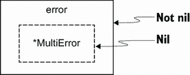

# 6 功能和方法

本章涵盖

*   何时使用价值型或指针型接收器
*   何时使用命名结果参数及其潜在的副作用
*   返回零接收方时避免常见错误
*   为什么使用接受文件名的函数不是最佳实践
*   处理`defer`参数

一个*函数*将一系列语句包装成一个单元，可以在其他地方调用。它可以接受一些输入并产生一些输出。另一方面，*方法*是附加到给定类型的函数。附加类型称为接收器*接收器*，可以是指针或值。本章一开始我们讨论如何选择一种接收机类型，因为这通常是一个争论的来源。然后我们讨论命名参数，何时使用它们，以及为什么它们有时会导致错误。我们还讨论了设计函数或返回特定值(如零接收器)时的常见错误。

## 6.1 #42:不知道使用哪种类型的接收器

为一个方法选择一个接收器类型并不总是那么简单。什么时候我们应该使用价值接受者？我们什么时候应该使用指针接收器？在这一节中，我们来看看做出正确决定的条件。

在第 12 章，我们将彻底讨论值和指针。因此，这一节将只涉及性能方面的皮毛。此外，在许多情况下，使用值或指针接收器不应该由性能决定，而是由我们将讨论的其他条件决定。但首先，让我们回忆一下接收器是如何工作的。

在 Go 中，我们可以给一个方法附加一个值或者一个指针接收器。使用值接收方，Go 复制该值并将其传递给方法。对对象的任何更改都保持在方法的本地。原始对象保持不变。

作为一个示例，下面的示例变异了一个值接收器:

```go
type customer struct {
    balance float64
}

func (c customer) add(v float64) {              // ❶
    c.balance += v
}

func main() {
    c := customer{balance: 100.}
    c.add(50.)
    fmt.Printf("balance: %.2f\n", c.balance)    // ❷
}
```

❶值接收器

❷的客户余额保持不变。

因为我们使用了一个值接收器，所以在`add`方法中增加余额不会改变原始`customer`结构的`balance`字段:

```go
100.00
```

另一方面，使用指针接收器，Go 将对象的地址传递给方法。本质上，它仍然是一个副本，但我们只复制了一个指针，而不是对象本身(通过引用传递在 Go 中是不存在的)。对接收器的任何修改都是在原始对象上完成的。下面是同样的例子，但是现在接收器是一个指针:

```go
type customer struct {
    balance float64
}

func (c *customer) add(operation float64) {    // ❶
    c.balance += operation
}

func main() {
    c := customer{balance: 100.0}
    c.add(50.0)
    fmt.Printf("balance: %.2f\n", c.balance)   // ❷
}
```

❶指针接收器

❷客户余额被更新。

因为我们使用指针接收器，增加余额会改变原始`customer`结构的`balance`字段:

```go
150.00
```

在值接收器和指针接收器之间做出选择并不总是那么简单。让我们讨论一些条件来帮助我们选择。

接收器*必须是一个指针*

*   如果方法需要变异接收方。如果接收方是一个片并且一个方法需要附加元素，这个规则也是有效的:

```go
type slice []int

func (s *slice) add(element int) {
    *s = append(*s, element)
}
```

*   如果方法接收方包含一个不能复制的字段:例如，`sync`包的类型部分(我们将在错误#74“复制同步类型”中讨论这一点)。

接收器*应该是一个指针*

*   如果接收器是一个大物体。使用指针可以使调用更有效，因为这样做可以防止进行大范围的复制。当你不确定多大才算大的时候，标杆管理可以是解决方案；很难给出一个具体的尺寸，因为它取决于很多因素。

接收方*必须是一个值*

*   如果我们必须强制一个接收者的不变性。

*   如果接收器是映射、功能或通道。否则，会发生编译错误。

接收器*应该是一个值*

*   如果接收方是一个不必变异的切片。

*   如果接收方是一个小数组或者结构，自然是一个没有可变字段的值类型，比如`time.Time`。

*   如果接收器是基本型如`int`、`float64`或`string`。

一个案例需要更多的讨论。假设我们设计了一个不同的`customer`结构。它的可变字段不直接是结构的一部分，而是在另一个结构中:

```go
type customer struct {
    data *data                                   // ❶
}

type data struct {
    balance float64
}

func (c customer) add(operation float64) {       // ❷
    c.data.balance += operation
}

func main() {
    c := customer{data: &data{
        balance: 100,
    }}
    c.add(50.)
    fmt.Printf("balance: %.2f\n", c.data.balance)
}
```

❶余额不直接是客户结构的一部分，而是在指针字段引用的结构中。

❷使用价值接受者

即使接收器是一个值，调用`add`最终也会改变实际余额:

```go
150.00
```

在这种情况下，我们不需要接收器是一个指针来变异`balance`。然而，为了清楚起见，我们可能倾向于使用指针接收器来强调`customer`作为一个整体对象是可变的。

混合接收器类型

我们是否可以混合接收器类型，比如一个包含多个方法的结构，其中一些有指针接收器，另一些有值接收器？共识倾向于禁止它。不过标准库中也有一些反例，比如`time.Time`。

设计者希望强制要求一个`time.Time`结构是不可变的。因此，大多数方法，如`After`、`IsZero`和`UTC`，都有一个值接收器。但是为了符合现有的接口，如`encoding.TextUnmarshaler`，`time.Time`必须实现`UnmarshalBinary([]byte)` `error`方法，该方法在给定一个字节片的情况下改变接收器。因此，这个方法有一个指针接收器。

因此，通常应避免混合接收器类型，但在 100%的情况下并不禁止。

我们现在应该很好地理解是使用值接收器还是指针接收器。当然，不可能面面俱到，因为总会有边缘情况，但本节的目标是提供涵盖大多数情况的指导。默认情况下，我们可以选择使用值接收器，除非有很好的理由不这样做。如果有疑问，我们应该使用指针接收器。

在下一节中，我们将讨论命名结果参数:它们是什么以及何时使用它们。

## 6.2 #43:从不使用命名结果参数

命名结果参数是 Go 中不常用的选项。这一节将讨论何时使用命名结果参数来使我们的 API 更加方便。但首先，让我们回忆一下它们是如何工作的。

当我们在函数或方法中返回参数时，我们可以给这些参数附加名称，并将其作为常规变量使用。当结果参数被命名时，它在函数/方法开始时被初始化为零值。有了命名的结果参数，我们还可以调用一个裸 return 语句(不带参数)。在这种情况下，结果参数的当前值被用作返回值。

下面是一个使用命名结果参数`b`的例子:

```go
func f(a int) (b int) {    // ❶
    b = a
    return                 // ❷
}
```

❶将 int 结果参数命名为 b

❷返回 b 的当前值

在这个例子中，我们给结果参数附加了一个名称:`b`。当我们不带参数调用`return`时，它返回`b`的当前值。

何时建议我们使用命名结果参数？首先，让我们考虑下面的接口，它包含一个从给定地址获取坐标的方法:

```go
type locator interface {
    getCoordinates(address string) (float32, float32, error)
}
```

因为这个接口是未导出的，所以文档不是强制性的。光是看这段代码，你能猜出这两个`float32`结果是什么吗？也许它们是一个纬度和一个经度，但顺序是什么呢？根据惯例，纬度并不总是第一要素。因此，我们必须检查实现才能了解结果。

在这种情况下，我们可能应该使用命名的结果参数，以使代码更容易阅读:

```go
type locator interface {
    getCoordinates(address string) (lat, lng float32, err error)
}
```

有了这个新版本，我们可以通过查看接口来理解方法签名的含义:首先是纬度，其次是经度。

现在，让我们探讨一下在方法实现中何时使用命名结果参数的问题。我们还应该使用命名结果参数作为实现本身的一部分吗？

```go
func (l loc) getCoordinates(address string) (
    lat, lng float32, err error) {
    // ...
}
```

在这种特定的情况下，拥有一个表达性的方法签名也可以帮助代码读者。因此，我们可能也想使用命名的结果参数。

注如果我们需要返回同一类型的多个结果，我们也可以考虑用有意义的字段名创建一个特别的结构。然而，这并不总是可能的:例如，当满足我们不能更新的现有接口时。

接下来，让我们考虑另一个函数签名，它允许我们在数据库中存储一个`Customer`类型:

```go
func StoreCustomer(customer Customer) (err error) {
    // ...
}
```

在这里，命名`error`参数`err`是没有帮助的，对读者没有帮助。在这种情况下，我们应该倾向于不使用命名结果参数。

因此，何时使用命名结果参数取决于上下文。在大多数情况下，如果不清楚使用它们是否会使我们的代码更易读，我们就不应该使用命名的结果参数。

还要注意，在某些上下文中，已经初始化的结果参数可能非常方便，即使它们不一定有助于可读性。下面这个例子提出的中的《高效 Go 变成》 （[`go.dev/doc/effective_go`](https://go.dev/doc/effective_go)）是受中`io.ReadFull`功能的启发:

```go
func ReadFull(r io.Reader, buf []byte) (n int, err error) {
    for len(buf) > 0 && err == nil {
        var nr int
        nr, err = r.Read(buf)
        n += nr
        buf = buf[nr:]
    }
    return
}
```

在这个例子中，命名结果参数并没有真正增加可读性。然而，因为`n`和`err`都被初始化为它们的零值，所以实现更短。另一方面，这个功能乍一看可能会让读者有点困惑。同样，这是一个找到正确平衡的问题。

关于裸返回(无参数返回)的一个注意事项:它们在短函数中被认为是可接受的；否则，它们会损害可读性，因为读者必须记住整个函数的输出。我们还应该在函数范围内保持一致，要么只使用裸返回，要么只使用带参数的返回。

那么关于命名结果参数的规则是什么呢？在大多数情况下，在接口定义的上下文中使用命名结果参数可以增加可读性，而不会导致任何副作用。但是在方法实现的上下文中没有严格的规则。在某些情况下，命名的结果参数也可以增加可读性:例如，如果两个参数具有相同的类型。在其他情况下，它们也可以方便地使用。因此，当有明显的好处时，我们应该谨慎地使用命名结果参数。

注意在错误#54“不处理延迟错误”中，我们将讨论在`defer`调用的上下文中使用命名结果参数的另一个用例。

此外，如果我们不够小心，使用命名结果参数可能会导致副作用和意想不到的后果，正如我们在下一节中看到的。T13】

## 6.3 #44:命名结果参数的意外副作用

我们提到了为什么命名的结果参数在某些情况下是有用的。但是当这些结果参数被初始化为它们的零值时，如果我们不够小心，使用它们有时会导致微妙的错误。本节举例说明了这样一种情况。

让我们增强前面的示例，它是一个从给定地址返回纬度和经度的方法。因为我们返回两个`float32`,所以我们决定使用命名的结果参数来明确纬度和经度。这个函数将首先验证给定的地址，然后获取坐标。在此期间，它将对输入上下文执行检查，以确保它没有被取消，并且它的截止日期还没有过去。

请注意，我们将在错误#60“误解 Go 上下文”中深入探究 Go 中的上下文概念如果你不熟悉上下文，简而言之，上下文可以携带取消信号或截止日期。我们可以通过调用的`Err`方法并测试返回的错误是否不为零来检查这些错误。

下面是`getCoordinates`方法的新实现。你能找出这段代码的错误吗？

```go
func (l loc) getCoordinates(ctx context.Context, address string) (
    lat, lng float32, err error) {
    isValid := l.validateAddress(address)          // ❶
    if !isValid {
        return 0, 0, errors.New("invalid address")
    }

    if ctx.Err() != nil {                          // ❷
        return 0, 0, err
    }

    // Get and return coordinates
}
```

❶验证了该地址

❷检查上下文是否被取消或截止日期是否已过

乍一看，这个错误可能并不明显。这里，`if ctx.Err()` `!=` `nil`范围内返回的错误是`err`。但是我们没有给变量`err`赋值。它仍然被赋值给和`error`类型:`nil`的零值。因此，这段代码将总是返回一个 nil 错误。

此外，这段代码可以编译，因为`err`由于命名的结果参数而被初始化为零值。如果不附加名称，我们会得到以下编译错误:

```go
Unresolved reference 'err'
```

一种可能的解决方法是将`ctx.Err()`分配给`err`，如下所示:

```go
if err := ctx.Err(); err != nil {
    return 0, 0, err
}
```

我们一直返回`err`，但是我们首先把它赋给`ctx.Err()`的结果。注意，本例中的`err`隐藏了结果变量。

使用裸返回语句

另一种选择是使用裸 return 语句:

```go
if err = ctx.Err(); err != nil {
    return
}
```

然而，这样做将打破规则，即我们不应该混合裸返回和带参数的返回。在这种情况下，我们可能应该坚持第一种选择。请记住，使用命名结果参数并不一定意味着使用裸返回。有时我们可以使用命名的结果参数来使签名更清晰。

我们通过强调命名结果参数在某些情况下可以提高代码的可读性(比如多次返回相同的类型),而在其他情况下非常方便，来结束这个讨论。但是我们必须记住，每个参数都被初始化为零值。正如我们在本节中看到的，这可能会导致微妙的错误，在阅读代码时并不总是容易发现。因此，在使用命名结果参数时，让我们保持谨慎，以避免潜在的副作用。

在下一节中，我们将讨论 Go 开发者在函数返回接口时会犯的一个常见错误。

## 6.4 #45:返回一个零接收器

在本节中，我们将讨论返回接口的影响，以及为什么在某些情况下这样做会导致错误。这个错误可能是GO中最普遍的错误之一，因为它可能被认为是违反直觉的，至少在我们犯这个错误之前是这样。

让我们考虑下面的例子。我们将处理一个`Customer`结构并实现一个`Validate`方法来执行健全性检查。我们不想返回第一个错误，而是想返回一个错误列表。为此，我们将创建一个自定义错误类型来传达多个错误:

```go
type MultiError struct {
    errs []string
}

func (m *MultiError) Add(err error) {      // ❶
    m.errs = append(m.errs, err.Error())
}

func (m *MultiError) Error() string {      // ❷
    return strings.Join(m.errs, ";")
}
```

❶补充了一个错误

❷实现了错误接口

`MultiError`满足`error`接口，因为实现了`Error()` `string`。同时，它公开了一个`Add`方法来附加一个错误。使用这个结构，我们可以以下面的方式实现一个`Customer.Validate`方法来检查客户的年龄和姓名。如果健全性检查正常，我们希望返回一个零错误:

```go
func (c Customer) Validate() error {
    var m *MultiError                           // ❶

    if c.Age < 0 {
        m = &MultiError{}
        m.Add(errors.New("age is negative"))    // ❷
    }
    if c.Name == "" {
        if m == nil {
            m = &MultiError{}
        }
        m.Add(errors.New("name is nil"))        // ❸
    }

    return m
}
```

❶实例化一个空的*MultiError

如果年龄为负，❷会附加一个错误

如果名称为零，❸会追加一个错误

在该实现中，`m`被初始化为`*MultiError`的零值:因此为`nil`。当健全性检查失败时，如果需要，我们分配一个新的`MultiError`，然后附加一个错误。最后，我们返回`m`，它可以是一个空指针，也可以是一个指向`MultiError`结构的指针，这取决于检查。

现在，让我们通过使用有效的`Customer`运行一个案例来测试这个实现:

```go
customer := Customer{Age: 33, Name: "John"}
if err := customer.Validate(); err != nil {
    log.Fatalf("customer is invalid: %v", err)
}
```

以下是输出:

```go
2021/05/08 13:47:28 customer is invalid: <nil>
```

这个结果可能相当令人惊讶。`Customer`有效，但`err != nil`条件为真，并记录打印的错误`<nil>`。那么，问题是什么？

在GO中，我们要知道一个指针接收器可以是`nil`。让我们通过创建一个虚拟类型并调用一个具有 nil 指针接收器的方法来进行实验:

```go
type Foo struct{}

func (foo *Foo) Bar() string {
    return "bar"
}

func main() {
    var foo *Foo
    fmt.Println(foo.Bar())     // ❶
}
```

❶福是零。

`foo`初始化为指针的零值:`nil`。但是这段代码可以编译，如果我们运行它，它会打印出`bar`。零指针是一个有效的接收器。

但是为什么会这样呢？在 Go 中，方法只是函数的语法糖，函数的第一个参数是接收者。因此，我们看到的`Bar`方法类似于这个函数:

```go
func Bar(foo *Foo) string {
    return "bar"
}
```

我们知道向函数传递一个空指针是有效的。因此，使用 nil 指针作为接收器也是有效的。

让我们回到最初的例子:

```go
func (c Customer) Validate() error {
    var m *MultiError

    if c.Age < 0 {
        // ...
    }
    if c.Name == "" {
        // ...
    }

    return m
}
```

`m`被初始化为指针的零值:`nil`。然后，如果所有的检查都有效，那么提供给`return`语句的参数不是直接提供给`nil`，而是一个空指针。因为 nil 指针是一个有效的接收器，所以将结果转换成接口不会产生 nil 值。换句话说，`Validate`的调用者总是会得到一个非零的错误。

为了明确这一点，让我们记住在 Go 中，接口是一个调度包装器。这里，wrappee 是`nil`(`MultiError`指针)，而 wrapper 不是(`error`接口)；参见图 6.1。



图 6.1`error`包装器不是`nil`。

因此，不管提供了什么样的`Customer`，这个函数的调用者总是会收到一个非零的错误。理解这种行为是必要的，因为这是一个普遍的错误。

那么，我们应该做些什么来修正这个例子呢？最简单的解决方案是仅当它不是`nil`时才返回`m`:

```go
func (c Customer) Validate() error {
    var m *MultiError

    if c.Age < 0 {
        // ...
    }
    if c.Name == "" {
        // ...
    }

    if m != nil {
        return m     // ❶
    }
    return nil       // ❷
}
```

只有当至少有一个错误时，❶才返回 m

否则，❷返回零

在方法的最后，我们检查`m`是否不是`nil`。如果这是真的，我们返回`m`；否则，我们显式返回`nil`。因此，在有效的`Customer`的情况下，我们返回一个 nil 接口，而不是一个转换成非零接口的 nil 接收器。

我们在这一节已经看到，在 Go 中，允许有一个 nil 接收器，并且从 nil 指针转换的接口不是 nil 接口。因此，当我们必须返回一个接口时，我们不应该返回一个空指针，而应该直接返回一个空值。一般来说，拥有一个空指针并不是一个理想的状态，这意味着可能有 bug。

我们在本节中看到了一个错误示例，因为这是导致该错误的最常见情况。但是这个问题不仅仅与错误有关:任何使用指针接收器实现的接口都会发生这个问题。

下一节讨论使用文件名作为函数输入时的一个常见设计错误。

## 6.5 #46:使用文件名作为函数输入

当创建一个需要读取文件的新函数时，传递文件名被认为不是一个最佳实践，而且可能会产生负面影响，比如使单元测试更难编写。让我们深入研究这个问题，了解如何克服它。

假设我们想实现一个函数来计算文件中空行的数量。实现该功能的一种方法是接受一个文件名，并使用`bufio.NewScanner`扫描和检查每一行:

```go
func countEmptyLinesInFile(filename string) (int, error) {
    file, err := os.Open(filename)       // ❶
    if err != nil {
        return 0, err
    }
    // Handle file closure

    scanner := bufio.NewScanner(file)    // ❷
    for scanner.Scan() {                 // ❸
        // ...
    }
}
```

❶打开文件名

❷从操作系统中创建了一个扫描仪。将每行输入拆分的文件变量

❸迭代每一行

我们从文件名中打开一个文件。然后我们使用`bufio.NewScanner`扫描每一行(默认情况下，它会将输入拆分为每行)。

这个函数会做我们期望它做的事情。事实上，只要提供的文件名有效，我们就会从中读取并返回空行的数量。那么问题出在哪里？

假设我们想要实现单元测试来覆盖以下情况:

*   一个名义上的案例

*   一个空文件

*   只包含空行的文件

每个单元测试都需要在我们的 Go 项目中创建一个文件。函数越复杂，我们想要添加的案例就越多，我们要创建的文件也就越多。在某些情况下，我们可能需要创建几十个文件，这很快就会变得难以管理。

此外，该函数不可重用。例如，如果我们必须实现相同的逻辑，但是计算一个 HTTP 请求的空行数量，我们就必须复制主要的逻辑:

```go
func countEmptyLinesInHTTPRequest(request http.Request) (int, error) {
    scanner := bufio.NewScanner(request.Body)
    // Copy the same logic
}
```

克服这些限制的一个方法可能是让函数接受一个`*bufio.Scanner`(由`bufio.NewScanner`返回的输出)。从我们创建`scanner`变量的那一刻起，这两个函数就有相同的逻辑，所以这种方法是可行的。但在GO中，惯用的方式是从读者的抽象出发。

让我们编写一个新版本的`countEmptyLines`函数，它接收一个`io.Reader`抽象:

```go
func countEmptyLines(reader io.Reader) (int, error) {     // ❶
    scanner := bufio.NewScanner(reader)                   // ❷
    for scanner.Scan() {
        // ...
    }
}
```

❶接受了一个 io。读者作为输入

❷创造了一只蟾蜍。来自 io 的扫描仪。阅读器，不是*os。文件

因为`bufio.NewScanner`接受一个`io.Reader`，所以我们可以直接传递`reader`变量。

这种方法的好处是什么？首先，这个函数抽象了数据源。是文件吗？一个 HTTP 请求？一个插座输入？对于功能来说不重要。因为`*os.File`和`http.Request`的`Body`字段实现了`io.Reader`，所以不管输入类型如何，我们都可以重用同一个函数。

另一个好处与测试有关。我们提到过为每个测试用例创建一个文件会很快变得很麻烦。既然`countEmptyLines`接受了一个`io.Reader`，我们可以通过从字符串创建一个`io.Reader`来实现单元测试:

```go
func TestCountEmptyLines(t *testing.T) {
    emptyLines, err := countEmptyLines(strings.NewReader(    // ❶
        `foo
            bar

            baz
            `))
    // Test logic
}
```

❶传了一个 io。从字符串中读取

在这个测试中，我们直接从字符串中使用`strings.NewReader`创建一个`io.Reader`。因此，我们不必为每个测试用例创建一个文件。每个测试用例都是独立的，提高了测试的可读性和可维护性，因为我们不必打开另一个文件来查看内容。

在大多数情况下，接受一个文件名作为函数输入来读取文件应该被认为是一种代码味道(除了在特定的函数中，比如`os.Open`)。正如我们所看到的，这使得单元测试更加复杂，因为我们可能需要创建多个文件。它还降低了函数的可重用性(尽管并不是所有的函数都应该被重用)。使用`io.Reader`接口抽象数据源。不管输入是一个文件、一个字符串、一个 HTTP 请求还是一个 gRPC 请求，这个实现都可以被重用和容易地测试。

在本章的最后一节，让我们讨论一个与`defer`相关的常见错误:函数/方法参数和方法接收方是如何计算的。T19】

## 6.6 #47:忽略如何评估延迟参数和接收器

我们在上一节提到过`defer`语句会延迟调用的执行，直到周围的函数返回。Go 开发人员的一个常见错误是不理解参数是如何计算的。我们将用两个小节来研究这个问题:一个与函数和方法参数有关，另一个与方法接收器有关。

### 6.6.1 论证评估

为了说明如何用`defer`对参数求值，我们来看一个具体的例子。一个函数需要调用两个函数`foo`和`bar`。同时，它必须处理关于执行的状态:

*   `StatusSuccess`如果`foo`和`bar`都没有返回错误

*   `StatusErrorFoo`如果`foo`返回错误

*   `StatusErrorBar`如果`bar`返回错误

我们将在多个操作中使用这个状态:例如，通知另一个 goroutine 和增加计数器。为了避免在每个`return`语句的之前重复这些调用，我们将使用`defer`。这是我们的第一个实现:

```go
const (
    StatusSuccess  = "success"
    StatusErrorFoo = "error_foo"
    StatusErrorBar = "error_bar"
)

func f() error {
    var status string
    defer notify(status)               // ❶
    defer incrementCounter(status)     // ❷

    if err := foo(); err != nil {
        status = StatusErrorFoo        // ❸
        return err
    }

    if err := bar(); err != nil {
        status = StatusErrorBar        ❹
        return err
    }

    status = StatusSuccess             ❺
    return nil
}
```

❶推迟打电话通知

❷推迟对增量计数器的调用

❸将状态设置为错误 foo

❹将状态设置为错误线

❺将状态设置为成功

首先我们声明一个`status`变量。然后我们使用`defer`将呼叫推迟到`notify`和`incrementCounter`。在这个函数中，根据执行路径，我们相应地更新`status`。

然而，如果我们尝试一下这个函数，我们会发现不管执行路径如何，`notify`和`incrementCounter`总是以相同的状态被调用:一个空字符串。这怎么可能？

我们需要理解一个`defer`函数中参数求值的关键之处:参数被立即求值*，而不是在周围的函数返回之后。在我们的例子中，我们调用`notify(status)`和`incrementCounter(status)`作为`defer`函数。因此，一旦在我们使用`defer`的阶段`f`返回`status`的当前值，Go 将延迟这些调用的执行，从而传递一个空字符串。想继续用`defer`怎么解决这个问题？有两种主要的解决方案。

第一种解决方案是将一个字符串指针传递给`defer`函数的:

```go
func f() error {
    var status string
    defer notify(&status)                // ❶
    defer incrementCounter(&status)      // ❷

    // The rest of the function is unchanged
    if err := foo(); err != nil {
        status = StatusErrorFoo
        return err
    }

    if err := bar(); err != nil {
        status = StatusErrorBar
        return err
    }

    status = StatusSuccess
    return nil
}
```

❶传递一个字符串指针给 notify

❷将一个字符串指针传递给 incrementCounter

我们根据情况不断更新`status`，但是现在`notify`和`incrementCounter`接收一个字符串指针。这种方法为什么有效？

使用`defer`立即计算参数:这里是`status`的地址。是的，`status`本身在整个函数中被修改，但是它的地址保持不变，不管赋值如何。因此，如果`notify`或`incrementCounter`使用字符串指针引用的值，它将按预期工作。但是这种解决方案需要改变两个函数的签名，这并不总是可能的。

还有另一个解决方案:调用一个闭包作为一个`defer`语句。提醒一下，闭包是一个匿名的函数值，它从自身外部引用变量。传递给`defer`函数的参数会被立即计算。但是我们必须知道由一个`defer`闭包引用的变量在闭包执行期间*被求值*(因此，当周围的函数返回时)。

这里有一个例子来说明`defer`闭包是如何工作的。一个闭包引用两个变量，一个作为函数参数，另一个作为其主体之外的变量:

```go
func main() {
    i := 0
    j := 0
    defer func(i int) {       // ❶
        fmt.Println(i, j)     // ❷
    }(i)                      // ❸
    i++
    j++
}
```

❶将接受整数作为输入的闭包称为延迟函数

❷ i 是函数输入，j 是外部变量。

❸将 I 传给了闭包(立即评估)

这里，闭包使用了`i`和`j`变量。`i`是作为函数参数传递的，所以它会被立即计算。相反，`j`引用了闭包体外部的变量，所以在执行闭包时会对它进行求值。如果我们运行这个例子，它将打印出`0 1`。

因此，我们可以使用闭包来实现函数的新版本:

```go
func f() error {
    var status string
    defer func() {                   // ❶
        notify(status)               // ❷
        incrementCounter(status)     // ❸
    }()

    // The rest of the function is unchanged
}
```

❶称闭包为延迟函数

❷在关闭和参考状态内调用通知

❸在闭包和引用状态内调用 incrementCounter

这里，我们将对`notify`和`incrementCounter`的调用包装在一个闭包中。这个闭包从变量体的外部引用了`status`变量。因此，一旦闭包被执行，`status`就被求值，而不是当我们调用`defer`时。这个解决方案也有效，并且不需要`notify`和`incrementCounter`改变它们的签名。

现在，在带有指针或值接收器的方法上使用`defer`怎么样？我们来看看这些问题。

### 指针和值接收器

在错误#42“不知道使用哪种类型的接收器”中，我们说接收器可以是值，也可以是指针。当我们在一个方法上使用`defer`时，与参数评估相关的相同逻辑也适用:接收器也被立即评估。让我们来了解这两种接收器类型的影响。

首先，这里有一个例子，它使用`defer`调用一个值接收器上的方法，但是后来改变了这个接收器:

```go
func main() {
    s := Struct{id: "foo"}
    defer s.print()           // ❶
    s.id = "bar"              // ❷
}

type Struct struct {
    id string
}

func (s Struct) print() {
    fmt.Println(s.id)         // ❸
}
```

❶的立即被评估。

❷更新 s.id(不可见)

❸福

我们将调用推迟到`print`方法。与参数一样，调用`defer`会立即对接收方进行评估。因此，`defer`用一个包含等于`foo`的`id`字段的结构来延迟方法的执行。因此，这个例子打印了`foo`。

相反，如果指针是接收者，那么在调用`defer`之后接收者的潜在变化是可见的:

```go
func main() {
    s := &Struct{id: "foo"}
    defer s.print()            // ❶
    s.id = "bar"               // ❷
}

type Struct struct {
    id string
}

func (s *Struct) print() {
    fmt.Println(s.id)          // ❸
}
```

❶ s 是一个指针，所以它会被立即求值，但在执行 defer 方法时可能会引用另一个变量。

❷更新 s.id(可见)

❸酒吧

`s`接收器也会被立即评估。但是，调用方法会导致复制指针接收器。因此，对指针引用的结构所做的更改是可见的。这个例子打印了`bar`。

总之，当我们在函数或方法上调用`defer`时，调用的参数会立即被计算。如果我们后来想改变提供给`defer`的参数，我们可以使用指针或闭包。对于一个方法，接收者也立即被评估；因此，行为取决于接收方是值还是指针。

## 摘要

*   应该根据诸如类型、是否必须变异、是否包含不能复制的字段以及对象有多大之类的因素来决定是使用值还是指针接收器。如有疑问，使用指针接收器。

*   使用命名结果参数是提高函数/方法可读性的有效方法，尤其是在多个结果参数具有相同类型的情况下。在某些情况下，这种方法也很方便，因为命名结果参数被初始化为零值。但是要小心潜在的副作用。

*   当返回一个接口时，小心不要返回一个空指针，而是一个显式的空值。否则，可能会导致意想不到的后果，因为调用方将收到一个非零值。

*   设计接收`io.Reader`类型而不是文件名的函数提高了函数的可重用性，并使测试更容易。

*   传递一个指向`defer`函数的指针和将一个调用封装在闭包里是两种可能的解决方案，可以克服参数和接收者的即时求值。