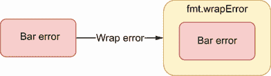

# 7 错误管理

本章涵盖

*   理解何时该恐慌
*   知道何时包装错误
*   从 Go 1.13 开始有效比较错误类型和错误值
*   习惯性地处理错误
*   了解如何忽略错误
*   处理`defer`调用中的错误

错误管理是构建健壮且可观察的应用的一个基本方面，它应该和代码库的其他部分一样重要。在 Go 中，错误管理不像大多数编程语言那样依赖于传统的`try/catch`机制。相反，错误作为正常返回值返回。

本章将涵盖与错误相关的最常见的错误。

## 7.1 #48:恐慌

对于 Go 新手来说，对错误处理有些困惑是很常见的。在 Go 中，错误通常由返回和`error`类型作为最后一个参数的函数或方法来管理。但是一些开发人员可能会发现这种方法令人惊讶，并试图使用`panic`和`recover`在 Java 或 Python 等语言中重现异常处理。所以，让我们重温一下恐慌的概念，讨论一下什么时候恐慌是合适的，什么时候不恐慌。

在 Go 中，`panic`是一个停止普通流程的内置函数:

```go
func main() {
    fmt.Println("a")
    panic("foo")
    fmt.Println("b")
}
```

该代码打印`a`，然后在打印`b`之前停止:

```go
a
panic: foo

goroutine 1 [running]:
main.main()
        main.go:7 +0xb3
```

一旦恐慌被触发，它将继续在调用栈中向上运行，直到当前的 goroutine 返回或者`panic`被`recover`捕获:

```go
func main() {
    defer func() {                       // ❶
        if r := recover(); r != nil {
            fmt.Println("recover", r)
        }
    }()

    f()                                  // ❷
}

func f() {
    fmt.Println("a")
    panic("foo")
    fmt.Println("b")
}
```

❶ 要求在延期关闭内恢复

❷ 调用`f`，`f`恐慌。这种恐慌是被前面的复苏所抓住的。

在`f`函数中，一旦`panic`被调用，就停止当前函数的执行，并向上调用栈:`main`。在`main`中，因为恐慌是由`recover`引起的，所以并不停止 goroutine:

```go
a
recover foo
```

注意，调用`recover()`来捕获 goroutine 恐慌只在一个`defer`函数内部有用；否则，该函数将返回`nil`并且没有其他作用。这是因为`defer`函数也是在周围函数恐慌时执行的。

现在，让我们来解决这个问题:什么时候恐慌是合适的？在 Go 中，`panic`用来表示真正的异常情况，比如程序员出错。例如，如果我们查看`net/http`包，我们会注意到在`WriteHeader`方法中，有一个对`checkWriteHeaderCode`函数的调用，用于检查状态代码是否有效:

```go
func checkWriteHeaderCode(code int) {
    if code < 100 || code > 999 {
        panic(fmt.Sprintf("invalid WriteHeader code %v", code))
    }
}
```

如果状态码无效，此函数会出现混乱，这纯粹是程序员错误。

另一个基于程序员错误的例子可以在注册数据库驱动时的`database/sql`包中找到:

```go
func Register(name string, driver driver.Driver) {
    driversMu.Lock()
    defer driversMu.Unlock()
    if driver == nil {
        panic("sql: Register driver is nil")                     // ❶
    }
    if _, dup := drivers[name]; dup {
        panic("sql: Register called twice for driver " + name)   // ❷
    }
    drivers[name] = driver
}
```

如果司机是零，❶就恐慌

如果司机已经注册，❷会感到恐慌

如果驱动程序是`nil` ( `driver.Driver`是一个接口)或者已经被注册，这个函数就会恐慌。这两种情况都会被认为是程序员的错误。此外，在大多数情况下(例如，使用最流行的 MySQL 驱动程序`go-sql-driver/mysql`【[`github.com/go-sql-driver/mysql`](https://github.com/go-sql-driver/mysql)】)，`Register`通过调用一个`init`函数，这限制了错误处理。出于所有这些原因，设计者在出现错误的情况下使函数变得混乱。

另一个令人恐慌的用例是当我们的应用需要一个依赖项，但是无法初始化它。例如，假设我们公开一个服务来创建新的客户帐户。在某个阶段，该服务需要验证所提供的电子邮件地址。为了实现这一点，我们决定使用正则表达式。

在 Go 中，`regexp`包公开了两个函数来从字符串创建正则表达式:`Compile`和`MustCompile`。前者返回一个`*regexp.Regexp`和一个错误，而后者只返回一个`*regexp.Regexp`但在出错时会恐慌。在这种情况下，正则表达式是一个强制依赖项。事实上，如果我们不能编译它，我们将永远无法验证任何电子邮件输入。因此，我们可能倾向于使用`MustCompile`并在出错时惊慌失措。

GO中的恐慌应该少用。我们已经看到了两个突出的例子，一个是程序员出错的信号，另一个是我们的应用不能创建一个强制依赖。因此，存在导致我们停止应用的异常情况。在大多数其他情况下，错误管理应该通过一个函数来完成，该函数返回一个合适的类型作为最后一个返回参数。

现在让我们开始讨论错误。在下一节中，我们将看到何时包装一个错误。

## 7.2 #49:忽略何时包装错误

从 Go 1.13 开始，`%w`指令让我们可以方便地包装错误。但是一些开发人员可能不知道什么时候包装错误(或者不包装)。因此，让我们提醒自己什么是错误包装，以及何时使用它。

错误包装是将一个错误包装或打包到一个包装容器中，这样也可以得到错误源(见图 7.1)。通常，错误包装的两个主要用例如下:

*   向错误添加附加上下文

*   将错误标记为特定错误


图 7.1 将错误包装在包装器中。

关于添加上下文，让我们考虑下面的例子。我们收到一个来自特定用户的访问数据库资源的请求，但是在查询过程中我们得到一个“权限被拒绝”的错误。出于调试目的，如果最终记录了错误，我们希望添加额外的上下文。在这种情况下，我们可以包装错误以表明用户是谁以及正在访问什么资源，如图 7.2 所示。


图 7.2 向“权限被拒绝”错误添加附加上下文

现在假设我们不添加上下文，而是要标记错误。例如，我们希望实现一个 HTTP 处理器，它检查在调用函数时收到的所有错误是否都属于`Forbidden`类型，这样我们就可以返回一个 403 状态代码。在这种情况下，我们可以将这个错误包装在`Forbidden`中(见图 7.3)。


图 7.3 标记错误`Forbidden`

在这两种情况下，源错误仍然存在。因此，调用者也可以通过解开错误并检查错误源来处理错误。还要注意，有时我们希望将两种方法结合起来:添加上下文和标记错误。

现在我们已经阐明了包装错误的主要用例，让我们看看在 Go 中返回我们收到的错误的不同方法。我们将考虑下面这段代码，并探索`if err != nil`块中的不同选项:

```go
func Foo() error {
    err := bar()
    if err != nil {
        // ?          // ❶
    }
    // ...
}
```

❶ 我们如何返回错误？

第一种选择是直接返回这个错误。如果我们不想标记错误，并且没有想要添加的有用上下文，这种方法很好:

```go
if err != nil {
    return err
}
```

图 7.4 显示我们返回了与`bar`相同的错误。


图 7.4 我们可以直接返回错误。

在 Go 1.13 之前，要包装一个错误，唯一不使用外部库的选项是创建一个自定义错误类型:

```go
type BarError struct {
    Err error
}

func (b BarError) Error() string {
    return "bar failed:" + b.Err.Error()
}
```

然后，我们没有直接返回`err`，而是将错误包装成一个`BarError`(见图 7.5):

```go
if err != nil {
    return BarError{Err: err}
}
```


图 7.5 将错误包裹在`BarError`内部

这个选项的好处是它的灵活性。因为`BarError`是一个定制结构，如果需要，我们可以添加任何额外的上下文。然而，如果我们想要重复这个操作，被迫创建一个特定的错误类型会很快变得很麻烦。

为了克服这种情况，Go 1.13 引入了`%w`指令:

```go
if err != nil {
    return fmt.Errorf("bar failed: %w", err)
}
```

这段代码包装了源错误以添加额外的上下文，而不必创建另一种错误类型，如图 7.6 所示。



图 7.6 将一个错误包装成一个标准错误。

因为源错误仍然可用，所以客户端可以解开父错误，然后检查源错误是否是特定的类型或值(我们将在下面的部分中讨论这些问题)。

我们将讨论的最后一个选项是使用`%v`指令:

```go
if err != nil {
    return fmt.Errorf("bar failed: %v", err)
}
```

区别在于错误本身没有被包装。我们将其转换为另一个错误来添加上下文，源错误不再可用，如图 7.7 所示。


图 7.7 转换错误

关于问题来源的信息仍然可用。然而，调用者不能解开这个错误并检查来源是否是`bar` `error`。所以，从某种意义上来说，这个选项比`%w`更具限制性。既然`%w`指令已经发布，我们应该阻止吗？不一定。

包装错误使调用者可以使用源错误。因此，这意味着引入潜在耦合。例如，假设我们使用包装，`Foo`的调用者检查源错误是否为`bar error`。现在，如果我们改变我们的实现，并使用另一个函数将返回另一种类型的错误呢？它将破坏调用者进行的错误检查。

为了确保我们的客户不依赖于我们认为是实现细节的东西，返回的错误应该被转换，而不是包装。在这种情况下，使用`%v`而不是`%w`可能是正确的选择。

让我们回顾一下我们处理过的所有不同选项。

| 

[计]选项

 | 

额外上下文

 | 

标记错误

 | 

源错误可用

 |
| 直接返回错误 | 不 | 不 | 是 |
| 自定义错误类型 | 可能(例如，如果错误类型包含字符串字段) | 是 | 可能(如果源错误是通过方法导出或访问的) |
| `fmt.Errorf`同`%w` | 是 | 不 | 是 |
| `fmt.Errorf`同`%v` | 是 | 不 | 不 |

总而言之，当处理一个错误时，我们可以决定包装它。包装是向错误添加额外的上下文和/或将错误标记为特定类型。如果我们需要标记一个错误，我们应该创建一个自定义的错误类型。然而，如果我们只是想添加额外的上下文，我们应该使用带有`%w`指令的`fmt.Errorf`，因为它不需要创建新的错误类型。然而，错误包装会产生潜在的耦合，因为它使调用者可以获得源错误。如果我们想防止它，我们不应该使用错误包装，而应该使用错误转换，例如，将`fmt.Errorf`与`%v`指令一起使用。

本节展示了如何用`%w`指令包装错误。但是一旦我们开始使用它，检查一个错误类型会有什么影响？

## 7.3 #50:检查错误类型不准确

上一节介绍了一种使用`%w`指令包装错误的可能方法。然而，当我们使用这种方法时，改变我们检查特定错误类型的方式也是必要的；否则，我们可能会不准确地处理错误。

我们来讨论一个具体的例子。我们将编写一个 HTTP 处理器，从一个 ID 返回交易金额。我们的处理器将解析请求以获取 ID，并从数据库(DB)中检索金额。我们的实现可能在两种情况下失败:

*   如果 ID 无效(字符串长度不是五个字符)

*   如果查询数据库失败

在前一种情况下，我们希望返回`StatusBadRequest` `(400)`，而在后一种情况下，我们希望返回`ServiceUnavailable` `(503)`。为此，我们将创建一个`transientError`类型来标记错误是暂时的。父处理器将检查错误类型。如果错误是一个`transientError`，将返回一个 503 状态码；否则，它将返回 400 状态代码。

让我们首先关注错误类型定义和处理器将调用的函数:

```go
type transientError struct {
    err error
}

func (t transientError) Error() string {              // ❶
    return fmt.Sprintf("transient error: %v", t.err)
}

func getTransactionAmount(transactionID string) (float32, error) {
    if len(transactionID) != 5 {
        return 0, fmt.Errorf("id is invalid: %s",
            transactionID)                            // ❷
    }

    amount, err := getTransactionAmountFromDB(transactionID)
    if err != nil {
        return 0, transientError{err: err}            // ❸
    }
    return amount, nil
}
```

❶ 创建一个自定义的 transientError

❷ 如果事务 ID 无效，将返回一个简单的错误

❸ 如果我们无法查询数据库，会返回一个`transientError`

如果标识符无效，使用`fmt.Errorf`返回一个错误。但是，如果从数据库获取交易金额失败，`getTransactionAmount`将错误封装到`transientError`类型中。

现在，让我们编写 HTTP 处理器来检查错误类型，以返回适当的 HTTP 状态代码:

```go
func handler(w http.ResponseWriter, r *http.Request) {
    transactionID := r.URL.Query().Get("transaction")      // ❶

    amount, err := getTransactionAmount(transactionID)     // ❷
    if err != nil {
        switch err := err.(type) {                         // ❸
        case transientError:
            http.Error(w, err.Error(), http.StatusServiceUnavailable)
        default:
            http.Error(w, err.Error(), http.StatusBadRequest)
        }
        return
    }

    // Write response
}
```

❶ 提取交易 ID

❷ 调用包含所有逻辑的`getTransactionAmount`

❸ 检查错误类型，如果错误是暂时的，则返回 503；否则，一个 400

在错误类型上使用一个`switch`,我们返回适当的 HTTP 状态代码:在错误请求的情况下返回 400，在暂时错误的情况下返回 503。

这段代码完全有效。然而，让我们假设我们想要对`getTransactionAmount`进行一个小的重构。`transientError`将由`getTransactionAmountFromDB`而不是`getTransactionAmount`返回。`getTransactionAmount`现在使用`%w`指令包装该错误:

```go
func getTransactionAmount(transactionID string) (float32, error) {
    // Check transaction ID validity

    amount, err := getTransactionAmountFromDB(transactionID)
    if err != nil {
        return 0, fmt.Errorf("failed to get transaction %s: %w",
            transactionID, err)                // ❶
    }
    return amount, nil
}

func getTransactionAmountFromDB(transactionID string) (float32, error) {
    // ...
    if err != nil {
        return 0, transientError{err: err}     // ❷
    }
    // ...
}
```

❶ 包装错误，而不是直接返回`transientError`

❷ 这个函数现在返回`transientError`。

如果我们运行这段代码，不管错误情况如何，它总是返回 400，所以永远不会遇到`case Transient`错误。我们如何解释这种行为？

重构之前，`getTransactionAmount`返回了`transientError`(见图 7.8)。重构后，`transientError`现在由`getTransactionAmountFromDB`返回(图 7.9)。


图 7.8 因为如果 DB 失败的话`getTransactionAmount`会返回一个`transientError`，所以情况是真的。


图 7.9 现在`getTransactionAmount`返回一个包装错误。于是，`case transientError`是假的。

`getTransactionAmount`返回的不是一个直接的`transientError`:它是一个错误包装`transientError`。因此`case transientError`现在为假。

正是为了这个目的，Go 1.13 提供了一个封装错误的指令，以及一种检查被封装的错误是否属于带有`errors.As`的某种类型的方法。这个函数递归地展开一个错误，如果链中的错误与预期的类型匹配，则返回`true`。

让我们使用`errors.As`重写调用者的实现:

```go
func handler(w http.ResponseWriter, r *http.Request) {
    // Get transaction ID

    amount, err := getTransactionAmount(transactionID)
    if err != nil {
        if errors.As(err, &transientError{}) {      // ❶
            http.Error(w, err.Error(),
                http.StatusServiceUnavailable)      // ❷
        } else {
            http.Error(w, err.Error(),
                http.StatusBadRequest)              // ❸
        }
        return
    }

    // Write response
}
```

❶ 称之为错误。如通过提供指向`transientError`的指针

❷ 如果错误是暂时的，返回 503

❸ 否则返回一个 400

在这个新版本中，我们去掉了`switch`案例类型，现在使用`errors.As`。这个函数要求第二个参数(目标错误)是一个指针。否则，该函数将会编译，但在运行时会恐慌。无论运行时错误是直接类型`transientError`还是错误包装`transientError`，`errors.As`都返回`true`；因此，处理器将返回 503 状态代码。

综上所述，如果我们依赖 Go 1.13 错误包装，我们必须使用`errors.As`来检查错误是否属于特定类型。这样，不管错误是由我们调用的函数直接返回，还是包装在错误中，`errors.As`将能够递归地打开我们的主错误，并查看其中一个错误是否是特定的类型。

我们刚刚看到了如何比较错误类型；现在是时候比较一个错误值了。

## 7.4 #51:检查错误值不准确

本节与上一节相似，但有标记错误(错误值)。首先，我们将定义一个哨兵错误传达了什么。然后，我们将会看到如何比较一个错误和一个值。

标记错误是定义为全局变量的错误:

```go
import "errors"

var ErrFoo = errors.New("foo")
```

一般来说，约定是从`Err`开始，后面跟着错误类型:这里是`ErrFoo`。标记错误传达一个*预期的*错误。但是我们所说的预期错误是什么意思呢？让我们在 SQL 库的上下文中讨论它。

我们想设计一个`Query`方法，允许我们执行对数据库的查询。此方法返回一部分行。当没有找到行时，我们应该如何处理这种情况？我们有两个选择:

*   返回一个标记值:例如，一个`nil`切片(想想`strings.Index`，如果一个子串不存在，它返回标记值-1)。

*   返回客户端可以检查的特定错误。

让我们采用第二种方法:如果没有找到行，我们的方法可以返回一个特定的错误。我们可以将这归类为一个*预期的*错误，因为传递一个不返回任何行的请求是被允许的。相反，像网络问题和连接轮询错误这样的情况是*意外的*错误。这并不意味着我们不想处理意外的错误；这意味着语义上，这些错误传达了不同的意思。

如果我们看一下标准库，我们可以找到许多标记错误的例子:

*   `sql.ErrNoRows`——当查询没有返回任何行时返回(这正是我们的情况)

*   `io.EOF`——当没有更多输入可用时，由`io.Reader`返回

这是哨兵错误背后的一般原则。它们传达了客户希望检查的预期错误。因此，作为一般准则，

*   预期错误应设计为错误值(哨兵错误):`var ErrFoo = errors.New("foo")`。

*   意外错误应设计为错误类型:`type` `BarError` `struct { ... }`，用`BarError`实现`error`接口。

让我们回到常见的错误。我们如何将错误与特定值进行比较？通过使用`==`操作符:

```go
err := query()
if err != nil {
    if err == sql.ErrNoRows {     // ❶
        // ...
    } else {
        // ...
    }
}
```

❶ 根据`sql.ErrNoRows`变量检查错误。

这里，我们调用一个`query`函数，得到一个错误。使用`==`操作符检查错误是否为`sql.ErrNoRows`。

然而，正如我们在上一节中讨论的，也可以包装一个标记错误。如果使用`fmt.Errorf`和`%w`指令包装`sql.ErrNoRows`，`err` `==` `sql.ErrNoRows`将始终为假。

还是那句话，Go 1.13 提供了答案。我们已经看到了如何使用`errors.As`来检查一个类型的错误。有了错误值，我们可以用它的对应物: `errors.Is`。让我们重写前面的例子:

```go
err := query()
if err != nil {
    if errors.Is(err, sql.ErrNoRows) {
        // ...
    } else {
        // ...
    }
}
```

使用`errors.Is`而不是`==`操作符允许进行比较，即使使用`%w`包装了错误。

总之，如果我们在应用中使用带有`%w`指令和`fmt.Errorf`的错误包装，那么应该使用`errors.Is`而不是`==`来检查特定值的错误。因此，即使标记错误被包装，`errors.Is`也可以递归地展开它，并将链中的每个错误与提供的值进行比较。

现在是时候讨论错误处理最重要的一个方面了:不要两次处理一个错误。

## 7.5 #52:处理一个错误两次

多次处理一个错误是开发人员经常犯的错误，而不是 Go 中特有的错误。让我们来理解为什么这是一个问题，以及如何有效地处理错误。

为了说明问题，让我们编写一个`GetRoute`函数来获得从一对源到一对目标坐标的路线。让我们假设这个函数将调用一个未导出的`getRoute`函数，该函数包含计算最佳路线的业务逻辑。在调用`getRoute`之前，我们必须使用`validateCoordinates`验证源和目标坐标。我们还希望记录可能的错误。下面是一个可能的实现:

```go
func GetRoute(srcLat, srcLng, dstLat, dstLng float32) (Route, error) {
    err := validateCoordinates(srcLat, srcLng)
    if err != nil {
        log.Println("failed to validate source coordinates")    // ❶
        return Route{}, err
    }

    err = validateCoordinates(dstLat, dstLng)
    if err != nil {
        log.Println("failed to validate target coordinates")    // ❶
        return Route{}, err
    }

    return getRoute(srcLat, srcLng, dstLat, dstLng)
}

func validateCoordinates(lat, lng float32) error {
    if lat > 90.0 || lat < -90.0 {
        log.Printf("invalid latitude: %f", lat)                 // ❶
        return fmt.Errorf("invalid latitude: %f", lat)
    }
    if lng > 180.0 || lng < -180.0 {
        log.Printf("invalid longitude: %f", lng)                // ❶
        return fmt.Errorf("invalid longitude: %f", lng)
    }
    return nil
}
```

❶ 记录并返回错误

这个代码有什么问题？首先，在`validateCoordinates`中，在日志记录和返回的错误中重复`invalid latitude`或`invalid longitude`错误消息是很麻烦的。此外，例如，如果我们使用无效的纬度运行代码，它将记录以下行:

```go
2021/06/01 20:35:12 invalid latitude: 200.000000
2021/06/01 20:35:12 failed to validate source coordinates
```

一个错误有两个日志行是一个问题。为什么？因为这使得调试更加困难。例如，如果同时多次调用此函数，日志中的两条消息可能不会一个接一个，从而使调试过程更加复杂。

根据经验，一个错误应该只处理一次。记录错误就是处理错误，返回错误也是如此。因此，我们应该记录或返回一个错误，而不是两者都记录。

让我们重写实现，只处理一次错误:

```go
func GetRoute(srcLat, srcLng, dstLat, dstLng float32) (Route, error) {
    err := validateCoordinates(srcLat, srcLng)
    if err != nil {
        return Route{}, err                                 // ❶
    }

    err = validateCoordinates(dstLat, dstLng)
    if err != nil {
        return Route{}, err                                 // ❶
    }

    return getRoute(srcLat, srcLng, dstLat, dstLng)
}

func validateCoordinates(lat, lng float32) error {
    if lat > 90.0 || lat < -90.0 {
        return fmt.Errorf("invalid latitude: %f", lat)      // ❶
    }
    if lng > 180.0 || lng < -180.0 {
        return fmt.Errorf("invalid longitude: %f", lng)     // ❶
    }
    return nil
}
```

❶ 只返回一个错误

在这个版本中，通过直接返回，每个错误只被处理一次。然后，假设`GetRoute`的调用者正在处理可能的日志错误，在纬度无效的情况下，代码将输出以下消息:

```go
2021/06/01 20:35:12 invalid latitude: 200.000000
```

这个新的 Go 版本代码是否完美？不完全是。例如，在纬度无效的情况下，第一个实现导致两个日志。尽管如此，我们知道哪个对`validateCoordinates`的调用失败了:要么是源坐标，要么是目标坐标。在这里，我们丢失了这些信息，所以我们需要向错误添加额外的上下文。

让我们使用 Go 1.13 错误包装重写我们代码的最新版本(我们省略了`validateCoordinates`，因为它保持不变):

```go
func GetRoute(srcLat, srcLng, dstLat, dstLng float32) (Route, error) {
    err := validateCoordinates(srcLat, srcLng)
    if err != nil {
        return Route{},
            fmt.Errorf("failed to validate source coordinates: %w",
                err)      // ❶
    }

    err = validateCoordinates(dstLat, dstLng)
    if err != nil {
        return Route{},
            fmt.Errorf("failed to validate target coordinates: %w",
                err)      // ❶
    }

    return getRoute(srcLat, srcLng, dstLat, dstLng)
}
```

❶ 返回一个包装错误

由`validateCoordinates`返回的每个错误现在都被包装起来，为错误提供额外的上下文:它是与源坐标相关还是与目标坐标相关。因此，如果我们运行这个新版本，在源纬度无效的情况下，调用者会记录以下内容:

```go
2021/06/01 20:35:12 failed to validate source coordinates:
    invalid latitude: 200.000000
```

在这个版本中，我们涵盖了所有不同的情况:一个日志，没有丢失任何有价值的信息。此外，每个错误只处理一次，这简化了我们的代码，例如，避免重复的错误消息。

处理一个错误应该只做一次。正如我们所见，记录错误就是处理错误。因此，我们应该记录或返回一个错误。通过这样做，我们简化了代码，并更好地了解了错误情况。使用错误包装是最方便的方法，因为它允许我们传播源错误并向错误添加上下文。

在下一节中，我们将看到在 Go 中忽略错误的适当方法。

## 7.6 #53:不处理错误

在某些情况下，我们可能想忽略函数返回的错误。在GO中应该只有一种方法可以做到这一点；我们来了解一下原因。

我们将考虑下面的例子，其中我们调用一个返回单个`error`参数的`notify`函数。我们对这个错误不感兴趣，所以我们故意忽略任何错误处理:

```go
func f() {
    // ...
    notify()     // ❶
}

func notify() error {
    // ...
}
```

省略了❶错误处理。

因为我们想忽略这个错误，所以在这个例子中，我们只调用了`notify`，而没有将其输出赋给一个经典的`err`变量。从功能的角度来看，这段代码没有任何问题:它按照预期编译和运行。

然而，从可维护性的角度来看，代码可能会导致一些问题。让我们考虑一个新读者看它。这个读者注意到`notify`返回了一个错误，但是这个错误不是由父函数处理的。他们如何猜测处理错误是否是有意的呢？他们怎么知道是之前的开发者忘记处理了还是故意的？

由于这些原因，当我们想要忽略 Go 中的错误时，只有一种方法来编写它:

```go
_ = notify()
```

我们不是将错误分配给变量，而是将其分配给空白标识符。就编译和运行时间而言，与第一段代码相比，这种方法没有任何改变。但是这个新版本明确表示我们对错误不感兴趣。

这样的代码也可以附带一条注释，但不要像下面这样提到忽略错误的注释:

```go
// Ignore the error
_ = notify()
```

这个注释只是重复了代码所做的事情，应该避免。但是，写一个注释来说明错误被忽略的原因可能是个好主意，如下所示:

```go
// At-most once delivery.
// Hence, it's accepted to miss some of them in case of errors.
_ = notify()
```

忽略 Go 中的错误应该是个例外。在许多情况下，我们仍然倾向于记录它们，即使是在低日志级别。但是如果我们确定一个错误能够并且应该被忽略，我们必须通过将它分配给空白标识符来明确地做到这一点。这样，未来的读者会理解我们故意忽略了这个错误。

本章的最后一节讨论了如何处理由`defer`函数返回的错误。

## 7.7 #54:不处理延迟错误

不处理`defer`语句中的错误是 Go 开发者经常犯的错误。我们来了解一下问题是什么，以及可能的解决方案。

在下面的例子中，我们将实现一个函数来查询数据库，以获得给定客户 ID 的余额。我们将使用`database/sql`和`Query`方法。

注意，我们不会在这里深入探究这个包是如何工作的；我们在错误#78“常见的 SQL 错误”中这样做

下面是一个可能的实现(我们关注查询本身，而不是结果的解析):

```go
const query = "..."

func getBalance(db *sql.DB, clientID string) (
    float32, error) {
    rows, err := db.Query(query, clientID)
    if err != nil {
        return 0, err
    }
    defer rows.Close()     // ❶

    // Use rows
}
```

❶ 将调用延迟到行。关闭()

`rows`是一种`*sql.Rows`类型。它实现了的`Closer`接口:

```go
type Closer interface {
    Close() error
}
```

这个接口包含一个返回错误的方法(我们也将在错误#79“不关闭瞬态资源”中看到这个主题)。我们在上一节中提到，错误应该总是被处理。但是在这种情况下，由`defer`调用返回的错误被忽略:

```go
defer rows.Close()
```

如前一节所述，如果我们不想处理错误，我们应该使用空白标识符显式忽略它:

```go
defer func() { _ = rows.Close() }()
```

这个版本更详细，但是从可维护性的角度来看更好，因为我们明确地标记了我们正在忽略这个错误。

但是在这种情况下，我们不应该盲目地忽略来自`defer`调用的所有错误，而是应该问自己这是否是最好的方法。在这种情况下，当调用`Close()`无法从池中释放 DB 连接时，会返回一个错误。因此，忽略这个错误可能不是我们想要做的。更好的选择是记录一条消息:

```go
defer func() {
    err := rows.Close()
    if err != nil {
        log.Printf("failed to close rows: %v", err)
    }
}()
```

现在，如果关闭`rows`失败，代码会记录一条消息，这样我们就知道了。

如果我们不处理错误，而是将它传播给`getBalance`的调用者，这样他们就可以决定如何处理它，那该怎么办？

```go
defer func() {
    err := rows.Close()
    if err != nil {
        return err
    }
}()
```

这个实现不能编译。的确，`return`语句是与匿名`func()`函数相关联的，而不是`getBalance`。

如果我们想将由`getBalance`返回的错误与在调用`defer`中捕获的错误联系起来，我们必须使用命名的结果参数。让我们写第一个版本:

```go
func getBalance(db *sql.DB, clientID string) (
    balance float32, err error) {
    rows, err := db.Query(query, clientID)
    if err != nil {
        return 0, err
    }
    defer func() {
        err = rows.Close()    // ❶
    }()

    if rows.Next() {
        err := rows.Scan(&balance)
        if err != nil {
            return 0, err
        }
        return balance, nil
    }
    // ...
}
```

❶ 将错误分配给输出命名参数

一旦正确创建了`rows`变量，我们就在匿名函数中延迟对`rows.Close()`的调用。该函数将错误分配给`err`变量，该变量使用命名结果参数进行初始化。

这段代码看起来可能没问题，但是有一个问题。如果`rows.Scan`返回一个错误，无论如何都要执行`rows.Close`；但是因为这个调用覆盖了`getBalance`返回的错误，如果`rows.Close`成功返回，我们可能会返回一个空错误，而不是返回一个错误。换句话说，如果对`db.Query`的调用成功(函数的第一行)，那么`getBalance`返回的错误将永远是`rows.Close`返回的错误，这不是我们想要的。

我们需要实现的逻辑并不简单:

*   如果`rows.Scan`成功，

    *   如果`rows.Close`成功，不返回错误。
    *   如果`rows.Close`失败，返回此错误。

如果`rows.Scan`失败，逻辑会更复杂一点，因为我们可能需要处理两个错误:

*   如果`rows.Scan`失败，

    *   如果`rows.Close`成功，返回`rows.Scan`的错误。
    *   如果`rows.Close`失败。。。然后呢？

如果`rows.Scan`和`rows.Close`都失败了，我们该怎么办？有几种选择。例如，我们可以返回一个传达两个错误的自定义错误。我们将实现的另一个选项是返回`rows.Scan`错误，但记录`rows.Close`错误。下面是匿名函数的最终实现:

```go
defer func() {
    closeErr := rows.Close()     // ❶
    if err != nil {              // ❷
        if closeErr != nil {
            log.Printf("failed to close rows: %v", err)
        }
        return
    }
    err = closeErr               // ❸
}()
```

❶ 分配行。关闭另一个变量的错误

❷ 如果错误已经不为零，我们优先考虑它。

❸ 否则，我们还会走得更近。

`rows.Close`错误被分配给另一个变量:`closeErr`。在将其分配给`err`之前，我们检查`err`与`nil`是否不同。如果是这种情况，那么`getBalance`已经返回了一个错误，所以我们决定记录`err`并返回现有的错误。

如前所述，错误应该总是被处理。对于由`defer`调用返回的错误，我们最起码应该做的是显式忽略它们。如果这还不够，我们可以通过记录错误或将错误传播给调用者来直接处理错误，如本节所示。

## 总结

*   使用`panic`是处理GO中错误的一个选项。但是，只有在不可恢复的情况下才应该谨慎使用它:例如，向程序员发出错误信号，或者当您未能加载强制依赖项时。

*   包装错误允许您标记错误和/或提供额外的上下文。但是，错误包装会产生潜在的耦合，因为它使调用者可以获得源错误。如果您想防止这种情况，请不要使用错误包装。

*   如果将 Go 1.13 错误包装与`%w`指令和`fmt.Errorf`一起使用，必须分别使用`errors.As`或`errors.Is`将错误与类型或值进行比较。否则，如果要检查的返回错误被包装，检查将失败。

*   为了传达一个预期的错误，使用错误标记(错误值)。意外错误应该是特定的错误类型。

*   在大多数情况下，一个错误应该只处理一次。记录错误就是处理错误。因此，您必须在记录或返回错误之间做出选择。在许多情况下，错误包装是解决方案，因为它允许您为错误提供额外的上下文并返回错误源。

*   忽略错误，无论是在函数调用期间还是在`defer`函数中，都应该使用空白标识符明确完成。否则，未来的读者可能会搞不清这是有意为之还是失手。

*   在很多情况下，你不应该忽略由`defer`函数返回的错误。根据上下文，可以直接处理它，也可以将它传播给调用者。如果您想忽略它，请使用空白标识符。