# 8 并发:基础

本章涵盖

*   了解并发和并行
*   为什么并发并不总是更快
*   CPU 受限和 I/O 受限工作负载的影响
*   使用通道与互斥
*   理解数据竞争和竞争条件之间的差异
*   使用 Go 上下文

近几十年来，CPU 厂商不再只关注时钟速度。相反，现代 CPU 设计有多个内核和超线程(同一个物理内核上有多个逻辑内核)。因此，为了利用这些架构，并发性对于软件开发人员来说变得至关重要。尽管 Go 提供了简单的原语，但这并不意味着编写并发代码变得容易了。本章讨论与并发性相关的基本概念；第 9 章将关注实践。

## 8.1 #55:混合并发性和并行性

即使经过多年的并发编程，开发者也不一定清楚并发和并行的区别。在深入研究特定于 Go 的主题之前，首先必须理解这些概念，这样我们就有了一个共同的词汇表。本节用一个真实的例子来说明:一家咖啡店。

在这家咖啡店，一名服务员负责接受订单，并使用一台咖啡机准备订单。顾客点餐，然后等待他们的咖啡(见图 8.1)。


图 8.1 一个简单的咖啡店

如果服务员很难服务所有的顾客，而咖啡店想加快整个过程，一个想法可能是有第二个服务员和第二个咖啡机。队列中的顾客会等待服务员过来(图 8.2)。

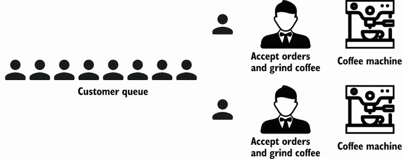

图 8.2 复制咖啡店里的一切

在这个新过程中，系统的每个部分都是独立的。咖啡店应该以两倍的速度为消费者服务。这是一个咖啡店的*并行*实现。

如果我们想扩大规模，我们可以一遍又一遍地复制服务员和咖啡机。然而，这不是唯一可能的咖啡店设计。另一种方法可能是将服务员的工作进行分工，让一个人负责接受订单，另一个人负责研磨咖啡豆，然后在一台机器中冲泡。此外，我们可以为等待订单的顾客引入另一个队列(想想星巴克)，而不是阻塞顾客队列直到顾客得到服务(图 8.3)。

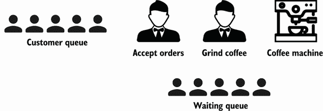

图 8.3 拆分服务员的角色

有了这个新的设计，我们不再把事情平行化。但是整体结构受到了影响:我们将一个给定的角色分成两个角色，并引入了另一个队列。与并行性不同，并行性是指一次多次做同一件事，*并发性*是关于结构的。

假设一个线程代表服务员接受订单，另一个线程代表咖啡机，我们引入了另一个线程来研磨咖啡豆。每个线程都是独立的，但必须与其他线程协调。在这里，接受订单的服务员线程必须传达要研磨哪些咖啡豆。同时，咖啡研磨螺纹必须与咖啡机螺纹连通。

如果我们想通过每小时服务更多的客户来提高吞吐量，该怎么办？因为磨咖啡豆比接受订单花费的时间更长，一个可能的改变是雇佣另一个磨咖啡的服务员(图 8.4)。

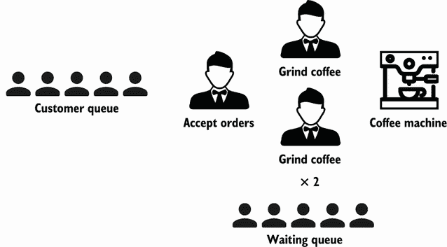

图 8.4 雇佣另一个服务员研磨咖啡豆

这里，结构保持不变。依然是三步走的设计:接受、研磨、冲泡咖啡。因此，在并发性方面没有变化。但是我们又回到了添加并行性，这里是针对一个特定的步骤:订单准备。

现在，让我们假设减慢整个过程的部分是咖啡机。使用单个咖啡机会引起咖啡研磨线程的争用，因为它们都在等待咖啡机线程可用。什么是解决方案？添加更多咖啡机线程(图 8.5)。

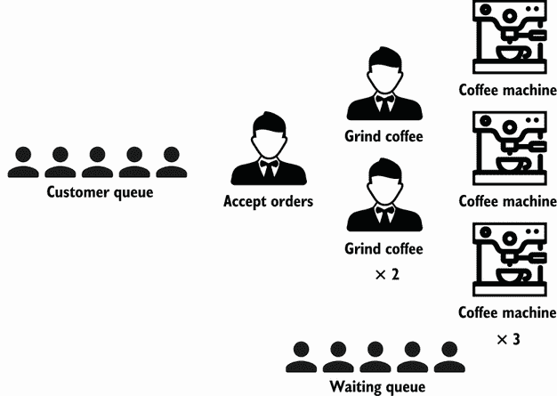

图 8.5 添加更多咖啡机

我们引入了更多的机器，而不是单一的咖啡机，从而提高了并行度。同样，结构没有改变。它仍然是一个三步设计。但是吞吐量应该会增加，因为咖啡研磨线程的争用程度应该会降低。

通过这种设计，我们可以注意到的重要之处:*并发支持并行*。事实上，并发性提供了一种结构来解决可能被并行化的部分的问题。

并发是指同时处理大量的事情。并行就是同时做很多事情。

—罗布·派克

总之，并发和并行是不同的。并发是关于结构的，我们可以通过引入独立并发线程可以处理的不同步骤，将顺序实现更改为并发实现。同时，并行是关于执行的，我们可以通过添加更多的并行线程在步骤级别使用它。理解这两个概念是成为一个熟练的 Go 开发者的基础。

下一节讨论一个普遍的错误:认为并发永远是正确的。

## 8.2 #56:思考并发总是更快

许多开发人员的一个误解是相信并发解决方案总是比顺序解决方案更快。这真是大错特错。解决方案的整体性能取决于许多因素，例如我们的结构的效率(并发性)，哪些部分可以并行处理，以及计算单元之间的争用程度。本节提醒我们一些 Go 中并发的基础知识；然后我们将看到一个具体的例子，其中并发解决方案并不一定更快。

### 去调度

线程是操作系统能够执行的最小处理单元。如果一个进程想要同时执行多个动作，它就会旋转多个线程。这些线程可以是

*   *并发*—两个或两个以上的线程可以在重叠的时间段内启动、运行、完成，就像上一节的服务员线程和咖啡机线程。

*   *并行*—同一任务可以一次执行多次，就像多个等待线程。

操作系统负责优化调度线程的进程，以便

*   所有线程都可以消耗 CPU 周期，而不会饥饿太长时间。

*   工作负载尽可能均匀地分布在不同的 CPU 内核中。

注意*线程*这个词在 CPU 级别上也可以有不同的含义。每个物理核心可以由多个逻辑核心组成(超线程的概念)，一个逻辑核心也称为线程。在本节中，当我们使用字*线程*时，我们指的是处理单元，而不是逻辑核心。

一个 CPU 内核执行不同的线程。当它从一个线程切换到另一个线程时，它执行一个叫做*上下文切换*的操作。消耗 CPU 周期的活动线程处于*执行*状态，并转移到*可运行*状态，这意味着它已准备好执行，等待可用内核。上下文切换被认为是一种开销很大的操作，因为操作系统需要在切换之前保存线程的当前执行状态(如当前寄存器值)。

作为 Go 开发者，我们不能直接创建线程，但是可以创建 goroutines，可以认为是应用级线程。然而，操作系统线程是由操作系统根据上下文切换到 CPU 内核的，而 goroutine 是由 Go 运行时根据上下文切换到操作系统线程的。此外，与 OS 线程相比，goroutine 的内存占用更小:Go 1.4 中的 Go routine 为 2 KB。一个操作系统线程依赖于操作系统，但是，例如，在 Linux/x86-32 上，默认大小是 2 MB(参见 [`mng.bz/DgMw`](http://mng.bz/DgMw) )。尺寸越小，上下文切换越快。

注意上下文切换一个 goroutine 比一个线程快大约 80%到 90%,这取决于架构。

现在让我们讨论 Go scheduler 是如何工作的，以概述 goroutines 是如何处理的。在内部，Go 调度程序使用以下术语(参见 [`mng.bz/N611`](http://mng.bz/N611) ):

*   *G*—goroutines

*   *M*—OS 线程（代表*机器*）

*   *P*—CPU 内核（代表*处理器*）

操作系统调度程序将每个操作系统线程(M)分配给一个 CPU 内核(P)。然后，每个 goroutine (G)在一个 M 上运行。`GOMAXPROCS`变量定义了负责同时执行用户级代码的 M 的限制。但是，如果一个线程在系统调用(例如 I/O)中被阻塞，调度程序可以加速更多的 M。

goroutine 的生命周期比 OS 线程更简单。它可以执行以下操作之一:

*   *执行*——goroutine 在 M 上调度并执行其指令。

*   *可执行*——goroutine 正在等待进入执行状态。

*   *等待*——goroutine 被停止，等待某些事情的完成，如系统调用或同步操作(如获取互斥)。

关于 Go 调度的实现还有最后一个需要理解的阶段:当一个 goroutine 被创建但还不能被执行时；例如，所有其他 M 都已经在执行 G 了，在这种情况下，Go 运行时会做什么呢？答案是排队。Go 运行时处理两种队列:每个 P 一个本地队列和所有 P 共享的全局队列。

图 8.6 显示了在一台四核机器上给定的调度情况，其中`GOMAXPROCS`等于`4`。这些部分是逻辑核心(Ps)、goroutines (Gs)、OS 线程(Ms)、本地队列和全局队列。

首先，我们可以看到五个 Ms，而`GOMAXPROCS`被设置为`4`。但是正如我们提到的，如果需要，Go 运行时可以创建比`GOMAXPROCS`值更多的 OS 线程。

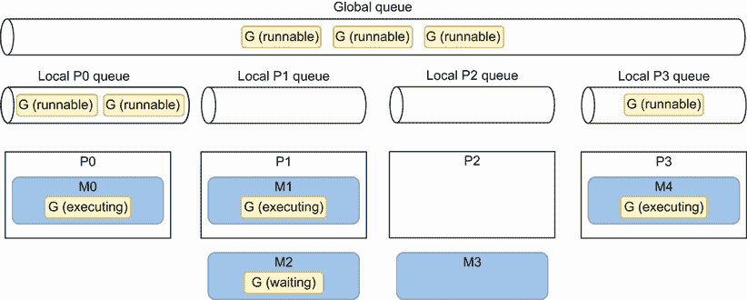

图 8.6 在四核机器上执行的 Go 应用程序的当前状态示例。不处于执行状态的 Goroutines 要么是可运行的(等待执行)，要么是等待的(等待阻塞操作)。

P0、P1 和 P3 目前正忙于执行 Go 运行时线程。但是 P2 现在很闲，因为 M3 离开了 P2，而且也没有戈鲁廷被处决。这不是一个好的情况，因为有六个可运行的 goroutines 正在等待执行，一些在全局队列中，一些在其他本地队列中。Go 运行时将如何处理这种情况？下面是用伪代码实现的调度(参见 [`mng.bz/lxY8`](http://mng.bz/lxY8) ):

```go
runtime.schedule() {
    // Only 1/61 of the time, check the global runnable queue for a G.
    // If not found, check the local queue.
    // If not found,
    //     Try to steal from other Ps.
    //     If not, check the global runnable queue.
    //     If not found, poll network.
}
```

每执行 61 次， Go 调度程序将检查全局队列中的 goroutines 是否可用。如果没有，它将检查其本地队列。同时，如果全局和本地队列都是空的，Go 调度程序可以从其他本地队列中提取 goroutines。调度中的这个原理叫做*偷工*，它允许一个未被充分利用的处理器主动寻找另一个处理器的 goroutines 并*偷*一些。

最后要提到的一件重要的事情是:在 Go 1.14 之前，调度器是合作的，这意味着只有在特定的阻塞情况下(例如，通道发送或接收、I/O、等待获取互斥锁)，goroutine 才可以从线程的上下文中切换出来。从 Go 1.14 开始，Go 调度程序现在是抢占式的:当一个 goroutine 运行了一段特定的时间(10 ms)时，它将被标记为可抢占的，并且可以在上下文中关闭，由另一个 goroutine 替换。这允许长时间运行的作业被强制共享 CPU 时间。

现在我们已经理解了 Go 中调度的基本原理，让我们看一个具体的例子:以并行方式实现合并排序。

### 8.2.2 并行合并排序

首先，我们简单回顾一下归并排序算法是如何工作的。然后我们将实现一个并行版本。请注意，我们的目标不是实现最有效的版本，而是支持一个具体的示例，展示为什么并发并不总是更快。

合并排序算法的工作原理是将一个列表重复分成两个子列表，直到每个子列表包含一个元素，然后合并这些子列表，这样结果就是一个排序后的列表(见图 8.7)。每个分割操作将列表分割成两个子列表，而合并操作将两个子列表合并成一个排序列表。

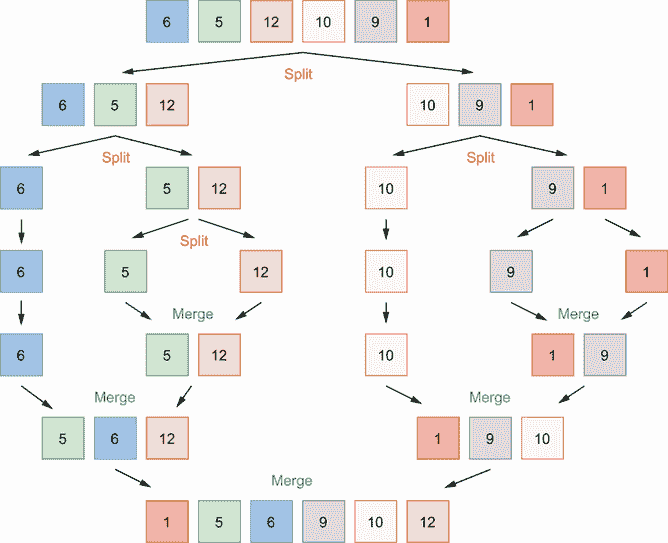

图 8.7 应用合并排序算法重复地将每个列表分成两个子列表。然后，该算法使用合并操作，从而对结果列表进行排序。

下面是该算法的顺序实现。我们没有包括所有的代码，因为这不是本节的重点:

```go
func sequentialMergesort(s []int) {
    if len(s) <= 1 {
        return
    }

    middle := len(s) / 2
    sequentialMergesort(s[:middle])     ❶
    sequentialMergesort(s[middle:])     ❷
    merge(s, middle)                    ❸
}

func merge(s []int, middle int) {
    // ...
}
```

❶上半场

❷下半场

❸合并了两半

这个算法有一个结构，使它对并发开放。事实上，由于每个`sequentialMergesort`操作都处理一组不需要完全复制的独立数据(这里是使用切片的底层阵列的独立视图)，我们可以通过在不同的 goroutine 中加速每个`sequentialMergesort`操作，在 CPU 内核之间分配这个工作负载。让我们编写第一个并行实现:

```go
func parallelMergesortV1(s []int) {
    if len(s) <= 1 {
        return
    }

    middle := len(s) / 2

    var wg sync.WaitGroup
    wg.Add(2)

    go func() {             ❶
        defer wg.Done()
        parallelMergesortV1(s[:middle])
    }()

    go func() {             ❷
        defer wg.Done()
        parallelMergesortV1(s[middle:])
    }()

    wg.Wait()
    merge(s, middle)        ❸
}
```

❶穿着戈罗丁舞加快了作品的前半部分

❷穿着戈罗丁舞加快了作品的后半部分

❸合并了两半

在这个版本中，工作负载的每一半都在一个单独的 goroutine 中处理。父 goroutine 通过使用`sync.WaitGroup`来等待两个部分。因此，我们在合并操作之前调用`Wait`方法。

注意，如果你还不熟悉`sync.WaitGroup`，我们将在错误#71“误用 sync.WaitGroup”中更详细地了解它。简而言之，它允许我们等待`n`操作完成:通常是 goroutines，就像前面的例子一样。

我们现在有了合并排序算法的并行版本。因此，如果我们运行一个基准来比较这个版本和顺序版本，并行版本应该更快，对吗？让我们在具有 10，000 个元素的四核计算机上运行它:

```go
Benchmark_sequentialMergesort-4       2278993555 ns/op
Benchmark_parallelMergesortV1-4      17525998709 ns/op
```

令人惊讶的是，并行版本几乎慢了一个数量级。我们如何解释这个结果？在四个内核之间分配工作负载的并行版本怎么可能比运行在单台机器上的顺序版本慢？我们来分析一下问题。

如果我们有一个 1024 个元素的切片，父 goroutine 将旋转两个 go routine，每个负责处理由 512 个元素组成的另一半。这些 goroutine 中的每一个都将增加两个新的 go routine，负责处理 256 个元素，然后是 128 个，依此类推，直到我们增加一个 go routine 来计算一个元素。

如果我们想要并行化的工作负载太小，这意味着我们将计算得太快，那么跨内核分布作业的好处就会被破坏:与直接合并当前 goroutine 中的少量项目相比，创建 goroutine 并让调度程序执行它所花费的时间太长了。尽管 goroutines 是轻量级的，启动速度比线程快，但我们仍然会遇到工作负载太小的情况。

注我们将讨论如何识别错误#98“没有使用 Go 诊断工具”中的执行并行性差的情况

那么我们能从这个结果中得出什么结论呢？这是否意味着合并排序算法不能并行化？等等，别这么快。

让我们尝试另一种方法。因为在一个新的 goroutine 中合并少量的元素效率不高，所以让我们定义一个阈值。该阈值将表示为了以并行方式处理，一半应该包含多少元素。如果一半中的元素数小于这个值，我们将按顺序处理。这是一个新版本:

```go
const max = 2048                      ❶

func parallelMergesortV2(s []int) {
    if len(s) <= 1 {
        return
    }

    if len(s) <= max {
        sequentialMergesort(s)        ❷
    } else {                          ❸
        middle := len(s) / 2

        var wg sync.WaitGroup
        wg.Add(2)

        go func() {
            defer wg.Done()
            parallelMergesortV2(s[:middle])
        }()

        go func() {
            defer wg.Done()
            parallelMergesortV2(s[middle:])
        }()

        wg.Wait()
        merge(s, middle)
    }
}
```

❶定义了门槛

❷称我们最初的序列版本

❸如果大于阈值，则保持平行版本

如果`s`切片中的元素数量小于`max`，我们称之为顺序版本。否则，我们继续调用我们的并行实现。这种方法会影响结果吗？是的，确实如此:

```go
Benchmark_sequentialMergesort-4       2278993555 ns/op
Benchmark_parallelMergesortV1-4      17525998709 ns/op
Benchmark_parallelMergesortV2-4       1313010260 ns/op
```

我们的 v2 并行实现比顺序实现快 40%以上，这要归功于定义一个阈值来指示并行何时应该比顺序更高效的想法。

请注意，为什么我将阈值设置为 2，048？因为这是我的机器上这个特定工作负载的最佳值。一般来说，这种神奇的价值应该用基准仔细定义(在类似于生产的执行环境中运行)。有趣的是，在没有实现 goroutines 概念的编程语言中运行相同的算法会对值产生影响。例如，在 Java 中使用线程运行相同的示例意味着最佳值接近 8，192。这有助于说明 goroutines 比线程更高效。

在本章中，我们已经看到了 Go 中调度的基本概念:线程和 goroutine 之间的区别，以及 Go 运行时如何调度 Go routine。同时，使用并行合并排序的例子，我们说明了并发并不总是更快。正如我们所看到的，让 goroutines 运行来处理最少的工作负载(只合并一小部分元素)会破坏我们从并行性中获得的好处。

那么，我们该何去何从呢？我们必须记住，并发并不总是更快，也不应该被认为是解决所有问题的默认方式。首先，它使事情变得更加复杂。此外，现代 CPU 在执行顺序代码和可预测代码方面已经变得非常高效。例如，超标量处理器可以在单个内核上高效地并行执行指令。

这是否意味着我们不应该使用并发性？当然不是。然而，记住这些结论是很重要的。例如，如果我们不确定并行版本会更快，正确的方法可能是从简单的顺序版本开始，然后使用概要分析(错误#98，“没有使用 Go diagnostics 工具”)和基准测试(错误#89，“编写不准确的基准测试”)进行构建。这可能是确保并发性值得的唯一方法。

下一节讨论一个常见的问题:什么时候应该使用通道或互斥体？

## 8.3 #57:对何时使用通道或互斥感到困惑

给定一个并发问题，我们是否可以使用通道或互斥来实现一个解决方案可能并不总是很清楚。因为 Go 提倡通过通信共享内存，所以一个错误可能是总是强制使用通道，而不管用例是什么。然而，我们应该把这两种选择看作是互补的。这一节阐明了我们应该在什么时候选择一个选项。我们的目标不是讨论每一个可能的用例(这可能需要一整章的时间)，而是给出可以帮助我们做出决定的一般准则。

首先，简单提醒一下 Go 中的通道:通道是一种沟通机制。在内部，通道是一个我们可以用来发送和接收值的管道，它允许我们*连接*并发的 goroutines。通道可以是以下任意一种:

*   *未缓冲*—发送方 goroutine 阻塞，直到接收方 goroutine 准备就绪。

*   *缓冲*—发送方仅在缓冲区已满时阻塞。

让我们回到我们最初的问题。我们什么时候应该使用通道或互斥？我们将使用图 8.8 中的例子作为主干。我们的示例中有三种不同的 goroutines，它们具有特定的关系:

*   G1 和 G2 是平行的两条路线。它们可能是两个执行相同功能的 go routine，该功能从一个通道接收消息，或者可能是两个 go routine 同时执行相同的 HTTP 处理程序。

*   另一方面，G1 和 G3 是并发的 goroutines，G2 和 G3 也是。所有的 goroutines 都是整个并发结构的一部分，但是 G1 和 G2 执行第一步，而 G3 执行下一步。

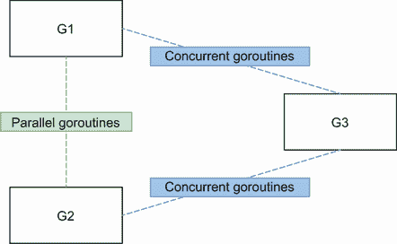

图 8.8 和 G2 是并行的，而 G2 和 G3 是并发的。

一般来说，并行 goroutines 必须*同步*:例如，当它们需要访问或改变一个共享资源(比如一个片)时。同步是通过互斥体实施的，而不是通过任何通道类型(不是缓冲通道)实施的。因此，一般来说，并行 goroutines 之间的同步应该通过互斥来实现。

相反，一般来说，并发的 goroutines 必须*协调和编排*。例如，如果 G3 需要汇总来自 G1 和 G2 的结果，则 G1 和 G2 需要向 G3 发出信号，告知有新的中间结果可用。这种协调属于沟通的范畴，因此属于通道的范畴。

关于并发 goroutines，也有这样的情况，我们希望将资源的所有权从一个步骤(G1 和 G2)转移到另一个步骤(G3)；例如，如果 G1 和 G2 正在丰富一个共享资源，在某个时刻，我们认为这项工作已经完成。这里，我们应该使用通道来表示特定的资源已经准备好，并处理所有权转移。

互斥体和通道有不同的语义。每当我们想要共享一个状态或访问一个共享资源时，互斥锁确保对这个资源的独占访问。相反，信道是一种机制，用于发送有数据或无数据的信号(`chan` `struct{}`或无数据)。协调或所有权转移应通过通道实现。了解 go routine 是并行的还是并发的很重要，因为一般来说，我们需要为并行的 go routine 使用互斥体，为并发的 go routine 使用通道。

现在让我们讨论一个关于并发性的普遍问题:竞争问题。

## 8.4 #58:不理解种族问题

种族问题可能是程序员面临的最困难和最阴险的错误之一。作为 Go 开发人员，我们必须理解关键的方面，比如数据竞争和竞争条件，它们可能的影响，以及如何避免它们。我们将讨论这些主题，首先讨论数据竞争和竞争条件，然后研究 go 内存模型及其重要性。

### 8.4.1 数据竞争与竞争条件

我们先来关注一下数据竞争。当两个或多个 goroutines 同时访问同一个内存位置，并且至少有一个正在写入时，就会发生数据竞争。以下是两个 goroutines 递增一个共享变量的示例:

```go
i := 0

go func() {
    i++       ❶
}()

go func() {
    i++
}()
```

❶增量 I

如果我们使用 Go race 检测器(`-race`选项)运行这段代码，它会警告我们发生了数据竞争:

```go
==================
WARNING: DATA RACE
Write at 0x00c00008e000 by goroutine 7:
  main.main.func2()

Previous write at 0x00c00008e000 by goroutine 6:
  main.main.func1()
==================
```

`i`的最终值也是无法预测的。有时候可以是`1`，有时候是`2`。

这段代码有什么问题？`i++`语句可以分解成三个操作:

1.  读作`i`。

2.  增加数值。

3.  写回`i`。

如果第一个 goroutine 在第二个之前执行并完成，会发生以下情况。

| 

Goroutine 1

 | 

Goroutine 2

 | 

操作

 | 

`i`

 |
|  |  |  | 0 |
| 阅读 |  | <- | 0 |
| 增量 |  |  | 0 |
| 回复 |  | -> | 1 |
|  | 阅读 | <- | 1 |
|  | 增量 |  | 1 |
|  | 回复 | -> | 2 |

第一个 goroutine 读取、递增并将值`1`写回`i`。然后第二个 goroutine 执行相同的一组动作，但是从`1`开始。因此，写入`i`的最终结果是`2`。

然而，在前面的例子中，不能保证第一个 goroutine 会在第二个之前开始或完成。我们还可以面对交叉执行的情况，其中两个 goroutines 同时运行并竞争访问`i`。这是另一种可能的情况。

| 

Goroutine 1

 | 

Goroutine 2

 | 

操作

 | 

`i`

 |
|  |  |  | 0 |
| 阅读 |  | <- | 0 |
|  | 阅读 | <- | 0 |
| 增量 |  |  | 0 |
|  | 增量 |  | 0 |
| 回复 |  | -> | 1 |
|  | 回复 | -> | 1 |

首先，两个 goroutines 从`i`读取并获得值`0`。然后，两者都将其递增，并写回它们的本地结果:`1`，这不是预期的结果。

这是数据竞争可能带来的影响。如果两个 goroutines 同时访问同一个内存位置，并且至少对该内存位置进行一次写入，结果可能是危险的。更糟糕的是，在某些情况下，内存位置最终可能会保存一个包含无意义的位组合的值。

请注意，在错误#83“未启用-race 标志”中，我们将看到 Go 如何帮助我们检测数据竞争。

我们如何防止数据竞争的发生？让我们看看一些不同的技术。这里的范围不是展示所有可能的选项(例如，我们将省略`atomic.Value`)，而是展示主要的选项。

第一种选择是使增量操作原子化，这意味着它在单个操作中完成。这防止了纠缠的运行操作。

| 

Goroutine 1

 | 

Goroutine 2

 | 

操作

 | 

`i`

 |
|  |  |  | 0 |
| 读取并递增 |  | <-> | 1 |
|  | 读取并递增 | <-> | 2 |

即使第二个 goroutine 在第一个之前运行，结果仍然是`2`。

原子操作可以在 Go 中使用T2 包来完成。这里有一个我们如何自动增加一个`int64`的例子:

```go
var i int64

go func() {
    atomic.AddInt64(&i, 1)    ❶
}()

go func() {
    atomic.AddInt64(&i, 1)    ❷
}()
```

❶原子地增加 I

❷相同

两个 goroutines 都自动更新`i`。原子操作不能被中断，从而防止同时进行两次访问。不管 goroutines 的执行顺序如何，`i`最终将等于`2`。

注意`sync/atomic`包为`int32`、`int64`、`uint32`和`uint64`提供了原语，但不为`int`提供原语。这就是为什么在这个例子中`i`是一个`int64`。

另一个选择是用一个类似互斥的特殊数据结构来同步两个 goroutines。*互斥*代表代表*互斥*；互斥体确保最多一个 goroutine 访问一个所谓的临界区。在 Go 中，`sync`包提供了一个`Mutex`类型:

```go
i := 0
mutex := sync.Mutex{}

go func() {
    mutex.Lock()        ❶
    i++                 ❷
    mutex.Unlock()      ❸
}()

go func() {
    mutex.Lock()
    i++
    mutex.Unlock()
}()
```

❶开始关键部分

❷增量 I

❸结束了关键部分

在本例中，递增`i`是临界区。不管 goroutines 的顺序如何，这个例子也为`i` : `2`产生一个确定值。

哪种方法效果最好？界限很简单。正如我们提到的，`sync/atomic`包只对特定类型的有效。如果我们想要别的东西(例如，切片、映射和结构)，我们不能依赖`sync/atomic`。

另一个可能的选择是避免共享同一个内存位置，而是支持跨 goroutines 的通信。例如，我们可以创建一个通道，每个 goroutine 使用该通道来产生增量值:

```go
i := 0
ch := make(chan int)

go func() {
    ch <- 1     ❶
}()

go func() {
    ch <- 1
}()

i += <-ch       ❷
i += <-ch
```

❶通知 goroutine 增加 1

❷从信道接收到的信息中增加 I

每个 goroutine 通过通道发送一个通知，告诉我们应该将`i`增加`1`。父 goroutine 收集通知并增加`i`。因为这是唯一写入`i`的 goroutine，这个解决方案也没有数据竞争。

让我们总结一下到目前为止我们所看到的。当多个 goroutines 同时访问同一个内存位置(例如，同一个变量)并且其中至少有一个正在写入时，就会发生数据争用。我们还看到了如何通过三种同步方法来防止这个问题:

*   使用原子操作

*   用互斥体保护临界区

*   使用通信和通道来确保一个变量只由一个例程更新

通过这三种方法，`i`的值最终将被设置为`2`，而不考虑两个 goroutines 的执行顺序。但是根据我们想要执行的操作，无数据竞争的应用程序一定意味着确定性的结果吗？让我们用另一个例子来探讨这个问题。

不是让两个 goroutines 递增一个共享变量，而是每个都做一个赋值。我们将遵循使用互斥体来防止数据竞争的方法:

```go
i := 0
mutex := sync.Mutex{}

go func() {
    mutex.Lock()
    defer mutex.Unlock()
    i = 1                 ❶
}()

go func() {
    mutex.Lock()
    defer mutex.Unlock()
    i = 2                 ❷
}()
```

❶第一次把 1 分配给 I

第二个❷把 2 分配给 I

第一个 goroutine 分配`1`到`i`，而第二个分配`2`。

这个例子中有数据竞争吗？不，没有。两个 goroutines 访问同一个变量，但不是同时，因为互斥体保护它。但是这个例子是确定性的吗？不，不是的。

根据执行顺序，`i`最终将等于`1`或`2`。这个例子不会导致数据竞争。但是它有一个*竞态条件*。当行为依赖于无法控制的事件顺序或时间时，就会出现竞争情况。在这里，事件的时间是 goroutines 的执行顺序。

确保 goroutines 之间特定的执行顺序是一个协调和编排的问题。如果我们想确保我们首先从状态 0 到状态 1，然后从状态 1 到状态 2，我们应该找到一种方法来保证 goroutines 按顺序执行。通道可以是解决这个问题的一种方式。协调和编排还可以确保一个特定的部分只被一个 goroutine 访问，这也意味着删除前面例子中的互斥体。

总之，当我们在并发应用程序中工作时，必须理解数据竞争不同于竞争条件。当多个 goroutines 同时访问同一个内存位置，并且其中至少有一个正在写入时，就会发生数据竞争。数据竞争意味着意外的行为。然而，无数据竞争的应用程序并不一定意味着确定的结果。一个应用程序可以没有数据竞争，但仍然具有依赖于不受控事件的行为(例如 goroutine 执行、消息发布到通道的速度，或者对数据库的调用持续多长时间)；这是一个竞争条件。理解这两个概念对于熟练设计并发应用程序至关重要。

现在让我们检查 Go 内存模型，并理解它为什么重要。T3】

### 8 . 4 . 2 Go 记忆模型

上一节讨论了同步 goroutines 的三种主要技术:原子操作、互斥和通道。然而，作为 Go 开发者，我们应该了解一些核心原则。例如，缓冲和无缓冲通道提供不同的保证。为了避免由于缺乏对语言核心规范的理解而导致的意外竞争，我们必须看看 Go 内存模型。

Go 内存模型( [`golang.org/ref/mem`](https://golang.org/ref/mem) )是一种规范，它定义了在写入不同 goroutine 中的相同变量后，从一个 goroutine 中的变量读取数据的条件。换句话说，它提供了开发人员应该记住的保证，以避免数据竞争和强制确定性输出。

在单个 goroutine 中，不存在不同步的访问。事实上，我们的程序所表达的顺序保证了先发生顺序。

然而，在多个 goroutines 中，我们应该记住其中的一些保证。我们将使用符号 A < B to denote that event A happens before event B. Let’s examine these guarantees (some copied from the Go memory model):

*   创建一个 goroutine 发生在 goroutine 执行开始之前。因此，读取一个变量，然后启动一个新的 goroutine 写入该变量，不会导致数据竞争:

    ```go
    i := 0
    go func() {
        i++
    }()
    ```

*   相反，一个 goroutine 的退出并不能保证发生在任何事件之前。因此，以下示例存在数据竞争:

    ```go
    i := 0
    go func() {
        i++
    }()
    fmt.Println(i)
    ```

    同样，如果我们想防止数据竞争的发生，我们应该同步这些 goroutines。

*   通道上的发送发生在该通道的相应接收完成之前。在下一个示例中，父 goroutine 在发送前递增变量，而另一个 goroutine 在通道读取后读取变量:

    ```go
    i := 0
    ch := make(chan struct{})
    go func() {
        <-ch
        fmt.Println(i)
    }()
    i++
    ch <- struct{}{}
    ```

    顺序如下:

    ```go
    variable increment < channel send < channel receive < variable read
    ```

    通过传递性，我们可以确保对`i`的访问是同步的，因此没有数据竞争。

*   关闭通道发生在接收到该关闭之前。下一个例子与上一个类似，只是我们没有发送消息，而是关闭了通道:

    ```go
    i := 0
    ch := make(chan struct{})
    go func() {
        <-ch
        fmt.Println(i)
    }()
    i++
    close(ch)
    ```

    因此，这个例子也没有数据竞争。

*   关于信道的最后一个保证乍一看可能是违反直觉的:来自无缓冲信道的接收发生在该信道上的发送完成之前。

    首先，我们来看一个用缓冲通道代替无缓冲通道的例子。我们有两个 goroutines，父节点发送消息并读取一个变量，而子节点更新这个变量并从通道接收:

    ```go
    i := 0
    ch := make(chan struct{}, 1)
    go func() {
        i = 1
        <-ch
    }()
    ch <- struct{}{}
    fmt.Println(i)
    ```

    这个例子导致了一场数据竞争。我们可以在图 8.9 中看到，对`i`的读取和写入可能同时发生；因此，`i`并不同步。

    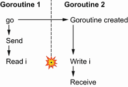

    图 8.9 如果通道被缓冲，就会导致数据竞争。

    现在，让我们将通道改为无缓冲通道，以说明内存模型保证:

    ```go
    i := 0
    ch := make(chan struct{})   ❶
    go func() {
        i = 1
        <-ch
    }()
    ch <- struct{}{}
    fmt.Println(i)
    ```

    ❶使通道无缓冲

    改变信道类型使本例无数据竞争(见图 8.10)。在这里，我们可以看到主要的区别:写操作肯定发生在读操作之前。注意，箭头不代表因果关系(当然，接收是由发送引起的)；它们代表 Go 内存模型的排序保证。因为来自无缓冲通道的接收发生在发送之前，所以对`i`的写入总是发生在读取之前。

    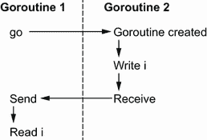

    图 8.10 如果通道是无缓冲的，它不会导致数据竞争。

在本节中，我们已经讨论了 Go 内存模型的主要保证。在编写并发代码时，理解这些保证应该是我们核心知识的一部分，并且可以防止我们做出可能导致数据竞争和/或竞争条件的错误假设。

下一节讨论了理解工作负载类型的重要性。

## 8.5 #59:不了解工作负载类型的并发影响

本节介绍了并行实施中工作负载类型的影响。根据工作负载是受 CPU 限制还是受 I/O 限制，我们可能需要以不同的方式处理这个问题。让我们首先定义这些概念，然后讨论影响。

在编程中，工作负荷的执行时间受以下因素的限制:

*   *CPU 的速度*—例如，运行合并排序算法。这个工作负载被称为 *CPU 限制*。

*   *I/O 的速度*—例如，进行 REST 调用或数据库查询。工作负载称为 *I/O 限制*。

*   *可用内存量*—工作负载称为*内存限制*。

注意，鉴于近几十年来内存变得非常便宜，最后一种是现在最罕见的。因此，本节重点介绍前两种工作负载类型:CPU 和 I/O 负载。

为什么在并发应用程序环境中对工作负载进行分类很重要？让我们通过一个并发模式来理解这一点:工作器池。

下面的例子实现了一个`read`函数，它接受一个`io.Reader`并从中重复读取 1024 个字节。我们将这 1024 字节传递给一个执行某些任务的`task`函数(稍后我们将看到是什么类型的任务)。这个`task`函数返回一个整数，我们要返回所有结果的和。下面是一个顺序实现:

```go
func read(r io.Reader) (int, error) {
    count := 0
    for {
        b := make([]byte, 1024)
        _, err := r.Read(b)     ❶
        if err != nil {
            if err == io.EOF {  ❷
                break
            }
            return 0, err
        }
        count += task(b)        ❸
    }
    return count, nil
}
```

❶读取 1024 字节

当我们到达终点时，❷停止了循环

❸根据任务函数的结果增加计数

该函数创建一个`count`变量，从读取`io.Reader`输入，调用`task`，并递增`count`。现在，如果我们想以并行的方式运行所有的和`task`函数，该怎么办呢？

一种选择是使用所谓的 *工作器统筹模式*。这样做涉及到创建固定大小的工作器(goroutines ),这些工作器从一个公共通道轮询任务(见图 8.11)。

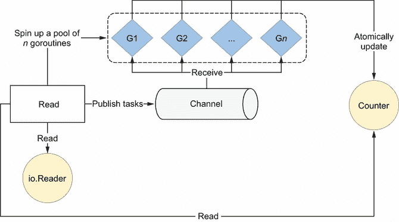

图 8.11 来自固定池的每个 goroutine 从共享信道接收。

首先，我们构建一个固定的 goroutines 池(稍后我们将讨论有多少)。然后我们创建一个共享通道，在每次读取到`io.Reader`之后，我们将任务发布到这个通道。池中的每个 goroutine 从这个通道接收数据，执行它的工作，然后自动更新一个共享计数器。

这里有一种在 Go 中写这个的可能方法，池大小为 10 个 goroutines。每个 goroutine 自动更新一个共享计数器:

```go
func read(r io.Reader) (int, error) {
    var count int64
    wg := sync.WaitGroup{}
    var n = 10

    ch := make(chan []byte, n)        ❶
    wg.Add(n)                         ❷
    for i := 0; i < n; i++ {          ❸
        go func() {
            defer wg.Done()           ❹
            for b := range ch {       ❺
                v := task(b)
                atomic.AddInt64(&count, int64(v))
            }
        }()
    }

    for {
        b := make([]byte, 1024)
        // Read from r to b
        ch <- b                       ❻
    }
    close(ch)
    wg.Wait()                         ❼
    return int(count), nil
}
```

❶创建一个容量等于池容量的通道

❷将 n 添加到等待组中

❸创造了一个 n 戈罗丁池

一旦 goroutine 从通道收到消息，❹就调用 Done 方法

每个 goroutine 从共享信道接收❺。

每次阅读后，❻都会向通道发布一个新任务

❼在返回之前等待等待组完成

在这个例子中，我们使用`n`来定义池的大小。我们创建一个容量与池相同的通道和一个增量为`n`的等待组。这样，我们在发布消息时减少了父 goroutine 中的潜在争用。我们迭代`n`次来创建一个从共享通道接收的新的 goroutine。收到的每条消息都通过执行`task`和自动递增共享计数器来处理。从通道中读取数据后，每个 goroutine 都会递减等待组。

在父 goroutine 中，我们一直从`io.Reader`开始读取，并将每个任务发布到通道。最后但同样重要的是，我们关闭通道，等待等待组完成(意味着所有的子 goroutines 都完成了它们的任务)再返回。

拥有固定数量的 goroutines 限制了我们讨论过的缺点；它缩小了资源的影响，并防止外部系统被淹没。现在的关键问题是:池大小的值应该是多少？答案取决于工作负载类型。

如果工作负载是 I/O 受限的，那么答案主要取决于外部系统。如果我们想要最大化吞吐量，系统可以处理多少个并发访问？

如果工作负载受 CPU 限制，最佳实践是依赖`GOMAXPROCS`。`GOMAXPROCS`是变量，设置分配给正在运行的 goroutines 的 OS 线程数。默认情况下，该值设置为逻辑 CPU 的数量。

使用运行时。GOMAXPROCS

我们可以使用`runtime.GOMAXPROCS(int)`函数来更新`GOMAXPROCS`的值。用`0`作为参数调用它不会改变值；它只返回当前值:

```go
n := runtime.GOMAXPROCS(0)
```

那么，将池的大小映射到`GOMAXPROCS`的基本原理是什么？我们举一个具体的例子，说我们将在四核机器上运行我们的应用程序；因此，Go 将实例化四个 OS 线程，其中 goroutines 将被执行。起初，事情可能并不理想:我们可能面临一个场景，有四个 CPU 核心和四个 goroutine，但是只有一个 go routine 被执行，如图 8.12 所示。

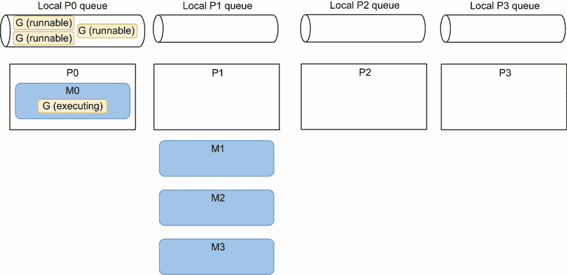

图 8.12 最多运行一个 goroutine。

M0 目前正在运行工作器池的 goroutine。因此，这些 goroutines 开始从通道接收消息并执行它们的作业。但是池中的其他三个 goroutines 还没有分配给 M；因此，它们处于可运行状态。M1、M2 和 M3 没有任何 goroutines 要运行，所以它们仍然没有核心。因此只有一个 goroutine 在运行。

最终，考虑到我们已经描述过的窃取工作的概念，P1 可能会从本地 P0 队列中窃取 goroutines。在图 8.13 中，P1 从 P0 那里偷了三个 goroutines。在这种情况下，Go 调度程序也可能最终将所有的 goroutines 分配给不同的 OS 线程，但是不能保证这应该在什么时候发生。然而，由于 Go 调度器的主要目标之一是优化资源(这里是 goroutines 的分布)，考虑到工作负载的性质，我们应该以这样的场景结束。

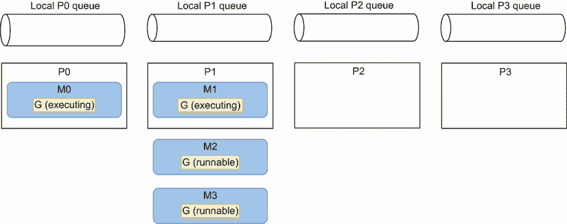

图 8.13 最多运行两个 goroutines。

这个场景仍然不是最佳的，因为最多运行两个 goroutines。假设机器只运行我们的应用程序(而不是操作系统进程)，那么 P2 和 P3 是自由的。最终，操作系统应该移动 M2 和 M3，如图 8.14 所示。

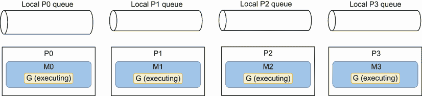

图 8.14 现在最多运行四个 goroutines。

在这里，操作系统调度程序决定将 M2 移到 P2，将 M3 移到 P3。同样，无法保证这种情况何时会发生。但是假设一台机器只执行我们的四线程应用程序，这应该是最终的画面。

情况发生了变化；它已经变得最优。四个 goroutines 运行在不同的线程中，线程运行在不同的内核上。这种方法减少了 goroutine 和线程级别的上下文切换量。

这个全局图不是我们(Go 开发者)能设计和要求的。然而，正如我们所看到的，我们可以在 CPU 受限的工作负载的情况下以有利的条件启用它:拥有一个基于`GOMAXPROCS`的工作池。

注意，如果给定特定的条件，我们希望将 goroutines 的数量绑定到 CPU 内核的数量，为什么不依赖于返回逻辑 CPU 内核数量的`runtime.NumCPU()`？我们提到过，`GOMAXPROCS`是可以改变的，可以小于 CPU 核心的数量。在 CPU 受限的工作负载的情况下，如果内核的数量是四个，但我们只有三个线程，我们应该增加三个 goroutines，而不是四个。否则，一个线程将在两个 goroutines 之间共享其执行时间，从而增加上下文切换的次数。

在实现 worker-pooling 模式时，我们已经看到池中 goroutines 的最佳数量取决于工作负载类型。如果工作线程执行的工作负载是 I/O 受限的，那么这个值主要取决于外部系统。相反，如果工作负载是 CPU 受限的，那么 goroutines 的最佳数量接近可用线程的数量。设计并发应用程序时，了解工作负载类型(I/O 或 CPU)至关重要。

最后但同样重要的是，让我们记住，在大多数情况下，我们应该通过基准来验证我们的假设。并发并不简单，很容易做出草率的假设，结果证明是无效的。

在本章的最后一节，我们将讨论一个要精通 Go 必须了解的重要话题:上下文。

## 8.6 #60:误解 Go 上下文

开发人员有时会误解`context.Context`类型，尽管它是该语言的关键概念之一，也是 Go 中并发代码的基础。让我们看看这个概念，并确保我们理解为什么以及如何有效地使用它。

根据官方文档( [`pkg.go.dev/context`](https://pkg.go.dev/context) ):

上下文携带截止日期、取消信号和其他跨 API 边界的值。

让我们检查一下这个定义，并理解与 Go 上下文相关的所有概念。

### 8.6.1 截止日期

截止日期是指由以下某一项确定的特定时间点:

*   从现在起一个`time.Duration`(例如，在 250 毫秒内)

*   A `time.Time`(例如世界协调时 2023-02-07 00:00:00)

截止日期的语义表明，如果符合截止日期，正在进行的活动应该停止。例如，一个活动是一个 I/O 请求或一个等待从通道接收消息的 goroutine。

让我们考虑一个每四秒钟从雷达接收一次飞行位置的应用程序。一旦我们收到一个职位，我们希望与只对最新职位感兴趣的其他应用程序共享它。我们拥有一个包含单一方法的`publisher`接口:

```go
type publisher interface {
    Publish(ctx context.Context, position flight.Position) error
}
```

此方法接受上下文和位置。我们假设具体实现调用一个函数向代理发布消息(比如使用 Sarama 发布 Kafka 消息)。这个函数是*上下文感知的*，这意味着一旦上下文被取消，它就可以取消请求。

假设我们没有收到一个现有的上下文，我们应该为上下文参数的`Publish`方法提供什么？我们已经提到，申请人只对最新的职位感兴趣。因此，我们构建的上下文应该传达这样的信息:4 秒钟后，如果我们无法发布航班位置，我们应该停止对`Publish`的呼叫:

```go
type publishHandler struct {
    pub publisher
}

func (h publishHandler) publishPosition(position flight.Position) error {
    ctx, cancel := context.WithTimeout(context.Background(), 4*time.Second) ❶
    defer cancel()                                                          ❷
    return h.pub.Publish(ctx, position)                                     ❸
}
```

❶创建的上下文将在 4 秒钟后超时

❷推迟取消

❸传递了创造的语境

这段代码使用函数`context.WithTimeout`创建一个上下文。该函数接受超时和上下文。在这里，由于`publishPosition`没有接收现有的上下文，我们用`context.Background`从一个空的上下文中创建一个。同时，`context.WithTimeout`返回两个变量:创建的上下文和一个取消`func()`函数，该函数将在调用后取消上下文。将创建的上下文传递给`Publish`方法应该会使它在最多 4 秒内返回。

称`cancel`函数为函数的基本原理是什么？在内部，`context.WithTimeout`创建一个 goroutine，该 go routine 将在内存中保留 4 秒钟或直到`cancel`被调用。因此，调用`cancel`作为一个`defer`函数意味着当我们退出父函数时，上下文将被取消，创建的 goroutine 将被停止。这是一种保护措施，这样当我们返回时，不会在内存中留下保留的对象。

现在让我们转到 Go 上下文的第二个方面:取消信号。

### 8.6.2 取消信号

Go 上下文的另一个用例是携带取消信号。假设我们想要创建一个在另一个 goroutine 中调用`CreateFileWatcher(ctx` `context.Context, filename` `string)`的应用程序。这个函数创建了一个特定的文件监视器，它不断读取文件并捕捉更新。当提供的上下文过期或被取消时，该函数处理它以关闭文件描述符。

最后，当`main`返回时，我们希望通过关闭这个文件描述符来优雅地处理事情。因此，我们需要传播一个信号。

一种可能的方法是使用`context.WithCancel`，它返回一个上下文(返回的第一个变量)，一旦调用了`cancel`函数(返回的第二个变量)，它将取消:

```go
func main() {
    ctx, cancel := context.WithCancel(context.Background())    ❶
    defer cancel()                                             ❷

    go func() {
        CreateFileWatcher(ctx, "foo.txt")                      ❸
    }()

    // ...
}
```

❶创造了一个可取消的环境

❷推迟取消电话

❸使用创建的上下文调用该函数

当`main`返回时，它调用`cancel`函数来取消传递给`CreateFileWatcher`的上下文，以便文件描述符被优雅地关闭。

接下来，让我们讨论 Go contexts 的最后一个方面:价值观。T24】

### 8.6.3 上下文值

Go 上下文的最后一个用例是携带一个键值列表。在了解其背后的原理之前，我们先来看看如何使用它。

传达值的上下文可以这样创建:

```go
ctx := context.WithValue(parentCtx, "key", "value")
```

与`context.WithTimeout`、`context.WithDeadline`、`context.WithCancel`一样，`context.WithValue`是从父上下文(这里是`parentCtx`)中创建的。在这种情况下，我们创建一个新的`ctx`上下文，它包含与`parentCtx`相同的特征，但也传递一个键和值。

我们可以使用`Value`方法访问该值:

```go
ctx := context.WithValue(context.Background(), "key", "value")
fmt.Println(ctx.Value("key"))
value
```

提供的键和值是`any`类型。事实上，对于值，我们希望传递`any`类型。但是为什么键也应该是一个空接口，而不是一个字符串呢？这可能会导致冲突:来自不同包的两个函数可能使用相同的字符串值作为键。因此，后者将覆盖前者的值。因此，处理上下文键的最佳实践是创建一个未导出的自定义类型:

```go
package provider

type key string

const myCustomKey key = "key"

func f(ctx context.Context) {
    ctx = context.WithValue(ctx, myCustomKey, "foo")
    // ...
}
```

`myCustomKey`常量未导出。因此，使用相同上下文的另一个包不会覆盖已经设置的值。即使另一个包也基于一个`key`类型创建了相同的`myCustomKey`，它也将是一个不同的键。

那么，让上下文携带一个键值列表有什么意义呢？因为 Go 上下文是通用的和主流的，所以有无限的用例。

例如，如果我们使用跟踪，我们可能希望不同的子功能共享相同的关联 ID。一些开发人员可能认为这个 ID 太具侵入性，不适合作为函数签名的一部分。在这方面，我们也可以决定将其作为所提供的上下文的一部分。

另一个例子是如果我们想要实现一个 HTTP 中间件。如果你不熟悉这个概念，中间件是在服务请求之前执行的中间功能。例如，在图 8.15 中，我们已经配置了两个中间件，它们必须在执行处理程序本身之前执行。如果我们想要中间件通信，它们必须通过`*http.Request`中处理的上下文。

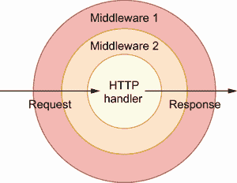

图 8.15 在到达处理程序之前，一个请求通过配置好的中间件。

让我们编写一个标记源主机是否有效的中间件示例:

```go
type key string

const isValidHostKey key = "isValidHost"                                    ❶

func checkValid(next http.Handler) http.Handler {
    return http.HandlerFunc(func(w http.ResponseWriter, r *http.Request) {
        validHost := r.Host == "acme"                                       ❷
        ctx := context.WithValue(r.Context(), isValidHostKey, validHost)    ❸

        next.ServeHTTP(w, r.WithContext(ctx))                               ❹
    })
}
```

❶创建上下文密钥

❷检查主机是否有效

❸创建一个新的上下文，其中包含一个值来表示源主机是否有效

❹称之为新环境下的下一步

首先，我们定义一个名为`isValidHostKey`的特定上下文键。然后`checkValid`中间件检查源主机是否有效。这个信息在新的上下文中传递，使用`next.ServeHTTP`传递到下一个 HTTP 步骤(下一个步骤可以是另一个 HTTP 中间件或最终的 HTTP 处理程序)。

这个例子展示了如何在具体的 Go 应用程序中使用带有值的上下文。在前面的章节中，我们已经看到了如何创建一个上下文来承载截止日期、取消信号和/或值。我们可以使用这个上下文，并将其传递给*上下文感知*库，这意味着库公开了接受上下文的函数。但是现在，假设我们必须创建一个库，并且我们希望外部客户端提供一个可以被取消的上下文。

### 8.6.4 捕捉上下文取消

`context.Context`类型导出返回一个只收通知通道的`Done`方法:`<-chan struct{}`。当与上下文相关联的工作应该被取消时，该通道被关闭。举个例子，

*   调用`cancel`函数时，与`context.WithCancel`创建的上下文相关的`Done`通道关闭。

*   当截止日期到期时，与用`context.WithDeadline`创建的上下文相关的`Done`通道关闭。

需要注意的一点是，内部通道应该在上下文被取消或达到截止日期时关闭，而不是在它收到特定值时关闭，因为通道的关闭是所有消费者 goroutines 将收到的唯一通道操作。这样，一旦上下文被取消或截止日期到了，所有的消费者都会得到通知。

此外，`context.Context`导出一个`Err`方法，如果`Done`通道尚未关闭，则返回`nil`。否则，它返回一个非零错误，解释为什么`Done`通道被关闭:例如，

*   一个`context.Canceled`错误，如果通道被取消

*   如果上下文的截止日期已过，则出现`context.DeadlineExceeded`错误

让我们看一个具体的例子，在这个例子中，我们希望不断地从一个通道接收消息。同时，我们的实现应该是上下文感知的，如果所提供的上下文完成了，就返回:

```go
func handler(ctx context.Context, ch chan Message) error {
    for {
        select {
        case msg := <-ch:               ❶
            // Do something with msg
        case <-ctx.Done():              ❷
            return ctx.Err()
        }
    }
}
```

❶不断收到来自中国的消息

❷如果上下文完成，返回与之相关的错误

我们创建一个`for`循环，并在两种情况下使用`select`:从`ch`接收消息或接收一个信号，表明上下文已经完成，我们必须停止我们的作业。在处理通道时，这是一个如何让函数感知上下文的例子。

实现接收上下文的函数

在接收传达可能的取消或超时的上下文的函数中，接收或发送消息到通道的操作不应该以阻塞方式完成。例如，在下面的函数中，我们向一个通道发送消息，并从另一个通道接收消息:

```go
func f(ctx context.Context) error {
    // ...
    ch1 <- struct{}{}     ❶

    v := <-ch2            ❷
    // ...
}
```

❶接收

❷发送

这个函数的问题是，如果上下文被取消或超时，我们可能不得不等待消息被发送或接收，而没有好处。相反，我们应该使用`select`来等待通道动作完成或者等待上下文取消:

```go
func f(ctx context.Context) error {
    // ...
    select {              ❶
    case <-ctx.Done():
        return ctx.Err()
    case ch1 <- struct{}{}:
    }

    select {              ❷
    case <-ctx.Done():
        return ctx.Err()
    case v := <-ch2:
        // ...
    }
}
```

❶向 ch1 发送消息或者等待上下文被取消

❷从 ch2 接收消息或者等待上下文被取消

在这个新版本中，如果`ctx`被取消或超时，我们会立即返回，而不会阻塞通道发送或接收。

总之，要成为一名精通GO的开发人员，我们必须了解什么是上下文以及如何使用它。在GO中，`context.Context`在标准库和外部库中随处可见。正如我们提到的，上下文允许我们携带截止日期、取消信号和/或键值列表。一般来说，用户等待的函数应该获取上下文，因为这样做允许上游调用者决定何时应该中止调用该函数。

当不确定使用哪个上下文时，我们应该使用`context.TODO()`，而不是用`context.Background`传递一个空上下文。`context.TODO()`返回一个空的上下文，但是从语义上来说，它表示要使用的上下文要么不清楚，要么还不可用(例如，还没有被父节点传播)。

最后，让我们注意标准库中的可用上下文对于多个 goroutines 的并发使用都是安全的。

## 摘要

*   理解并发和并行之间的根本区别是 Go 开发人员知识的基石。并发是关于结构的，而并行是关于执行的。

*   要成为一名熟练的开发人员，你必须承认并发并不总是更快。涉及最小工作量并行化的解决方案不一定比顺序实施更快。对顺序解决方案和并发解决方案进行基准测试应该是验证假设的方法。

*   了解 goroutine 交互也有助于在通道和互斥之间做出决定。一般来说，并行 goroutines 需要同步，因此也需要互斥。相反，并发 goroutines 通常需要协调和编排，因此也需要通道。

*   精通并发也意味着理解数据竞争和竞争条件是不同的概念。当多个 goroutines 同时访问同一个内存位置，并且其中至少有一个正在写入时，就会发生数据争用。同时，无数据竞争并不一定意味着确定性执行。当一个行为依赖于无法控制的事件顺序或时间时，这就是一个竞争条件。

*   了解 Go 内存模型以及排序和同步方面的底层保证对于防止可能的数据争用和/或争用情况至关重要。

*   在创建一定数量的 goroutines 时，要考虑工作负载类型。创建 CPU 绑定的 goroutines 意味着将这个数字绑定到接近于`GOMAXPROCS`变量的位置(默认情况下基于主机上 CPU 核心的数量)。创建 I/O 绑定的 goroutines 取决于其他因素，例如外部系统。

*   Go 上下文也是 Go 中并发的基石之一。上下文允许你携带截止日期、取消信号和/或键值列表。