# 9 并发:实践

本章涵盖

*   防止 goroutines 和 channels 的常见错误
*   了解使用标准数据结构和并发代码的影响
*   使用标准库和一些扩展
*   避免数据竞争和死锁

在前一章中，我们讨论了并发的基础。现在是时候看看 Go 开发人员在使用并发原语时所犯的实际错误了。

## 9.1 #61:传播不适当的上下文

在 Go 中处理并发时，上下文无处不在，在许多情况下，可能建议传播它们。然而，上下文传播有时会导致细微的错误，阻止子功能的正确执行。

让我们考虑下面的例子。我们公开一个 HTTP 处理程序，它执行一些任务并返回一个响应。但是就在返回响应之前，我们还想把它发送到一个卡夫卡主题。我们不想降低 HTTP 消费者的延迟，所以我们希望在新的 goroutine 中异步处理发布操作。我们假设我们有一个接受上下文的`publish`函数，例如，如果上下文被取消，发布消息的操作就会被中断。下面是一个可能的实现:

```go
func handler(w http.ResponseWriter, r *http.Request) {
    response, err := doSomeTask(r.Context(), r)         // ❶
    if err != nil {
        http.Error(w, err.Error(), http.StatusInternalServerError)
        return
    }

    go func() {                                         // ❷
        err := publish(r.Context(), response)
        // Do something with err
    }()

    writeResponse(response)                             // ❸
}
```

❶执行一些任务来计算 HTTP 响应

❷创建了一个戈鲁丁来发表对卡夫卡的回应

❸编写 HTTP 响应

首先我们调用一个`doSomeTask`函数来获得一个`response`变量。它在调用`publish`的 goroutine 中使用，并格式化 HTTP 响应。此外，当调用`publish`时，我们传播附加到 HTTP 请求的上下文。你能猜出这段代码有什么问题吗？

我们必须知道附加到 HTTP 请求的上下文可以在不同的情况下取消:

*   当客户端连接关闭时

*   在 HTTP/2 请求的情况下，当请求被取消时

*   当响应被写回客户端时

在前两种情况下，我们可能会正确处理事情。例如，如果我们从`doSomeTask`得到一个响应，但是客户端已经关闭了连接，那么调用`publish`时可能已经取消了一个上下文，所以消息不会被发布。但是最后一种情况呢？

当响应被写入客户端时，与请求相关联的上下文将被取消。因此，我们面临着一种竞争状态:

*   如果响应是在 Kafka 发布之后写的，我们都返回响应并成功发布消息。

*   然而，如果回复是在卡夫卡发表之前或发表期间写的，则该消息不应被发表。

在后一种情况下，调用`publish`将返回一个错误，因为我们快速返回了 HTTP 响应。

我们如何解决这个问题？一种想法是不传播父上下文。相反，我们会用一个空的上下文调用`publish`:

```go
err := publish(context.Background(), response)    // ❶
```

❶使用空上下文代替 HTTP 请求上下文

在这里，这将工作。不管写回 HTTP 响应需要多长时间，我们都可以调用`publish`。

但是如果上下文包含有用的值呢？例如，如果上下文包含用于分布式跟踪的关联 ID，我们可以将 HTTP 请求和 Kafka 发布关联起来。理想情况下，我们希望有一个新的上下文，它与潜在的父取消无关，但仍然传达值。

标准包没有提供这个问题的直接解决方案。因此，一个可能的解决方案是实现我们自己的 Go 上下文，类似于所提供的上下文，只是它不携带取消信号。

一个`context.Context`是一个接口，包含四个方法:

```go
type Context interface {
    Deadline() (deadline time.Time, ok bool)
    Done() <-chan struct{}
    Err() error
    Value(key any) any
}
```

通过`Deadline`方法管理上下文的截止时间，通过`Done`和`Err`方法管理取消信号。当截止时间已过或上下文已被取消时，`Done`应该返回一个关闭的通道，而`Err`应该返回一个错误。最后，通过`Value`方法传送这些值。

让我们创建一个自定义上下文，将取消信号从父上下文中分离出来:

```go
type detach struct {                  // ❶
    ctx context.Context
}

func (d detach) Deadline() (time.Time, bool) {
    return time.Time{}, false
}

func (d detach) Done() <-chan struct{} {
    return nil
}

func (d detach) Err() error {
    return nil
}

func (d detach) Value(key any) any {
    return d.ctx.Value(key)           // ❷
}
```

❶自定义结构充当初始上下文顶部的包装

❷将获取值调用委托给父上下文

除了调用父上下文获取值的`Value`方法之外，其他方法都返回默认值，因此上下文永远不会被视为过期或取消。

由于我们的自定义上下文，我们现在可以调用`publish`并分离取消信号:

```go
err := publish(detach{ctx: r.Context()}, response)    // ❶
```

❶在 HTTP 上下文上使用分离

现在传递给`publish`的上下文将永远不会过期或被取消，但是它将携带父上下文的值。

总之，传播一个语境要谨慎。在本节中，我们用一个基于与 HTTP 请求相关联的上下文处理异步操作的例子来说明这一点。因为一旦我们返回响应，上下文就会被取消，所以异步操作也可能会意外停止。让我们记住传播给定上下文的影响，如果有必要，总是可以为特定的操作创建自定义上下文。

下一节讨论一个常见的并发错误:启动一个 goroutine 而没有计划停止它。

## 9.2 #62:启动一个 goroutine 而不知道何时停止它

启动 goroutine 既容易又便宜——如此容易又便宜，以至于我们可能没有必要计划何时停止新的 go routine，这可能会导致泄漏。不知道何时停止 goroutine 是一个设计问题，也是 Go 中常见的并发错误。我们来了解一下为什么以及如何预防。

首先，让我们量化一下 goroutine 泄漏意味着什么。在内存方面，一个 goroutine 的最小栈大小为 2 KB，可以根据需要增加和减少(最大栈大小在 64 位上是 1 GB，在 32 位上是 250 MB)。在内存方面，goroutine 还可以保存分配给堆的变量引用。与此同时，goroutine 可以保存 HTTP 或数据库连接、打开的文件和网络套接字等资源，这些资源最终应该被正常关闭。如果一个 goroutine 被泄露，这些类型的资源也会被泄露。

让我们看一个例子，其中 goroutine 停止的点不清楚。这里，父 goroutine 调用一个返回通道的函数，然后创建一个新的 goroutine，它将继续从该通道接收消息:

```go
ch := foo()
go func() {
    for v := range ch {
        // ...
    }
}()
```

当`ch`关闭时，创建的 goroutine 将退出。但是我们知道这个通道什么时候会关闭吗？这可能不明显，因为`ch`是由`foo`函数创建的。如果通道从未关闭，那就是泄漏。因此，我们应该始终保持警惕，确保最终到达一个目标。

我们来讨论一个具体的例子。我们将设计一个需要观察一些外部配置的应用程序(例如，使用数据库连接)。这是第一个实现:

```go
func main() {
    newWatcher()

    // Run the application
}

type watcher struct { /* Some resources */ }

func newWatcher() {
    w := watcher{}
    go w.watch()      // ❶
}
```

❶创建了一个监视外部配置的 goroutine

我们调用`newWatcher`，它创建一个`watcher`结构，并启动一个负责监视配置的 goroutine。这段代码的问题是，当主 goroutine 退出时(可能是因为 OS 信号或者因为它的工作负载有限)，应用程序就会停止。因此，由`watcher`创建的资源没有被优雅地关闭。如何才能防止这种情况发生？

一种选择是传递给`newWatcher`一个当`main`返回时将被取消的上下文:

```go
func main() {
    ctx, cancel := context.WithCancel(context.Background())
    defer cancel()

    newWatcher(ctx)      // ❶

    // Run the application
}

func newWatcher(ctx context.Context) {
    w := watcher{}
    go w.watch(ctx)      // ❷
}
```

❶传递给 newWatcher 一个最终会取消的上下文

❷传播这一背景

我们将创建的上下文传播给`watch`方法。当上下文被取消时，`watcher`结构应该关闭它的资源。然而，我们能保证`watch`有时间这样做吗？绝对不是——这是一个设计缺陷。

问题是，我们使用信号来传达必须停止 goroutine。直到资源关闭后，我们才阻塞父 goroutine。让我们确保做到:

```go
func main() {
    w := newWatcher()
    defer w.close()     // ❶

    // Run the application
}

func newWatcher() watcher {
    w := watcher{}
    go w.watch()
    return w
}

func (w watcher) close() {
    // Close the resources
}
```

❶将调用推迟到 close 方法

`watcher`有了新方法:`close`。我们现在调用这个`close`方法，使用`defer`来保证在应用程序退出之前关闭资源，而不是用信号通知`watcher`该关闭它的资源了。

总之，我们要注意的是，goroutine 和任何其他资源一样，最终都必须被关闭以释放内存或其他资源。启动 goroutine 而不知道何时停止是一个设计问题。无论什么时候开始，我们都应该有一个明确的计划，知道它什么时候会停止。最后但同样重要的是，如果一个 goroutine 创建资源，并且它的生命周期与应用程序的生命周期绑定在一起，那么在退出应用程序之前等待这个 goroutine 完成可能更安全。这样，我们可以确保释放资源。

现在让我们讨论在 Go 中工作时最常见的错误之一:错误处理 goroutines 和循环变量。

## 9.3 #63:对 goroutines 和循环变量不够小心

错误处理 goroutines 和循环变量可能是 Go 开发者在编写并发应用时最常犯的错误之一。我们来看一个具体的例子；然后我们将定义这种 bug 的条件以及如何防止它。

在下面的例子中，我们初始化一个切片。然后，在作为新的 goroutine 执行的闭包中，我们访问这个元素:

```go
s := []int{1, 2, 3}

for _, i := range s {      // ❶
    go func() {
        fmt.Print(i)       // ❷
    }()
}
```

❶迭代每个元素

❷访问循环变量

我们可能希望这段代码不按特定的顺序打印`123`(因为不能保证创建的第一个 goroutine 会首先完成)。然而，这段代码的输出是不确定的。比如有时候打印`233`有时候打印`333`。原因是什么？

在这个例子中，我们从一个闭包创建新的 goroutines。提醒一下，闭包是一个从其主体外部引用变量的函数值:这里是`i`变量。我们必须知道，当执行闭包 goroutine 时，它不会捕获创建 goroutine 时的值。相反，所有的 goroutines 都引用完全相同的变量。当一个 goroutine 运行时，它在执行`fmt.Print`时打印出`i`的值。因此，`i`可能在 goroutine 上市后被修改过。

图 9.1 显示了代码打印`233`时可能的执行情况。随着时间的推移，`i`的值会发生变化:`1`、`2`，然后是`3`。在每次迭代中，我们都会旋转出一个新的 goroutine。因为不能保证每个 goroutine 什么时候开始和完成，所以结果也会不同。在这个例子中，第一个 goroutine 在`i`等于`2`时打印它。然后，当值已经等于`3`时，其他 goroutines 打印`i`。因此，本例打印`233`。这段代码的行为是不确定的。

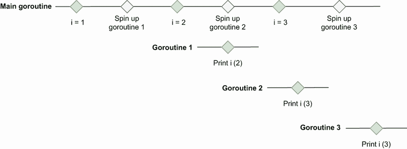

图 9.1 go routines 访问一个不固定但随时间变化的`i`变量。

如果我们想让每个闭包在创建 goroutine 时访问`i`的值，有什么解决方案？如果我们想继续使用闭包，第一个选项包括创建一个新变量:

```go
for _, i := range s {
    val := i            // ❶
    go func() {
        fmt.Print(val)
    }()
}
```

❶为每次迭代创建一个局部变量

为什么这段代码会起作用？在每次迭代中，我们创建一个新的局部变量`val`。该变量在创建 goroutine 之前捕获`i`的当前值。因此，当每个闭包 goroutine 执行 print 语句时，它会使用预期的值。这段代码打印`123`(同样，没有特别的顺序)。

第二个选项不再依赖于闭包，而是使用一个实际的函数:

```go
for _, i := range s {
    go func(val int) {     // ❶
        fmt.Print(val)
    }(i)                   // ❷
}
```

❶执行一个以整数为参数的函数

❷调用这个函数并传递 I 的当前值

我们仍然在新的 a goroutine 中执行匿名函数(例如，我们不运行`go f(i)`)，但这一次它不是闭包。该函数没有从其主体外部引用`val`作为变量；`val`现在是功能输入的一部分。通过这样做，我们在每次迭代中修正了`i`，并使我们的应用程序按预期工作。

我们必须小心 goroutines 和循环变量。如果 goroutine 是一个访问从其主体外部声明的迭代变量的闭包，那就有问题了。我们可以通过创建一个局部变量(例如，我们已经看到在执行 goroutine 之前使用`val := i`)或者使函数不再是一个闭包来修复它。两种选择都可行，我们不应该偏向其中一种。一些开发人员可能会发现闭包方法更方便，而其他人可能会发现函数方法更具表现力。

在多个通道上使用`select`语句会发生什么？让我们找出答案。

## 9.4 #64:使用选择和通道预期确定性行为

Go 开发人员在使用通道时犯的一个常见错误是对`select`如何使用多个通道做出错误的假设。错误的假设会导致难以识别和重现的细微错误。

假设我们想要实现一个需要从两个通道接收数据的 goroutine:

*   `messageCh`为待处理的新消息。

*   `disconnectCh`接收传达断线的通知。在这种情况下，我们希望从父函数返回。

这两个通道，我们要优先考虑`messageCh`。例如，如果发生断开连接，我们希望在返回之前确保我们已经收到了所有的消息。

我们可以决定这样处理优先级:

```go
for {
    select {                         // ❶
    case v := <-messageCh:           // ❷
        fmt.Println(v)
    case <-disconnectCh:             // ❸
        fmt.Println("disconnection, return")
        return
    }
}
```

❶使用 select 语句从多个通道接收

❷收到新消息

❸断电

我们使用`select`从多个通道接收。因为我们想要区分`messageCh`的优先级，我们可以假设我们应该首先编写`messageCh`案例，然后是`disconnectCh`案例。但是这些代码真的有用吗？让我们通过编写一个发送 10 条消息然后发送一个断开通知的伪生产者 goroutine 来尝试一下:

```go
for i := 0; i < 10; i++ {
    messageCh <- i
}
disconnectCh <- struct{}{}
```

如果我们运行这个例子，如果`messageCh`被缓冲，这里是一个可能的输出:

```go
0
1
2
3
4
disconnection, return
```

我们没有收到这 10 条信息，而是收到了其中的 5 条。原因是什么？它在于规范的多通道的`select`语句（[`go.dev/ref/spec`](https://go.dev/ref/spec)）:

如果一个或多个通信可以进行，则通过统一的伪随机选择来选择可以进行的单个通信。

与`switch`语句不同，在语句中，第一个匹配的案例获胜，如果有多个选项，则`select`语句随机选择。

这种行为乍一看可能很奇怪，但有一个很好的理由:防止可能的饥饿。假设选择的第一个可能的通信是基于源顺序的。在这种情况下，我们可能会陷入这样一种情况，例如，由于发送者速度快，我们只能从一个通道接收。为了防止这种情况，语言设计者决定使用随机选择。

回到我们的例子，即使`case` `v` `:=` `<-messageCh`在源代码顺序中排在第一位，如果`messageCh`和`disconnectCh`中都有消息，也不能保证哪种情况会被选中。因此，这个例子的行为是不确定的。我们可能会收到 0 条、5 条或 10 条消息。

如何才能克服这种情况？如果我们想在断线情况下返回之前接收所有消息，有不同的可能性。

如果只有一个制片人，我们有两个选择:

*   使`messageCh`成为非缓冲通道，而不是缓冲通道。因为发送方 goroutine 阻塞，直到接收方 goroutine 准备好，所以这种方法保证了在从`disconnectCh`断开连接之前，接收到来自`messageCh`的所有消息。

*   用单通道代替双通道。例如，我们可以定义一个`struct`来传递一个新消息或者一个断开。通道保证发送消息的顺序与接收消息的顺序相同，因此我们可以确保最后接收到断开连接。

如果我们遇到有多个生产者 goroutines 的情况，可能无法保证哪一个先写。因此，无论我们有一个无缓冲的`messageCh`通道还是一个单一的通道，都会导致生产者之间的竞争。在这种情况下，我们可以实施以下解决方案:

1.  从`messageCh`或`disconnectCh`接收。

2.  如果接收到断开连接

    *   阅读`messageCh`中所有已有的信息，如果有的话。
    *   然后返回。

以下是解决方案:

```go
for {
    select {
    case v := <-messageCh:
        fmt.Println(v)
    case <-disconnectCh:
        for {                          // ❶
            select {
            case v := <-messageCh:     // ❷
                fmt.Println(v)
            default:                   // ❸
                fmt.Println("disconnection, return")
                return
            }
        }
    }
}
```

❶内部 for/select

❷阅读剩下的信息

然后❸回来了

该解决方案使用带有两个外壳的内部`for/select`:一个在`messageCh`上，一个在`default`外壳上。在中使用`default`，只有当其他情况都不匹配时，才选择`select`语句。在这种情况下，这意味着我们只有在收到了`messageCh`中所有剩余的消息后才会返回。

让我们来看一个代码如何工作的例子。我们将考虑这样的情况，在`messageCh`中有两个消息，在`disconnectCh`中有一个断开，如图 9.2 所示。

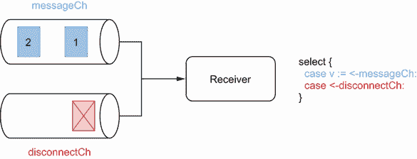

图 9.2 初始状态

在这种情况下，正如我们已经说过的，`select`随机选择一种情况或另一种情况。假设`select`选择第二种情况；参见图 9.3。

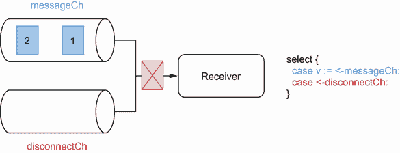

图 9.3 接收断开连接

因此，我们接收到断开连接并进入内部`select`(图 9.4)。这里，只要消息还在`messageCh`中，`select`将总是优先于`default`(图 9.5)。

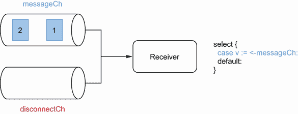

图 9.4 内部`select`

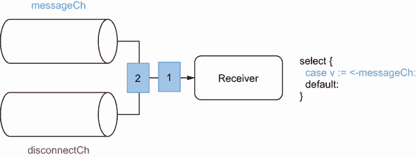

图 9.5 接收剩余消息

一旦我们收到来自`messageCh`的所有消息，`select`不会阻塞并选择`default`的情况(图 9.6)。因此，我们返回并阻止 goroutine。

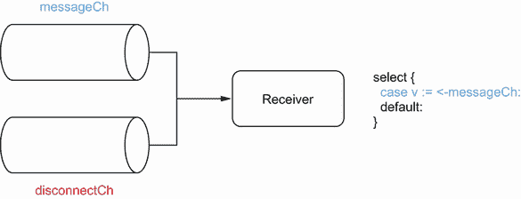

图 9.6 默认情况

这是一种确保我们通过多个通道上的接收器从一个通道接收所有剩余消息的方法。当然，如果在 goroutine 返回后发送了一个`messageCh`(例如，如果我们有多个生产者 go routine)，我们将错过这个消息。

当使用多通道的`select`时，我们必须记住，如果有多个选项，源顺序中的第一种情况不会自动胜出。相反，Go 随机选择，所以不能保证哪个选项会被选中。为了克服这种行为，在单个生产者 goroutine 的情况下，我们可以使用无缓冲通道或单个通道。在多个生产者 goroutines 的情况下，我们可以使用内部选择和`default`来处理优先级。

下一节讨论一种常见的通道类型:通知通道。

## 9.5 #65:不使用通知通道

信道是一种通过信令进行跨例程通信的机制。信号可以有数据，也可以没有数据。但是对于 Go 程序员来说，如何处理后一种情况并不总是那么简单。

我们来看一个具体的例子。我们将创建一个通道，当某个连接断开时，它会通知我们。一种想法是将它作为一个`chan bool`来处理:

```go
disconnectCh := make(chan bool)
```

现在，假设我们与一个为我们提供这样一个通道的 API 进行交互。因为这是一个布尔通道，我们可以接收`true`或`false`消息。大概很清楚`true`传达的是什么。但是`false`是什么意思呢？是不是说明我们没有断线？在这种情况下，我们收到这种信号的频率有多高？是不是意味着我们又重新联系上了？

我们应该期待收到`false`吗？也许我们应该只期待收到`true`消息。如果是这样的话，意味着我们不需要特定的值来传达一些信息，我们需要一个没有数据的*通道*。惯用的处理方式是一个空的结构的通道:`chan struct{}`。

在 Go 中，空结构是没有任何字段的结构。无论架构如何，它都不占用任何字节的存储空间，我们可以使用`unsafe.Sizeof`来验证这一点:

```go
var s struct{}
fmt.Println(unsafe.Sizeof(s))
0
```

注意为什么不用空接口(`var` `i` `interface{}`)？因为空接口不是免费的；它在 32 位架构上占用 8 个字节，在 64 位架构上占用 16 个字节。

一个空的结构是一个事实上的标准来表达没有意义。例如，如果我们需要一个散列集合结构(唯一元素的集合)，我们应该使用一个空结构作为值:`map[K]struct{}`。

应用于通道，如果我们想要创建一个通道来发送没有数据的通知，在 Go 中这样做的合适方法是一个`chan` `struct{}`。空结构通道的一个最著名的应用是 Go 上下文，我们将在本章中讨论。

通道可以有数据，也可以没有数据。如果我们想设计一个关于 Go 标准的惯用 API，让我们记住没有数据的通道应该用a`chan`T8】类型来表示。这样，它向接收者阐明了他们不应该从信息的内容中期待任何意义——仅仅是他们已经收到信息的事实。在 Go 中，这样的通道称为*通知通道*。

下一节将讨论 Go 如何处理零通道以及使用它们的基本原理。T19】

## 9.6 #66:不使用零通道

在使用 Go 和通道时，一个常见的错误是忘记了零通道有时是有帮助的。那么什么是零通道，我们为什么要关心它们呢？这是本节的范围。

让我们从创建一个 nil 通道并等待接收消息的 goroutine 开始。这段代码应该做什么？

```go
var ch chan int     // ❶
<-ch
```

❶零通道

`ch`是`chan int`型。通道的零值为零，`ch`为`nil`。goroutine 不会惊慌；但是，会永远屏蔽。

如果我们向零通道发送消息，原理是相同的。这条路永远不通:

```go
var ch chan int
ch <- 0
```

那么 Go 允许从 nil 通道接收消息或者向 nil 通道发送消息的目的是什么呢？我们将用一个具体的例子来讨论这个问题。

我们将实现一个`func` `merge(ch1,` `ch2` `<-chan` `int)` `<-chan int`函数来将两个通道合并成一个通道。通过合并它们(参见图 9.7)，我们的意思是在`ch1`或`ch2`中接收的每个消息都将被发送到返回的通道。

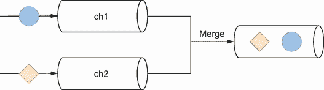

图 9.7 将两个通道合并为一个

在GO中如何做到这一点？让我们首先编写一个简单的实现，它启动一个 goroutine 并从两个通道接收数据(得到的通道将是一个包含一个元素的缓冲通道):

```go
func merge(ch1, ch2 <-chan int) <-chan int {
    ch := make(chan int, 1)

    go func() {
        for v := range ch1 {    // ❶
            ch <- v
        }
        for v := range ch2 {    // ❷
            ch <- v
        }
        close(ch)
    }()

    return ch
}
```

❶从 ch1 接收并发布到合并的通道

❷从 ch2 接收并发布到合并的通道

在另一个 goroutine 中，我们从两个通道接收信息，每条信息最终都在`ch`中发布。

这个第一个版本的主要问题是我们从`ch1`接收，然后从`ch2`接收。这意味着在`ch1`关闭之前，我们不会收到来自`ch2`的信息。这不符合我们的用例，因为`ch1`可能会永远打开，所以我们希望同时从两个通道接收。

让我们使用`select`编写一个带有并发接收者的改进版本:

```go
func merge(ch1, ch2 <-chan int) <-chan int {
    ch := make(chan int, 1)

    go func() {
        for {
            select {          // ❶
            case v := <-ch1:
                ch <- v
            case v := <-ch2:
                ch <- v
            }
        }
        close(ch)
    }()

    return ch
}
```

❶同时接收 ch1 和 ch2

`select`语句让一个 goroutine 同时等待多个操作。因为我们将它包装在一个`for`循环中，所以我们应该重复地从一个或另一个通道接收消息，对吗？但是这些代码真的有用吗？

一个问题是`close(ch)`语句是不可达的。当通道关闭时，使用`range`操作符在通道上循环中断。然而，当`ch1`或`ch2`关闭时，我们实现`for` / `select`的方式并不适用。更糟糕的是，如果在某个点`ch1`或`ch2`关闭，当记录值时，合并通道的接收器将接收到以下内容:

```go
received: 0
received: 0
received: 0
received: 0
received: 0
...
```

所以接收器会重复接收一个等于零的整数。为什么？从封闭通道接收是一种非阻塞操作:

```go
ch1 := make(chan int)
close(ch1)
fmt.Print(<-ch1, <-ch1)
```

尽管我们可能认为这段代码会死机或阻塞，但是它会运行并打印出`0 0`。我们在这里捕获的是闭包事件，而不是实际的消息。要检查我们是否收到消息或结束信号，我们必须这样做:

```go
ch1 := make(chan int)
close(ch1)
v, open := <-ch1        // ❶
fmt.Print(v, open)
```

无论通道是否打开，❶都会指定打开

使用`open`布尔值，我们现在可以看到`ch1`是否仍然打开:

```go
0 false
```

同时，我们也将`0`赋给`v`，因为它是一个整数的零值。

让我们回到我们的第二个解决方案。我们说`ch1`关了不太好用；例如，因为`select`案例是`case v` `:=` `<-ch1`，所以我们会一直输入这个案例，并向合并后的通道发布一个零整数。

让我们后退一步，看看处理这个问题的最佳方法是什么(见图 9.8)。我们必须从两个通道接收。那么，要么

*   的`ch1`是先关闭的，所以我们要从`ch2`开始接收，直到它关闭。

*   `ch2`先关闭，所以我们要从`ch1`接收，直到它关闭。

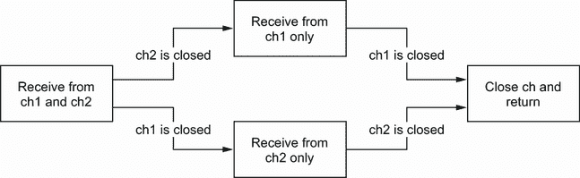

图 9.8 根据先关闭`ch1`还是先关闭`ch2`来处理不同情况

如何在 Go 中实现这一点？让我们编写一个版本，就像我们可能使用状态机方法和布尔函数所做的那样:

```go
func merge(ch1, ch2 <-chan int) <-chan int {
    ch := make(chan int, 1)
    ch1Closed := false
    ch2Closed := false

    go func() {
        for {
            select {
            case v, open := <-ch1:
                if !open {               // ❶
                    ch1Closed = true
                    break
                }
                ch <- v
            case v, open := <-ch2:
                if !open {               // ❷
                    ch2Closed = true
                    break
                }
                ch <- v
            }

            if ch1Closed && ch2Closed {  // ❸
                close(ch)
                return
            }
        }
    }()

    return ch
}
```

❶处理 ch1 是否关闭

❷处理 ch2 是否关闭

如果两个通道都关闭，❸将关闭并返回

我们定义了两个布尔值`ch1Closed`和`ch2Closed`。一旦我们从一个通道接收到一个消息，我们就检查它是否是一个关闭信号。如果是，我们通过将通道标记为关闭来处理(例如，`ch1Closed` `=` `true`)。两个通道都关闭后，我们关闭合并的通道并停止 goroutine。

这段代码除了开始变得复杂之外，还有什么问题呢？有一个主要问题:当两个通道中的一个关闭时，`for`循环将充当一个忙等待循环，这意味着即使在另一个通道中没有接收到新消息，它也将继续循环。在我们的例子中，我们必须记住语句的行为。假设`ch1`关闭(所以我们在这里不会收到任何新消息)；当我们再次到达`select`时，它将等待以下三个条件之一发生:

*   `ch1`是封闭的。

*   `ch2`有新消息。

*   `ch2`关闭。

第一个条件`ch1`是关闭的，将永远有效。因此，只要我们在`ch2`中没有收到消息，并且这个通道没有关闭，我们将继续循环第一个案例。这将导致浪费 CPU 周期，必须避免。因此，我们的解决方案不可行。

我们可以尝试增强状态机部分，并在每种情况下实现子`for/select`循环。但是这将使我们的代码更加复杂和难以理解。

是时候回到零通道了。正如我们提到的，从零通道接收将永远阻塞。在我们的解决方案中使用这个想法怎么样？我们将把这个通道赋值为 nil，而不是在一个通道关闭后设置一个布尔值。让我们写出最终版本:

```go
func merge(ch1, ch2 <-chan int) <-chan int {
    ch := make(chan int, 1)

    go func() {
        for ch1 != nil || ch2 != nil {    // ❶
            select {
            case v, open := <-ch1:
                if !open {
                    ch1 = nil             // ❷
                    break
                }
                ch <- v
            case v, open := <-ch2:
                if !open {
                    ch2 = nil             // ❸
                    break
                }
                ch <- v
            }
        }
        close(ch)
    }()

    return ch
}
```

如果至少有一个通道不为零，❶将继续

一旦关闭，❷将 ch1 分配给零通道

一旦关闭，❸将 ch2 分配给零通道

首先，只要至少一个通道仍然打开，我们就循环。然后，例如，如果`ch1`关闭，我们将`ch1`赋值为零。因此，在下一次循环迭代期间，`select`语句将只等待两个条件:

*   `ch2`有新消息。

*   `ch2`关闭。

`ch1`不再是等式的一部分，因为它是一个零通道。同时，我们为`ch2`保留相同的逻辑，并在它关闭后将其赋值为 nil。最后，当两个通道都关闭时，我们关闭合并的通道并返回。图 9.9 显示了这种实现的模型。

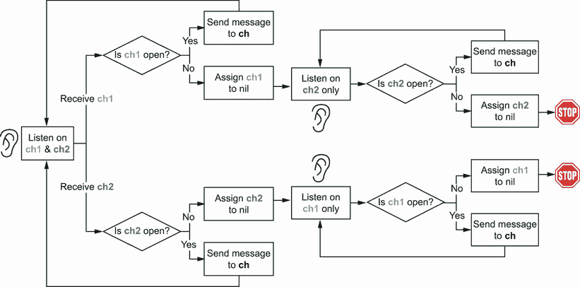

图 9.9 从两个通道接收。如果一个是关闭的，我们把它赋值为 0，这样我们只从一个通道接收。

这是我们一直在等待的实现。我们涵盖了所有不同的情况，并且不需要会浪费 CPU 周期的繁忙循环。

总之，我们已经看到，等待或发送到一个零通道是一个阻塞行为，这种行为是有用的。正如我们在合并两个通道的例子中所看到的，我们可以使用零通道来实现一个优雅的状态机，该状态机将从一个`select`语句中移除一个 case。让我们记住这个想法:nil 通道在某些情况下是有用的，在处理并发代码时应该成为 Go 开发者工具集的一部分。

在下一节中，我们将讨论创建通道时应设置的大小。

## 9.7 #67:对通道规模感到困惑

当我们使用`make`内置函数创建通道时，通道可以是无缓冲的，也可以是缓冲的。与这个话题相关，有两个错误经常发生:不知道什么时候使用这个或那个；如果我们使用缓冲通道，应该使用多大的缓冲通道。让我们检查一下这几点。

首先，让我们记住核心概念。无缓冲通道是没有任何容量的通道*。它可以通过省略尺寸或提供一个`0`尺寸来创建:*

```go
ch1 := make(chan int)
ch2 := make(chan int, 0)
```

使用无缓冲通道(有时称为同步通道)，发送方将阻塞，直到接收方从该通道接收到数据。

相反，缓冲通道有容量，必须创建大于或等于`1`的大小:

```go
ch3 := make(chan int, 1)
```

使用缓冲通道，发送方可以在通道未满时发送消息。一旦信道满了，它就会阻塞，直到接收者或路由器收到消息。例如:

```go
ch3 := make(chan int, 1)
ch3 <-1                   // ❶
ch3 <-2                   // ❷
```

❶无阻塞

❷阻塞

第一个发送没有阻塞，而第二个阻塞了，因为这个阶段通道已满。

让我们后退一步，讨论这两种通道类型之间的根本区别。通道是一种并发抽象，用于支持 goroutines 之间的通信。但是同步呢？在并发中，同步意味着我们可以保证多个 goroutines 在某个时刻处于已知状态。例如，互斥锁提供同步，因为它确保同一时间只有一个 goroutine 在临界区。关于通道:

*   无缓冲通道支持同步。我们保证两个 goroutines 将处于已知状态:一个接收消息，另一个发送消息。

*   缓冲通道不提供任何强同步。事实上，如果通道未满，生产者 goroutine 可以发送消息，然后继续执行。唯一的保证是 goroutine 在消息发送之前不会收到消息。但这只是一个保证，因为因果关系(你不喝你的咖啡之前，你准备好了)。

牢记这一基本区别至关重要。两种通道类型都支持通信，但只有一种提供同步。如果我们需要同步，我们必须使用无缓冲通道。无缓冲通道也可能更容易推理:缓冲通道可能会导致不明显的死锁，而无缓冲通道会立即显现出来。

在其他情况下，无缓冲通道更可取:例如，在通知通道的情况下，通知是通过通道关闭(`close(ch)`)来处理的。这里，使用缓冲通道不会带来任何好处。

但是如果我们需要一个缓冲通道呢？我们应该提供多大的尺寸？我们应该为缓冲通道使用的默认值是它的最小值:`1`。因此，我们可以从这个角度来处理这个问题:有什么好的理由*不*使用`1`的值吗？这里列出了我们应该使用另一种尺寸的可能情况:

*   使用类似工作器池的模式，意味着旋转固定数量的 goroutines，这些 goroutines 需要将数据发送到共享通道。在这种情况下，我们可以将通道大小与创建的 goroutines 的数量联系起来。

*   使用通道进行限速问题时。例如，如果我们需要通过限制请求数量来加强资源利用率，我们应该根据限制来设置通道大小。

如果我们在这些情况之外，使用不同的通道尺寸应该谨慎。使用幻数设置通道大小的代码库非常常见:

```go
ch := make(chan int, 40)
```

为什么是`40`？有什么道理？为什么不是`50`甚至`1000`？设置这样的值应该有充分的理由。也许这是在基准测试或性能测试之后决定的。在许多情况下，对这样一个值的基本原理进行注释可能是一个好主意。

让我们记住，决定一个准确的队列大小并不是一个简单的问题。首先，这是 CPU 和内存之间的平衡。值越小，我们面临的 CPU 争用就越多。但是值越大，需要分配的内存就越多。

另一个需要考虑的问题是 2011 年关于 LMAX Disruptor 的白皮书中提到的问题(马丁·汤普森等人； [`lmax-exchange.github.io/disruptor/files/Disruptor-1.0.pdf`](https://lmax-exchange.github.io/disruptor/files/Disruptor-1.0.pdf) ):

由于消费者和生产者之间的速度差异，队列通常总是接近满或接近空。他们很少在一个平衡的中间地带运作，在那里生产和消费的比率是势均力敌的。

因此，很难找到一个稳定准确的通道大小，这意味着一个不会导致太多争用或内存分配浪费的准确值。

这就是为什么，除了所描述的情况，通常最好从默认的通道大小`1`开始。例如，当不确定时，我们仍然可以使用基准来度量它。

与编程中的几乎任何主题一样，可以发现异常。因此，这一节的目标不是详尽无遗，而是给出创建通道时应该使用什么尺寸的指导。同步是无缓冲通道而非缓冲通道的保证。此外，如果我们需要一个缓冲通道，我们应该记住使用一个作为通道大小的默认值。我们应该通过精确的过程谨慎地决定使用另一个值，并且应该对基本原理进行注释。最后但并非最不重要的一点是，我们要记住，选择缓冲通道也可能导致不明显的死锁，而使用无缓冲通道更容易发现这种死锁。

在下一节中，我们将讨论处理字符串格式时可能出现的副作用。

## 9.8 #68:忘记字符串格式化可能带来的副作用

格式化字符串是开发者的常用操作，无论是返回错误还是记录消息。然而，在并发应用程序中工作时，很容易忘记字符串格式的潜在副作用。本节将看到两个具体的例子:一个来自 etcd 存储库，导致数据竞争，另一个导致死锁情况。

### etcd 数据竞争

etcd 是在 Go 中实现的分布式键值存储。它被用于许多项目，包括 Kubernetes，来存储所有的集群数据。它提供了与集群交互的 API。例如，`Watcher`接口用于接收数据变更通知:

```go
type Watcher interface {
    // Watch watches on a key or prefix. The watched events will be returned
    // through the returned channel.
    // ...
    Watch(ctx context.Context, key string, opts ...OpOption) WatchChan
    Close() error
}
```

API 依赖于 gRPC 流。如果你不熟悉它，它是一种在客户机和服务器之间不断交换数据的技术。服务器必须维护使用该功能的所有客户端的列表。因此，`Watcher`接口由包含所有活动流的`watcher`结构实现:

```go
type watcher struct {
    // ...

    // streams hold all the active gRPC streams keyed by ctx value.
    streams map[string]*watchGrpcStream
}
```

该映射的键基于调用`Watch`方法时提供的上下文:

```go
func (w *watcher) Watch(ctx context.Context, key string,
    opts ...OpOption) WatchChan {
    // ...
    ctxKey := fmt.Sprintf("%v", ctx)       // ❶
    // ...
    wgs := w.streams[ctxKey]
    // ...
```

❶根据提供的上下文格式化映射键

`ctxKey`是映射的键，由客户端提供的上下文格式化。当格式化由值(`context.WithValue`)创建的上下文中的字符串时，Go 将读取该上下文中的所有值。在这种情况下，etcd 开发人员发现提供给`Watch`的上下文在某些条件下是包含可变值(例如，指向结构的指针)的上下文。他们发现了一种情况，其中一个 goroutine 正在更新一个上下文值，而另一个正在执行`Watch`，因此读取这个上下文中的所有值。这导致了一场数据竞争。

修复（[`github.com/etcd-io/etcd/pull/7816`](https://github.com/etcd-io/etcd/pull/7816)）是不依赖`fmt.Sprintf`来格式化映射的键，以防止遍历和读取上下文中的包装值链。相反，解决方案是实现一个定制的`streamKeyFromCtx`函数，从特定的不可变的上下文值中提取键。

注意:上下文中潜在的可变值会引入额外的复杂性，以防止数据竞争。这可能是一个需要仔细考虑的设计决策。

这个例子说明了我们必须小心并发应用程序中字符串格式化的副作用——在这个例子中，是数据竞争。在下面的例子中，我们将看到导致死锁情况的副作用。

### 僵局

假设我们必须处理一个可以并发访问的`Customer`结构。我们将使用`sync.RWMutex`来保护访问，无论是读还是写。我们将实现一个`UpdateAge`方法来更新客户的年龄，并检查年龄是否为正数。同时，我们将实现和`Stringer`接口。

你能看出这段代码中的问题是什么吗？一个`Customer`结构公开了一个`UpdateAge`方法，而实现了`fmt.Stringer`接口。

```go
type Customer struct {
    mutex sync.RWMutex                                    // ❶
    id    string
    age   int
}

func (c *Customer) UpdateAge(age int) error {
    c.mutex.Lock()                                        // ❷
    defer c.mutex.Unlock()

    if age < 0 {                                          // ❸
        return fmt.Errorf("age should be positive for customer %v", c)
    }

    c.age = age
    return nil
}

func (c *Customer) String() string {
    c.mutex.RLock()                                       ❹
    defer c.mutex.RUnlock()
    return fmt.Sprintf("id %s, age %d", c.id, c.age)
}
```

❶使用同步。RWMutex 保护并发访问

❷锁定和推迟解锁，因为我们更新客户

如果年龄为负，❸将返回错误

❹锁定和推迟解锁，因为我们阅读客户

这里的问题可能并不简单。如果提供的`age`是负的，我们返回一个错误。因为错误被格式化了，使用接收者上的`%s`指令，它将调用`String`方法来格式化`Customer`。但是因为`UpdateAge`已经获得了互斥锁，所以`String`方法将无法获得互斥锁(见图 9.10)。

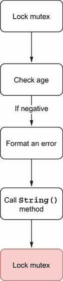

图 9.10 如果`age`为负，执行`UpdateAge`

因此，这会导致死锁情况。如果所有的 goroutines 也睡着了，就会导致恐慌:

```go
fatal error: all goroutines are asleep - deadlock!

goroutine 1 [semacquire]:
sync.runtime_SemacquireMutex(0xc00009818c, 0x10b7d00, 0x0)
...
```

这种情况应该怎么处理？首先，它说明了单元测试的重要性。在这种情况下，我们可能会认为创建一个负年龄的测试是不值得的，因为逻辑非常简单。然而，没有适当的测试覆盖，我们可能会错过这个问题。

这里可以改进的一点是限制互斥锁的范围。在`UpdateAge`中，我们首先获取锁并检查输入是否有效。我们应该反其道而行之:首先检查输入，如果输入有效，就获取锁。这有利于减少潜在的副作用，但也会对性能产生影响——仅在需要时才获取锁，而不是在此之前:

```go
func (c *Customer) UpdateAge(age int) error {
    if age < 0 {
        return fmt.Errorf("age should be positive for customer %v", c)
    }

    c.mutex.Lock()          // ❶
    defer c.mutex.Unlock()

    c.age = age
    return nil
}
```

只有当输入被验证后，❶才会锁定互斥体

在我们的例子中，只有在检查了年龄之后才锁定互斥体可以避免死锁情况。如果年龄为负，则调用`String`而不事先锁定互斥体。

但是，在某些情况下，限制互斥锁的范围并不简单，也不可能。在这种情况下，我们必须非常小心字符串格式。也许我们想调用另一个不试图获取互斥体的函数，或者我们只想改变我们格式化错误的方式，这样它就不会调用的`String`方法。例如，下面的代码不会导致死锁，因为我们只在直接访问`id`字段时记录客户 ID:

```go
func (c *Customer) UpdateAge(age int) error {
    c.mutex.Lock()
    defer c.mutex.Unlock()

    if age < 0 {
        return fmt.Errorf("age should be positive for customer id %s", c.id)
    }

    c.age = age
    return nil
}
```

我们已经看到了两个具体的例子，一个格式化上下文中的键，另一个返回格式化结构的错误。在这两种情况下，格式化字符串都会导致一个问题:数据竞争和死锁情况。因此，在并发应用程序中，我们应该对字符串格式化可能产生的副作用保持谨慎。

下一节讨论并发调用`append`时的行为。

## 9.9 #69:使用 append 创建数据竞争

我们之前提到过什么是数据竞争，有哪些影响。现在，让我们看看片，以及使用`append`向片添加元素是否是无数据竞争的。剧透？看情况。

在下面的例子中，我们将初始化一个切片并创建两个 goroutines，这两个 goroutines 将使用`append`创建一个带有附加元素的新切片:

```go
s := make([]int, 1)

go func() {                // ❶
    s1 := append(s, 1)
    fmt.Println(s1)
}()

go func() {                // ❷
    s2 := append(s, 1)
    fmt.Println(s2)
}()
```

❶在一个新的 goroutine 中，在 s 上追加了一个新元素

❷相同

你相信这个例子有数据竞争吗？答案是否定的。

我们必须回忆一下第 3 章中描述的一些切片基础知识。切片由数组支持，有两个属性:长度和容量。长度是切片中可用元素的数量，而容量是后备数组中元素的总数。当我们使用`append`时，行为取决于切片是否已满(长度==容量)。如果是，Go 运行时创建一个新的后备数组来添加新元素；否则，运行库会将其添加到现有的后备数组中。

在这个例子中，我们用`make([]int,` `1)`创建一个切片。该代码创建一个长度为一、容量为一的切片。因此，因为切片已满，所以在每个 goroutine 中使用`append`会返回一个由新数组支持的切片。它不会改变现有的数组；因此，它不会导致数据竞争。

现在，让我们运行同一个例子，只是在初始化`s`的方式上稍作改变。我们不是创建长度为`1`的切片，而是创建长度为`0`但容量为`1`的切片:

```go
s := make([]int, 0, 1)      // ❶

// Same
```

❶改变了切片初始化的方式

这个新例子怎么样？是否包含数据竞争？答案是肯定的:

```go
==================
WARNING: DATA RACE
Write at 0x00c00009e080 by goroutine 10:
  ...

Previous write at 0x00c00009e080 by goroutine 9:
  ...
==================
```

我们用`make([]int,` `0,` `1)`创建一个切片。因此，数组没有满。两个 goroutines 都试图更新后备数组的同一个索引(索引 1)，这是一种数据竞争。

如果我们希望两个 goroutines 都在一个包含初始元素`s`和一个额外元素的片上工作，我们如何防止数据竞争？一种解决方案是创建`s`的副本:

```go
s := make([]int, 0, 1)

go func() {
    sCopy := make([]int, len(s), cap(s))
    copy(sCopy, s)                          // ❶

    s1 := append(sCopy, 1)
    fmt.Println(s1)
}()

go func() {
    sCopy := make([]int, len(s), cap(s))
    copy(sCopy, s)                          // ❷

    s2 := append(sCopy, 1)
    fmt.Println(s2)
}()
```

❶制作了一个拷贝，并在拷贝的切片上使用了 append

❷相同

两个 goroutines 都会制作切片的副本。然后他们在切片副本上使用`append`，而不是原始切片。这防止了数据竞争，因为两个 goroutines 都处理孤立的数据。

切片和地图的数据竞争

数据竞争对切片和地图的影响有多大？当我们有多个 goroutines 时，以下为真:

*   用至少一个 goroutine 更新值来访问同一个片索引是一种数据竞争。goroutines 访问相同的内存位置。

*   不管操作如何，访问不同的片索引不是数据竞争；不同的索引意味着不同的内存位置。

*   用至少一个 goroutine 更新来访问同一个映射(不管它是相同的还是不同的键)是一种数据竞争。为什么这与切片数据结构不同？正如我们在第 3 章中提到的，map 是一个桶数组，每个桶是一个指向键值对数组的指针。哈希算法用于确定桶的数组索引。因为该算法在 map 初始化期间包含一些随机性，所以一次执行可能导致相同的数组索引，而另一次执行可能不会。竞争检测器通过发出警告来处理这种情况，而不管实际的数据竞争是否发生。

当在并发上下文中使用片时，我们必须记住在片上使用`append`并不总是无竞争的。根据切片以及切片是否已满，行为会发生变化。如果切片已满，`append`是无竞争的。否则，多个 goroutines 可能会竞争更新同一个数组索引，从而导致数据竞争。

一般来说，我们不应该根据片是否已满而有不同的实现。我们应该考虑到在并发应用程序中的共享片上使用`append`会导致数据竞争。因此，应该避免使用它。

现在，让我们讨论一个切片和映射上不精确互斥锁的常见错误。T19】

## 9.10 #70:对切片和贴图不正确地使用互斥

在数据可变和共享的并发环境中工作时，我们经常需要使用互斥体来实现对数据结构的保护访问。一个常见的错误是在处理切片和贴图时不准确地使用互斥。让我们看一个具体的例子，了解潜在的问题。

我们将实现一个用于处理客户余额缓存的`Cache`结构。该结构将包含每个客户 ID 的余额映射和一个互斥体，以保护并发访问:

```go
type Cache struct {
    mu       sync.RWMutex
    balances map[string]float64
}
```

注意这个解决方案使用一个`sync.RWMutex`来允许多个读者，只要没有作者。

接下来，我们添加一个`AddBalance`方法来改变`balances`图。变异是在一个临界区中完成的(在互斥锁和互斥解锁内):

```go
func (c *Cache) AddBalance(id string, balance float64) {
    c.mu.Lock()
    c.balances[id] = balance
    c.mu.Unlock()
}
```

同时，我们必须实现一个方法来计算所有客户的平均余额。一种想法是这样处理最小临界区:

```go
func (c *Cache) AverageBalance() float64 {
    c.mu.RLock()
    balances := c.balances                  // ❶
    c.mu.RUnlock()

    sum := 0.
    for _, balance := range balances {      // ❷
        sum += balance
    }
    return sum / float64(len(balances))
}
```

❶创建了余额图的副本

❷迭代临界区之外的副本

首先，我们创建一个映射到本地`balances`变量的副本。仅在临界区中进行复制，以迭代每个余额，并计算临界区之外的平均值。这个解决方案有效吗？

如果我们使用带有两个并发 goroutines 的`-race`标志运行测试，一个调用`AddBalance`(因此变异`balances`)，另一个调用`AverageBalance`，就会发生数据竞争。这里有什么问题？

在内部，映射是一个`runtime.hmap`结构，主要包含元数据(例如，计数器)和引用数据桶的指针。所以，`balances := c.balances`不会复制实际的数据。切片也是同样的原理:

```go
s1 := []int{1, 2, 3}
s2 := s1
s2[0] = 42
fmt.Println(s1)
```

即使我们修改了`s2`，打印`s1`也会返回`[42 2 3]`。原因是`s2 := s1`创建了一个新的切片:`s2`与`s1`有相同的长度和相同的容量，并由相同的数组支持。

回到我们的例子，我们给`balances`分配一个新的映射，引用与`c.balances`相同的数据桶。同时，两个 goroutines 对同一个数据集执行操作，其中一个对它进行了变异。因此，这是一场数据竞争。我们如何解决数据竞争？我们有两个选择。

如果迭代操作并不繁重(这里就是这种情况，因为我们执行增量操作)，我们应该保护整个函数:

```go
func (c *Cache) AverageBalance() float64 {
    c.mu.RLock()
    defer c.mu.RUnlock()       // ❶

    sum := 0.
    for _, balance := range c.balances {
        sum += balance
    }
    return sum / float64(len(c.balances))
}
```

函数返回时，❶解锁

临界区现在包含了整个函数，包括迭代。这可以防止数据竞争。

如果迭代操作不是轻量级的，另一个选择是处理数据的实际副本，并且只保护副本:

```go
func (c *Cache) AverageBalance() float64 {
    c.mu.RLock()
    m := make(map[string]float64, len(c.balances))     // ❶
    for k, v := range c.balances {
        m[k] = v
    }
    c.mu.RUnlock()

    sum := 0.
    for _, balance := range m {
        sum += balance
    }
    return sum / float64(len(m))
}
```

❶复制了这张地图

一旦我们完成了深层拷贝，我们就释放互斥体。迭代是在临界区之外的副本上完成的。

让我们考虑一下这个解决方案。我们必须在 map 值上迭代两次:一次是复制，一次是执行操作(这里是增量)。但关键部分只是地图副本。因此，当且仅当操作不是*快速*时，这种解决方案可能是一个很好的选择。例如，如果一个操作需要调用外部数据库，这个解决方案可能会更有效。在选择一个解决方案或另一个解决方案时，不可能定义一个阈值，因为选择取决于元素数量和结构的平均大小等因素。

总之，我们必须小心互斥锁的边界。在本节中，我们已经看到了为什么将一个现有的映射(或一个现有的片)分配给一个映射不足以防止数据竞争。无论是地图还是切片，新变量都由相同的数据集支持。有两种主要的解决方案可以防止这种情况:保护整个函数，或者处理实际数据的副本。在所有情况下，让我们在设计临界截面时保持谨慎，并确保准确定义边界。

现在让我们讨论一下使用`sync.WaitGroup`时的一个常见错误。T9】

## 9.11 #71:误用同步。等待组

`sync.WaitGroup`是一种等待`n`操作完成的机制；通常，我们使用它来等待`n`goroutines 完成。我们先回忆一下公开的 API 然后，我们将看到一个导致非确定性行为的常见错误。

可以用零值`sync.WaitGroup`创建一个等待组:

```go
wg := sync.WaitGroup{}
```

在内部，`sync.WaitGroup`保存默认初始化为`0`的内部计数器。我们可以使用`Add(int)`方法递增这个计数器，使用带有负值的`Done()`或`Add`递减它。如果我们想等待计数器等于`0`，我们必须使用阻塞的`Wait()`方法。

注意计数器不能为负，否则 goroutine 将会死机。

在下面的例子中，我们将初始化一个等待组，启动三个自动更新计数器的 goroutines，然后等待它们完成。我们希望等待这三个 goroutines 打印计数器的值(应该是`3`)。你能猜出这段代码是否有问题吗？

```go
wg := sync.WaitGroup{}
var v uint64

for i := 0; i < 3; i++ {
    go func() {                     // ❶
        wg.Add(1)                   // ❷
        atomic.AddUint64(&v, 1)     // ❸
        wg.Done()                   ❹
    }()
}

wg.Wait()                           ❺
fmt.Println(v)
```

❶创造了一个高卢廷

❷递增等待组计数器

❸原子地增加 v

❹递减等待组计数器

❺一直等到所有的 goroutines 都增加了 v 才打印它

如果我们运行这个例子，我们会得到一个不确定的值:代码可以打印从`0`到`3`的任何值。同样，如果我们启用了`-race`标志，Go 甚至会发生数据竞争。考虑到我们正在使用`sync/atomic`包来更新`v`，这怎么可能呢？这个代码有什么问题？

问题是`wg.Add(1)`是在新创建的 goroutine 中调用的，而不是在父 goroutine 中。因此，不能保证我们已经向等待组表明我们想在调用`wg.Wait()`之前等待三次 goroutines。

图 9.11 显示了代码打印`2`时的可能场景。在这个场景中，主 goroutine 旋转了三个 go routine。但是最后一个 goroutine 是在前两个 goroutine 已经调用了`wg.Done()`之后执行的，所以父 go routine 已经解锁。因此，在这种情况下，当主 goroutine 读取`v`时，它等于`2`。竞争检测器还可以检测对`v`的不安全访问。

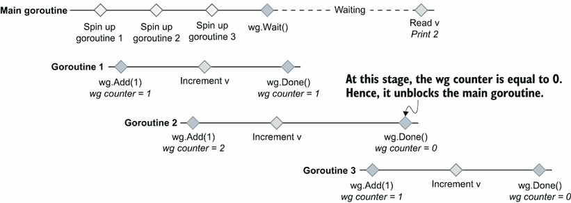

图 9.11 主 goroutine 已经解封后，最后一个 goroutine 调用`wg.Add(1)`。

在处理 goroutines 时，关键是要记住，没有同步，执行是不确定的。例如，以下代码可以打印`ab`或`ba`:

```go
go func() {
    fmt.Print("a")
}()
go func() {
    fmt.Print("b")
}()
```

两个 goroutines 都可以分配给不同的线程，不能保证哪个线程会先被执行。

CPU 有来使用*内存屏障*(也称为*内存屏障*)来确保顺序。Go 为实现内存栅栏提供了不同的同步技术:例如，`sync.WaitGroup`支持`wg.Add`和`wg.Wait`之间的先发生关系。

回到我们的例子，有两个选项来解决我们的问题。首先，我们可以用 3:

```go
wg := sync.WaitGroup{}
var v uint64

wg.Add(3)
for i := 0; i < 3; i++ {
    go func() {
        // ...
    }()
}

// ...
```

或者，第二，我们可以在每次循环迭代中调用`wg.Add`,然后旋转子 goroutines:

```go
wg := sync.WaitGroup{}
var v uint64

for i := 0; i < 3; i++ {
    wg.Add(1)
    go func() {
        // ...
    }()
}

// ...
```

两种解决方案都可以。如果我们想要最终设置给等待组计数器的值是预先知道的，那么第一个解决方案可以避免我们不得不多次调用`wg.Add`。然而，它需要确保在任何地方都使用相同的计数，以避免细微的错误。

让我们小心不要重现这种GO开发者常犯的错误。使用`sync.WaitGroup`时，`Add`操作必须在父 goroutine 中启动 goroutine 之前完成，而`Done`操作必须在 goroutine 中完成。

下面讨论的另一个原语`sync`包:`sync.Cond`。

## 9.12 #72:忘记同步。Cond

在`sync`包中的同步原语中，`sync.Cond`可能是使用和理解最少的。但是，它提供了我们用通道无法实现的功能。本节通过一个具体的例子来说明`sync.Cond`何时有用以及如何使用。

本节中的示例实现了一个捐赠目标机制:一个每当达到特定目标时就会发出警报的应用程序。我们将有一个 goroutine 负责增加余额(一个更新器 goroutine)。相反，其他 goroutines 将接收更新，并在达到特定目标时打印一条消息(监听器 goroutines)。例如，一个 goroutine 正在等待 10 美元的捐赠目标，而另一个正在等待 15 美元的捐赠目标。

第一个简单的解决方案是使用互斥。更新程序 goroutine 每秒增加一次余额。另一方面，监听器 goroutines 循环，直到达到它们的捐赠目标:

```go
type Donation struct {               // ❶
    mu             sync.RWMutex
    balance int
}
donation := &Donation{}

// Listener goroutines
f := func(goal int) {                // ❷
    donation.mu.RLock()
    for donation.balance < goal {    // ❸
        donation.mu.RUnlock()
        donation.mu.RLock()
    }
    fmt.Printf("$%d goal reached\n", donation.balance)
    donation.mu.RUnlock()
}
go f(10)
go f(15)

// Updater goroutine
go func() {
    for {                            ❹
        time.Sleep(time.Second)
        donation.mu.Lock()
        donation.balance++
        donation.mu.Unlock()
    }
}()
```

❶创建并实例化包含当前余额和互斥体的捐赠结构

❷创造了一个结局

❸检查目标是否达到

❹不断增加余额

我们使用互斥来保护对共享的`donation.balance`变量的访问。如果我们运行这个示例，它会像预期的那样工作:

```go
$10 goal reached
$15 goal reached
```

主要问题——也是使这种实现变得糟糕的原因——是繁忙循环。每个监听器 goroutine 一直循环，直到达到它的捐赠目标，这浪费了大量的 CPU 周期，并使 CPU 的使用量巨大。我们需要找到一个更好的解决方案。

让我们后退一步。每当平衡被更新时，我们必须找到一种方法从更新程序发出信号。如果我们考虑GO中的信令，就要考虑通道。因此，让我们尝试使用通道原语的另一个版本:

```go
type Donation struct {
    balance int
    ch      chan int                        // ❶
}

donation := &Donation{ch: make(chan int)}

// Listener goroutines
f := func(goal int) {
    for balance := range donation.ch {      // ❷
        if balance >= goal {
            fmt.Printf("$%d goal reached\n", balance)
            return
        }
    }
}
go f(10)
go f(15)

// Updater goroutine
for {
    time.Sleep(time.Second)
    donation.balance++
    donation.ch <- donation.balance         // ❸
}
```

❶更新捐赠，所以它包含一个通道

❷接收通道更新

每当余额更新时，❸都会发送一条消息

每个监听程序从一个共享的通道接收。与此同时，每当余额更新时，更新程序 goroutine 就会发送消息。但是，如果我们尝试一下这个解决方案，下面是一个可能的输出:

```go
$11 goal reached
$15 goal reached
```

当余额为 10 美元而不是 11 美元时，应该通知第一个 goroutine。发生了什么事？

发送到通道的消息只能由一个 goroutine 接收。在我们的例子中，如果第一个 goroutine 在第二个之前从通道接收，图 9.12 显示了可能发生的情况。

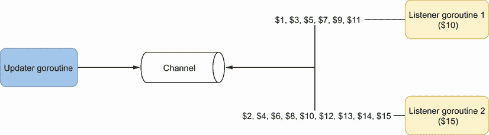

图 9.12 第一个 goroutine 接收$1 消息，然后第二个 goroutine 接收$2 消息，然后第一个 goroutine 接收$3 消息，依此类推。

从共享信道接收多个 goroutines 的默认分发模式是循环调度。如果一个 goroutine 没有准备好接收消息(没有在通道上处于等待状态)，它可能会改变；在这种情况下，Go 将消息分发到下一个可用的 goroutine。

每条消息都由一个单独的 goroutine 接收。因此，在这个例子中，第一个 goroutine 没有收到$10 消息，但是第二个收到了。只有一个通道关闭事件可以广播到多个 goroutines。但是这里我们不想关闭通道，因为那样的话更新程序 goroutine 就不能发送消息了。

在这种情况下使用通道还有另一个问题。只要达到了捐赠目标，听众就会回来。因此，更新程序 goroutine 必须知道所有侦听器何时停止接收到该通道的消息。否则，通道最终会变满，阻塞发送方。一个可能的解决方案是在组合中添加一个`sync.WaitGroup`，但是这样做会使解决方案更加复杂。

理想情况下，我们需要找到一种方法，每当余额更新到多个 goroutines 时，重复广播通知。好在 Go 有解:`sync.Cond`。我们先讨论理论；然后我们将看到如何使用这个原语解决我们的问题。

根据官方文档（[`pkg.go.dev/sync`](https://pkg.go.dev/sync)），

Cond 实现了一个条件变量，即等待或宣布事件发生的 goroutines 的集合点。

条件变量是等待特定条件的线程(这里是 goroutines)的容器。在我们的例子中，条件是余额更新。每当余额更新时，更新程序 gorroutine 就会广播一个通知，监听程序 gorroutine 会一直等到更新。此外，`sync.Cond`依靠一个`sync.Locker`(一个`*sync .Mutex`或`*sync.RWMutex`)来防止数据竞争。下面是一个可能的实现:

```go
type Donation struct {
    cond    *sync.Cond                    // ❶
    balance int
}

donation := &Donation{
    cond: sync.NewCond(&sync.Mutex{}),    // ❷
}

// Listener goroutines
f := func(goal int) {
    donation.cond.L.Lock()
    for donation.balance < goal {
        donation.cond.Wait()              // ❸
    }
    fmt.Printf("%d$ goal reached\n", donation.balance)
    donation.cond.L.Unlock()
}
go f(10)
go f(15)

// Updater goroutine
for {
    time.Sleep(time.Second)
    donation.cond.L.Lock()
    donation.balance++                    ❹
    donation.cond.L.Unlock()
    donation.cond.Broadcast()             ❺
}
```

❶加了一个*sync。Cond

❷同步。Cond 依赖于互斥体。

❸在锁定/解锁状态下等待条件(余额更新)

❹增加锁定/解锁范围内的余额

❺广播满足条件的事实(余额更新)

首先，我们使用`sync.NewCond`创建一个`*sync.Cond`，并提供一个`*sync.Mutex`。监听器和更新程序 goroutines 呢？

监听器 goroutines 循环，直到达到捐赠余额。在循环中，我们使用 `Wait`方法，该方法一直阻塞到满足条件。

注意，让我们确保术语*条件*在这里得到理解。在这种情况下，我们讨论的是更新余额，而不是捐赠目标条件。所以，这是两个监听器共享的一个条件变量。

对`Wait`的调用必须发生在临界区内，这听起来可能有些奇怪。锁不会阻止其他 goroutines 等待相同的条件吗？实际上，`Wait`的实现是这样的:

1.  解锁互斥。

2.  暂停 goroutine，并等待通知。

3.  通知到达时锁定互斥体。

因此，监听器 goroutines 有两个关键部分:

*   访问`for donation.balance < goal`中的`donation.balance`时

*   访问`fmt.Printf`中的`donation.balance`时

这样，对共享`donation.balance`变量的所有访问都受到保护。

现在，更新程序 goroutine 怎么样了？平衡更新在临界区内完成，以防止数据竞争。然后我们调用`Broadcast`方法，它在每次余额更新时唤醒所有等待条件的 goroutines。

因此，如果我们运行这个示例，它会打印出我们期望的结果:

```go
10$ goal reached
15$ goal reached
```

在我们的实现中，条件变量基于正在更新的余额。因此，侦听器变量在每次进行新的捐赠时都会被唤醒，以检查它们的捐赠目标是否达到。这种解决方案可以防止我们在重复检查中出现消耗 CPU 周期的繁忙循环。

让我们也注意一下使用`sync.Cond`时的一个可能的缺点。当我们发送一个通知时——例如，发送给一个`chan struct`——即使没有活动的接收者，消息也会被缓冲，这保证了这个通知最终会被接收到。使用`sync.Cond`和`Broadcast`方法唤醒当前等待该条件的所有 goroutines 如果没有，通知将被错过。这也是我们必须牢记的基本原则。

信号()与广播()

我们可以使用`Signal()`而不是`Broadcast()`来唤醒单个 goroutine。就语义而言，它与以非阻塞方式在`chan struct`中发送消息是一样的:

```go
ch := make(chan struct{})
select {
case ch <- struct{}{}:
default:
}
```

GO中的信令可以用通道来实现。多个 goroutines 可以捕获的唯一事件是通道关闭，但这只能发生一次。因此，如果我们重复向多个 goroutines 发送通知，`sync.Cond`是一个解决方案。这个原语基于条件变量，这些变量设置了等待特定条件的线程容器。使用`sync.Cond`，我们可以广播信号来唤醒所有等待某个条件的 goroutines。

让我们使用`golang.org/x`和`errgroup`包来扩展我们关于并发原语的知识。

## 9.13 #73:不使用错误组

不管什么编程语言，多此一举很少是个好主意。代码库重新实现如何旋转多个 goroutines 并聚合错误也很常见。但是 Go 生态系统中的一个包就是为了支持这种频繁的用例而设计的。让我们看看它，并理解为什么它应该成为 Go 开发者工具集的一部分。

是一个为标准库提供扩展的库。`sync`子库包含一个便利的包:`errgroup`。

假设我们必须处理一个函数，我们接收一些数据作为参数，我们希望用这些数据来调用外部服务。由于条件限制，我们不能打一个电话；我们每次都用不同的子集打多个电话。此外，这些调用是并行进行的(参见图 9.13)。

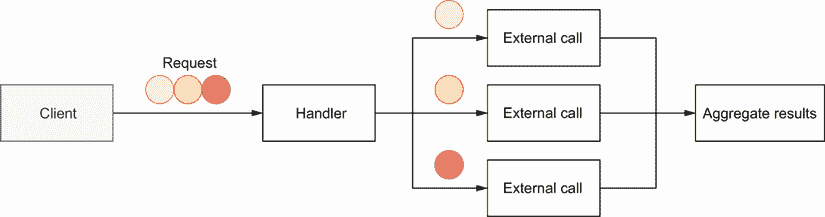

图 9.13 每个圆圈导致一个并行调用。

万一通话过程中出现错误，我们希望退货。如果有多个错误，我们只想返回其中一个。让我们只使用标准的并发原语来编写实现的框架:

```go
func handler(ctx context.Context, circles []Circle) ([]Result, error) {
    results := make([]Result, len(circles))
    wg := sync.WaitGroup{}                    // ❶
    wg.Add(len(results))

    for i, circle := range circles {
        i := i                                // ❷
        circle := circle                      // ❸

        go func() {                           ❹
            defer wg.Done()                   ❺
            result, err := foo(ctx, circle)
            if err != nil {
                // ?
            }
            results[i] = result               ❻
        }()
    }

    wg.Wait()
    // ...
}
```

❶创建了一个等待组来等待我们旋转的所有 goroutines

❷在 goroutine 中创建了一个新的 I 变量(参见错误#63，“不小心使用 go routine 和循环变量”)

❸同样适用于圆形

❹每圈触发一次 goroutine

❺指示 goroutine 何时完成

❻汇总了结果

我们决定使用一个`sync.WaitGroup`来等待所有的 goroutines 完成，并在一个片上处理聚合。这是做这件事的一种方法；另一种方法是将每个部分结果发送到一个通道，并在另一个 goroutine 中聚合它们。如果需要排序，主要的挑战将是重新排序传入的消息。因此，我们决定采用最简单的方法和共享切片。

注意因为每个 goroutine 都写入一个特定的索引，所以这个实现是无数据竞争的。

然而，有一个关键案例我们还没有解决。如果`foo`(在新的 goroutine 中进行的调用)返回一个错误怎么办？应该怎么处理？有各种选项，包括:

*   就像`results`切片一样，我们可以在 goroutines 之间共享一个错误切片。每个 goroutine 都会在出错时写入这个片。我们必须在父 goroutine 中迭代这个切片，以确定是否发生了错误(O(n)时间复杂度)。

*   我们可以通过一个共享互斥体让 goroutines 访问一个错误变量。

*   我们可以考虑共享一个错误通道，父 goroutine 将接收并处理这些错误。

不管选择哪个选项，它都会使解决方案变得非常复杂。出于这个原因，`errgroup`包是设计和开发的。

它导出一个函数`WithContext`，这个函数返回一个给定上下文的`*Group`结构。该结构为一组 goroutines 提供同步、错误传播和上下文取消，并且只导出两种方法:

*   `Go`在新的 goroutine 中触发呼叫。

*   `Wait`阻塞，直到所有程序完成。它返回第一个非零错误(如果有)。

让我们使用 `errgroup`重写解决方案。首先我们需要导入`errgroup`包:

```go
$ go get golang.org/x/sync/errgroup
```

实现如下:

```go
func handler(ctx context.Context, circles []Circle) ([]Result, error) {
    results := make([]Result, len(circles))
    g, ctx := errgroup.WithContext(ctx)      // ❶

    for i, circle := range circles {
        i := i
        circle := circle
        g.Go(func() error {                  // ❷
            result, err := foo(ctx, circle)
            if err != nil {
                return err
            }
            results[i] = result
            return nil
        })
    }

    if err := g.Wait(); err != nil {         // ❸
        return nil, err
    }
    return results, nil
}
```

❶创建了一个错误组。给定父上下文的组

❷调用 Go 来提升处理错误的逻辑，并将结果聚合到一个新的 goroutine 中

❸叫 Wait 来等待所有的 goroutines

首先，我们通过提供父上下文来创建和`*errgroup.Group`。在每次迭代中，我们使用`g.Go`在新的 goroutine 中触发一个调用。这个方法将一个`func() error`作为输入，用一个闭包包装对`foo`的调用，并处理结果和错误。与我们第一个实现的主要区别是，如果我们得到一个错误，我们从这个闭包返回它。然后，`g.Wait`允许我们等待所有的 goroutines 完成。

这个解决方案本质上比第一个更简单(第一个是部分的，因为我们没有处理错误)。我们不必依赖额外的并发原语，并且`errgroup.Group`足以处理我们的用例。

我们还没有解决的另一个好处是共享环境。假设我们必须触发三个并行调用:

*   第一个在 1 毫秒内返回一个错误。

*   第二次和第三次调用在 5 秒内返回结果或错误。

我们想要返回一个错误，如果有的话。因此，没有必要等到第二次和第三次通话结束。使用`errgroup.WithContext`创建一个在所有并行调用中使用的共享上下文。因为第一个调用在 1 毫秒内返回一个错误，所以它将取消上下文，从而取消其他 goroutines。所以，我们不必等 5 秒钟就返回一个错误。这是使用`errgroup`的另一个好处。

注意由`g.Go`调用的流程必须是*上下文感知的*。否则，取消上下文不会有任何效果。

总之，当我们必须触发多个 goroutines 并处理错误和上下文传播时，可能值得考虑`errgroup`是否是一个解决方案。正如我们所看到的，这个包支持一组 goroutines 的同步，并提供了处理错误和共享上下文的答案。

本章的最后一节讨论了 Go 开发者在复制`sync` 类型时的一个常见错误。

## 9.14 #74:复制同步类型

`sync`包提供了基本的同步原语，比如互斥、条件变量和等待组。对于所有这些类型，有一个硬性规则要遵循:它们永远不应该被复制。让我们了解一下基本原理和可能出现的问题。

我们将创建一个线程安全的数据结构来存储计数器。它将包含一个代表每个计数器当前值的`map[string]int`。我们还将使用一个`sync.Mutex`，因为访问必须受到保护。让我们添加一个`increment`方法来递增给定的计数器名称:

```go
type Counter struct {
    mu       sync.Mutex
    counters map[string]int
}

func NewCounter() Counter {                    // ❶
    return Counter{counters: map[string]int{}}
}

func (c Counter) Increment(name string) {
    c.mu.Lock()                                // ❷
    defer c.mu.Unlock()
    c.counters[name]++
}
```

❶工厂函数

❷在临界区增加计数器

增量逻辑在一个临界区完成:在`c.mu.Lock()`和`c.mu .Unlock()`之间。让我们通过使用和`-race`选项运行下面的例子来尝试我们的方法，该例子加速两个 goroutines 并递增它们各自的计数器:

```go
counter := NewCounter()

go func() {
    counter.Increment("foo")
}()
go func() {
    counter.Increment("bar")
}()
```

如果我们运行这个例子，它会引发一场数据竞争:

```go
==================
WARNING: DATA RACE
...
```

我们的`Counter`实现中的问题是互斥体被复制了。因为`Increment`的接收者是一个值，所以每当我们调用`Increment`时，它执行`Counter`结构的复制，这也复制了互斥体。因此，增量不是在共享的临界区中完成的。

`sync`不应复制类型。此规则适用于以下类型:

*   `sync.Cond`

*   `sync.Map`

*   `sync.Mutex`

*   `sync.RWMutex`

*   `sync.Once`

*   `sync.Pool`

*   `sync.WaitGroup`

因此，互斥体不应该被复制。有哪些替代方案？

首先是修改`Increment`方法的接收器类型:

```go
func (c *Counter) Increment(name string) {
    // Same code
}
```

改变接收器类型可避免调用`Increment`时复制`Counter`。因此，内部互斥体不会被复制。

如果我们想保留一个值接收器，第二个选项是将`Counter`中的`mu`字段的类型改为指针:

```go
type Counter struct {
    mu       *sync.Mutex        // ❶
    counters map[string]int
}

func NewCounter() Counter {
    return Counter{
        mu: &sync.Mutex{},      // ❷
        counters: map[string]int{},
    }
}
```

❶改变了 mu 的类型

❷改变了管理部门的初始化方式

如果`Increment`有一个值接收器，它仍然复制`Counter`结构。然而，由于`mu`现在是一个指针，它将只执行指针复制，而不是`sync.Mutex`的实际复制。因此，这种解决方案也防止了数据竞争。

注意我们也改变了`mu`的初始化方式。因为`mu`是一个指针，如果我们在创建`Counter`的时候省略了它，那么它会被初始化为一个指针的零值:`nil`。这将导致调用`c.mu.Lock()`时 goroutine 死机。

在以下情况下，我们可能会面临无意中复制`sync`字段的问题:

*   调用带有值接收者的方法(如我们所见)

*   调用带有`sync`参数的函数

*   调用带有包含`sync`字段的参数的函数

在每一种情况下，我们都应该非常谨慎。另外，让我们注意一些 linters 可以捕捉到这个问题——例如，使用`go vet`:

```go
$ go vet .
./main.go:19:9: Increment passes lock by value: Counter contains sync.Mutex
```

根据经验，每当多个 goroutines 必须访问一个公共的`sync`元素时，我们必须确保它们都依赖于同一个实例。这个规则适用于包`sync`中定义的所有类型。使用指针是解决这个问题的一种方法:我们可以有一个指向`sync`元素的指针，或者一个指向包含T21 元素的结构的指针。

## 摘要

*   在传播上下文时，理解可以取消上下文的条件应该很重要:例如，当响应已经发送时，HTTP 处理程序取消上下文。

*   避免泄露意味着无论何时启动 goroutine，你都应该有一个最终阻止它的计划。

*   为了避免 goroutines 和循环变量的错误，创建局部变量或调用函数，而不是闭包。

*   了解拥有多个通道的`select`在多个选项可能的情况下随机选择案例，可以防止做出错误的假设，从而导致微妙的并发错误。

*   使用`chan struct{}`类型发送通知。

*   使用 nil 通道应该是你的并发工具集的一部分，因为它允许你从`select`语句中*移除*用例。

*   给定一个问题，仔细决定要使用的正确通道类型。只有无缓冲通道才能提供强同步保证。

*   除了为缓冲通道指定通道尺寸之外，您应该有一个很好的理由来指定通道尺寸。

*   意识到字符串格式化可能会导致调用现有函数意味着要小心可能的死锁和其他数据竞争。

*   调用`append`并不总是无数据竞争的；因此，它不应该在共享片上并发使用。

*   记住切片和图是指针可以防止常见的数据竞争。

*   为了准确地使用`sync.WaitGroup`，在旋转 goroutines 之前调用`Add`方法。

*   您可以使用`sync.Cond`向多个 goroutines 发送重复通知。

*   你可以同步一组 goroutines，并用`errgroup`包处理错误和上下文。

*   `sync`不该复制的类型。