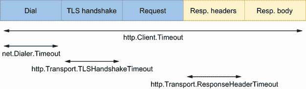

# 10 标准图书馆

本章涵盖

*   提供正确的持续时间
*   使用`time.After`时了解潜在的内存泄漏
*   避免 JSON 处理和 SQL 中的常见错误
*   关闭暂态资源
*   记住 HTTP 处理程序中的`return`语句
*   为什么生产级应用不应该使用默认的 HTTP 客户端和服务器

Go 标准库是一组增强和扩展该语言的核心包。例如，Go 开发人员可以编写 HTTP 客户端或服务器，处理 JSON 数据，或者与 SQL 数据库进行交互。所有这些特性都由标准库提供。然而，误用标准库是很容易的，或者我们可能对它的行为了解有限，这可能导致错误和编写不应该被认为是生产级的应用程序。让我们看看使用标准库时最常见的一些错误。

## 10.1 #75:提供了错误的持续时间

标准库提供了接受`time.Duration`的通用函数和方法。然而，因为`time.Duration`是`int64`类型的别名，对这种语言的新来者可能会感到困惑，并提供错误的持续时间。例如，具有 Java 或 JavaScript 背景的开发人员习惯于传递数值类型。

为了说明这个常见的错误，让我们创建一个新的`time.Ticker`，它将提供每秒钟的时钟滴答声:

```go
ticker := time.NewTicker(1000)
for {
    select {
    case <-ticker.C:
        // Do something
    }
}
```

如果我们运行这段代码，我们会注意到分笔成交点不是每秒都有；它们每微秒传送一次。

因为`time.Duration`基于`int64`类型，所以之前的代码是正确的，因为`1000`是有效的`int64`。但是`time.Duration`代表两个瞬间之间经过的时间，单位为*纳秒*。所以我们给`NewTicker`提供了 1000 纳秒= 1 微秒的持续时间。

这种错误经常发生。事实上，Java 和 JavaScript 等语言的标准库有时会要求开发人员以毫秒为单位提供持续时间。

此外，如果我们想有目的地创建一个间隔为 1 微秒的`time.Ticker`，我们不应该直接传递一个`int64`。相反，我们应该始终使用`time.Duration` API 来避免可能的混淆:

```go
ticker = time.NewTicker(time.Microsecond)
// Or
ticker = time.NewTicker(1000 * time.Nanosecond)
```

这并不是本书中最复杂的错误，但是具有其他语言背景的开发人员很容易陷入这样一个陷阱，认为`time`包中的函数和方法应该是毫秒级的。我们必须记住使用`time.Duration` API 和提供一个`int64`和一个时间单位。

现在，让我们讨论一下在使用`time.After`和包时的一个常见错误。

## 10.2 #76:时间。在和内存泄漏之后

`time.After(time.Duration)`是一个方便的功能，它返回一个通道，并在向该通道发送消息之前等待一段规定的时间。通常，它用在并发代码中；否则，如果我们想要睡眠给定的持续时间，我们可以使用`time.Sleep(time.Duration)`。`time.After`的优势在于它可以用于实现这样的场景，比如“如果我在这个通道中 5 秒钟没有收到任何消息，我会...."但是代码库经常在循环中包含对`time.After`的调用，正如我们在本节中所描述的，这可能是内存泄漏的根本原因。

让我们考虑下面的例子。我们将实现一个函数，该函数重复使用来自通道的消息。如果我们超过 1 小时没有收到任何消息，我们也希望记录一个警告。下面是一个可能的实现:

```go
func consumer(ch <-chan Event) {
    for {
        select {
        case event := <-ch:               // ❶
            handle(event)
        case <-time.After(time.Hour):     // ❷
            log.Println("warning: no messages received")
        }
    }
}
```

❶ 处理事件

❷ 递增空闲计数器

这里，我们在两种情况下使用`select`:从`ch`接收消息和 1 小时后没有消息(`time.After`在每次迭代中被评估，因此超时每次被*重置*)。乍一看，这段代码还不错。但是，这可能会导致内存使用问题。

我们说过，`time.After`返回一个通道。我们可能期望这个通道在每次循环迭代中都是关闭的，但事实并非如此。一旦超时，由`time.After`创建的资源(包括通道)将被释放，并使用内存直到超时结束。多少内存？在 Go 1.15 中，每次调用`time.After`大约使用 200 字节的内存。如果我们收到大量的消息，比如每小时 500 万条，我们的应用程序将消耗 1 GB 的内存来存储和`time.After`资源。

我们可以通过在每次迭代中以编程方式关闭通道来解决这个问题吗？不会。返回的通道是一个`<-chan time.Time`，意味着它是一个只能接收的通道，不能关闭。

我们有几个选择来修正我们的例子。第一种是使用上下文来代替`time.After`:

```go
func consumer(ch <-chan Event) {
    for {                                                                   // ❶
        ctx, cancel := context.WithTimeout(context.Background(), time.Hour) // ❷
        select {
        case event := <-ch:
            cancel()                                                        // ❸
            handle(event)
        case <-ctx.Done():                                                  // ❹
            log.Println("warning: no messages received")
        }
    }
}
```

❶ 主环路

❷ 创建了一个超时的上下文

如果我们收到消息，❸取消上下文

❹ 上下文取消

这种方法的缺点是，我们必须在每次循环迭代中重新创建一个上下文。创建上下文并不是 Go 中最轻量级的操作:例如，它需要创建一个通道。我们能做得更好吗？

第二个选项来自`time`包:`time.NewTimer`。这个函数创建了一个结构，该结构导出了以下内容:

*   一个`C`字段，它是内部定时器通道

*   一种`Reset(time.Duration)`方法来重置持续时间

*   一个`Stop()`方法来停止计时器

时间。内部构件后

我们要注意的是`time.After`也依赖于`time.Timer`。但是，它只返回`C`字段，所以我们无法访问`Reset`方法:

```go
package time

func After(d Duration) <-chan Time {
    return NewTimer(d).C                // ❶
}
```

❶ 创造了一个新时代。定时器并返回通道字段

让我们使用`time.NewTimer`实现一个新版本:

```go
func consumer(ch <-chan Event) {
    timerDuration := 1 * time.Hour
    timer := time.NewTimer(timerDuration)     // ❶

    for {                                     // ❷
        timer.Reset(timerDuration)            // ❸
        select {
        case event := <-ch:
            handle(event)
        case <-timer.C:                       // ❹
            log.Println("warning: no messages received")
        }
    }
}
```

❶ 创造了一个新的计时器

❷ 主环路

❸ 重置持续时间

❹ 计时器到期

在这个实现中，我们在每次循环迭代中保持一个循环动作:调用`Reset`方法。然而，调用`Reset`比每次都创建一个新的上下文要简单得多。它速度更快，对垃圾收集器的压力更小，因为它不需要任何新的堆分配。因此，使用`time.Timer`是我们最初问题的最佳解决方案。

注意为了简单起见，在这个例子中，前面的 goroutine 没有停止。正如我们在错误#62 中提到的，“启动一个 goroutine 却不知道何时停止”，这不是一个最佳实践。在生产级代码中，我们应该找到一个退出条件，比如可以取消的上下文。在这种情况下，我们还应该记得使用`defer timer.Stop()`停止`time.Timer`，例如，在`timer`创建之后。

在循环中使用`time.After`并不是导致内存消耗高峰的唯一情况。该问题与重复调用的代码有关。循环是一种情况，但是在 HTTP 处理函数中使用`time.After`会导致同样的问题，因为该函数会被多次调用。

一般情况下，使用`time.After`时要谨慎。请记住，创建的资源只有在计时器到期时才会被释放。当重复调用`time.After`时(例如，在一个循环中，一个 Kafka 消费函数，或者一个 HTTP 处理程序)，可能会导致内存消耗的高峰。在这种情况下，我们应该倾向于`time.NewTimer`。

下一节讨论 JSON 处理过程中最常见的错误。

## 10.3 #77:常见的 JSON 处理错误

Go 用`encoding/json`包对 JSON 有极好的支持。本节涵盖了与编码(编组)和解码(解组)JSON 数据相关的三个常见错误。

### 10.3.1 类型嵌入导致的意外行为

在错误#10“没有意识到类型嵌入可能存在的问题”中，我们讨论了与类型嵌入相关的问题。在 JSON 处理的上下文中，让我们讨论类型嵌入的另一个潜在影响，它会导致意想不到的封送/解封结果。

在下面的例子中，我们创建了一个包含 ID 和嵌入时间戳的`Event`结构:

```go
type Event struct {
    ID int
    time.Time       // ❶
}
```

❶ 嵌入式领域

因为`time.Time`是嵌入式的，以我们之前描述的方式，我们可以在`Event`级别直接访问和`time.Time`方法:例如，`event .Second()`。

JSON 封送处理对嵌入式字段有哪些可能的影响？让我们在下面的例子中找出答案。我们将实例化一个`Event`，并将其封送到 JSON 中。这段代码的输出应该是什么？

```go
event := Event{
    ID:   1234,
    Time: time.Now(),       // ❶
}

b, err := json.Marshal(event)
if err != nil {
    return err
}

fmt.Println(string(b))
```

❶ 结构实例化期间匿名字段的名称是结构的名称(时间)。

我们可能期望这段代码打印出如下内容:

```go
{"ID":1234,"Time":"2021-05-18T21:15:08.381652+02:00"}
```

相反，它会打印以下内容:

```go
"2021-05-18T21:15:08.381652+02:00"
```

我们如何解释这个输出？`ID`字段和`1234`值怎么了？因为此字段是导出的，所以它应该已被封送。要理解这个问题，我们必须强调两点。

首先，正如错误#10 中所讨论的，如果一个嵌入字段类型实现了一个接口，那么包含该嵌入字段的结构也将实现这个接口。其次，我们可以通过让一个类型实现`json.Marshaler`接口来改变默认的封送处理行为。该界面包含单个`MarshalJSON`功能:

```go
type Marshaler interface {
    MarshalJSON() ([]byte, error)
}
```

下面是一个自定义封送处理的示例:

```go
type foo struct{}                             // ❶

func (foo) MarshalJSON() ([]byte, error) {    // ❷
    return []byte(`"foo"`), nil               // ❸
}

func main() {
    b, err := json.Marshal(foo{})             // ❹
    if err != nil {
        panic(err)
    }
    fmt.Println(string(b))
}
```

❶ 定义了这个结构

❷ 实现了`MarshalJSON`方法

❸ 回复了一个静态响应

❹ 然后，`json.Marshal`依赖于自定义`MarshalJSON`实现。

因为我们通过实现和`Marshaler`接口改变了默认的 JSON 封送行为，所以这段代码打印出了`"foo"`。

澄清了这两点之后，让我们回到最初关于`Event`结构的问题:

```go
type Event struct {
    ID int
    time.Time
}
```

我们必须知道`time.Time`*实现了*`json.Marshaler`接口。因为`time.Time`是`Event`的嵌入字段，所以编译器会提升它的方法。因此，`Event`也实现了`json.Marshaler`。

因此，向`json.Marshal`传递一个`Event`会使用`time.Time`提供的封送处理行为，而不是默认行为。这就是为什么封送一个`Event`会导致忽略`ID`字段。

注意，如果我们使用`json.Unmarshal`解组一个`Event`，我们也会面临相反的问题。

要解决这个问题，有两种主要的可能性。首先，我们可以添加一个名称，这样`time.Time`字段就不再被嵌入:

```go
type Event struct {
    ID   int
    Time time.Time      // ❶
}
```

❶ 时间。时间不再是嵌入式。

这样，如果我们封送这个`Event`结构的一个版本，它将打印如下内容:

```go
{"ID":1234,"Time":"2021-05-18T21:15:08.381652+02:00"}
```

如果我们希望或者必须保留嵌入的`time.Time`字段，另一个选择是让`Event`实现的`json.Marshaler`接口:

```go
func (e Event) MarshalJSON() ([]byte, error) {
    return json.Marshal(
        struct {            // ❶
            ID   int
            Time time.Time
        }{
            ID:   e.ID,
            Time: e.Time,
        },
    )
}
```

❶ 创建了一个匿名结构

在这个解决方案中，我们实现了一个定制的`MarshalJSON`方法，而定义了一个反映`Event`结构的匿名结构。但是这种解决方案更麻烦，并且要求我们确保`MarshalJSON`方法和`Event`结构总是最新的。

我们应该小心嵌入字段。虽然提升嵌入字段类型的字段和方法有时会很方便，但它也会导致微妙的错误，因为它会使父结构在没有明确信号的情况下实现接口。还是那句话，在使用嵌入字段的时候，要清楚的了解可能产生的副作用。

在下一节中，我们将看到另一个与使用`time.Time`相关的常见 JSON 错误。

### 10.3.2 JSON 和单调时钟

当封送或解封一个包含`time.Time`类型的结构时，我们有时会面临意想不到的比较错误。检查`time.Time`有助于完善我们的假设并防止可能的错误。

一个操作系统处理两种不同的时钟类型:墙时钟和单调时钟。本节首先看这些时钟类型，然后看使用 JSON 和`time.Time`时可能产生的影响。

挂钟用来确定一天中的当前时间。这个钟可能会有变化。例如，如果使用网络时间协议(NTP)同步时钟，它可以在时间上向后或向前跳转。我们不应该使用挂钟来测量持续时间，因为我们可能会面临奇怪的行为，例如负持续时间。这就是操作系统提供第二种时钟类型原因:单调时钟。单调时钟保证时间总是向前移动，不受时间跳跃的影响。它会受到频率调整的影响(例如，如果服务器检测到本地石英钟的移动速度与 NTP 服务器不同)，但不会受到时间跳跃的影响。

在下面的例子中，我们考虑一个包含单个`time.Time`字段(非嵌入式)的`Event`结构:

```go
type Event struct {
    Time time.Time
}
```

我们实例化一个`Event`，将它封送到 JSON 中，并将其解包到另一个结构中。然后我们比较这两种结构。让我们看看编组/解组过程是否总是对称的:

```go
t := time.Now()                    // ❶
event1 := Event{                   // ❷
    Time: t,
}

b, err := json.Marshal(event1)     // ❸
if err != nil {
    return err
}

var event2 Event
err = json.Unmarshal(b, &event2)   // ❹
if err != nil {
    return err
}

fmt.Println(event1 == event2)
```

❶ 得到当前的当地时间

❷ 实例化一个事件结构

❸ 编组 JSON

❹ 解组 JSON

这段代码的输出应该是什么？它打印的是`false`，不是`true`。我们如何解释这一点？

首先，让我们打印出`event1`和`event2`的内容:

```go
fmt.Println(event1.Time)
fmt.Println(event2.Time)
2021-01-10 17:13:08.852061 +0100 CET m=+0.000338660
2021-01-10 17:13:08.852061 +0100 CET
```

代码为`event1`和`event2`打印不同的内容。除了`m=+0.000338660`部分，它们是一样的。这是什么意思？

在 Go 中，`time.Time`可能包含一个挂钟和一个单调时间，而不是将两个时钟分成两个不同的 API。当我们使用`time.Now()`获得本地时间时，它返回一个`time.Time`和两个时间:

```go
2021-01-10 17:13:08.852061 +0100 CET m=+0.000338660
------------------------------------ --------------
             Wall time               Monotonic time
```

相反，当我们解组 JSON 时，`time.Time`字段不包含单调时间——只包含墙时间。因此，当我们比较这些结构时，由于单调的时间差，结果是`false`；这也是为什么我们在打印两个结构时会看到差异。我们如何解决这个问题？有两个主要选项。

当我们使用`==`操作符来比较两个`time.Time`字段时，它会比较所有的结构字段，包括单调部分。为了避免这种情况，我们可以使用`Equal`方法来代替:

```go
fmt.Println(event1.Time.Equal(event2.Time))
true
```

`Equal`方法没有考虑单调时间；因此，这段代码打印了`true`。但是在这种情况下，我们只比较了`time.Time`字段，而不是父`Event`结构。

第二个选项是保留`==`来比较两个结构，但是使用和`Truncate`方法去除单调时间。该方法返回将`time.Time`值向下舍入到给定持续时间的倍数的结果。我们可以通过提供零持续时间来使用它，如下所示:

```go
t := time.Now()
event1 := Event{
    Time: t.Truncate(0),             // ❶
}

b, err := json.Marshal(event1)
if err != nil {
    return err
}

var event2 Event
err = json.Unmarshal(b, &event2)
if err != nil {
    return err
}

fmt.Println(event1 == event2)        // ❷
```

❶ 剥离了单调的时间

❷ 使用==运算符执行比较

在这个版本中，两个`time.Time`字段是相等的。因此，这段代码打印了`true`。

时间。时间和地点

我们还要注意，每个`time.Time`都与一个代表时区的`time.Location`相关联。例如:

```go
t := time.Now() // 2021-01-10 17:13:08.852061 +0100 CET
```

这里，位置被设置为 CET，因为我使用了`time.Now()`，它返回我当前的本地时间。JSON 封送结果取决于位置。为了防止这种情况，我们可以坚持一个特定的位置:

```go
location, err := time.LoadLocation("America/New_York")    // ❶
if err != nil {
    return err
}
t := time.Now().In(location) // 2021-05-18 22:47:04.155755 -0500 EST
```

❶ 获得美洲/纽约的当前位置

或者，我们可以获得 UTC 的当前时间:

```go
t := time.Now().UTC() // 2021-05-18 22:47:04.155755 +0000 UTC
```

总之，编组/解组过程并不总是对称的，我们面对的这种情况是一个包含`time.Time`的结构。我们应该记住这个原则，这样我们就不会写错误的测试。

### 10.3.3 任何的映射

在解组数据的时候，我们可以提供一个映射来代替结构。基本原理是，当键和值不确定时，传递映射比传递静态结构更灵活。然而，有一个规则要记住，以避免错误的假设和可能的恐慌。

让我们编写一个将消息解组到映射中的示例:

```go
b := getMessage()
var m map[string]any
err := json.Unmarshal(b, &m)    // ❶
if err != nil {
    return err
}
```

❶ 提供了映射指针

让我们为前面的代码提供以下 JSON:

```go
{
    "id": 32,
    "name": "foo"
}
```

因为我们使用了一个通用的`map[string]any`，它会自动解析所有不同的字段:

```go
map[id:32 name:foo]
```

然而，如果我们使用`any`的映射，有一个重要的问题需要记住:任何数值，不管它是否包含小数，都被转换为`float64`类型。我们可以通过打印`m["id"]`的类型来观察这一点:

```go
fmt.Printf("%T\n", m["id"])
float64
```

我们应该确保我们没有做出错误的假设，并期望默认情况下没有小数的数值被转换为整数。例如，对类型转换做出不正确的假设可能会导致 goroutine 崩溃。

下一节讨论编写与 SQL 数据库交互的应用程序时最常见的错误。

## 10.4 #78:常见的 SQL 错误

`database/sql`包为 SQL(或类似 SQL 的)数据库提供了一个通用接口。在使用这个包时，看到一些模式或错误也是相当常见的。让我们深入探讨五个常见错误。

### 忘记了`sql.Open`不一定要建立到数据库的连接

使用`sql.Open`时，一个常见的误解是期望该函数建立到数据库的连接:

```go
db, err := sql.Open("mysql", dsn)
if err != nil {
    return err
}
```

但这不一定是事实。据文献记载（[`pkg.go.dev/database/sql`](https://pkg.go.dev/database/sql)），

Open 可能只是验证它的参数，而不创建到数据库的连接。

实际上，行为取决于所使用的 SQL 驱动程序。对于某些驱动程序来说，`sql.Open`并不建立连接:这只是为以后使用做准备(例如，与`db.Query`)。因此，到数据库的第一个连接可能是延迟建立的。

为什么我们需要了解这种行为？例如，在某些情况下，我们希望只有在我们知道所有的依赖项都已正确设置并且可以访问之后，才准备好服务。如果我们不知道这一点，服务可能会接受流量，尽管配置是错误的。

如果我们想确保使用`sql.Open`的函数也保证底层数据库是可访问的，我们应该使用`Ping`方法:

```go
db, err := sql.Open("mysql", dsn)
if err != nil {
    return err
}
if err := db.Ping(); err != nil {     // ❶
    return err
}
```

❶ 在 sql 之后调用 Ping 方法。打开

`Ping`强制代码建立一个连接，确保数据源名称有效并且数据库可访问。注意，`Ping`的另一种选择是`PingContext`，它要求一个额外的上下文来传达 ping 何时应该被取消或超时。

尽管可能违反直觉，但让我们记住`sql.Open`不一定建立连接，第一个连接可以被延迟打开。如果我们想测试我们的配置并确保数据库是可达的，我们应该在`sql.Open`之后调用`Ping`或`PingContext`方法。

### 忘记连接池

正如默认的 HTTP 客户端和服务器提供了在生产中可能无效的默认行为一样(参见错误#81，“使用默认的 HTTP 客户端和服务器”)，理解 Go 中如何处理数据库连接是至关重要的。`sql.Open`返回一个`*sql.DB`结构。此结构不代表单个数据库连接；相反，它代表一个连接池。这是值得注意的，所以我们不会尝试手动实现它。池中的连接可以有两种状态:

*   已被使用(例如，被另一个触发查询的 goroutine 使用)

*   闲置(已经创建但暂时没有使用)

同样重要的是要记住，创建池会导致四个可用的配置参数，我们可能想要覆盖它们。这些参数中的每一个都是`*sql.DB`的导出方法:

*   `SetMaxOpenConns`——数据库的最大打开连接数(默认值:`unlimited`)

*   `SetMaxIdleConns`——最大空闲连接数(默认值:`2`)

*   `SetConnMaxIdleTime`——连接关闭前可以空闲的最长时间(默认值:`unlimited`)

*   `SetConnMaxLifetime`——连接关闭前可以保持打开的最长时间(默认值:`unlimited`)

图 10.1 显示了一个最多有五个连接的例子。它有四个正在进行的连接:三个空闲，一个在使用中。因此，仍有一个插槽可用于额外的连接。如果有新的查询进来，它将选择一个空闲连接(如果仍然可用)。如果没有更多的空闲连接，如果有额外的时隙可用，池将创建一个新的连接；否则，它将一直等到连接可用。


图 10.1 具有五个连接的连接池

那么，我们为什么要调整这些配置参数呢？

*   设置`SetMaxOpenConns`对于生产级应用非常重要。因为默认值是无限制的，所以我们应该设置它以确保它适合底层数据库可以处理的内容。

*   如果我们的应用程序生成大量并发请求，那么`SetMaxIdleConns`(默认:`2`)的值应该增加。否则，应用程序可能会经历频繁的重新连接。

*   如果我们的应用程序可能面临突发的请求，设置`SetConnMaxIdleTime`是很重要的。当应用程序返回到一个更和平的状态时，我们希望确保创建的连接最终被释放。

*   例如，如果我们连接到一个负载平衡的数据库服务器，设置`SetConnMaxLifetime`会很有帮助。在这种情况下，我们希望确保我们的应用程序不会长时间使用连接。

对于生产级应用，我们必须考虑这四个参数。如果一个应用程序面临不同的用例，我们也可以使用多个连接池。

### 10.4.3 不使用准备好的报表

预准备语句是很多 SQL 数据库为了执行重复的 SQL 语句而实现的功能。在内部，SQL 语句被预编译并与提供的数据分离。有两个主要好处:

*   *效率*——语句不用重新编译(编译就是解析+优化+翻译)。

*   *安全*——这种方法降低了 SQL 注入攻击的风险。

因此，如果一个陈述是重复的，我们应该使用准备好的陈述。我们还应该在不受信任的上下文中使用准备好的语句(比如在互联网上公开一个端点，其中请求被映射到一个 SQL 语句)。

为了使用准备好的语句，我们不调用`*sql.DB`的`Query`方法，而是调用`Prepare`:

```go
stmt, err := db.Prepare("SELECT * FROM ORDER WHERE ID = ?")   // ❶
if err != nil {
    return err
}
rows, err := stmt.Query(id)                                   // ❷
// ...
```

❶ 准备声明

❷ 执行准备好的查询

我们准备语句，然后在提供参数的同时执行它。`Prepare`方法的第一个输出是一个`*sql.Stmt`，它可以被重用和并发运行。当不再需要该语句时，必须使用和`Close()`方法将其关闭。

注意，`Prepare`和`Query`方法提供了另外一个上下文:`PrepareContext`和`QueryContext`。

为了效率和安全，我们需要记住在有意义的时候使用准备好的语句。

### 错误处理空值

下一个错误是用查询错误处理空值。让我们写一个例子，其中我们检索雇员的部门和年龄:

```go
rows, err := db.Query("SELECT DEP, AGE FROM EMP WHERE ID = ?", id)    // ❶
if err != nil {
    return err
}
// Defer closing rows

var (
    department string
    age int
)
for rows.Next() {
    err := rows.Scan(&department, &age)                               // ❷
    if err != nil {
        return err
    }
    // ...
}
```

❶ 执行查询

❷ 扫描每一行

我们使用`Query`来执行一个查询。然后，我们对行进行迭代，并使用`Scan`将列复制到由`department`和`age`指针指向的值中。如果我们运行这个例子，我们可能会在调用`Scan`时得到以下错误:

```go
2021/10/29 17:58:05 sql: Scan error on column index 0, name "DEPARTMENT":
converting NULL to string is unsupported
```

这里，SQL 驱动程序引发了一个错误，因为部门值等于`NULL`。如果一个列可以为空，有两个选项可以防止`Scan`返回错误。

第一种方法是将`department`声明为字符串指针:

```go
var (
    department *string      // ❶
    age        int
)
for rows.Next() {
    err := rows.Scan(&department, &age)
    // ...
}
```

❶ 将类型从字符串更改为*字符串

我们给`scan`提供的是指针的地址，而不是直接字符串类型的地址。通过这样做，如果值为`NULL`，`department`将为`nil`。

另一种方法是使用`sql.NullXXX`类型中的，如`sql.NullString`:

```go
var (
    department sql.NullString    // ❶
    age        int
)
for rows.Next() {
    err := rows.Scan(&department, &age)
    // ...
}
```

❶ 将类型更改为`sql.NullString`

`sql.NullString`是字符串顶部的包装。它包含两个导出字段:`String`包含字符串值，`Valid`表示字符串是否不是`NULL`。可以访问以下包装器:

*   `sql.NullString`

*   `sql.NullBool`

*   `sql.NullInt32`

*   

*   `sql.NullFloat64`

*   `sql.NullTime`

两个都采用的工作方式，用`sql.NullXXX`更清晰地表达的意图，正如核心GO维护者 Russ Cox([`mng.bz/rJNX`](http://mng.bz/rJNX))所说:

没有有效的区别。我们认为人们可能想要使用`NullString`，因为它太常见了，并且可能比`*string`更清楚地表达了意图。但是这两种方法都可以。

因此，可空列的最佳实践是要么将其作为指针处理，要么使用和`sql.NullXXX`类型。

### 10.4.5 不处理行迭代错误

另一个常见的错误是在迭代行时漏掉可能的错误。让我们看一个错误处理被误用的函数:

```go
func get(ctx context.Context, db *sql.DB, id string) (string, int, error) {
    rows, err := db.QueryContext(ctx,
        "SELECT DEP, AGE FROM EMP WHERE ID = ?", id)
    if err != nil {                                     // ❶
        return "", 0, err
    }
    defer func() {
        err := rows.Close()                             // ❷
        if err != nil {
            log.Printf("failed to close rows: %v\n", err)
        }
    }()

    var (
        department string
        age        int
    )
    for rows.Next() {
        err := rows.Scan(&department, &age)             // ❸
        if err != nil {
            return "", 0, err
        }
    }

    return department, age, nil
}
```

❶ 在执行查询时处理错误

❷ 在关闭行时处理错误

❸ 在扫描行时处理错误

在这个函数中，我们处理三个错误:执行查询时，关闭行，扫描行。但这还不够。我们必须知道`for` `rows .Next()` `{}`循环可以中断，无论是当没有更多的行时，还是当准备下一行时发生错误时。在行迭代之后，我们应该调用`rows.Err`来区分两种情况:

```go
func get(ctx context.Context, db *sql.DB, id string) (string, int, error) {
    // ...
    for rows.Next() {
        // ...
    }

    if err := rows.Err(); err != nil {    // ❶
        return "", 0, err
    }

    return department, age, nil
}
```

❶ 检查`rows.Err`确定上一个循环是否因为错误而停止

这是要记住的最佳实践:因为`rows.Next`可能在我们迭代完所有行时停止，或者在准备下一行时发生错误时停止，所以我们应该在迭代后检查`rows.Err`。

现在让我们讨论一个常见的错误:忘记关闭瞬态资源。

## 10.5 #79:不关闭瞬态资源

开发人员经常使用必须在代码中的某个点关闭的瞬态(临时)资源:例如，为了避免磁盘或内存中的泄漏。结构通常可以实现`io.Closer`接口来传达必须关闭瞬态资源。让我们来看三个常见的例子，看看当资源没有正确关闭时会发生什么，以及如何正确地处理它们。

### HTTP 主体

首先，我们在 HTTP 的背景下讨论一下这个问题。我们将编写一个`getBody`方法，发出 HTTP GET 请求并返回 HTTP 主体响应。这是第一个实现:

```go
type handler struct {
    client http.Client
    url    string
}

func (h handler) getBody() (string, error) {
    resp, err := h.client.Get(h.url)           // ❶
    if err != nil {
        return "", err
    }

    body, err := io.ReadAll(resp.Body)         // ❷
    if err != nil {
        return "", err
    }

    return string(body), nil
}
```

❶ 发出一个 HTTP GET 请求

❷ 阅读`resp.Body`，并以`[]byte`的形式获取主体

我们使用`http.Get`并使用`io.ReadAll`解析响应。这个方法看起来不错，它正确地返回了 HTTP 响应体。然而，有一个资源泄漏。我们来了解一下在哪里。

`resp`是一个`*http.Response`型。它包含一个`Body` `io.ReadCloser`字段(`io.ReadCloser`实现了`io.Reader`和`io.Closer`)。如果`http.Get`没有返回错误，这个主体必须关闭；否则就是资源泄露。在这种情况下，我们的应用程序将保留一些不再需要但不能被 GC 回收的内存，在最坏的情况下，可能会阻止客户端重用 TCP 连接。

处理体闭包最方便的方法是像这样处理`defer`语句:

```go
defer func() {
    err := resp.Body.Close()
    if err != nil {
        log.Printf("failed to close response: %v\n", err)
    }
}()
```

在这个实现中，我们将正文资源闭包作为一个`defer`函数来处理，一旦`getBody`返回，就会执行。

注意在服务器端，在实现 HTTP 处理程序时，我们不需要关闭请求体，因为服务器会自动关闭请求体。

我们还应该理解，无论我们是否读取响应体，它都必须是封闭的。例如，如果我们只对 HTTP 状态代码感兴趣，而对主体不感兴趣，那么无论如何都必须关闭它，以避免泄漏:

```go
func (h handler) getStatusCode(body io.Reader) (int, error) {
    resp, err := h.client.Post(h.url, "application/json", body)
    if err != nil {
        return 0, err
    }

    defer func() {                // ❶
        err := resp.Body.Close()
        if err != nil {
            log.Printf("failed to close response: %v\n", err)
        }
    }()

    return resp.StatusCode, nil
}
```

即使我们不读，❶也会关闭回复正文

这个函数关闭了主体，即使我们没有读它。

另一件需要记住的重要事情是，当我们关闭身体时，行为是不同的，这取决于我们是否已经阅读了它:

*   如果我们在没有读取的情况下关闭主体，默认的 HTTP 传输可能会关闭连接。

*   如果我们在读取之后关闭主体，默认的 HTTP 传输不会关闭连接；因此，它可以重复使用。

因此，如果`getStatusCode`被重复调用并且我们想要使用保持活动的连接，我们应该读取主体，即使我们对它不感兴趣:

```go
func (h handler) getStatusCode(body io.Reader) (int, error) {
    resp, err := h.client.Post(h.url, "application/json", body)
    if err != nil {
        return 0, err
    }

    // Close response body

    _, _ = io.Copy(io.Discard, resp.Body)     // ❶

    return resp.StatusCode, nil
}
```

❶ 阅读回复正文

在本例中，我们读取正文以保持连接的活力。注意，我们没有使用`io.ReadAll`，而是使用了`io.Copy`到`io.Discard`，一个`io.Writer`实现。这段代码读取主体，但丢弃它，不进行任何复制，这比`io.ReadAll`更有效。

何时关闭响应体

通常，如果响应不为空，实现会关闭主体，而不是如果错误为`nil`:

```go
resp, err := http.Get(url)
if resp != nil {                // ❶
    defer resp.Body.Close()     // ❷
}

if err != nil {
    return "", err
}
```

如果答案不是零，❶...

❷ ...作为延迟函数关闭响应正文。

这个实现不是必需的。这是基于这样一个事实:在某些情况下(比如重定向失败)，无论是`resp`还是`err`都不会是`nil`。但是根据官方GO文档（[`pkg.go.dev/net/http`](https://pkg.go.dev/net/http)），

出错时，任何回复都可以忽略。只有当`CheckRedirect`失败时，才会出现带有非零错误的非零响应，即使在这种情况下，返回的响应也是如此。身体已经关闭。

因此，没有必要进行`if resp != nil {}`检查。我们应该坚持最初的解决方案，只有在没有错误的情况下，才在`defer`函数中关闭主体。

关闭资源以避免泄漏不仅仅与 HTTP 主体管理相关。一般来说，所有实现`io.Closer`接口的结构都应该在某个时候关闭。该接口包含单个`Close`方法:

```go
type Closer interface {
    Close() error
}
```

现在让我们看看`sql.Rows`的影响。

### sql。行

`sql.Rows`是作为 SQL 查询结果使用的结构。因为这个结构实现了`io.Closer`，所以它必须被关闭。以下示例省略了行的关闭:

```go
db, err := sql.Open("postgres", dataSourceName)
if err != nil {
    return err
}

rows, err := db.Query("SELECT * FROM CUSTOMERS")    // ❶
if err != nil {
    return err
}

// Use rows

return nil
```

❶ 执行 SQL 查询

忘记关闭行意味着连接泄漏，这会阻止数据库连接被放回连接池中。

我们可以将闭包作为跟在`if err != nil`块后面的`defer`函数来处理:

```go
// Open connection

rows, err := db.Query("SELECT * FROM CUSTOMERS")     // ❶
if err != nil {
    return err
}

defer func() {                                       // ❷
    if err := rows.Close(); err != nil {
        log.Printf("failed to close rows: %v\n", err)
    }
}()

// Use rows
```

❶ 执行 SQL 查询

❷ 关闭行

在`Query`调用之后，如果没有返回错误，我们应该最终关闭`rows`来防止连接泄漏。

注如前一节所述，`db`变量(`*sql.DB`类型)代表一个连接池。它还实现了`io.Closer`接口。但是正如文档所示，很少关闭一个`sql.DB`,因为它应该是长期存在的，并且由许多 goroutines 共享。

接下来，让我们讨论在处理文件时关闭资源。

### 操作系统。文件

`os.File`代表一个打开的文件描述符。和`sql.Rows`一样，最终必须关闭:

```go
f, err := os.OpenFile(filename, os.O_APPEND|os.O_WRONLY, os.ModeAppend)   // ❶
if err != nil {
    return err
}

defer func() {
    if err := f.Close(); err != nil {                                     // ❷
        log.Printf("failed to close file: %v\n", err)
    }
}()
```

❶ 打开文件

❷ 关闭文件描述符

在这个例子中，我们使用`defer`来推迟对`Close`方法的调用。如果我们最终没有关闭一个`os.File`，它本身不会导致泄漏:当`os.File`被垃圾收集时，文件会自动关闭。但是，最好显式调用`Close`，因为我们不知道下一个 GC 将在何时被触发(除非我们手动运行它)。

显式调用`Close`还有另一个好处:主动监控返回的错误。例如，可写文件应该是这种情况。

写入文件描述符不是同步操作。出于性能考虑，数据被缓冲。`close(2)`的 BSD 手册页提到，一个闭包会导致在 I/O 错误期间遇到的先前未提交的写操作(仍在缓冲区中)出错。因此，如果我们想要写入文件，我们应该传播关闭文件时发生的任何错误:

```go
func writeToFile(filename string, content []byte) (err error) {
    // Open file

    defer func() {             // ❶
        closeErr := f.Close()
        if err == nil {
            err = closeErr
        }
    }()

    _, err = f.Write(content)
    return
}
```

如果写入成功，❶将返回关闭错误

在本例中，我们使用命名参数，并在写入成功时将错误设置为`f.Close`的响应。通过这种方式，客户将会意识到这个函数是否出了问题，并做出相应的反应。

此外，成功关闭可写的`os.File`并不能保证文件将被写入磁盘。写操作仍然可以驻留在文件系统的缓冲区中，而不会刷新到磁盘上。如果持久性是一个关键因素，我们可以使用`Sync()`方法来提交变更。在这种情况下，来自`Close`的错误可以被安全地忽略:

```go
func writeToFile(filename string, content []byte) error {
    // Open file

    defer func() {
        _ = f.Close()       // ❶
    }()

    _, err = f.Write(content)
    if err != nil {
        return err
    }

    return f.Sync()         // ❷
}
```

❶ 忽略了可能的错误

❷ 将写入提交到磁盘

这个例子是一个同步写函数。它确保内容在返回之前被写入磁盘。但是它的缺点是会影响性能。

总结这一节，我们已经看到关闭短暂的资源从而避免泄漏是多么重要。短暂的资源必须在正确的时间和特定的情况下关闭。事先并不总是清楚什么必须结束。我们只能通过仔细阅读 API 文档和/或通过经验来获取这些信息。但是我们应该记住，如果一个结构实现了`io.Closer`接口，我们最终必须调用`Close`方法。最后但并非最不重要的一点是，必须理解如果闭包失败了该怎么做:记录一条消息就够了吗，或者我们还应该传播它吗？适当的操作取决于实现，如本节中的三个示例所示。

现在让我们切换到与 HTTP 处理相关的常见错误:忘记`return`语句。

## 10.6 #80:回复 HTTP 请求后忘记返回语句

在编写 HTTP 处理程序时，很容易忘记回复 HTTP 请求后的语句。这可能会导致一种奇怪的情况，我们应该在出错后停止处理程序，但是我们没有。

我们可以在下面的例子中观察到这种情况:

```go
func handler(w http.ResponseWriter, req *http.Request) {
    err := foo(req)
    if err != nil {
        http.Error(w, "foo", http.StatusInternalServerError)    // ❶
    }

    // ...
}
```

❶ 处理错误

如果`foo`返回一个错误，我们使用`http.Error`来处理它，它用`foo`错误消息和一个 500 内部服务器错误来回复请求。这段代码的问题是，如果我们进入`if err != nil`分支，应用程序将继续执行，因为`http.Error`不会停止处理程序的执行。

这种错误的真正影响是什么？首先我们从 HTTP 层面来讨论一下。例如，假设我们通过添加一个步骤来编写成功的 HTTP 响应正文和状态代码，从而完成了前面的 HTTP 处理程序:

```go
func handler(w http.ResponseWriter, req *http.Request) {
    err := foo(req)
    if err != nil {
        http.Error(w, "foo", http.StatusInternalServerError)
    }

    _, _ = w.Write([]byte("all good"))
    w.WriteHeader(http.StatusCreated)
}
```

在`err != nil`的情况下，HTTP 响应如下:

```go
foo
all good
```

响应包含错误和成功消息。

我们将只返回第一个 HTTP 状态代码:在前面的例子中是 500。但是，Go 也会记录一个警告:

```go
2021/10/29 16:45:33 http: superfluous response.WriteHeader call
from main.handler (main.go:20)
```

这个警告意味着我们试图多次写入状态代码，这样做是多余的。

就执行而言，主要影响是继续执行本应停止的功能。例如，如果`foo`在返回错误的同时还返回了一个指针，那么继续执行将意味着使用这个指针，这可能会导致一个空指针解引用(并因此导致一个 goroutine 崩溃)。

纠正这个错误的方法是继续考虑在`http.Error`之后添加`return`语句的:

```go
func handler(w http.ResponseWriter, req *http.Request) {
    err := foo(req)
    if err != nil {
        http.Error(w, "foo", http.StatusInternalServerError)
        return    // ❶
    }

    // ...
}
```

❶ 补充了退货声明

由于的`return`语句，如果我们在`if err != nil`分支结束，函数将停止执行。

这个错误可能不是这本书最复杂的。然而，很容易忘记这一点，这种错误经常发生。我们总是需要记住`http.Error`不会停止一个处理程序的执行，必须手动添加。如果我们有足够的覆盖率，这样的问题可以而且应该在测试中被发现。

本章的最后一节继续我们对 HTTP 的讨论。我们明白了为什么生产级应用程序不应该依赖默认的 HTTP 客户端和服务器实现。

## 10.7 #81:使用默认的 HTTP 客户端和服务器

`http`包提供了 HTTP 客户端和服务器实现。然而，开发人员很容易犯一个常见的错误:在最终部署到生产环境中的应用程序的上下文中依赖默认实现。让我们看看问题和如何克服它们。

### 10.7.1 HTTP 客户端

我们来定义一下*默认客户端*是什么意思。我们将使用一个 GET 请求作为例子。我们可以像这样使用`http.Client`结构的零值:

```go
client := &http.Client{}
resp, err := client.Get("https://golang.org/")
```

或者我们可以使用`http.Get`功能:

```go
resp, err := http.Get("https://golang.org/")
```

最后，两种方法都是一样的。`http.Get`功能使用`http .DefaultClient`，其也是基于`http.Client`的零值:

```go
// DefaultClient is the default Client and is used by Get, Head, and Post.
var DefaultClient = &Client{}
```

那么，使用默认的 HTTP 客户端有什么问题呢？

首先，默认客户端没有指定任何超时。这种没有超时的情况并不是我们想要的生产级系统:它会导致许多问题，比如永无止境的请求会耗尽系统资源。

在深入研究发出请求时的可用超时之前，让我们回顾一下 HTTP 请求中涉及的五个步骤:

1.  拨号建立 TCP 连接。

2.  TLS 握手(如果启用)。

3.  发送请求。

4.  阅读响应标题。

5.  阅读回复正文。

图 10.2 显示了这些步骤与主客户端超时的关系。



图 10.2 HTTP 请求期间的五个步骤，以及相关的超时

四种主要超时如下:

*   `net.Dialer.Timeout`——指定拨号等待连接完成的最长时间。

*   `http.Transport.TLSHandshakeTimeout`——指定等待 TLS 握手的最长时间。

*   `http.Transport.ResponseHeaderTimeout`——指定等待服务器响应头的时间。

*   `http.Client.Timeout`——指定请求的时限。它包括从步骤 1(拨号)到步骤 5(读取响应正文)的所有步骤。

HTTP 客户端超时

在指定`http.Client .Timeout`时，您可能会遇到以下错误:

```go
net/http: request canceled (Client.Timeout exceeded while awaiting 
headers)
```

此错误意味着端点未能及时响应。我们得到这个关于头的错误是因为读取它们是等待响应的第一步。

下面是一个覆盖这些超时的 HTTP 客户端示例:

```go
client := &http.Client{
    Timeout: 5 * time.Second,                  // ❶
    Transport: &http.Transport{
        DialContext: (&net.Dialer{
            Timeout: time.Second,              // ❷
        }).DialContext,
        TLSHandshakeTimeout:   time.Second,    // ❸
        ResponseHeaderTimeout: time.Second,    // ❹
    },
}
```

❶ 全局请求超时

❷ 拨号超时

❸ TLS 握手超时

❹ 响应标头超时

我们创建一个客户端，拨号、TLS 握手和读取响应头的超时时间为 1 秒。同时，每个请求都有一个 5 秒的全局超时。

关于默认 HTTP 客户端，要记住的第二个方面是如何处理连接。默认情况下，HTTP 客户端使用连接池。默认客户端重用连接(可以通过将`http.Transport.DisableKeepAlives`设置为`true`来禁用)。有一个额外的超时来指定空闲连接在池中保持多长时间:`http.Transport.IdleConnTimeout`。默认值是 90 秒，这意味着在此期间，连接可以被其他请求重用。之后，如果连接没有被重用，它将被关闭。

要配置池中的连接数，我们必须覆盖`http.Transport.MaxIdleConns`。该值默认设置为`100`。但是有一些重要的事情需要注意:每台主机的`http.Transport.MaxIdleConnsPerHost`限制，默认设置为 2。例如，如果我们向同一个主机触发`100`请求，那么在此之后，只有 2 个连接会保留在连接池中。因此，如果我们再次触发 100 个请求，我们将不得不重新打开至少 98 个连接。如果我们必须处理对同一台主机的大量并行请求，这种配置也会影响平均延迟。

对于生产级系统，我们可能希望覆盖默认超时。调整与连接池相关的参数也会对延迟产生重大影响。

### HTTP 服务器

在实现 HTTP 服务器时，我们也应该小心。同样，可以使用零值`http.Server`创建默认服务器:

```go
server := &http.Server{}
server.Serve(listener)
```

或者我们可以使用一个函数，比如`http.Serve`、`http.ListenAndServe`或`http .ListenAndServeTLS`，它们也依赖于默认的`http.Server`。

一旦连接被接受，HTTP 响应就分为五个步骤:

1.  等待客户端发送请求。

2.  TLS 握手(如果启用)。

3.  读取请求标题。

4.  读请求体。

5.  写下回应。

注意，对于已经建立的连接，不必重复 TLS 握手。

图 10.3 显示了这些步骤与主服务器超时的关系。三种主要超时如下:

*   `http.Server.ReadHeaderTimeout`——字段，指定读取请求头的最大时间量

*   `http.Server.ReadTimeout`——指定读取整个请求的最长时间的字段

*   `http.TimeoutHandler`——一个包装器函数，指定处理程序完成的最大时间


图 10.3 HTTP 响应的五个步骤，以及相关的超时

最后一个参数不是服务器参数，而是一个位于处理程序之上的包装器，用于限制其持续时间。如果处理程序未能及时响应，服务器将通过特定消息回复 503 服务不可用，传递给处理程序的上下文将被取消。

注意我们故意省略了`http.Server.WriteTimeout`，因为`http.TimeoutHandler`已经发布(Go 1.8)，所以没有必要。`http.Server.WriteTimeout`有一些问题。首先，它的行为取决于是否启用了 TLS，这使得理解和使用它变得更加复杂。如果超时，它还会关闭 TCP 连接，而不返回正确的 HTTP 代码。它不会将取消传播到处理程序上下文，所以处理程序可能会继续执行，而不知道 TCP 连接已经关闭。

当向不受信任的客户端公开我们的端点时，最佳实践是至少设置`http.Server.ReadHeaderTimeout`字段，并且使用`http.TimeoutHandler`包装函数。否则，客户端可能会利用此缺陷，例如，创建永无止境的连接，这可能会导致系统资源耗尽。

以下是如何设置具有这些超时的服务器:

```go
s := &http.Server{
    Addr:              ":8080",
    ReadHeaderTimeout: 500 * time.Millisecond,
    ReadTimeout:       500 * time.Millisecond,
    Handler:           http.TimeoutHandler(handler, time.Second, "foo"),   // ❶
}
```

❶ 包装了 HTTP 处理程序

`http.TimeoutHandler`包装提供的处理程序。这里，如果`handler`在 1 秒内没有响应，服务器返回一个 503 状态码，用`foo`作为 HTTP 响应。

正如我们所描述的 HTTP 客户端一样，在服务器端，我们可以在激活 keep-alive 时为下一个请求配置最长时间。我们使用`http.Server.IdleTimeout`来完成:

```go
s := &http.Server{
    // ...
    IdleTimeout: time.Second,
}
```

注意，如果没有设置`http.Server.IdleTimeout`，则`http.Server .ReadTimeout`的值用于空闲超时。如果两者都没有设置，则不会有任何超时，连接将保持打开状态，直到被客户端关闭。

对于生产级应用程序，我们需要确保不使用默认的 HTTP 客户端和服务器。否则，请求可能会因为没有超时而永远停滞不前，甚至恶意客户端会利用我们的服务器没有任何超时这一事实。

## 摘要

*   对接受`time.Duration`的函数保持谨慎。尽管传递整数是允许的，但还是要努力使用 time API 来防止任何可能的混淆。

*   避免在重复的函数(比如循环或者 HTTP 处理程序)中调用`time.After`可以避免内存消耗高峰。由`time.After`创建的资源只有在定时器到期时才会被释放。

*   在 Go 结构中使用嵌入字段时要小心。这样做可能会导致偷偷摸摸的错误，比如实现`json .Marshaler`接口的嵌入式`time.Time`字段，因此会覆盖默认的封送处理行为。

*   当比较两个`time.Time`结构时，回想一下`time.Time`包含一个挂钟和一个单调时钟，使用`==`操作符的比较是在两个时钟上进行的。

*   为了避免在解组 JSON 数据时提供映射时的错误假设，请记住默认情况下 numerics 被转换为`float64`。

*   如果您需要测试您的配置并确保数据库可访问，请调用`Ping`或`PingContext`方法。

*   为生产级应用配置数据库连接参数。

*   使用 SQL 预准备语句使查询更高效、更安全。

*   使用指针或`sql.NullXXX`类型处理表中可空的列。

*   在行迭代后调用`*sql.Rows`的`Err`方法，以确保在准备下一行时没有遗漏错误。

*   最终关闭所有实现`io.Closer`的结构以避免可能的泄漏。

*   为了避免 HTTP 处理程序实现中的意外行为，如果您希望处理程序在`http.Error`之后停止，请确保不要错过`return`语句。

*   对于生产级应用程序，不要使用默认的 HTTP 客户端和服务器实现。这些实现缺少生产中应该强制的超时和行为。