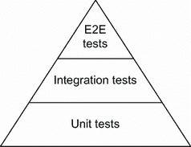
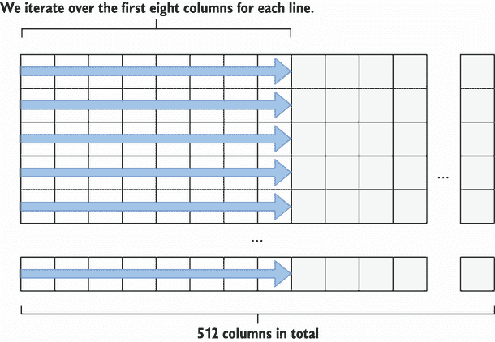

# 11 测试

本章涵盖

*   对测试进行分类，使它们更加健壮
*   使 Go 测试具有确定性
*   使用实用程序包，如`httptest`和`iotest`
*   避免常见的基准错误
*   改进测试流程

测试是项目生命周期的一个重要方面。它提供了无数的好处，比如建立对应用的信心，充当代码文档，以及使重构更容易。与其他一些语言相比，Go 拥有强大的编写测试的原语。在这一章中，我们将关注那些使测试过程变得脆弱、低效和不准确的常见错误。

## 11.1 #82:没有对测试进行分类

测试金字塔是一个将测试分成不同类别的模型(见图 11.1)。单元测试占据了金字塔的底部。大多数测试应该是单元测试:它们编写成本低，执行速度快，并且具有很高的确定性。通常，当我们走的时候

在金字塔的更高层，测试变得越来越复杂，运行越来越慢，并且更难保证它们的确定性。



图 11.1 测试金字塔的一个例子

一种常见的技术是明确要运行哪种测试。例如，根据项目生命周期的阶段，我们可能希望只运行单元测试或者运行项目中的所有测试。不对测试进行分类意味着潜在的浪费时间和精力，并且失去了测试范围的准确性。本节讨论了在 Go 中对测试进行分类的三种主要方法。

### 构建标签

分类测试最常见的方法是使用构建标签。构建标签是 Go 文件开头的特殊注释，后面跟一个空行。

例如，看看这个`bar.go`文件:

```go
//go:build foo

package bar
```

这个文件包含了`foo`标签。请注意，一个包可能包含多个带有不同构建标记的文件。

注从 Go 1.17 开始，语法`//` `+build foo`被`//go:build foo`取代。目前(Go 1.18)，`gofmt`同步这两种形式来帮助迁移。

构建标签主要用于两种情况。首先，我们可以使用`build`标签作为构建应用的条件选项:例如，如果我们希望只有在启用了`cgo`的情况下才包含源文件(`cgo`是一种让包调用 C 代码的方法)，我们可以添加`//go:build` `cgo``build`标签。第二，如果我们想要将一个测试归类为集成测试，我们可以添加一个特定的构建标志，比如`integration`。

下面是一个`db_test.go`文件示例:

```go
//go:build integration

package db

import (
    "testing"
)

func TestInsert(t *testing.T) {
    // ...
}
```

这里我们添加了`integration``build`标签来分类这个文件包含集成测试。使用构建标签的好处是我们可以选择执行哪种测试。例如，让我们假设一个包包含两个测试文件:

*   我们刚刚创建的文件:db_test.go

*   另一个不包含构建标签的文件:contract_test.go

如果我们在这个包中运行`go test`而没有任何选项，它将只运行没有构建标签的测试文件(contract_test.go):

```go
$ go test -v .
=== RUN   TestContract
--- PASS: TestContract (0.01s)
PASS
```

然而，如果我们提供了`integration`标签，运行`go test`也将包括`db_test.go`:

```go
$ go test --tags=integration -v .
=== RUN   TestInsert
--- PASS: TestInsert (0.01s)
=== RUN   TestContract
--- PASS: TestContract (2.89s)
PASS
```

因此，运行带有特定标签的测试包括没有标签的文件和匹配这个标签的文件。如果我们只想运行*集成测试*呢？一种可能的方法是在单元测试文件上添加一个否定标记。例如，使用`!integration`意味着只有当`integration`标志*不*启用时，我们才想要包含测试文件(contract_test.go):

```go
//go:build !integration

package db

import (
    "testing"
)

func TestContract(t *testing.T) {
    // ...
}
```

使用这种方法，

*   带`integration`标志运行`go test`仅运行集成测试。

*   在没有`integration`标志的情况下运行`go test`只会运行单元测试。

让我们讨论一个在单个测试层次上工作的选项，而不是一个文件。

### 环境变量

正如 Go 社区的成员 Peter Bourgon 所提到的，`build`标签有一个主要的缺点:缺少一个测试被忽略的信号(参见 [`mng.bz/qYlr`](http://mng.bz/qYlr) )。在第一个例子中，当我们在没有构建标志的情况下执行`go test`时，它只显示了被执行的测试:

```go
$ go test -v .
=== RUN   TestUnit
--- PASS: TestUnit (0.01s)
PASS
ok      db  0.319s
```

如果我们不小心处理标签的方式，我们可能会忘记现有的测试。出于这个原因，一些项目喜欢使用环境变量来检查测试类别的方法。

例如，我们可以通过检查一个特定的环境变量并可能跳过测试来实现`TestInsert`集成测试:

```go
func TestInsert(t *testing.T) {
    if os.Getenv("INTEGRATION") != "true" {
        t.Skip("skipping integration test")
    }

    // ...
}
```

如果`INTEGRATION`环境变量没有设置为`true`，测试将被跳过，并显示一条消息:

```go
$ go test -v .
=== RUN   TestInsert
    db_integration_test.go:12: skipping integration test     // ❶
--- SKIP: TestInsert (0.00s)
=== RUN   TestUnit
--- PASS: TestUnit (0.00s)
PASS
ok      db  0.319s
```

❶ 显示跳过测试的消息

使用这种方法的一个好处是明确哪些测试被跳过以及为什么。这种技术可能没有`build`标签使用得广泛，但是它值得了解，因为正如我们所讨论的，它提供了一些优势。

接下来，让我们看看另一种分类测试的方法:短模式。

### 短模式

另一种对测试进行分类的方法与它们的速度有关。我们可能必须将短期运行的测试与长期运行的测试分离开来。

作为一个例子，假设我们有一组单元测试，其中一个非常慢。我们希望对慢速测试进行分类，这样我们就不必每次都运行它(特别是当触发器是在保存一个文件之后)。短模式允许我们进行这种区分:

```go
func TestLongRunning(t *testing.T) {
    if testing.Short() {                        // ❶
        t.Skip("skipping long-running test")
    }
    // ...
}
```

❶ 将测试标记为长期运行

使用`testing.Short`，我们可以在运行测试时检索是否启用了短模式。然后我们使用`Skip`来跳过测试。要使用短模式运行测试，我们必须通过`-short`:

```go
% go test -short -v .
=== RUN   TestLongRunning
    foo_test.go:9: skipping long-running test
--- SKIP: TestLongRunning (0.00s)
PASS
ok      foo  0.174s
```

执行测试时，明确跳过`TestLongRunning`。请注意，与构建标签不同，该选项适用于每个测试，而不是每个文件。

总之，对测试进行分类是成功测试策略的最佳实践。在本节中，我们已经看到了三种对测试进行分类的方法:

*   在测试文件级别使用构建标签

*   使用环境变量来标记特定的测试

*   基于使用短模式的测试步速

我们还可以组合方法:例如，如果我们的项目包含长时间运行的单元测试，使用构建标签或环境变量来分类测试(例如，作为单元或集成测试)和短模式。

在下一节中，我们将讨论为什么启用`-race`标志很重要。

## 11.2 #83:不启用竞争标志

在错误#58“不理解竞争问题”中，我们将数据竞争定义为当两个 goroutines 同时访问同一个变量时发生，至少有一个变量被写入。我们还应该知道，Go 有一个标准的竞争检测工具来帮助检测数据竞争。一个常见的错误是忘记了这个工具的重要性，没有启用它。这一节讨论竞争检测器捕捉什么，如何使用它，以及它的局限性。

在 Go 中，竞争检测器不是编译期间使用的静态分析工具；相反，它是一个发现运行时发生的数据竞争的工具。要启用它，我们必须在编译或运行测试时启用`-race`标志。例如:

```go
$ go test -race ./...
```

一旦启用了竞争检测器，编译器就会检测代码来检测数据竞争。*插装*指的是编译器添加额外的指令:在这里，跟踪所有的内存访问并记录它们何时以及如何发生。在运行时，竞争检测器监视数据竞争。但是，我们应该记住启用竞争检测器的运行时开销:

*   内存使用量可能会增加 5 到 10 倍。

*   执行时间可能增加 2 到 20 倍。

由于这种开销，通常建议只在本地测试或持续集成(CI)期间启用竞争检测器。在生产中，我们应该避免使用它(或者只在金丝雀释放的情况下使用它)。

如果检测到竞争，Go 会发出警告。例如，这个例子包含了一个数据争用，因为`i`可以同时被读取和写入:

```go
package main

import (
    "fmt"
)

func main() {
    i := 0
    go func() { i++ }()
    fmt.Println(i)
}
```

使用`-race`标志运行该应用会记录以下数据竞争警告:

```go
==================
WARNING: DATA RACE
Write at 0x00c000026078 by goroutine 7:                // ❶
  main.main.func1()
      /tmp/app/main.go:9 +0x4e

Previous read at 0x00c000026078 by main goroutine:     // ❷
  main.main()
      /tmp/app/main.go:10 +0x88

Goroutine 7 (running) created at:                      // ❸
  main.main()
      /tmp/app/main.go:9 +0x7a
==================
```

❶ 指出，戈鲁丁 7 是写

❷ 指出主要的路线是阅读

❸ 指出了 goroutine 7 的创建时间

让我们确保阅读这些信息时感到舒适。Go 总是记录以下内容:

*   被牵连的并发 goroutine:这里是主 goroutine 和 goroutine 7。

*   代码中出现访问的地方:在本例中，是第 9 行和第 10 行。

*   创建这些 goroutine 的时间:goroutine 7 是在`main()`中创建的。

注意在内部，竞争检测器使用向量时钟，这是一种用于确定事件部分顺序的数据结构(也用于分布式系统，如数据库)。每一个 goroutine 的创造都会导致一个矢量时钟的产生。该工具在每次存储器访问和同步事件时更新向量时钟。然后，它比较矢量时钟以检测潜在的数据竞争。

竞争检测器不能捕捉假阳性(一个明显的数据竞争，而不是真正的数据竞争)。因此，如果我们得到警告，我们知道我们的代码包含数据竞争。相反，它有时会导致假阴性(遗漏实际的数据竞争)。

关于测试，我们需要注意两件事。首先，竞争检测器只能和我们的测试一样好。因此，我们应该确保针对数据竞争对并发代码进行彻底的测试。其次，考虑到可能的假阴性，如果我们有一个测试来检查数据竞争，我们可以将这个逻辑放在一个循环中。这样做增加了捕获可能的数据竞争的机会:

```go
func TestDataRace(t *testing.T) {
    for i := 0; i < 100; i++ {
        // Actual logic
    }
}
```

此外，如果一个特定的文件包含导致数据竞争的测试，我们可以使用`!race``build`标签将其从竞争检测中排除:

```go
//go:build !race

package main

import (
    "testing"
)

func TestFoo(t *testing.T) {
    // ...
}

func TestBar(t *testing.T) {
    // ...
}
```

只有在禁用竞争检测器的情况下，才会构建该文件。否则，整个文件不会被构建，所以测试不会被执行。

总之，我们应该记住，如果不是强制性的，强烈推荐使用并发性为应用运行带有`-race`标志的测试。这种方法允许我们启用竞争检测器，它检测我们的代码来捕捉潜在的数据竞争。启用时，它会对内存和性能产生重大影响，因此必须在特定条件下使用，如本地测试或 CI。

下面讨论与和执行模式相关的两个标志:`parallel`和`shuffle`。

## 11.3 #84:不使用测试执行模式

在运行测试时，`go`命令可以接受一组标志来影响测试的执行方式。一个常见的错误是没有意识到这些标志，错过了可能导致更快执行或更好地发现可能的 bug 的机会。让我们来看看其中的两个标志:`parallel`和`shuffle`。

### 平行旗

并行执行模式允许我们并行运行特定的测试，这可能非常有用:例如，加速长时间运行的测试。我们可以通过调用`t.Parallel`来标记测试必须并行运行:

```go
func TestFoo(t *testing.T) {
    t.Parallel()
    // ...
}
```

当我们使用`t.Parallel`标记一个测试时，它与所有其他并行测试一起并行执行。然而，在执行方面，Go 首先一个接一个地运行所有的顺序测试。一旦顺序测试完成，它就执行并行测试。

例如，以下代码包含三个测试，但其中只有两个被标记为并行运行:

```go
func TestA(t *testing.T) {
    t.Parallel()
    // ...
}

func TestB(t *testing.T) {
    t.Parallel()
    // ...
}

func TestC(t *testing.T) {
    // ...
}
```

运行该文件的测试会产生以下日志:

```go
=== RUN   TestA
=== PAUSE TestA           // ❶
=== RUN   TestB
=== PAUSE TestB           // ❷
=== RUN   TestC           // ❸
--- PASS: TestC (0.00s)
=== CONT  TestA           // ❹
--- PASS: TestA (0.00s)
=== CONT  TestB
--- PASS: TestB (0.00s)
PASS
```

❶ 暂停`TestA`

❷ 暂停`TestB`

❸ 运行`TestC`

❹ 恢复`TestA`和`TestB`

`TestC`第一个被处决。`TestA`和`TestB`首先被记录，但是它们被暂停，等待`TestC`完成。然后两者都被恢复并并行执行。

默认情况下，可以同时运行的最大测试数量等于`GOMAXPROCS`值。为了序列化测试，或者，例如，在进行大量 I/O 的长时间运行的测试环境中增加这个数字，我们可以使用的`-parallel`标志来改变这个值:

```go
$ go test -parallel 16 .
```

这里，并行测试的最大数量被设置为 16。

现在让我们看看运行 Go 测试的另一种模式:`shuffle`。

### 洗牌标志

从 Go 1.17 开始，可以随机化测试和基准的执行顺序。有什么道理？编写测试的最佳实践是将它们隔离开来。例如，它们不应该依赖于执行顺序或共享变量。这些隐藏的依赖关系可能意味着一个可能的测试错误，或者更糟糕的是，一个在测试过程中不会被发现的错误。为了防止这种情况，我们可以使用和`-shuffle`标志来随机化测试。我们可以将其设置为`on`或`off`来启用或禁用测试洗牌(默认情况下禁用):

```go
$ go test -shuffle=on -v .
```

然而，在某些情况下，我们希望以相同的顺序重新运行测试。例如，如果在 CI 期间测试失败，我们可能希望在本地重现错误。为此，我们可以传递用于随机化测试的种子，而不是将`on`传递给`-shuffle`标志。我们可以通过启用详细模式(`-v`)在运行混洗测试时访问这个种子值:

```go
$ go test -shuffle=on -v .
-test.shuffle 1636399552801504000     // ❶
=== RUN   TestBar
--- PASS: TestBar (0.00s)
=== RUN   TestFoo
--- PASS: TestFoo (0.00s)
PASS
ok      teivah  0.129s
```

❶ 种子价值

我们随机执行测试，但是`go` `test`打印种子值:`1636399552801504000`。为了强制测试以相同的顺序运行，我们将这个种子值提供给`shuffle`:

```go
$ go test -shuffle=1636399552801504000 -v .
-test.shuffle 1636399552801504000
=== RUN   TestBar
--- PASS: TestBar (0.00s)
=== RUN   TestFoo
--- PASS: TestFoo (0.00s)
PASS
ok      teivah  0.129s
```

测试以相同的顺序执行:`TestBar`然后是`TestFoo`。

一般来说，我们应该对现有的测试标志保持谨慎，并随时了解最近 Go 版本的新特性。并行运行测试是减少运行所有测试的总执行时间的一个很好的方法。并且`shuffle`模式可以帮助我们发现隐藏的依赖关系，这可能意味着在以相同的顺序运行测试时的测试错误，甚至是看不见的 bug。

## 11.4 #85:不使用表驱动测试

表驱动测试是一种有效的技术，用于编写精简的测试，从而减少样板代码，帮助我们关注重要的东西:测试逻辑。本节通过一个具体的例子来说明为什么在使用 Go 时表驱动测试是值得了解的。

让我们考虑下面的函数，它从字符串中删除所有的新行后缀(`\n`或`\r\n`):

```go
func removeNewLineSuffixes(s string) string {
    if s == "" {
        return s
    }
    if strings.HasSuffix(s, "\r\n") {
        return removeNewLineSuffixes(s[:len(s)-2])
    }
    if strings.HasSuffix(s, "\n") {
        return removeNewLineSuffixes(s[:len(s)-1])
    }
    return s
}
```

这个函数递归地删除所有前导的`\r\n`和`\n`后缀。现在，假设我们想要广泛地测试这个函数。我们至少应该涵盖以下情况:

*   输入为空。

*   输入以`\n`结束。

*   输入以`\r\n`结束。

*   输入以多个`\n`结束。

*   输入结束时没有换行符。

以下方法为每个案例创建一个单元测试:

```go
func TestRemoveNewLineSuffix_Empty(t *testing.T) {
    got := removeNewLineSuffixes("")
    expected := ""
    if got != expected {
        t.Errorf("got: %s", got)
    }
}

func TestRemoveNewLineSuffix_EndingWithCarriageReturnNewLine(t *testing.T) {
    got := removeNewLineSuffixes("a\r\n")
    expected := "a"
    if got != expected {
        t.Errorf("got: %s", got)
    }
}

func TestRemoveNewLineSuffix_EndingWithNewLine(t *testing.T) {
    got := removeNewLineSuffixes("a\n")
    expected := "a"
    if got != expected {
        t.Errorf("got: %s", got)
    }
}

func TestRemoveNewLineSuffix_EndingWithMultipleNewLines(t *testing.T) {
    got := removeNewLineSuffixes("a\n\n\n")
    expected := "a"
    if got != expected {
        t.Errorf("got: %s", got)
    }
}

func TestRemoveNewLineSuffix_EndingWithoutNewLine(t *testing.T) {
    got := removeNewLineSuffixes("a\n")
    expected := "a"
    if got != expected {
        t.Errorf("got: %s", got)
    }
}
```

每个功能都代表了我们想要涵盖的一个特定案例。然而，有两个主要缺点。首先，函数名更复杂(`TestRemoveNewLineSuffix_EndingWithCarriageReturnNewLine`有 55 个字符长)，这很快会影响函数测试内容的清晰度。第二个缺点是这些功能之间的重复量，因为结构总是相同的:

1.  谓`removeNewLineSuffixes`。

2.  定义期望值。

3.  比较数值。

4.  记录错误信息。

如果我们想要改变这些步骤中的一个——例如，将期望值作为错误消息的一部分包含进来——我们将不得不在所有的测试中重复它。我们写的测试越多，代码就越难维护。

相反，我们可以使用表驱动测试，这样我们只需编写一次逻辑。表驱动测试依赖于子测试，一个测试函数可以包含多个子测试。例如，以下测试包含两个子测试:

```go
func TestFoo(t *testing.T) {
    t.Run("subtest 1", func(t *testing.T) {    // ❶
        if false {
            t.Error()
        }
    })
    t.Run("subtest 2", func(t *testing.T) {    // ❷
        if 2 != 2 {
            t.Error()
        }
    })
}
```

❶ 进行第一个子测试，称为子测试 1

❷ 进行了第二个子测试，称为子测试 2

`TestFoo`功能包括两个子测试。如果我们运行这个测试，它显示了`subtest 1`和`subtest 2`的结果:

```go
--- PASS: TestFoo (0.00s)
    --- PASS: TestFoo/subtest_1 (0.00s)
    --- PASS: TestFoo/subtest_2 (0.00s)
PASS
```

我们还可以使用和`-run`标志运行一个单独的测试，并将父测试名与子测试连接起来。例如，我们可以只运行`subtest 1`:

```go
$ go test -run=TestFoo/subtest_1 -v      // ❶
=== RUN   TestFoo
=== RUN   TestFoo/subtest_1
--- PASS: TestFoo (0.00s)
    --- PASS: TestFoo/subtest_1 (0.00s)
```

❶ 使用-run 标志只运行子测试 1

让我们回到我们的例子，看看如何使用子测试来防止重复测试逻辑。主要想法是为每个案例创建一个子测试。变化是存在的，但是我们将讨论一个映射数据结构，其中键代表测试名称，值代表测试数据(输入，预期)。

表驱动测试通过使用包含测试数据和子测试的数据结构来避免样板代码。下面是一个使用映射的可能实现:

```go
func TestRemoveNewLineSuffix(t *testing.T) {
    tests := map[string]struct {                   // ❶
        input    string
        expected string
    }{
        `empty`: {                                 // ❷
            input:    "",
            expected: "",
        },
        `ending with \r\n`: {
            input:    "a\r\n",
            expected: "a",
        },
        `ending with \n`: {
            input:    "a\n",
            expected: "a",
        },
        `ending with multiple \n`: {
            input:    "a\n\n\n",
            expected: "a",
        },
        `ending without newline`: {
            input:    "a",
            expected: "a",
        },
    }
    for name, tt := range tests {                  // ❸
        t.Run(name, func(t *testing.T) {           // ❹
            got := removeNewLineSuffixes(tt.input)
            if got != tt.expected {
                t.Errorf("got: %s, expected: %s", got, tt.expected)
            }
        })
    }
}
```

❶ 定义了测试数据

❷ :映射中的每个条目代表一个子测试。

❸ 在映射上迭代

❹ 为每个映射条目运行一个新的子测试

`tests`变量是一个映射。关键是测试名称，值代表测试数据:在我们的例子中，输入和预期的字符串。每个映射条目都是我们想要覆盖的一个新的测试用例。我们为每个映射条目运行一个新的子测试。

这个测试解决了我们讨论的两个缺点:

*   每个测试名现在是一个字符串，而不是 Pascal 大小写函数名，这使得它更容易阅读。

*   该逻辑只编写一次，并在所有不同的情况下共享。修改测试结构或者增加一个新的测试需要最小的努力。

关于表驱动测试，我们需要提到最后一件事，它也可能是错误的来源:正如我们前面提到的，我们可以通过调用`t.Parallel`来标记一个并行运行的测试。我们也可以在提供给`t.Run`的闭包内的子测试中这样做:

```go
for name, tt := range tests {
    t.Run(name, func(t *testing.T) {
        t.Parallel()                   // ❶
        // Use tt
    })
}
```

❶ 标记了并行运行的子测试

然而，这个闭包使用了一个循环变量。为了防止类似于错误#63 中讨论的问题，“不小心使用 goroutines 和循环变量”，这可能导致闭包使用错误的`tt`变量的值，我们应该创建另一个变量或影子`tt`:

```go
for name, tt := range tests {
    tt := tt                          // ❶
    t.Run(name, func(t *testing.T) {
        t.Parallel()
        // Use tt
    })
}
```

❶ 跟踪`tt`，使其位于循环迭代的局部

这样，每个闭包都会访问它自己的`tt`变量。

总之，如果多个单元测试有相似的结构，我们可以使用表驱动测试来共同化它们。因为这种技术防止了重复，它使得改变测试逻辑变得简单，并且更容易添加新的用例。

接下来，我们来讨论如何在 Go 中防止片状测试。

## 11.5 #86:在单元测试中休眠

一个*切片*测试是一个不需要任何代码改变就可以通过和失败的测试。古怪的测试是测试中最大的障碍之一，因为它们调试起来很昂贵，并且削弱了我们对测试准确性的信心。在 Go 中，在测试中调用`time.Sleep`可能是可能出现问题的信号。例如，并发代码经常使用休眠进行测试。这一部分介绍了从测试中移除睡眠的具体技术，从而防止我们编写出易变的测试。

我们将用一个函数来说明这一部分，该函数返回值并启动一个在后台执行任务的 goroutine。我们将调用一个函数来获取一片`Foo`结构，并返回最佳元素(第一个)。与此同时，另一个 goroutine 将负责调用带有第`n`个`Foo`元素的`Publish`方法:

```go
type Handler struct {
    n         int
    publisher publisher
}

type publisher interface {
    Publish([]Foo)
}

func (h Handler) getBestFoo(someInputs int) Foo {
    foos := getFoos(someInputs)        // ❶
    best := foos[0]                    // ❷

    go func() {
        if len(foos) > h.n {           // ❸
            foos = foos[:h.n]
        }
        h.publisher.Publish(foos)      // ❹
    }()

    return best
}
```

❶ 得到`Foo`切片

❷ 保留第一个元素(为了简单起见，省略了检查`foos`的长度)

❸ 只保留前`n`个`Foo`结构

❹ 称之为发布方法

`Handler`结构包含两个字段:一个`n`字段和一个用于发布第一个`n` `Foo`结构的`publisher`依赖项。首先我们得到一片`Foo`；但是在返回第一个元素之前，我们旋转一个新的 goroutine，过滤`foos`片，并调用`Publish`。

我们如何测试这个功能？编写声明响应的部分非常简单。但是，如果我们还想检查传递给`Publish`的是什么呢？

我们可以模仿`publisher`接口来记录调用`Publish`方法时传递的参数。然后，我们可以在检查记录的参数之前休眠几毫秒:

```go
type publisherMock struct {
    mu  sync.RWMutex
    got []Foo
}

func (p *publisherMock) Publish(got []Foo) {
    p.mu.Lock()
    defer p.mu.Unlock()
    p.got = got
}

func (p *publisherMock) Get() []Foo {
    p.mu.RLock()
    defer p.mu.RUnlock()
    return p.got
}

func TestGetBestFoo(t *testing.T) {
    mock := publisherMock{}
    h := Handler{
        publisher: &mock,
        n:         2,
    }

    foo := h.getBestFoo(42)
    // Check foo

    time.Sleep(10 * time.Millisecond)    // ❶
    published := mock.Get()
    // Check published
}
```

❶ 在检查传递给`Publish`的参数之前，休眠了 10 毫秒

我们编写了一个对`publisher`的模拟，它依赖于一个互斥体来保护对`published`字段的访问。在我们的单元测试中，我们调用`time.Sleep`在检查传递给`Publish`的参数之前留出一些时间。

这种测试本来就不可靠。不能严格保证 10 毫秒就足够了(在本例中，有可能但不能保证)。

那么，有哪些选项可以改进这个单元测试呢？首先，我们可以使用重试来周期性地断言给定的条件。例如，我们可以编写一个函数，将一个断言作为参数，最大重试次数加上等待时间，定期调用该函数以避免繁忙循环:

```go
func assert(t *testing.T, assertion func() bool,
    maxRetry int, waitTime time.Duration) {
    for i := 0; i < maxRetry; i++ {
        if assertion() {               // ❶
            return
        }
        time.Sleep(waitTime)           // ❷
    }
    t.Fail()                           // ❸
}
```

❶ 检查断言

❷ 在重试前休眠

经过多次尝试后，❸最终失败了

该函数检查提供的断言，并在一定次数的重试后失败。我们也使用`time.Sleep`，但是我们可以用这段代码来缩短睡眠时间。

举个例子，让我们回到`TestGetBestFoo`:

```go
assert(t, func() bool {
    return len(mock.Get()) == 2
}, 30, time.Millisecond)
```

我们不是休眠 10 毫秒，而是每毫秒休眠一次，并配置最大重试次数。如果测试成功，这种方法可以减少执行时间，因为我们减少了等待时间。因此，实施重试策略是比使用被动睡眠更好的方法。

注意一些测试库，如`testify`，提供重试功能。例如，在`testify`中，我们可以使用`Eventually`函数，它实现了最终应该成功的断言和其他特性，比如配置错误消息。

另一个策略是使用通道来同步发布`Foo`结构的 goroutine 和测试 goroutine。例如，在模拟实现中，我们可以将这个值发送到一个通道，而不是将接收到的切片复制到一个字段中:

```go
type publisherMock struct {
    ch chan []Foo
}

func (p *publisherMock) Publish(got []Foo) {
    p.ch <- got                               // ❶
}

func TestGetBestFoo(t *testing.T) {
    mock := publisherMock{
        ch: make(chan []Foo),
    }
    defer close(mock.ch)

    h := Handler{
        publisher: &mock,
        n:         2,
    }
    foo := h.getBestFoo(42)
    // Check foo

    if v := len(<-mock.ch); v != 2 {          // ❷
        t.Fatalf("expected 2, got %d", v)
    }
}
```

❶ 发送收到的参数

❷ 比较了这些观点

发布者将接收到的参数发送到通道。同时，测试 goroutine 设置模拟并基于接收到的值创建断言。我们还可以实现一个超时策略，以确保如果出现问题，我们不会永远等待`mock.ch`。例如，我们可以将`select`与`time.After`一起使用。

我们应该支持哪个选项:重试还是同步？事实上，同步将等待时间减少到最低限度，如果设计得好的话，可以使测试完全确定。

如果我们不能应用同步，我们也许应该重新考虑我们的设计，因为我们可能有一个问题。如果同步确实不可能，我们应该使用重试选项，这是比使用被动睡眠来消除测试中的不确定性更好的选择。

让我们继续讨论如何在测试中防止剥落，这次是在使用时间 API 的时候。

## 11.6 #87:没有有效地处理时间 API

一些函数必须依赖于时间 API:例如，检索当前时间。在这种情况下，编写脆弱的单元测试可能会很容易失败。在本节中，我们将通过一个具体的例子来讨论选项。我们的目标并不是涵盖所有的用例及技术，而是给出关于使用时间 API 编写更健壮的函数测试的指导。

假设一个应用接收到我们希望存储在内存缓存中的事件。我们将实现一个`Cache`结构来保存最近的事件。此结构将公开三个方法，这些方法执行以下操作:

*   追加事件

*   获取所有事件

*   在给定的持续时间内修剪事件(我们将重点介绍这种方法)

这些方法中的每一个都需要访问当前时间。让我们使用`time.Now()`编写第三种方法的第一个实现(我们将假设所有事件都按时间排序):

```go
type Cache struct {
    mu     sync.RWMutex
    events []Event
}

type Event struct {
    Timestamp time.Time
    Data string
}

func (c *Cache) TrimOlderThan(since time.Duration) {
    c.mu.RLock()
    defer c.mu.RUnlock()

    t := time.Now().Add(-since)               // ❶
    for i := 0; i < len(c.events); i++ {
        if c.events[i].Timestamp.After(t) {
            c.events = c.events[i:]           // ❷
            return
        }
    }
}
```

❶ 从当前时间中减去给定的持续时间

❷ 负责整理这些事件

我们计算一个`t`变量，它是当前时间减去提供的持续时间。然后，因为事件是按时间排序的，所以一旦到达时间在`t`之后的事件，我们就更新内部的`events`片。

我们如何测试这种方法？我们可以依靠当前时间使用`time.Now`来创建事件:

```go
func TestCache_TrimOlderThan(t *testing.T) {
    events := []Event{                                        // ❶
        {Timestamp: time.Now().Add(-20 * time.Millisecond)},
        {Timestamp: time.Now().Add(-10 * time.Millisecond)},
        {Timestamp: time.Now().Add(10 * time.Millisecond)},
    }
    cache := &Cache{}
    cache.Add(events)                                         // ❷
    cache.TrimOlderThan(15 * time.Millisecond)                // ❸
    got := cache.GetAll()                                     // ❹
    expected := 2
    if len(got) != expected {
        t.Fatalf("expected %d, got %d", expected, len(got))
    }
}
```

❶ 利用时间创造事件。现在()

❷ 将这些事件添加到缓存中

❸ 整理了 15 毫秒前的事件

❹ 检索所有事件

我们使用`time.Now()`将一部分事件添加到缓存中，并增加或减少一些小的持续时间。然后，我们将这些事件调整 15 毫秒，并执行断言。

这种方法有一个主要缺点:如果执行测试的机器突然很忙，我们可能会修剪比预期更少的事件。我们也许能够增加提供的持续时间，以减少测试失败的机会，但这样做并不总是可能的。例如，如果时间戳字段是在添加事件时生成的未导出字段，该怎么办？在这种情况下，不可能传递特定的时间戳，最终可能会在单元测试中添加睡眠。

问题和`TrimOlderThan`的实现有关。因为它调用了`time.Now()`，所以实现健壮的单元测试更加困难。让我们讨论两种使我们的测试不那么脆弱的方法。

第一种方法是使检索当前时间的方法成为对`Cache`结构的依赖。在生产中，我们会注入真正的实现，而在单元测试中，我们会传递一个存根。

有多种技术可以处理这种依赖性，比如接口或函数类型。在我们的例子中，因为我们只依赖一个方法(`time.Now()`)，我们可以定义一个函数类型:

```go
type now func() time.Time

type Cache struct {
    mu     sync.RWMutex
    events []Event
    now    now
}
```

`now`类型是一个返回`time.Time`的函数。在工厂函数中，我们可以这样传递实际的`time.Now`函数:

```go
func NewCache() *Cache {
    return &Cache{
        events: make([]Event, 0),
        now:    time.Now,
    }
}
```

因为`now`依赖项仍未导出，所以外部客户端无法访问它。此外，在我们的单元测试中，我们可以通过基于预定义的时间注入`func() time.Time`的*假*实现来创建一个`Cache`结构:

```go
func TestCache_TrimOlderThan(t *testing.T) {
    events := []Event{                                         // ❶
        {Timestamp: parseTime(t, "2020-01-01T12:00:00.04Z")},
        {Timestamp: parseTime(t, "2020-01-01T12:00:00.05Z")},
        {Timestamp: parseTime(t, "2020-01-01T12:00:00.06Z")},
    }
    cache := &Cache{now: func() time.Time {                    // ❷
        return parseTime(t, "2020-01-01T12:00:00.06Z")
    }}
    cache.Add(events)
    cache.TrimOlderThan(15 * time.Millisecond)
    // ...
}

func parseTime(t *testing.T, timestamp string) time.Time {
    // ...
}
```

❶ 基于特定的时间戳创建事件

❷ 注入一个静态函数来固定时间

在创建新的`Cache`结构时，我们根据给定的时间注入`now`依赖。由于这种方法，测试是健壮的。即使在最坏的情况下，这个测试的结果也是确定的。

使用全局变量

我们可以通过一个全局变量来检索时间，而不是使用字段:

```go
var now = time.Now      // ❶
```

❶ 定义了一个现在的全局变量

一般来说，我们应该尽量避免这种易变的共享状态。在我们的例子中，这将导致至少一个具体的问题:测试将不再是孤立的，因为它们都依赖于一个共享的变量。因此，举例来说，测试不能并行运行。如果可能的话，我们应该将这些情况作为结构依赖的一部分来处理，促进测试隔离。

这个解决方案也是可扩展的。比如函数调用`time.After`怎么办？我们可以添加另一个`after`依赖项，或者创建一个将两个方法`Now`和`After`组合在一起的接口。然而，这种方法有一个主要的缺点:例如，如果我们从一个外部包中创建一个单元测试，那么`now`依赖就不可用(我们在错误 90“没有探索所有的 Go 测试特性”中探讨了这一点)。

在这种情况下，我们可以使用另一种技术。我们可以要求客户端提供当前时间，而不是将时间作为未报告的依赖项来处理:

```go
func (c *Cache) TrimOlderThan(now time.Time, since time.Duration) {
    // ...
}
```

为了更进一步，我们可以将两个函数参数*合并*到一个单独的`time.Time`中，该参数代表一个特定的时间点，直到我们想要调整事件:

```go
func (c *Cache) TrimOlderThan(t time.Time) {
    // ...
}
```

由呼叫者来计算这个时间点:

```go
cache.TrimOlderThan(time.Now().Add(time.Second))
```

而在测试中，我们也必须通过相应的时间:

```go
func TestCache_TrimOlderThan(t *testing.T) {
    // ...
    cache.TrimOlderThan(parseTime(t, "2020-01-01T12:00:00.06Z").
        Add(-15 * time.Millisecond))
    // ...
}
```

这种方法是最简单的，因为它不需要创建另一种类型和存根。

一般来说，我们应该谨慎测试使用`time` API 的代码。这可能是一扇为古怪的测试敞开的大门。在本节中，我们看到了两种处理方法。我们可以将`time`交互作为依赖的一部分，通过使用我们自己的实现或依赖外部库，我们可以在单元测试中伪造这种依赖；或者我们可以修改我们的 API，要求客户提供我们需要的信息，比如当前时间(这种技术更简单，但是更有限)。

现在让我们讨论两个与测试相关的有用的 Go 包:`httptest`和`iotest`。

## 11.7 #88:不使用测试实用程序包

标准库提供了用于测试的实用程序包。一个常见的错误是没有意识到这些包，并试图重新发明轮子或依赖其他不方便的解决方案。本节研究其中的两个包:一个在使用 HTTP 时帮助我们，另一个在进行 I/O 和使用读取器和写入器时使用。

### `httptest`包

`httptest`包（[`pkg.go.dev/net/http/httptest`](https://pkg.go.dev/net/http/httptest)）为客户端和服务器端的 HTTP 测试提供了工具。让我们看看这两个用例。

首先，让我们看看`httptest`如何在编写 HTTP 服务器时帮助我们。我们将实现一个处理程序，它执行一些基本的操作:编写标题和正文，并返回一个特定的状态代码。为了清楚起见，我们将省略错误处理:

```go
func Handler(w http.ResponseWriter, r *http.Request) {
    w.Header().Add("X-API-VERSION", "1.0")
    b, _ := io.ReadAll(r.Body)
    _, _ = w.Write(append([]byte("hello "), b...))     // ❶
    w.WriteHeader(http.StatusCreated)
}
```

❶ 将`hello`与请求体连接起来

HTTP 处理程序接受两个参数:请求和编写响应的方式。`httptest`包为两者提供了实用程序。对于请求，我们可以使用 HTTP 方法、URL 和主体使用`httptest.NewRequest`构建一个`*http.Request`。对于响应，我们可以使用`httptest.NewRecorder`来记录处理程序中的变化。让我们编写这个处理程序的单元测试:

```go
func TestHandler(t *testing.T) {
    req := httptest.NewRequest(http.MethodGet, "http://localhost",     // ❶
        strings.NewReader("foo"))
    w := httptest.NewRecorder()                                        // ❷
    Handler(w, req)                                                    // ❸

    if got := w.Result().Header.Get("X-API-VERSION"); got != "1.0" {   // ❹
        t.Errorf("api version: expected 1.0, got %s", got)
    }

    body, _ := ioutil.ReadAll(wordy)                                   // ❺
    if got := string(body); got != "hello foo" {
        t.Errorf("body: expected hello foo, got %s", got)
    }

    if http.StatusOK != w.Result().StatusCode {                        // ❻
        t.FailNow()
    }
}
```

❶ 构建请求

❷ 创造了反应记录器

❸ 调用负责人

❹ 验证 HTTP 报头

❺ 验证 HTTP 主体

❻验证 HTTP 状态代码

使用`httptest`测试处理程序并不测试传输(HTTP 部分)。测试的重点是用请求和记录响应的方法直接调用处理程序。然后，使用响应记录器，我们编写断言来验证 HTTP 头、主体和状态代码。

让我们看看硬币的另一面:测试 HTTP 客户端。我们将编写一个负责查询 HTTP 端点的客户机，该端点计算从一个坐标开车到另一个坐标需要多长时间。客户端看起来像这样:

```go
func (c DurationClient) GetDuration(url string,
    lat1, lng1, lat2, lng2 float64) (
    time.Duration, error) {
    resp, err := c.client.Post(
        url, "application/json",
        buildRequestBody(lat1, lng1, lat2, lng2),
    )
    if err != nil {
        return 0, err
    }

    return parseResponseBody(resp.Body)
}
```

这段代码对提供的 URL 执行 HTTP POST 请求，并返回解析后的响应(比如说，一些 JSON)。

如果我们想测试这个客户呢？一种选择是使用 Docker 并启动一个模拟服务器来返回一些预先注册的响应。然而，这种方法使得测试执行缓慢。另一个选择是使用`httptest.NewServer`来创建一个基于我们将提供的处理程序的本地 HTTP 服务器。一旦服务器启动并运行，我们可以将它的 URL 传递给`GetDuration`:

```go
func TestDurationClientGet(t *testing.T) {
    srv := httptest.NewServer(                                             // ❶
        http.HandlerFunc(
            func(w http.ResponseWriter, r *http.Request) {
                _, _ = w.Write([]byte(`{"duration": 314}`))                // ❷
            },
        ),
    )
    defer srv.Close()                                                      // ❸

    client := NewDurationClient()
    duration, err :=
        client.GetDuration(srv.URL, 51.551261, -0.1221146, 51.57, -0.13)   // ❹
    if err != nil {
        t.Fatal(err)
    }

    if duration != 314*time.Second {                                       // ❺
        t.Errorf("expected 314 seconds, got %v", duration)
    }
}
```

❶ 启动 HTTP 服务器

❷ 注册处理程序来服务响应

❸ 关闭了服务器

❹ 提供了服务器 URL

❺ 证实了这个回答

在这个测试中，我们创建了一个带有返回`314`秒的静态处理程序的服务器。我们还可以根据发送的请求做出断言。此外，当我们调用`GetDuration`时，我们提供启动的服务器的 URL。与测试处理程序相比，这个测试执行一个实际的 HTTP 调用，但是它的执行只需要几毫秒。

我们还可以使用 TLS 和`httptest.NewTLSServer`启动一个新的服务器，并使用`httptest.NewUnstartedServer`创建一个未启动的服务器，这样我们就可以延迟启动它。

让我们记住在 HTTP 应用的上下文中工作时`httptest`是多么有用。无论我们是编写服务器还是客户端，`httptest`都可以帮助我们创建高效的测试。

### `iotest`包

`iotest`包（[`pkg.go.dev/testing/iotest`](https://pkg.go.dev/testing/iotest)）实现了测试读者和作者的实用程序。这是一个很方便的包，但 Go 开发者经常会忘记。

当实现一个自定义的`io.Reader`时，我们应该记得使用`iotest.TestReader`来测试它。这个实用函数测试读取器的行为是否正确:它准确地返回读取的字节数，填充提供的片，等等。如果提供的阅读器实现了像`io.ReaderAt`这样的接口，它还会测试不同的行为。

假设我们有一个自定义的`LowerCaseReader`，它从给定的输入`io.Reader`中流出小写字母。下面是如何测试这个读者没有行为不端:

```go
func TestLowerCaseReader(t *testing.T) {
    err := iotest.TestReader(
        &LowerCaseReader{reader: strings.NewReader("aBcDeFgHiJ")},   // ❶
        []byte("acegi"),                                             // ❷
    )
    if err != nil {
        t.Fatal(err)
    }
}
```

❶ 提供了一个`io.Reader`

❷ 期望

我们通过提供自定义的`LowerCaseReader`和一个期望来调用`iotest.TestReader`:小写字母`acegi`。

`iotest`包的另一个用例是，以确保使用读取器和写入器的应用能够容忍错误:

*   `iotest.ErrReader`创建一个`io.Reader`返回一个提供的错误。

*   `iotest.HalfReader`创建一个`io.Reader`，它只读取从`io.Reader`请求的一半字节。

*   `iotest.OneByteReader`创建一个`io.Reader`，用于从`io.Reader`中读取每个非空字节。

*   `iotest.TimeoutReader`创建一个`io.Reader`，在第二次读取时返回一个没有数据的错误。后续调用将会成功。

*   `iotest.TruncateWriter`创建一个`io.Writer`写入一个`io.Writer`，但在`n`字节后静默停止。

例如，假设我们实现了以下函数，该函数从读取器读取所有字节开始:

```go
func foo(r io.Reader) error {
    b, err := io.ReadAll(r)
    if err != nil {
        return err
    }

    // ...
}
```

我们希望确保我们的函数具有弹性，例如，如果提供的读取器在读取期间失败(例如模拟网络错误):

```go
func TestFoo(t *testing.T) {
    err := foo(iotest.TimeoutReader(            // ❶
        strings.NewReader(randomString(1024)),
    ))
    if err != nil {
        t.Fatal(err)
    }
}
```

❶ `iotest.TimeoutReader`包装提供`io.Reader`。

我们用`io.TimeoutReader`包装一个`io.Reader`。正如我们提到的，二读会失败。如果我们运行这个测试来确保我们的函数能够容忍错误，我们会得到一个测试失败。实际上，`io.ReadAll`会返回它发现的任何错误。

知道了这一点，我们就可以实现我们的自定义`readAll`函数，它可以容忍多达`n`个错误:

```go
func readAll(r io.Reader, retries int) ([]byte, error) {
    b := make([]byte, 0, 512)
    for {
        if len(b) == cap(b) {
            b = append(b, 0)[:len(b)]
        }
        n, err := r.Read(b[len(b):cap(b)])
        b = b[:len(b)+n]
        if err != nil {
            if err == io.EOF {
                return b, nil
            }
            retries--
            if retries < 0 {     // ❶
                return b, err
            }
        }
    }
}
```

❶ 容忍重试

这个实现类似于`io.ReadAll`，但是它也处理可配置的重试。如果我们改变初始函数的实现，使用自定义的`readAll`而不是`io.ReadAll`，测试将不再失败:

```go
func foo(r io.Reader) error {
    b, err := readAll(r, 3)       // ❶
    if err != nil {
        return err
    }

    // ...
}
```

❶ 表示最多可重试三次

我们已经看到了一个例子，在从`io.Reader`中读取数据时，如何检查一个函数是否能够容忍错误。我们依靠的`iotest`包进行了测试。

当使用`io.Reader`和`io.Writer`进行 I/O 和工作时，让我们记住`iotest`包有多方便。正如我们所看到的，它提供了测试自定义`io.Reader`行为的实用程序，并针对读写数据时出现的错误测试我们的应用。

下一节讨论一些可能导致编写不准确基准的常见陷阱。

## 11.8 #89:编写不准确的基准

一般来说，我们永远不要去猜测性能。当编写优化时，许多因素可能会发挥作用，即使我们对结果有强烈的意见，测试它们也不是一个坏主意。然而，编写基准并不简单。编写不准确的基准并基于它们做出错误的假设可能非常简单。本节的目标是检查导致不准确的常见和具体的陷阱。

在讨论这些陷阱之前，让我们简单回顾一下基准在 Go 中是如何工作的。基准的框架如下:

```go
func BenchmarkFoo(b *testing.B) {
    for i := 0; i < b.N; i++ {
        foo()
    }
}
```

函数名以前缀`Benchmark`开头。被测函数(`foo`)在循环`for`中被调用。`b.N`代表可变的迭代次数。当运行一个基准时，Go 试图使它与请求的基准时间相匹配。基准时间默认设置为 1 秒，可通过`-benchtime`标志进行更改。`b.N`从 1 开始；如果基准在 1 秒内完成，`b.N`增加，基准再次运行，直到`b.N`与`benchtime`大致匹配:

```go
$ go test -bench=.
cpu: Intel(R) Core(TM) i5-7360U CPU @ 2.30GHz
BenchmarkFoo-4                73          16511228 ns/op
```

在这里，基准测试花费了大约 1 秒钟，`foo`被执行了 73 次，平均执行时间为 16511228 纳秒。我们可以使用`-benchtime`改变基准时间:

```go
$ go test -bench=. -benchtime=2s
BenchmarkFoo-4               150          15832169 ns/op
```

`foo`被执行死刑的人数大约是前一次基准期间的两倍。

接下来，我们来看看一些常见的陷阱。

### 11.8.1 不重置或暂停计时器

在某些情况下，我们需要在基准循环之前执行操作。这些操作可能需要相当长的时间(例如，生成大量数据)，并且可能会显著影响基准测试结果:

```go
func BenchmarkFoo(b *testing.B) {
    expensiveSetup()
    for i := 0; i < b.N; i++ {
        functionUnderTest()
    }
}
```

在这种情况下，我们可以在进入循环之前使用`ResetTimer`方法:

```go
func BenchmarkFoo(b *testing.B) {
    expensiveSetup()
    b.ResetTimer()                // ❶
    for i := 0; i < b.N; i++ {
        functionUnderTest()
    }
}
```

❶ 重置基准计时器

调用`ResetTimer`将测试开始以来运行的基准时间和内存分配计数器清零。这样，可以从测试结果中丢弃昂贵的设置。

如果我们必须不止一次而是在每次循环迭代中执行昂贵的设置，那该怎么办？

```go
func BenchmarkFoo(b *testing.B) {
    for i := 0; i < b.N; i++ {
        expensiveSetup()
        functionUnderTest()
    }
}
```

我们不能重置计时器，因为这将在每次循环迭代中执行。但是我们可以停止并恢复基准计时器，围绕对`expensiveSetup`的调用:

```go
func BenchmarkFoo(b *testing.B) {
    for i := 0; i < b.N; i++ {
        b.StopTimer()                // ❶
        expensiveSetup()
        b.StartTimer()               // ❷
        functionUnderTest()
    }
}
```

❶ 暂停了基准计时器

❷ 恢复基准计时器

这里，我们暂停基准计时器来执行昂贵的设置，然后恢复计时器。

注意，这种方法有一个问题需要记住:如果被测函数与设置函数相比执行速度太快，基准测试可能需要太长时间才能完成。原因是到达`benchtime`需要比 1 秒长得多的时间。基准时间的计算完全基于`functionUnderTest`的执行时间。因此，如果我们在每次循环迭代中等待很长时间，基准测试将会比 1 秒慢得多。如果我们想保持基准，一个可能的缓解措施是减少`benchtime`。

我们必须确保使用计时器方法来保持基准的准确性。

### 11.8.2 对微观基准做出错误的假设

微基准测试测量一个微小的计算单元，并且很容易对它做出错误的假设。比方说，我们不确定是使用`atomic.StoreInt32`还是`atomic.StoreInt64`(假设我们处理的值总是适合 32 位)。我们希望编写一个基准来比较这两种功能:

```go
func BenchmarkAtomicStoreInt32(b *testing.B) {
    var v int32
    for i := 0; i < b.N; i++ {
        atomic.StoreInt32(&v, 1)
    }
}

func BenchmarkAtomicStoreInt64(b *testing.B) {
    var v int64
    for i := 0; i < b.N; i++ {
        atomic.StoreInt64(&v, 1)
    }
}
```

如果我们运行该基准测试，下面是一些示例输出:

```go
cpu: Intel(R) Core(TM) i5-7360U CPU @ 2.30GHz
BenchmarkAtomicStoreInt32
BenchmarkAtomicStoreInt32-4       197107742             5.682 ns/op
BenchmarkAtomicStoreInt64
BenchmarkAtomicStoreInt64-4       213917528             5.134 ns/op
```

我们很容易认为这个基准是理所当然的，并决定使用`atomic.StoreInt64`,因为它似乎更快。现在，为了做一个*公平的*基准测试，我们颠倒一下顺序，先测试`atomic.StoreInt64`，再测试`atomic.StoreInt32`。以下是一些输出示例:

```go
BenchmarkAtomicStoreInt64
BenchmarkAtomicStoreInt64-4       224900722             5.434 ns/op
BenchmarkAtomicStoreInt32
BenchmarkAtomicStoreInt32-4       230253900             5.159 ns/op
```

这一次，`atomic.StoreInt32`效果更好。发生了什么事？

在微基准的情况下，许多因素都会影响结果，例如运行基准时的机器活动、电源管理、散热以及指令序列的更好的高速缓存对齐。我们必须记住，许多因素，即使在我们的 Go 项目范围之外，也会影响结果。

注意，我们应该确保执行基准测试的机器是空闲的。但是，外部流程可能在后台运行，这可能会影响基准测试结果。出于这个原因，像`perflock`这样的工具可以限制基准测试消耗多少 CPU。例如，我们可以用总可用 CPU 的 70%来运行基准测试，将 30%分配给操作系统和其他进程，并减少机器活动因素对结果的影响。

一种选择是使用`-benchtime`选项增加基准时间。类似于概率论中的大数定律，如果我们运行基准测试很多次，它应该倾向于接近它的期望值(假设我们忽略了指令缓存和类似机制的好处)。

另一种选择是在经典的基准工具之上使用外部工具。例如，`benchstat`工具，是`golang.org/x`库的的一部分，它允许我们计算和比较关于基准执行的统计数据。

让我们使用和`-count`选项运行基准测试 10 次，并将输出传输到一个特定的文件:

```go
$ go test -bench=. -count=10 | tee stats.txt
cpu: Intel(R) Core(TM) i5-7360U CPU @ 2.30GHz
BenchmarkAtomicStoreInt32-4     234935682                5.124 ns/op
BenchmarkAtomicStoreInt32-4     235307204                5.112 ns/op
// ...
BenchmarkAtomicStoreInt64-4     235548591                5.107 ns/op
BenchmarkAtomicStoreInt64-4     235210292                5.090 ns/op
// ...
```

然后我们可以对这个文件运行`benchstat`:

```go
$ benchstat stats.txt
name                time/op
AtomicStoreInt32-4  5.10ns ± 1%
AtomicStoreInt64-4  5.10ns ± 1%
```

结果是一样的:两个函数平均需要 5.10 纳秒来完成。我们还可以看到给定基准的执行之间的百分比变化:1%。这个指标告诉我们，两个基准都是稳定的，让我们对计算出的平均结果更有信心。因此，对于我们测试的使用情况(在特定机器上的特定 Go 版本中)，我们可以得出其执行时间与`atomic .StoreInt64`相似的结论，而不是得出`atomic.StoreInt32`更快或更慢的结论。

总的来说，我们应该对微基准保持谨慎。许多因素会显著影响结果，并可能导致错误的假设。增加基准测试时间或使用`benchstat`等工具重复执行基准测试并计算统计数据，可以有效地限制外部因素并获得更准确的结果，从而得出更好的结论。

我们还要强调的是，如果另一个系统最终运行了该应用，那么在使用在给定机器上执行的微基准测试的结果时，我们应该小心。生产系统的行为可能与我们运行微基准测试的系统大相径庭。

### 11.8.3 不注意编译器优化

另一个与编写基准相关的常见错误是被编译器优化所愚弄，这也可能导致错误的基准假设。在这一节中，我们来看看 Go issue 14813 ( [`github.com/golang/go/issues/14813`](https://github.com/golang/go/issues/14813) ，也是 Go 项目成员戴夫·切尼讨论过的)的人口计数函数(计算设置为`1`的位数的函数):

```go
const m1 = 0x5555555555555555
const m2 = 0x3333333333333333
const m4 = 0x0f0f0f0f0f0f0f0f
const h01 = 0x0101010101010101

func popcnt(x uint64) uint64 {
    x -= (x >> 1) & m1
    x = (x & m2) + ((x >> 2) & m2)
    x = (x + (x >> 4)) & m4
    return (x * h01) >> 56
}
```

这个函数接受并返回一个`uint64`。为了对这个函数进行基准测试，我们可以编写以下代码:

```go
func BenchmarkPopcnt1(b *testing.B) {
    for i := 0; i < b.N; i++ {
        popcnt(uint64(i))
    }
}
```

然而，如果我们执行这个基准测试，我们得到的结果低得惊人:

```go
cpu: Intel(R) Core(TM) i5-7360U CPU @ 2.30GHz
BenchmarkPopcnt1-4      1000000000               0.2858 ns/op
```

0.28 纳秒的持续时间大约是一个时钟周期，所以这个数字低得不合理。问题是开发人员对编译器优化不够仔细。在这种情况下，测试中的函数足够简单，可以作为*内联*的候选函数:这是一种用被调用函数的主体替换函数调用的优化，让我们可以避免函数调用，它占用的内存很小。一旦函数被内联，编译器会注意到该调用没有副作用，并将其替换为以下基准:

```go
func BenchmarkPopcnt1(b *testing.B) {
    for i := 0; i < b.N; i++ {
        // Empty
    }
}
```

基准现在是空的——这就是为什么我们得到了接近一个时钟周期的结果。为了防止这种情况发生，最佳实践是遵循以下模式:

1.  在每次循环迭代中，将结果赋给一个局部变量(基准函数上下文中的局部变量)。

2.  将最新结果赋给一个全局变量。

在我们的例子中，我们编写了以下基准:

```go
var global uint64                         // ❶

func BenchmarkPopcnt2(b *testing.B) {
    var v uint64                          // ❷
    for i := 0; i < b.N; i++ {
        v = popcnt(uint64(i))             // ❸
    }
    global = v                            // ❹
}
```

❶ 定义了一个全局变量

❷ 定义了一个局部变量

❸ 将结果赋给局部变量

❹ 将结果赋给全局变量

`global`是全局变量，而`v`是局部变量，其作用域是基准函数。在每次循环迭代中，我们将`popcnt`的结果赋给局部变量。然后我们将最新的结果赋给全局变量。

注意为什么不把`popcnt`调用的结果直接分配给`global`来简化测试呢？写入一个全局变量比写入一个局部变量要慢(我们在错误#95“不理解栈和堆”中讨论了这些概念)。因此，我们应该将每个结果写入一个局部变量，以限制每次循环迭代期间的内存占用。

如果我们运行这两个基准测试，我们现在会得到显著不同的结果:

```go
cpu: Intel(R) Core(TM) i5-7360U CPU @ 2.30GHz
BenchmarkPopcnt1-4      1000000000               0.2858 ns/op
BenchmarkPopcnt2-4      606402058                1.993 ns/op
```

`BenchmarkPopcnt2`是基准的准确版本。它保证我们避免了内联优化，内联优化会人为地降低执行时间，甚至会删除对被测函数的调用。依赖`BenchmarkPopcnt1`的结果可能会导致错误的假设。

让我们记住避免编译器优化愚弄基准测试结果的模式:将被测函数的结果赋给一个局部变量，然后将最新的结果赋给一个全局变量。这种最佳实践还可以防止我们做出不正确的假设。

### 被观察者效应所迷惑

在物理学中，观察者效应是观察行为对被观察系统的扰动。这种影响也可以在基准测试中看到，并可能导致对结果的错误假设。让我们看一个具体的例子，然后尝试减轻它。

我们想要实现一个函数来接收一个由`int64`元素组成的矩阵。这个矩阵有固定的 512 列，我们想计算前八列的总和，如图 11.2 所示。



图 11.2 计算前八列的总和

为了优化，我们还想确定改变列数是否有影响，所以我们还实现了第二个函数，有 513 列。实现如下:

```go
func calculateSum512(s [][512]int64) int64 {
    var sum int64
    for i := 0; i < len(s); i++ {     // ❶
        for j := 0; j < 8; j++ {      // ❷
            sum += s[i][j]            // ❸
        }
    }
    return sum
}

func calculateSum513(s [][513]int64) int64 {
    // Same implementation as calculateSum512
}
```

❶ 遍历每一行

❷ 遍历前八列

❸ 增量总和

我们遍历每一行，然后遍历前八列，并增加一个返回的`sum`变量。`calculateSum513`中的实现保持不变。

我们希望对这些函数进行基准测试，以确定在给定固定行数的情况下哪一个函数的性能最高:

```go
const rows = 1000

var res int64

func BenchmarkCalculateSum512(b *testing.B) {
    var sum int64
    s := createMatrix512(rows)       // ❶
    b.ResetTimer()
    for i := 0; i < b.N; i++ {
        sum = calculateSum512(s)     // ❷
    }
    res = sum
}

func BenchmarkCalculateSum513(b *testing.B) {
    var sum int64
    s := createMatrix513(rows)       // ❸
    b.ResetTimer()
    for i := 0; i < b.N; i++ {
        sum = calculateSum513(s)     // ❹
    }
    res = sum
}
```

❶ 创建了一个 512 列的矩阵

❷ 计算总数

❸ 创建了一个 513 列的矩阵

❹ 计算总数

我们希望只创建一次矩阵，以限制结果的影响。因此，我们在循环外调用`createMatrix512`和`createMatrix513`。我们可能期望结果是相似的，因为我们只希望迭代前八列，但实际情况并非如此(在我的机器上):

```go
cpu: Intel(R) Core(TM) i5-7360U CPU @ 2.30GHz
BenchmarkCalculateSum512-4        81854             15073 ns/op
BenchmarkCalculateSum513-4       161479              7358 ns/op
```

具有 513 列的第二个基准测试快了大约 50%。同样，因为我们只迭代了前八列，所以这个结果相当令人惊讶。

为了理解这种差异，我们需要理解 CPU 缓存的基础知识。简而言之，CPU 由不同的缓存组成(通常是 L1、L2 和 L3)。这些高速缓存降低了从主存储器访问数据的平均成本。在某些情况下，CPU 可以从主存储器中取出数据，并将其复制到 L1。在这种情况下，CPU 试图将`calculateSum`感兴趣的矩阵子集(每行的前八列)读入 L1。但是，在一种情况下(513 列)，矩阵适合内存，而在另一种情况下(512 列)，则不适合。

注意解释原因不在本章的范围内，但是我们在错误#91“不理解 CPU 缓存”中来看这个问题

回到基准测试，主要问题是我们在两种情况下都重复使用相同的矩阵。因为函数重复了成千上万次，所以当它接收一个普通的新矩阵时，我们不测量函数的执行。相反，我们测量一个函数，该函数获取一个矩阵，该矩阵已经包含缓存中存在的单元的子集。因此，因为`calculateSum513`导致缓存未命中更少，所以它有更好的执行时间。

这是观察者效应的一个例子。因为我们一直在观察一个被反复调用的 CPU 绑定函数，所以 CPU 缓存可能会发挥作用并显著影响结果。在这个例子中，为了防止这种影响，我们应该在每个测试期间创建一个矩阵，而不是重用一个:

```go
func BenchmarkCalculateSum512(b *testing.B) {
    var sum int64
    for i := 0; i < b.N; i++ {
        b.StopTimer()
        s := createMatrix512(rows)     // ❶
        b.StartTimer()
        sum = calculateSum512(s)
    }
    res = sum
}
```

❶ 在每次循环迭代中都会创建一个新矩阵

现在，在每次循环迭代中都会创建一个新矩阵。如果我们再次运行基准测试(并调整`benchtime`——否则执行时间太长)，结果会更接近:

```go
cpu: Intel(R) Core(TM) i5-7360U CPU @ 2.30GHz
BenchmarkCalculateSum512-4         1116             33547 ns/op
BenchmarkCalculateSum513-4          998             35507 ns/op
```

我们没有做出`calculateSum513`更快的错误假设，而是看到两个基准测试在接收新矩阵时会产生相似的结果。

正如我们在本节中看到的，因为我们重用了相同的矩阵，CPU 缓存显著影响了结果。为了防止这种情况，我们必须在每次循环迭代中创建一个新的矩阵。一般来说，我们应该记住，观察测试中的函数可能会导致结果的显著差异，特别是在低级别优化很重要的 CPU 绑定函数的微基准环境中。强制基准在每次迭代期间重新创建数据是防止这种影响的好方法。

在本章的最后一节，让我们看看一些关于GO测试的常见技巧。

## 11.9 #90:没有探索所有的 Go 测试功能

在编写测试时，开发人员应该了解 Go 的特定测试特性和选项。否则，测试过程可能不太准确，甚至效率更低。这一节讨论的主题可以让我们在编写 Go 测试时更加舒适。

### 代码覆盖率

在开发过程中，直观地看到测试覆盖了代码的哪些部分是很方便的。我们可以使用的`-coverprofile`标志来访问这些信息:

```go
$ go test -coverprofile=coverage.out ./...
```

这个命令创建一个`coverage.out`文件，然后我们可以使用`go tool cover`打开它:

```go
$ go tool cover -html=coverage.out
```

该命令打开 web 浏览器并显示每行代码的覆盖率。

默认情况下，只对当前被测试的包进行代码覆盖率分析。例如，假设我们有以下结构:

```go
/myapp
  |_ foo
    |_ foo.go
    |_ foo_test.go
  |_ bar
    |_ bar.go
    |_ bar_test.go
```

如果`foo.go`的某个部分只在`bar_test.go`中测试，默认情况下，它不会显示在覆盖率报告中。要包含它，我们必须在`myapp`文件夹中，并且使用`-coverpkg`标志:

```go
go test -coverpkg=./... -coverprofile=coverage.out ./...
```

我们需要记住这个特性来查看当前的代码覆盖率，并决定哪些部分值得更多的测试。

注意在追踪代码覆盖率时要保持谨慎。拥有 100%的测试覆盖率并不意味着一个没有 bug 的应用。正确地推理我们的测试覆盖的内容比任何静态的阈值更重要。

### 11.9.2 不同包装的测试

当编写单元测试时，一种方法是关注行为而不是内部。假设我们向客户端公开一个 API。我们可能希望我们的测试关注于从外部可见的东西，而不是实现细节。这样，如果实现发生变化(例如，如果我们将一个函数重构为两个)，测试将保持不变。它们也更容易理解，因为它们展示了我们的 API 是如何使用的。如果我们想强制执行这种做法，我们可以使用不同的包。

在 Go 中，一个文件夹中的所有文件应该属于同一个包，只有一个例外:一个测试文件可以属于一个`_test`包。例如，假设下面的`counter.go`源文件属于`counter`包:

```go
package counter

import "sync/atomic"

var count uint64

func Inc() uint64 {
    atomic.AddUint64(&count, 1)
    return count
}
```

测试文件可以存在于同一个包中，并访问内部文件，比如`count`变量。或者它可以存在于一个`counter_test`包中，比如这个`counter_test.go`文件:

```go
package counter_test

import (
    "testing"

    "myapp/counter"
)

func TestCount(t *testing.T) {
    if counter.Inc() != 1 {
        t.Errorf("expected 1")
    }
}
```

在这种情况下，测试是在一个外部包中实现的，不能访问内部包，比如`count`变量。使用这种实践，我们可以保证测试不会使用任何未导出的元素；因此，它将着重于测试公开的行为。

### 实用功能

在编写测试时，我们可以用不同于生产代码的方式处理错误。例如，假设我们想要测试一个函数，它将一个`Customer`结构作为参数。因为`Customer`的创建将被重用，为了测试，我们决定创建一个特定的`createCustomer`函数。该函数将返回一个可能的错误，并附带一个`Customer`:

```go
func TestCustomer(t *testing.T) {
    customer, err := createCustomer("foo")     // ❶
    if err != nil {
        t.Fatal(err)
    }
    // ...
}

func createCustomer(someArg string) (Customer, error) {
    // Create customer
    if err != nil {
        return Customer{}, err
    }
    return customer, nil
}
```

❶ 创建一个客户并检查错误

我们使用`createCustomer`实用函数创建一个客户，然后我们执行剩下的测试。然而，在测试函数的上下文中，我们可以通过将`*testing.T`变量传递给实用函数来简化错误管理:

```go
func TestCustomer(t *testing.T) {
    customer := createCustomer(t, "foo")     // ❶
    // ...
}

func createCustomer(t *testing.T, someArg string) Customer {
    // Create customer
    if err != nil {
        t.Fatal(err)                         // ❷
    }
    return customer
}
```

❶ 调用效用函数并提供`t`

❷ 如果我们不能创造一个客户，就直接失败了

如果不能创建一个`Customer`，那么`createCustomer`会直接测试失败，而不是返回一个错误。这使得`TestCustomer`写起来更小，读起来更容易。

让我们记住这个关于错误管理和测试的实践来改进我们的测试。

### 安装和拆卸

在某些情况下，我们可能需要准备一个测试环境。例如，在集成测试中，我们启动一个特定的 Docker 容器，然后停止它。我们可以为每个测试或每个包调用安装和拆卸函数。幸运的是，在GO中，两者都有可能。

为了每次测试都这样做，我们可以使用`defer`调用安装函数和拆卸函数作为预操作:

```go
func TestMySQLIntegration(t *testing.T) {
    setupMySQL()
    defer teardownMySQL()
    // ...
}
```

也可以注册一个在测试结束时执行的函数。例如，让我们假设`TestMySQLIntegration`需要调用`createConnection`来创建数据库连接。如果我们希望这个函数也包含拆卸部分，我们可以使用`t.Cleanup`来注册一个清理函数:

```go
func TestMySQLIntegration(t *testing.T) {
    // ...
    db := createConnection(t, "tcp(localhost:3306)/db")
    // ...
}

func createConnection(t *testing.T, dsn string) *sql.DB {
    db, err := sql.Open("mysql", dsn)
    if err != nil {
        t.FailNow()
    }
    t.Cleanup(          // ❶
        func() {
            _ = db.Close()
        })
    return db
}
```

❶ 注册了一个要在测试结束时执行的函数

测试结束时，执行提供给`t.Cleanup`的关闭。这使得未来的单元测试更容易编写，因为它们不会负责关闭`db`变量。

注意，我们可以注册多个清理函数。在这种情况下，它们将被执行，就像我们使用`defer`一样:后进先出。

为了处理每个包的安装和拆卸，我们必须使用`TestMain`函数。下面是`TestMain`的一个简单实现:

```go
func TestMain(m *testing.M) {
    os.Exit(m.Run())
}
```

这个特定的函数接受一个`*testing.M`参数，该参数公开了一个运行所有测试的`Run`方法。因此，我们可以用安装和拆卸数围绕这个调用:

```go
func TestMain(m *testing.M) {
    setupMySQL()                 // ❶
    code := m.Run()              // ❷
    teardownMySQL()              // ❸
    os.Exit(code)
}
```

❶ 建立了 MySQL

❷ 负责测试

❸ 拆了 MySQL

这段代码在所有测试之前启动 MySQL 一次，然后将其关闭。

使用这些实践来添加安装和拆卸功能，我们可以为我们的测试配置一个复杂的环境。

## 摘要

*   使用构建标志、环境变量或者短模式对测试进行分类使得测试过程更加有效。您可以使用构建标志或环境变量来创建测试类别(例如，单元测试与集成测试)，并区分短期和长期运行的测试，以决定执行哪种测试。

*   在编写并发应用时，强烈建议启用`-race`标志。这样做可以让您捕捉到可能导致软件错误的潜在数据竞争。

*   使用`-parallel`标志是加速测试的有效方法，尤其是长时间运行的测试。

*   使用`-shuffle`标志来帮助确保测试套件不依赖于可能隐藏 bug 的错误假设。

*   表驱动测试是一种有效的方法，可以将一组相似的测试分组，以防止代码重复，并使未来的更新更容易处理。

*   使用同步来避免睡眠，以使测试不那么不稳定，更健壮。如果同步是不可能的，考虑重试的方法。

*   理解如何使用时间 API 处理函数是使测试不那么容易出错的另一种方法。您可以使用标准技术，比如将时间作为隐藏依赖项的一部分来处理，或者要求客户端提供时间。

*   `httptest`包有助于处理 HTTP 应用。它提供了一组测试客户机和服务器的实用程序。

*   `iotest`包帮助编写`io.Reader`并测试应用是否能够容忍错误。

*   关于基准:

    *   使用时间方法保持基准的准确性。
    *   增加`benchtime`或使用`benchstat`等工具在处理微基准时会有所帮助。
    *   如果最终运行应用的系统与运行微基准测试的系统不同，请小心微基准测试的结果。
    *   确保被测函数会导致副作用，防止编译器优化在基准测试结果上欺骗你。
    *   为了防止观察者效应，强制基准重新创建 CPU 绑定函数使用的数据。
*   使用带有`-coverprofile`标志的代码覆盖率来快速查看哪部分代码需要更多的关注。

*   将单元测试放在一个不同的包中，以强制编写关注于公开行为而不是内部的测试。

*   使用`*testing.T`变量而不是经典的`if` `err !=` `nil`来处理错误使得代码更短，更容易阅读。

*   你可以使用安装和拆卸功能来配置一个复杂的环境，比如在集成测试的情况下。