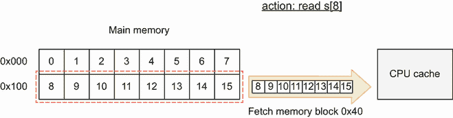
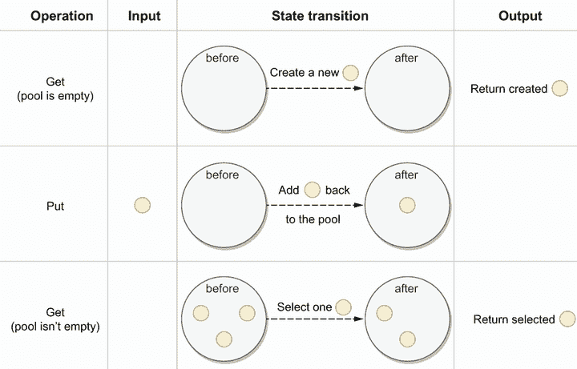

# 十二、优化

本章涵盖

*   研究机械同情心的概念
*   了解堆与栈并减少分配
*   使用标准 Go 诊断工具
*   了解垃圾收集器的工作原理
*   跑GO里面的 Docker 和 Kubernetes

在我们开始这一章之前，一个免责声明:在大多数情况下，编写可读、清晰的代码比编写优化但更复杂、更难理解的代码要好。优化通常是有代价的，我们建议您遵循软件工程师 Wes Dyer 的这句名言:

使其正确，使其清晰，使其简洁，使其快速，按此顺序。

这并不意味着禁止优化应用的速度和效率。例如，我们可以尝试识别需要优化的代码路径，因为有必要这样做，比如让我们的客户满意或者降低我们的成本。在本章中，我们将讨论常见的优化技术；有些是特定要去的，有些不是。我们还讨论了识别瓶颈的方法，这样我们就不会盲目工作。

## 12.1 #91:不了解 CPU 缓存

当赛车手不一定要当工程师，但一定要有机械同情心。

——三届 F1 世界冠军杰基·斯图瓦特创建的一个术语

简而言之，当我们了解一个系统是如何被设计使用的，无论是 F1 赛车、飞机还是计算机，我们都可以与设计保持一致，以获得最佳性能。在本节中，我们将讨论一些具体的例子，在这些例子中，对 CPU 缓存如何工作的机械同情可以帮助我们优化 Go 应用。

### 12.1.1 CPU 架构

首先让我们了解一下 CPU 架构的基础知识，以及为什么 CPU 缓存很重要。我们将以英特尔酷睿 i5-7300 为例。

现代 CPU 依靠缓存来加速内存访问，大多数情况下通过三个缓存级别:L1、L2 和 L3。在 i5-7300 上，这些高速缓存的大小如下:

*   L1: 64 KB

*   L2: 256 KB

*   三级:4 MB

i5-7300 有两个物理内核，但有四个逻辑内核(也称为*虚拟内核*或*线程*)。在英特尔家族中，将一个物理内核划分为多个逻辑内核称为超线程。

图 12.1 给出了英特尔酷睿 i5-7300 的概述(`Tn`代表*线程`n`*)。每个物理核心(核心 0 和核心 1)被分成两个逻辑核心(线程 0 和线程 1)。L1 缓存分为两个子缓存:L1D 用于数据，L1I 用于指令(每个 32 KB)。缓存不仅仅与数据相关，当 CPU 执行一个应用时，它也可以缓存一些指令，理由相同:加速整体执行。


图 12.1 i5-7300 具有三级高速缓存、两个物理内核和四个逻辑内核。

存储器位置越靠近逻辑核心，访问速度越快(参见 [`mng.bz/o29v`](http://mng.bz/o29v) ):

*   L1:大约 1 纳秒

*   L2:大约比 L1 慢 4 倍

*   L3:大约比 L1 慢 10 倍

CPU 缓存的物理位置也可以解释这些差异。L1 和 L2被称为*片上*，这意味着它们与处理器的其余部分属于同一块硅片。相反，L3 是*片外*，这部分解释了与 L1 和 L2 相比的延迟差异。

对于主内存(或 RAM)，平均访问速度比 L1 慢 50 到 100 倍。我们可以访问存储在 L1 上的多达 100 个变量，只需支付一次访问主存储器的费用。因此，作为 Go 开发人员，一个改进的途径是确保我们的应用使用 CPU 缓存。

### 12.1.2 高速缓存行

理解高速缓存行的概念至关重要。但是在介绍它们是什么之前，让我们了解一下为什么我们需要它们。

当访问特定的内存位置时(例如，通过读取变量)，在不久的将来可能会发生以下情况之一:

*   相同的位置将被再次引用。

*   将引用附近的存储位置。

前者指时间局部性，后者指空间局部性。两者都是称为引用位置的原则的一部分。

例如，让我们看看下面这个计算一个`int64`切片之和的函数:

```go
func sum(s []int64) int64 {
    var total int64
    length := len(s)
    for i := 0; i < length; i++ {
        total += s[i]
    }
    return total
}
```

在这个例子中，时间局部性适用于多个变量:`i`、`length`和`total`。在整个迭代过程中，我们不断地访问这些变量。空间局部性适用于代码指令和切片`s`。因为一个片是由内存中连续分配的数组支持的，在这种情况下，访问`s[0]`也意味着访问`s[1]`、`s[2]`等等。

时间局部性是我们需要 CPU 缓存的部分原因:加速对相同变量的重复访问。然而，由于空间局部性，CPU 复制我们称之为*缓存行*，而不是将单个变量从主内存复制到缓存。

高速缓存行是固定大小的连续内存段，通常为 64 字节(8 个`int64`变量)。每当 CPU 决定从 RAM 缓存内存块时，它会将内存块复制到缓存行。因为内存是一个层次结构，当 CPU 想要访问一个特定的内存位置时，它首先检查 L1，然后是 L2，然后是 L3，最后，如果该位置不在这些缓存中，则检查主内存。

让我们用一个具体的例子来说明获取内存块。我们第一次用 16 个`int64`元素的切片调用`sum`函数。当`sum`访问`s[0]`时，这个内存地址还不在缓存中。如果 CPU 决定缓存这个变量(我们在本章后面也会讨论这个决定)，它会复制整个内存块；参见图 12.2。


图 12.2 访问`s[0]`使 CPU 复制 0x000 内存块。

首先，访问`s[0]`会导致缓存未命中，因为地址不在缓存中。这种错过被称为一种*强制错过*。但是，如果 CPU 获取 0x000 存储块，访问从 1 到 7 的元素会导致缓存命中。当`sum`访问`s[8]`时，同样的逻辑也适用(见图 12.3)。



图 12.3 访问`s[8]`使 CPU 复制 0x100 内存块。

同样，访问`s8`会导致强制未命中。但是如果将`0x100`内存块复制到高速缓存行中，也会加快对元素 9 到 15 的访问。最后，迭代 16 个元素导致 2 次强制缓存未命中和 14 次缓存命中。

CPU 缓存策略

你可能想知道当 CPU 复制一个内存块时的确切策略。例如，它会将一个块复制到所有级别吗？只去 L1？在这种情况下，L2 和 L3 怎么办？

我们必须知道存在不同的策略。有时缓存是包含性的(例如，L2 数据也存在于 L3 中)，有时缓存是排他性的(例如，L3 被称为*牺牲缓存*，因为它只包含从 L2 逐出的数据)。

一般来说，这些策略都是 CPU 厂商隐藏的，知道了不一定有用。所以，这些问题我们就不深究了。

让我们看一个具体的例子来说明 CPU 缓存有多快。我们将实现两个函数，它们在迭代一片`int64`元素时计算总数。在一种情况下，我们将迭代每两个元素，在另一种情况下，迭代每八个元素:

```go
func sum2(s []int64) int64 {
    var total int64
    for i := 0; i < len(s); i+=2 {     // ❶
        total += s[i]
    }
    return total
}

func sum8(s []int64) int64 {
    var total int64
    for i := 0; i < len(s); i += 8 {   // ❷
        total += s[i]
    }
    return total
}
```

❶ 迭代每两个元素

❷ 迭代每八个元素

除了迭代之外，这两个函数是相同的。如果我们对这两个函数进行基准测试，我们的直觉可能是第二个版本会快四倍，因为我们需要增加的元素少了四倍。然而，运行基准测试表明`sum8`在我的机器上只快了 10%:仍然更快，但是只快了 10%。

原因与缓存行有关。我们看到一个缓存行通常是 64 字节，包含多达 8 个`int64`变量。这里，这些循环的运行时间是由内存访问控制的，而不是增量指令。在第一种情况下，四分之三的访问导致缓存命中。因此，这两个函数的执行时间差异并不明显。这个例子展示了为什么缓存行很重要，以及如果我们缺乏机械的同情心，我们很容易被我们的直觉所欺骗——在这个例子中，是关于 CPU 如何缓存数据的。

让我们继续讨论引用的局部性，看一个使用空间局部性的具体例子。

### 12.1.3 结构切片与切片结构

本节看一个比较两个函数执行时间的例子。第一个将一部分结构作为参数，并对所有的`a`字段求和:

```go
type Foo struct {
    a int64
    b int64
}

func sumFoo(foos []Foo) int64 {         // ❶
    var total int64
    for i := 0; i < len(foos); i++ {    // ❷
        total += foos[i].a
    }
    return total
}
```

❶ 获取`Foo`切片

❷ 对每个`Foo`进行迭代，并对每个字段求和

`sumFoo`接收`Foo`的一部分，并通过读取每个`a`域来增加`total`。

第二个函数也计算总和。但是这一次，参数是一个包含片的结构:

```go
type Bar struct {
    a []int64                           // ❶
    b []int64
}

func sumBar(bar Bar) int64 {            // ❷
    var total int64
    for i := 0; i < len(bar.a); i++ {   // ❸
        total += bar.a[i]               // ❹
    }
    return total
}
```

❶ `a`和`b`现在是切片。

❷ 接收单个结构

❸ 遍历`bar`

❹ 增加了`total`

`sumBar`接收一个包含两个切片的`Bar`结构:`a`和`b`。它遍历`a`的每个元素来增加`total`。

我们期望这两个函数在速度上有什么不同吗？在运行基准测试之前，让我们在图 12.4 中直观地看看内存的差异。两种情况的数据量相同:切片中有 16 个`Foo`元素，切片中有 16 个`Bar`元素。每个黑条代表一个被读取以计算总和的`int64`，而每个灰条代表一个被跳过的`int64`。


图 12.4 切片结构更紧凑，因此需要迭代的缓存行更少。

在`sumFoo`的情况下，我们收到一个包含两个字段`a`和`b`的结构片。因此，我们在内存中有一连串的`a`和`b`。相反，在`sumBar`的情况下，我们收到一个包含两个片的结构，`a`和`b`。因此，`a`的所有元素都是连续分配的。

这种差异不会导致任何内存压缩优化。但是这两个函数的目标都是迭代每个`a`，这样做在一种情况下需要四个缓存行，在另一种情况下只需要两个缓存行。

如果对这两个函数进行基准测试，`sumBar`更快(在我的机器上大约快 20%)。主要原因是更好的空间局部性，这使得 CPU 从内存中获取更少的缓存行。

这个例子演示了空间局部性如何对性能产生重大影响。为了优化应用，我们应该组织数据，以从每个单独的缓存行中获得最大的价值。

但是，使用空间局部性就足以帮助 CPU 了吗？我们仍然缺少一个关键特征:可预测性。

### 12.1.4 可预测性

可预测性是指 CPU 预测应用将如何加速其执行的能力。让我们看一个具体的例子，缺乏可预测性会对应用性能产生负面影响。

再一次，让我们看两个对元素列表求和的函数。第一个循环遍历一个链表并对所有值求和:

```go
type node struct {             // ❶
    value int64
    next  *node
}

func linkedList(n *node) int64 {
    var total int64
    for n != nil {             // ❷
        total += n.value       // ❸
        n = n.next
    }
    return total
}
```

❶ 链表数据结构

❷ 迭代每个节点

❸ 增加`total`

这个函数接收一个链表，遍历它，并增加一个总数。

另一方面，让我们再来看一下`sum2`函数，它迭代一个片，两个元素中的一个:

```go
func sum2(s []int64) int64 {
    var total int64
    for i := 0; i < len(s); i+=2 {     // ❶
        total += s[i]
    }
    return total
}
```

❶ 迭代每两个元素

让我们假设链表是连续分配的:例如，由单个函数分配。在 64 位架构中，一个字的长度是 64 位。图 12.5 比较了函数接收的两种数据结构(链表或切片)；深色的条代表

我们用来增加总数的`int64`元素。


图 12.5 在内存中，链表和切片以类似的方式压缩。

在这两个例子中，我们面临类似的压缩。因为链表是由一连串的值和 64 位指针元素组成的，所以我们使用两个元素中的一个来增加总和。同时，`sum2`的例子只读取了两个元素中的一个。

这两个数据结构具有相同的空间局部性，因此我们可以预期这两个函数的执行时间相似。但是在片上迭代的函数要快得多(在我的机器上大约快 70%)。原因是什么？

要理解这一点，我们得讨论一下大步走的概念。跨越与 CPU 如何处理数据有关。有三种不同类型的步幅(见图 12.6):

*   *单位步幅*——我们要访问的所有值都是连续分配的:比如一片`int64`元素。这一步对于 CPU 来说是可预测的，也是最有效的，因为它需要最少数量的缓存行来遍历元素。

*   *恒定步幅*——对于 CPU 来说仍然是可预测的:例如，每两个元素迭代一次的切片。这个步幅需要更多的缓存行来遍历数据，因此它的效率比单位步幅低。

*   *非单位步幅*——CPU 无法预测的一个步幅:比如一个链表或者一片指针。因为 CPU 不知道数据是否是连续分配的，所以它不会获取任何缓存行。


图 12.6 三种类型的步幅

对于`sum2`，我们面对的是一个不变的大步。但是，对于链表来说，我们面临的是非单位跨步。即使我们知道数据是连续分配的，CPU 也不知道。因此，它无法预测如何遍历链表。

由于不同的步距和相似的空间局部性，遍历一个链表比遍历一个值要慢得多。由于更好的空间局部性，我们通常更喜欢单位步幅而不是常数步幅。但是，无论数据如何分配，CPU 都无法预测非单位步幅，从而导致负面的性能影响。

到目前为止，我们已经讨论了 CPU 缓存速度很快，但明显小于主内存。因此，CPU 需要一种策略来将内存块提取到缓存行。这种策略称为*缓存放置策略*和会显著影响性能。

### 12.1.5 缓存放置策略

在错误#89“编写不准确的基准测试”中，我们讨论了一个矩阵示例，其中我们必须计算前八列的总和。在这一点上，我们没有解释为什么改变列的总数会影响基准测试的结果。这听起来可能违反直觉:因为我们只需要读取前八列，为什么改变总列数会影响执行时间？让我们来看看这一部分。

提醒一下，实现如下:

```go
func calculateSum512(s [][512]int64) int64 {     // ❶
    var sum int64
    for i := 0; i < len(s); i++ {
        for j := 0; j < 8; j++ {
            sum += s[i][j]
        }
    }
    return sum
}

func calculateSum513(s [][513]int64) int64 {     // ❷
    // Same implementation as calculateSum512
}
```

❶ 接收 512 列的矩阵

❷ 接收 513 列的矩阵

我们迭代每一行，每次对前八列求和。当这两个函数每次都用一个新矩阵作为基准时，我们没有观察到任何差异。然而，如果我们继续重用相同的矩阵，`calculateSum513`在我的机器上大约快 50%。原因在于 CPU 缓存以及如何将内存块复制到缓存行。让我们对此进行检查，以了解这种差异。

当 CPU 决定复制一个内存块并将其放入缓存时，它必须遵循特定的策略。假设 L1D 缓存为 32 KB，缓存行为 64 字节，如果将一个块随机放入 L1D，CPU 在最坏的情况下将不得不迭代 512 个缓存行来读取一个变量。这种缓存叫做*全关联*。

为了提高从 CPU 缓存中访问地址的速度，设计人员在缓存放置方面制定了不同的策略。让我们跳过历史，讨论一下今天使用最广泛的选项:*组关联缓存*，其中依赖于缓存分区。

为了使下图更清晰，我们将简化问题:

*   我们假设 L1D 缓存为 512 字节(8 条缓存线)。

*   矩阵由 4 行 32 列组成，我们将只读取前 8 列。

图 12.7 显示了这个矩阵如何存储在内存中。我们将使用内存块地址的二进制表示。同样，灰色块代表我们想要迭代的前 8 个`int64`元素。剩余的块在迭代过程中被跳过。


图 12.7 存储在内存中的矩阵，以及用于执行的空缓存

每个存储块包含 64 个字节，因此有 8 个`int64`元素。第一个内存块从 0x000000000000 开始，第二个从 0001000000000(二进制 512)开始，依此类推。我们还展示了可以容纳 8 行的缓存。

请注意，我们将在错误#94“不知道数据对齐”中看到，切片不一定从块的开头开始。

使用组关联高速缓存策略，高速缓存被划分为多个组。我们假设高速缓存是双向组关联的，这意味着每个组包含两行。一个内存块只能属于一个集合，其位置由内存地址决定。为了理解这一点，我们必须将内存块地址分成三个部分:

*   *块偏移*是基于块大小的。这里块的大小是 512 字节，512 等于`2^9`。因此，地址的前 9 位代表块偏移(BO)。

*   *集合索引*表示一个地址所属的集合。因为高速缓存是双向组关联的，并且包含 8 行，所以我们有`8 / 2 = 4`个组。此外，4 等于`2^2`，因此接下来的两位表示集合索引(SI)。

*   地址的其余部分由标签位(TB)组成。在图 12.7 中，为了简单起见，我们用 13 位来表示一个地址。为了计算 TB，我们使用`13 - BO - SI`。这意味着剩余的两位代表标签位。

假设该函数启动并试图读取属于地址 000000000000 的`s[0][0]`。因为这个地址还不在高速缓存中，所以 CPU 计算它的集合索引并将其复制到相应的高速缓存集合中(图 12.8)。


图 12.8 内存地址 000000000000 被复制到集合 0。

如前所述，9 位代表块偏移量:这是每个内存块地址的最小公共前缀。然后，2 位表示集合索引。地址为 0000000000000 时，SI 等于 00。因此，该存储块被复制到结合 0。

当函数从`s[0][1]`读取到`s[0][7]`时，数据已经在缓存中。CPU 是怎么知道的？CPU 计算存储块的起始地址，计算集合索引和标记位，然后检查集合 0 中是否存在 00。

接下来函数读取`s[0][8]`，这个地址还没有被缓存。所以同样的操作发生在复制内存块 0100000000000(图 12.9)。


图 12.9 内存地址 010000000000 被复制到集合 0。

该存储器的集合索引等于 00，因此它也属于集合 0。高速缓存线被复制到组 0 中的下一个可用线。然后，再一次，从`s[1][1]`到`s[1][7]`的读取导致缓存命中。

现在事情越来越有趣了。该函数读取`s[2][0]`，该地址不在缓存中。执行相同的操作(图 12.10)。


图 12.10 内存地址 1000000000000 替换集合 0 中的现有缓存行。

设置的索引再次等于 00。但是，set 0 已满 CPU 做什么？将内存块复制到另一组？不会。CPU 会替换现有缓存线之一来复制内存块 1000000000000。

缓存替换策略依赖于 CPU，但它通常是一个伪 LRU 策略(真正的 LRU（最久未使用）会太复杂而难以处理)。在这种情况下，假设它替换了我们的第一个缓存行:000000000000。当迭代第 3 行时，这种情况重复出现:内存地址 1100000000000 也有一个等于 00 的集合索引，导致替换现有的缓存行。

现在，让我们假设基准程序用一个从地址 000000000000 开始指向同一个矩阵的片来执行函数。当函数读取`s[0][0]`时，地址不在缓存中。该块已被替换。

基准测试将导致更多的缓存未命中，而不是从一次执行到另一次执行都使用 CPU 缓存。这种类型的缓存未命中被称为*冲突未命中*:如果缓存没有分区，这种未命中就不会发生。我们迭代的所有变量都属于一个集合索引为 00 的内存块。因此，我们只使用一个缓存集，而不是分布在整个缓存中。

之前我们讨论了跨越的概念，我们将其定义为 CPU 如何遍历我们的数据。在这个例子中，这个步距被称为*临界步距*:它导致访问具有相同组索引的存储器地址，这些地址因此被存储到相同的高速缓存组。

让我们回到现实世界的例子，用两个函数`calculateSum512`和`calculateSum513`。基准测试是在一个 32 KB 的八路组关联 L1D 缓存上执行的:总共 64 组。因为高速缓存行是 64 字节，所以关键步距等于`64 × 64B = 4 KB`。四 KB 的`int64`类型代表 512 个元素。因此，我们用 512 列的矩阵达到了一个临界步长，所以我们有一个差的缓存分布。同时，如果矩阵包含 513 列，它不会导致关键的一步。这就是为什么我们在两个基准测试中观察到如此巨大的差异。

总之，我们必须意识到现代缓存是分区的。根据步距的不同，在某些情况下只使用一组，这可能会损害应用性能并导致冲突未命中。这种跨步叫做临界跨步。对于性能密集型应用，我们应该避免关键步骤，以充分利用 CPU 缓存。

请注意，我们的示例还强调了为什么我们应该注意在生产系统之外的系统上执行微基准测试的结果。如果生产系统具有不同的缓存架构，性能可能会有很大不同。

让我们继续讨论 CPU 缓存的影响。这一次，我们在编写并发代码时看到了具体的效果。

## 12.2 #92:编写导致错误共享的并发代码

到目前为止，我们已经讨论了 CPU 缓存的基本概念。我们已经看到，一些特定的缓存(通常是 L1 和 L2)并不在所有逻辑内核之间共享，而是特定于一个物理内核。这种特殊性会产生一些具体的影响，比如并发性和错误共享的概念，这会导致性能显著下降。让我们通过一个例子来看看什么是虚假分享，然后看看如何防止它。

在这个例子中，我们使用了两个结构，`Input`和`Result`:

```go
type Input struct {
    a int64
    b int64
}

type Result struct {
    sumA int64
    sumB int64
}
```

目标是实现一个`count`函数，该函数接收`Input`的一部分并计算以下内容:

*   所有`Input.a`字段的总和变成`Result.sumA`

*   所有`Input.b`字段的总和变成`Result.sumB`

为了举例，我们实现了一个并发解决方案，其中一个 goroutine 计算`sumA`，另一个计算`sumB`:

```go
func count(inputs []Input) Result {
    wg := sync.WaitGroup{}
    wg.Add(2)

    result := Result{}                        // ❶

    go func() {
        for i := 0; i < len(inputs); i++ {
            result.sumA += inputs[i].a        // ❷
        }
        wg.Done()
    }()

    go func() {
        for i := 0; i < len(inputs); i++ {
            result.sumB += inputs[i].b        // ❸
        }
        wg.Done()
    }()

    wg.Wait()
    return result
}
```

❶ 初始化`Result`结构

❷ 计算`sumA`

❸ 计算`sumB`

我们旋转了两个 goroutines:一个迭代每个`a`字段，另一个迭代每个`b`字段。从并发的角度来看，这个例子很好。例如，它不会导致数据竞争，因为每个 goroutine 都会增加自己的数据

可变。但是这个例子说明了降低预期性能的错误共享概念。

让我们看看主内存(见图 12.11)。因为`sumA`和`sumB`是连续分配的，所以在大多数情况下(八分之七)，两个变量都被分配到同一个内存块。


图 12.11 在这个例子中，`sumA`和`sumB`是同一个内存块的一部分。

现在，让我们假设机器包含两个内核。在大多数情况下，我们最终应该在不同的内核上调度两个线程。因此，如果 CPU 决定将这个内存块复制到一个缓存行，它将被复制两次(图 12.12)。


图 12.12 每个块都被复制到核心 0 和核心 1 上的缓存行。

因为 L1D (L1 数据)是针对每个内核的，所以两条缓存线都是复制的。回想一下，在我们的例子中，每个 goroutine 更新它自己的变量:一边是`sumA`，另一边是`sumB`(图 12.13)。


图 12.13 每个 goroutine 更新它自己的变量。

因为这些缓存行是复制的，所以 CPU 的目标之一是保证缓存一致性。例如，如果一个 goroutine 更新`sumA`而另一个读取`sumA`(在一些同步之后)，我们期望我们的应用获得最新的值。

然而，我们的例子并没有做到这一点。两个 goroutines 都访问它们自己的变量，而不是共享的变量。我们可能希望 CPU 知道这一点，并理解这不是冲突，但事实并非如此。当我们写缓存中的变量时，CPU 跟踪的粒度不是变量:而是缓存行。

当一个缓存行在多个内核之间共享，并且至少有一个 goroutine 是写线程时，整个缓存行都会失效。即使更新在逻辑上是独立的，也会发生这种情况(例如，`sumA`和`sumB`)。这就是错误共享的问题，它降低了性能。

注意在内部，CPU 使用 MESI 协议来保证缓存一致性。它跟踪每个高速缓存行，标记它已修改、独占、共享或无效(MESI)。

关于内存和缓存，需要理解的最重要的一个方面是，跨内核共享内存是不真实的——这是一种错觉。这种理解来自于我们并不认为机器是黑匣子；相反，我们试图对潜在的层次产生机械的同情。

那么我们如何解决虚假分享呢？有两种主要的解决方案。

第一个解决方案是使用我们已经展示过的相同方法，但是确保`sumA`和`sumB`不属于同一个缓存行。例如，我们可以更新`Result`结构，在字段之间添加*填充*。填充是一种分配额外内存的技术。因为`int64`需要 8 字节的分配和 64 字节长的缓存行，所以我们需要`64–8 = 56`字节的填充:

```go
type Result struct {
    sumA int64
    _    [56]byte     // ❶
    sumB int64
}
```

❶ 填充

图 12.14 显示了一种可能的内存分配。使用填充，`sumA`和`sumB`将总是不同存储块的一部分，因此是不同的高速缓存行。


图 12.14 `sumA`和`sumB`是不同内存块的一部分。

如果我们对两种解决方案进行基准测试(有和没有填充)，我们会发现填充解决方案明显更快(在我的机器上大约快 40%)。这是一个重要的改进，因为在两个字段之间添加了填充以防止错误的共享。

第二个解决方案是重新设计算法的结构。例如，不是让两个 goroutines 共享同一个结构，我们可以让它们通过通道交流它们的本地结果。结果基准与填充大致相同。

总之，我们必须记住，跨 goroutines 共享内存是最低内存级别的一种错觉。当至少有一个 goroutine 是写线程时，如果缓存行在两个内核之间共享，则会发生假共享。如果我们需要优化一个依赖于并发的应用，我们应该检查假共享是否适用，因为这种模式会降低应用的性能。我们可以通过填充或通信来防止错误共享。

下一节讨论 CPU 如何并行执行指令，以及如何利用这种能力。

## 12.3 #93:不考虑指令级并行性

指令级并行是另一个可以显著影响性能的因素。在定义这个概念之前，我们先讨论一个具体的例子，以及如何优化。

我们将编写一个接收两个`int64`元素的数组的函数。这个函数将迭代一定次数(一个常数)。在每次迭代期间，它将执行以下操作:

*   递增数组的第一个元素。

*   如果第一个元素是偶数，则递增数组的第二个元素。

这是 Go 版本:

```go
const n = 1_000_000

func add(s [2]int64) [2]int64 {
    for i := 0; i < n; i++ {       // ❶
        s[0]++                     // ❷
        if s[0]%2 == 0 {           // ❸
            s[1]++
        }
    }
    return s
}
```

❶ 迭代`n`次

❷ 递增`s[0]`

❸ 如果`s[0]`是偶数，递增`s[1]`

循环中执行的指令如图 12.15 所示(一个增量需要一个读操作和一个写操作)。指令的顺序是连续的:首先我们递增`s[0]`；然后，在递增`s[1]`之前，我们需要再次读取`s[0]`。


图 12.15 三个主要步骤:增量、检查、增量

注意这个指令序列与汇编指令的粒度不匹配。但是为了清楚起见，我们使用一个简化的视图。

让我们花点时间来讨论指令级并行(ILP)背后的理论。几十年前，CPU 设计师不再仅仅关注时钟速度来提高 CPU 性能。他们开发了多种优化，包括 ILP，它允许开发人员并行执行一系列指令。在单个虚拟内核中实现 ILP 的处理器称为*超标量处理器*。例如，图 12.16 显示了一个 CPU 执行一个由三条指令组成的应用，`I1`、`I2`和`I3`。

 *执行一系列指令需要不同的阶段。简而言之，CPU 需要解码指令并执行它们。执行由执行单元处理，执行单元执行各种操作和计算。


图 12.16 尽管是按顺序写的，但这三条指令是并行执行的。

在图 12.16 中，CPU 决定并行执行这三条指令。注意，并非所有指令都必须在单个时钟周期内完成。例如，读取已经存在于寄存器中的值的指令将在一个时钟周期内完成，但是读取必须从主存储器获取的地址的指令可能需要几十个时钟周期才能完成。

如果顺序执行，该指令序列将花费以下时间(函数`t(x)`表示 CPU 执行指令`x`所花费的时间):

```go
total time = t(I1) + t(I2) + t(I3)
```

由于 ILP，总时间如下:

```go
total time = max(t(I1), t(I2), t(I3))
```

理论上，ILP 看起来很神奇。但是这也带来了一些挑战叫做*冒险*。

举个例子，如果`I3`将一个变量设置为 42，而`I2`是条件指令(例如`if` `foo` `==` `1`)怎么办？理论上，这个场景应该防止并行执行`I2`和`I3`。此称为 a *控制冒险*或*分支冒险*。在实践中，CPU 设计者使用分支预测来解决控制冒险。

例如，CPU 可以计算出在过去的 100 次中有 99 次条件为真；因此，它将并行执行`I2`和`I3`。在错误预测(`I2`恰好为假)的情况下，CPU 将刷新其当前执行流水线，确保没有不一致。这种刷新会导致 10 到 20 个时钟周期的性能损失。

其他类型的冒险会阻止并行执行指令。作为软件工程师，我们应该意识到这一点。例如，让我们考虑下面两条更新寄存器(用于执行操作的临时存储区)的指令:

*   `I1`将寄存器 A 和 B 中的数字加到 C 中。

*   `I2`将寄存器 C 和 D 中的数字加到 D 中。

因为`I2`取决于关于寄存器 C 的值的`I1`的结果，所以两条指令不能同时执行。`I1`必须在`I2`前完成。这被称为一*数据冒险*。为了处理数据冒险，CPU 设计者想出了一个叫做*转发*的技巧，即基本上绕过了对寄存器的写入。这种技术不能解决问题，而是试图减轻影响。

请注意，当流水线中至少有两条指令需要相同的资源时，还有和*结构冒险*。作为 Go 开发人员，我们不能真正影响这些种类的冒险，所以我们不在本节讨论它们。

现在我们对 ILP 理论有了一个不错的理解，让我们回到我们最初的问题，把注意力集中在循环的内容上:

```go
s[0]++
if s[0]%2 == 0 {
    s[1]++
}
```

正如我们所讨论的，数据冒险会阻止指令同时执行。让我们看看图 12.17 中的指令序列；这次我们强调说明之间的冒险。


图 12.17 说明之间的冒险类型

由于的`if`语句，该序列包含一个控制冒险。然而，正如所讨论的，优化执行和预测应该采取什么分支是 CPU 的范围。还有多重数据危害。正如我们所讨论的，数据冒险阻止 ILP 并行执行指令。图 12.18 从 ILP 的角度显示了指令序列:唯一独立的指令是`s[0]`检查和`s[1]`增量，因此这两个指令集可以并行执行，这要归功于分支预测。


图 12.18 两个增量都是顺序执行的。

增量呢？我们能改进代码以减少数据冒险吗？

让我们编写另一个版本(`add2`)来引入一个临时变量:

```go
func add(s [2]int64) [2]int64 {     // ❶
    for i := 0; i < n; i++ {
        s[0]++
        if s[0]%2 == 0 {
            s[1]++
        }
    }
    return s
}

func add2(s [2]int64) [2]int64 {    // ❷
    for i := 0; i < n; i++ {
        v := s[0]                   // ❸
        s[0] = v + 1
        if v%2 != 0 {
            s[1]++
        }
    }
    return s
}
```

❶ 第一版

❷ 第二版

❸ 引入了一个新的变量来固定`s[0]`值

在这个新版本中，我们将`s[0]`的值固定为一个新变量`v`。之前我们增加了`s[0]`，并检查它是否是偶数。为了复制这种行为，因为`v`是基于`s[0]`，为了增加`s[1]`，我们现在检查`v`是否是奇数。

图 12.19 比较了两个版本的危害。步骤的数量是相同的。最大的区别是关于数据冒险:`s[0]`增量步骤和检查`v`步骤现在依赖于相同的指令(`read` `s[0]` `into` `v`)。


图 12.19 一个显著的区别:检查步骤`v`的数据冒险

为什么这很重要？因为它允许 CPU 提高并行度(图 12.20)。


图 12.20 在第二个版本中，两个增量步骤可以并行执行。

尽管有相同数量的步骤，第二个版本增加了可以并行执行的步骤数量:三个并行路径而不是两个。同时，应该优化执行时间，因为最长路径已经减少。如果我们对这两个函数进行基准测试，我们会看到第二个版本的速度有了显著的提高(在我的机器上大约提高了 20%)，这主要是因为 ILP。

让我们后退一步来结束这一节。我们讨论了现代 CPU 如何使用并行性来优化一组指令的执行时间。我们还研究了数据冒险，它会阻止并行执行指令。我们还优化了一个 Go 示例，减少了数据冒险的数量，从而增加了可以并行执行的指令数量。

理解 Go 如何将我们的代码编译成汇编，以及如何使用 ILP 等 CPU 优化是另一个改进的途径。在这里，引入一个临时变量可以显著提高性能。这个例子演示了机械共鸣如何帮助我们优化 Go 应用。

让我们也记住对这种微优化保持谨慎。因为 Go 编译器一直在发展，所以当 Go 版本发生变化时，应用生成的程序集也可能发生变化。

下一节讨论数据对齐的效果。

## 12.4 #94:不知道数据对齐

数据对齐是一种安排如何分配数据的方式，以加速 CPU 的内存访问。不了解这个概念会导致额外的内存消耗，甚至降低性能。本节讨论这个概念，它适用的地方，以及防止代码优化不足的技术。

为了理解数据对齐是如何工作的，让我们首先讨论一下没有它会发生什么。假设我们分配了两个变量，一个`int32` (32 字节)和一个`int64` (64 字节):

```go
var i int32
var j int64
```

在没有数据对齐的情况下，在 64 位架构上，这两个变量的分配如图 12.21 所示。`j`变量分配可以用两个词来概括。如果 CPU 想要读取`j`，它将需要两次内存访问，而不是一次。


图 12.21 `j`两个字上的分配

为了避免这种情况，变量的内存地址应该是其自身大小的倍数。这就是数据对齐的概念。在 Go 中，对齐保证如下:

*   `byte`、`uint8`、`int8` : 1 字节

*   `uint16`，`int16` : 2 字节

*   `uint32`、`int32`、`float32` : 4 字节

*   `uint64`、`int64`、`float64`、`complex64` : 8 字节

*   `complex128` : 16 字节

所有这些类型都保证是对齐的:它们的地址是它们大小的倍数。例如，任何`int32`变量的地址都是 4 的倍数。

让我们回到现实世界。图 12.22 显示了`i`和`j`在内存中分配的两种不同情况。


图 12.22 在这两种情况下，`j`都与自己的尺寸对齐。

在第一种情况下，就在`i`之前分配了一个 32 位变量。因此，`i`和`j`被连续分配。第二种情况，32 位变量在`i`之前没有分配(例如，它是一个 64 位变量)；所以，`i`是一个字的开头。考虑到数据对齐(地址是 64 的倍数)，不能将`j`与`i`一起分配，而是分配给下一个 64 的倍数。灰色框表示 32 位填充。

接下来，让我们看看填充何时会成为问题。我们将考虑以下包含三个字段的结构:

```go
type Foo struct {
    b1 byte
    i  int64
    b2 byte
}
```

我们有一个`byte`类型(1 字节)，一个`int64` (8 字节)，还有另一个`byte`类型(1 字节)。在 64 位架构上，该结构被分配在内存中，如图 12.23 所示。`b1`先分配。因为`i`是一个`int64`，所以它的地址必须是 8 的倍数。所以不可能在 0x01 和`b1`一起分配。下一个是 8 的倍数的地址是什么？0x08。`b2`分配给下一个可用地址，该地址是 1: 0x10 的倍数。


图 12.23 该结构总共占用 24 个字节。

因为结构的大小必须是字长的倍数(8 字节)，所以它的地址不是 17 字节，而是总共 24 字节。在编译期间，Go 编译器添加填充以保证数据对齐:

```go
type Foo struct {
    b1 byte
    _  [7]byte     // ❶
    i  int64
    b2 byte
    _  [7]byte     // ❶
}
```

❶ 由编译器添加

每次创建一个`Foo`结构，它都需要 24 个字节的内存，但是只有 10 个字节包含数据——剩下的 14 个字节是填充。因为结构是一个原子单元，所以它永远不会被重组，即使在垃圾收集(GC)之后；它将总是占用 24 个字节的内存。请注意，编译器不会重新排列字段；它只添加填充以保证数据对齐。

如何减少分配的内存量？经验法则是重新组织结构，使其字段按类型大小降序排列。在我们的例子中，`int64`类型首先是，然后是两个`byte`类型:

```go
type Foo struct {
    i  int64
    b1 byte
    b2 byte
}
```

图 12.24 显示了这个新版本的`Foo`是如何在内存中分配的。`i`先分配，占据一个完整的字。主要的区别是现在`b1`和`b2`可以在同一个单词中共存。


图 12.24 该结构现在占用了 16 个字节的内存。

同样，结构必须是字长的倍数；但是它只占用了 16 个字节，而不是 24 个字节。我们仅仅通过移动`i`到第一个位置就节省了 33%的内存。

如果我们使用第一个版本的`Foo`结构(24 字节)而不是压缩的，会有什么具体的影响？如果保留了`Foo`结构(例如，内存中的`Foo`缓存)，我们的应用将消耗额外的内存。但是，即使没有保留`Foo`结构，也会有其他影响。例如，如果我们频繁地创建`Foo`变量并将它们分配给堆(我们将在下一节讨论这个概念)，结果将是更频繁的 GC，影响整体应用性能。

说到性能，空间局部性还有另一个影响。例如，让我们考虑下面的`sum`函数，它将一部分`Foo`结构作为参数。该函数对切片进行迭代，并对所有的`i`字段(`int64`)求和:

```go
func sum(foos []Foo) int64 {
    var s int64
    for i := 0; i < len(foos); i++ {
        s += foos[i].i                 // ❶
    }
    return s
}
```

❶ 对所有`i`字段求和

因为一个片由一个数组支持，这意味着一个`Foo`结构的连续分配。

让我们讨论一下两个版本的`Foo`的后备数组，并检查两个缓存行的数据(128 字节)。在图 12.25 中，每个灰色条代表 8 个字节的数据，较暗的条是`i`变量(我们要求和的字段)。


图 12.25 因为每个缓存行包含更多的`i`变量，迭代`Foo`的一个片需要更少的缓存行。

正如我们所见，在最新版本的`Foo`中，每条缓存线都更加有用，因为它平均包含 33%以上的`i`变量。因此，迭代一个`Foo`片来对所有的`int64`元素求和会更有效。

我们可以用一个基准来证实这一观察。如果我们使用 10，000 个元素的切片运行两个基准测试，使用最新的`Foo`结构的版本在我的机器上大约快 15%。与改变结构中单个字段的位置相比，速度提高了 15%。

让我们注意数据对齐。正如我们在本节中所看到的，重新组织 Go 结构的字段以按大小降序排列可以防止填充。防止填充意味着分配更紧凑的结构，这可能会导致优化，如减少 GC 的频率和更好的空间局部性。

下一节讨论栈和堆之间的根本区别以及它们为什么重要。

## 12.5 #95:不了解栈与堆

在 Go 中，一个变量既可以分配在栈上，也可以分配在堆上。这两种类型的内存有着根本的不同，会对数据密集型应用产生重大影响。让我们来看看这些概念和编译器在决定变量应该分配到哪里时所遵循的规则。

### 12.5.1 栈与堆

首先，让我们讨论一下栈和堆的区别。栈是默认内存；它是一种后进先出(LIFO)的数据结构，存储特定 goroutine 的所有局部变量。当一个 goroutine 启动时，它会获得 2 KB 的连续内存作为其栈空间(这个大小会随着时间的推移而变化，并且可能会再次改变)。但是，这个大小在运行时不是固定的，可以根据需要增加或减少(但是它在内存中始终保持连续，从而保持数据局部性)。

当 Go 进入一个函数时，会创建一个栈帧，表示内存中只有当前函数可以访问的区间。让我们看一个具体的例子来理解这个概念。这里，`main`函数将打印一个`sumValue`函数的结果:

```go
func main() {
    a := 3
    b := 2

    c := sumValue(a, b)        // ❶
    println(c)                 // ❷
}

//go:noinline                  // ❸
func sumValue(x, y int) int {
    z := x + y
    return z
}
```

❶ 调用`sumValue`函数

❷ 打印了结果

❸ 禁用内联

这里有两点需要注意。首先，我们使用`println`内置函数代替`fmt.Println`，这将强制在堆上分配`c`变量。其次，我们在`sumValue`函数上禁用内联；否则，函数调用不会发生(我们在错误#97“不依赖内联”中讨论了内联)。

图 12.26 显示了`a`和`b`分配后的栈。因为我们执行了`main`，所以为这个函数创建了一个栈框架。在这个栈帧中，两个变量`a`和`b`被分配给栈。所有存储的变量都是有效的地址，这意味着它们可以被引用和访问。


图 12.26 `a`和`b`分配在栈上。

图 12.27 显示了如果我们进入函数到语句会发生什么。Go 运行时创建一个新的栈框架，作为当前 goroutine 栈的一部分。`x`和`y`被分配在当前栈帧的`z`旁边。


图 12.27 调用`sumValue`创建一个新的栈框架。

前一个栈帧`(main)`包含仍被视为有效的地址。我们不能直接访问`a`和`b`；但是如果我们有一个指针在`a`上，例如，它将是有效的。我们不久将讨论指针。

让我们转到`main`函数的最后一条语句:`println`。我们退出了`sumValue`函数，那么它的栈框架会发生什么变化呢？参见图 12.28。


图 12.28 删除了`sumValue`栈框架，并用`main`中的变量代替。在本例中，`x`已被`c`擦除，而`y`和`z`仍在内存中分配，但无法访问。

栈帧没有完全从内存中删除。当一个函数返回时，Go 不需要花时间去释放变量来回收空闲空间。但是这些先前的变量不能再被访问，当来自父函数的新变量被分配到栈时，它们替换了先前的分配。从某种意义上说，栈是自清洁的；它不需要额外的机制，比如 GC。

现在，让我们做一点小小的改变来理解栈的局限性。该函数将返回一个指针，而不是返回一个`int`:

```go
func main() {
    a := 3
    b := 2

    c := sumPtr(a, b)
    println(*c)
}

//go:noinline
func sumPtr(x, y int) *int {     // ❶
    z := x + y
    return &z
}
```

❶ 返回了一个指针

`main`中的`c`变量现在是一个`*int`类型。在调用`sumPtr`之后，让我们直接转到最后一个`println`语句。如果`z`在栈上保持分配状态会发生什么(这不可能)？参见图 12.29。


图 12.29`c`变量引用一个不再有效的地址。

如果`c`引用的是`z`变量的地址，而`z`是在栈上分配的，我们就会遇到一个大问题。该地址将不再有效，加上`main`的栈帧将继续增长并擦除`z`变量。出于这个原因，栈是不够的，我们需要另一种类型的内存:堆。

内存堆是由所有 goroutines 共享的内存池。在图 12.30 中，三个 goroutine`G1`、`G2`和`G3`都有自己的栈。它们都共享同一个堆。


图 12.30 三个 goroutines 有自己的栈，但共享堆

在前面的例子中，我们看到`z`变量不能在栈上生存；因此，是*逃逸到*堆里。如果在函数返回后，编译器不能证明变量*没有*被引用，那么该变量将被分配到堆中。

我们为什么要关心？理解栈和堆的区别有什么意义？因为这对性能有很大的影响。

正如我们所说的，栈是自清洁的，由一个单独的 goroutine 访问。相反，堆必须由外部系统清理:GC。分配的堆越多，我们给 GC 的压力就越大。当 GC 运行时，它使用 25%的可用 CPU 容量，并可能产生毫秒级的“停止世界”延迟(应用暂停的阶段)。

我们还必须理解，在栈上分配对于 Go 运行时来说更快，因为它很简单:一个指针引用下面的可用内存地址。相反，在堆上分配需要更多的努力来找到正确的位置，因此需要更多的时间。

为了说明这些差异，让我们对`sumValue`和`sumPtr`进行基准测试:

```go
var globalValue int
var globalPtr *int

func BenchmarkSumValue(b *testing.B) {
    b.ReportAllocs()                    // ❶
    var local int
    for i := 0; i < b.N; i++ {
        local = sumValue(i, i)          // ❷
    }
    globalValue = local
}

func BenchmarkSumPtr(b *testing.B) {
    b.ReportAllocs()                    // ❸
    var local *int
    for i := 0; i < b.N; i++ {
        local = sumPtr(i, i)            // ❹
    }
    globalValue = *local
}
```

❶ 报告堆分配

❷ 按值求和

❸ 报告堆分配

❹ 用指针求和

如果我们运行这些基准测试(并且仍然禁用内联)，我们会得到以下结果:

```go
BenchmarkSumValue-4   992800992    1.261 ns/op   0 B/op   0 allocs/op
BenchmarkSumPtr-4     82829653     14.84 ns/op   8 B/op   1 allocs/op
```

`sumPtr`比`sumValue`大约慢一个数量级，这是用堆代替栈的直接后果。

注意这个例子表明使用指针来避免复制并不一定更快；这要看上下文。到目前为止，在本书中，我们只通过语义的棱镜讨论了值和指针:当值必须被共享时使用指针。在大多数情况下，这应该是遵循的规则。还要记住，现代 CPU 复制数据的效率非常高，尤其是在同一个缓存行中。让我们避免过早的优化，首先关注可读性和语义。

我们还应该注意，在之前的基准测试中，我们调用了`b.ReportAllocs()`，它强调了堆分配(栈分配不计算在内):

*   `B/op:`每次操作分配多少字节

*   `allocs/op:`每次操作分配多少

接下来，我们来讨论变量逃逸到堆的条件。

### 12.5.2 逃逸分析

*冒险分析*是指编译器执行的决定一个变量应该分配在栈上还是堆上的工作。让我们看看主要的规则。

当一个分配不能在栈上完成时，它在堆上完成。尽管这听起来像是一个简单的规则，但记住这一点很重要。例如，如果编译器不能证明函数返回后变量没有被引用，那么这个变量就被分配到堆上。在上一节中，`sumPtr`函数返回了一个指向在函数作用域中创建的变量的指针。一般来说，*向上共享*会将冒险到堆中。

但是相反的情况呢？如果我们接受一个指针，如下例所示，会怎么样？

```go
func main() {
    a := 3
    b := 2
    c := sum(&a, &b)
    println(c)
}

//go:noinline
func sum(x, y *int) int {     // ❶
    return *x + *y
}
```

❶ 接受指针

`sum`接受两个指针指向父级中创建的变量。如果我们移到`sum`函数中的`return`语句，图 12.31 显示了当前栈。


图 12.31`x`和`y`变量引用有效地址。

尽管是另一个栈帧的一部分，`x`和`y`变量引用有效地址。所以，`a`和`b`就不用逃了；它们可以留在栈中。一般来说，*向下共享*停留在栈上。

以下是变量可以冒险到堆的其他情况:

*   全局变量，因为多个 goroutines 可以访问它们。

*   发送到通道的指针:

    ```go
    type Foo struct{ s string }
    ch := make(chan *Foo, 1)
    foo := &Foo{s: "x"}
    ch <- foo
    ```

    在这里，`foo`逃到了垃圾堆里。

*   发送到通道的值所引用的变量:

    ```go
    type Foo struct{ s *string }
    ch := make(chan Foo, 1)
    s := "x"
    bar := Foo{s: &s}
    ch <- bar
    ```

    因为`s`通过它的地址被`Foo`引用，所以在这些情况下它会冒险到堆中。

*   如果局部变量太大，无法放入栈。

*   如果一个局部变量的大小未知。例如，`s` `:=` `make([]int,` `10)`可能不会冒险到堆中，但`s` `:=` `make([]int,` `n)`会，因为它的大小是基于变量的。

*   如果使用`append`重新分配切片的后备数组。

尽管这个列表为我们理解编译器的决定提供了思路，但它并不详尽，在未来的 Go 版本中可能会有所改变。为了确认一个假设，我们可以使用`-gcflags`来访问编译器的决定:

```go
$ go build -gcflags "-m=2"
...
./main.go:12:2: z escapes to heap:
```

在这里，编译器通知我们`z`变量将逃逸到堆中。

理解堆和栈之间的根本区别对于优化 Go 应用至关重要。正如我们已经看到的，堆分配对于 Go 运行时来说更加复杂，需要一个带有 GC 的外部系统来释放数据。在一些数据密集型应用中，堆管理会占用高达 20%或 30%的总 CPU 时间。另一方面，栈是自清洁的，并且对于单个 goroutine 来说是本地的，这使得分配更快。因此，优化内存分配可以有很大的投资回报。

理解逸出分析的规则对于编写更高效的代码也是必不可少的。一般来说，向下共享停留在栈上，而向上共享则转移到堆上。这应该可以防止常见的错误，比如我们想要返回指针的过早优化，例如，“为了避免复制”让我们首先关注可读性和语义，然后根据需要优化分配。

下一节讨论如何减少分配。

## 12.6 不知道如何减少分配

减少分配是加速 Go 应用的常用优化技术。本书已经介绍了一些减少堆分配数量的方法:

*   优化不足的字符串连接(错误#39):使用`strings.Builder`而不是`+`操作符来连接字符串。

*   无用的字符串转换(错误#40):尽可能避免将`[]byte`转换成字符串。

*   切片和图初始化效率低(错误#21 和#27):如果长度已知，则预分配切片和图。

*   更好的数据结构对齐以减少结构大小(错误#94)。

作为本节的一部分，我们将讨论三种减少分配的常用方法:

*   改变我们的 API

*   依赖编译器优化

*   使用`sync.Pool`等工具

### 12.6.1 API 的变化

第一个选择是在我们提供的 API 上认真工作。让我们举一个具体的例子`io.Reader`接口:

```go
type Reader interface {
    Read(p []byte) (n int, err error)
}
```

`Read`方法接受一个片并返回读取的字节数。现在，想象一下如果`io.Reader`接口被反过来设计:传递一个表示需要读取多少字节的`int`并返回一个片:

```go
type Reader interface {
    Read(n int) (p []byte, err error)
}
```

语义上，这没有错。但是在这种情况下，返回的片会自动逃逸到堆中。我们将处于上一节描述的共享情况。

Go 设计者使用向下共享的方法来防止自动将切片逃逸到堆中。因此，由调用者来提供切片。这并不一定意味着这个片不会被逃逸:编译器可能已经决定这个片不能留在栈上。然而，由调用者来处理它，而不是由调用的`Read`方法引起的约束。

有时，即使是 API 中的微小变化也会对分配产生积极的影响。当设计一个 API 时，让我们注意上一节描述的逃逸分析规则，如果需要，使用`-gcflags`来理解编译器的决定。

### 12.6.2 编译器优化

Go 编译器的目标之一就是尽可能优化我们的代码。这里有一个关于映射的具体例子。

在 Go 中，我们不能使用切片作为键类型来定义映射。在某些情况下，特别是在做 I/O 的应用中，我们可能会收到我们想用作关键字的`[]byte`数据。我们必须先将它转换成一个字符串，这样我们就可以编写下面的代码:

```go
type cache struct {
    m map[string]int                                // ❶
}

func (c *cache) get(bytes []byte) (v int, contains bool) {
    key := string(bytes)                            // ❷
    v, contains = c.m[key]                          // ❸
    return
}
```

❶ 包含字符串的映射

❷ 将`[]byte`转换为字符串

❸ 使用字符串值查询映射

因为`get`函数接收一个`[]byte`切片，所以我们将其转换成一个`key`字符串来查询映射。

然而，如果我们使用`string(bytes)`查询映射，Go 编译器会实现一个特定的优化:

```go
func (c *cache) get(bytes []byte) (v int, contains bool) {
    v, contains = c.m[string(bytes)]                         // ❶
    return
}
```

❶ 使用`string(bytes)`直接查询映射

尽管这是几乎相同的代码(我们直接调用`string(bytes)`而不是传递变量)，编译器将避免进行这种字节到字符串的转换。因此，第二个版本比第一个快。

这个例子说明了看起来相似的函数的两个版本可能导致遵循 Go 编译器工作的不同汇编代码。我们还应该了解优化应用的可能的编译器优化。我们需要关注未来的 Go 版本，以检查是否有新的优化添加到语言中。

### 12.6.3 `sync.Pool`

如果我们想解决分配数量的问题，另一个改进的途径是使用`sync.Pool`。我们应该明白`sync.Pool`不是一个缓存:没有我们可以设置的固定大小或最大容量。相反，它是一个重用公共对象的池。

假设我们想要实现一个`write`函数，它接收一个`io.Writer`，调用一个函数来获取一个`[]byte`片，然后将它写入`io.Writer`。我们的代码如下所示(为了清楚起见，我们省略了错误处理):

```go
func write(w io.Writer) {
    b := getResponse()       // ❶
    _, _ = w.Write(b)        // ❷
}
```

❶ 收到一个`[]byte`的响应

❷ 写入`io.Writer`

这里，`getResponse`在每次调用时返回一个新的`[]byte`片。如果我们想通过重用这个片来减少分配的次数呢？我们假设所有响应的最大大小为 1，024 字节。这种情况，我们可以用`sync.Pool`。

创建一个`sync.Pool`需要一个`func()` `any`工厂函数；参见图 12.32。`sync.Pool`暴露两种方法:

*   `Get() any`——从池中获取一个对象

*   `Put(any)`——将对象返回到池中


图 12.32 定义了一个工厂函数，它在每次调用时创建一个新对象。

如果池是空的，使用`Get`创建一个新对象，否则重用一个对象。然后，在使用该对象之后，我们可以使用`Put`将它放回池中。图 12.33 显示了先前定义的工厂的一个例子，当池为空时有一个`Get`，当池不为空时有一个`Put`和一个`Get`。



图 12.33 `Get`创建一个新对象或从池中返回一个对象。`Put`将对象返回到池中。

什么时候从水池中排出物体？没有特定的方法可以做到这一点:它依赖于 GC。每次 GC 之后，池中的对象都被销毁。

回到我们的例子，假设我们可以更新`getResponse`函数，将数据写入给定的片，而不是创建一个片，我们可以实现另一个版本的依赖于池的`write`方法:

```go
var pool = sync.Pool{
    New: func() any {                // ❶
        return make([]byte, 1024)
    },
}

func write(w io.Writer) {
    buffer := pool.Get().([]byte)    // ❷
    buffer = buffer[:0]              // ❸
    defer pool.Put(buffer)           // ❹

    getResponse(buffer)              // ❺
    _, _ = w.Write(buffer)
}
```

❶ 创建了一个池并设置了工厂函数

❷ 从池中获取或创建`[]byte`

❸ 重置了缓冲区

❹ 把缓冲区放回池

❺ 将响应写入提供的缓冲区

我们使用`sync.Pool`结构定义一个新的池，并设置工厂函数来创建一个长度为 1024 个元素的新的`[]byte`。在`write`函数中，我们试图从池中检索一个缓冲区。如果池是空的，该函数创建一个新的缓冲区；否则，它从缓冲池中选择一个任意的缓冲区并返回它。关键的一步是使用`buffer[:0]`重置缓冲区，因为该片可能已经被使用。然后我们将调用`Put`将切片放回池中。

在这个新版本中，调用`write`不会导致为每个调用创建一个新的`[]byte`片。相反，我们可以重用现有的已分配片。在最坏的情况下——例如，在 GC 之后——该函数将创建一个新的缓冲区；但是，摊余分配成本会减少。

综上所述，如果我们频繁分配很多同类型的对象，可以考虑使用`sync.Pool`。它是一组临时对象，可以帮助我们避免重复重新分配同类数据。并且`sync.Pool`可供多个 goroutines 同时安全使用。

接下来，让我们讨论内联的概念，以了解这种计算机优化是值得了解的。

## 12.7 #97:不依赖内联

*内联*是指用函数体替换函数调用。现在，内联是由编译器自动完成的。理解内联的基本原理也是优化应用特定代码路径的一种方式。

让我们来看一个内联的具体例子，它使用一个简单的`sum`函数将两种`int`类型相加:

```go
func main() {
    a := 3
    b := 2
    s := sum(a, b)
    println(s)
}

func sum(a int, b int) int {     // ❶
    return a + b
}
```

❶ 内联了这个函数

如果我们使用`-gcflags`运行`go` `build`，我们将访问编译器对`sum`函数做出的决定:

```go
$ go build -gcflags "-m=2"
./main.go:10:6: can inline sum with cost 4 as:
    func(int, int) int { return a + b }
...
./main.go:6:10: inlining call to sum func(int, int) int { return a + b }
```

编译器决定将调用内联到`sum`。因此，前面的代码被替换为以下代码:

```go
func main() {
    a := 3
    b := 2
    s := a + b     // ❶
    println(s)
}
```

❶ 用它的正文代替了对`sum`的调用

内联只对具有一定复杂性的函数有效，也称为*内联预算*。否则，编译器会通知我们该函数太复杂，无法内联:

 *```go
./main.go:10:6: cannot inline foo: function too complex:
    cost 84 exceeds budget 80
```

内联有两个主要好处。首先，它消除了函数调用的开销(尽管自 Go 1.17 和基于寄存器的调用约定以来，开销已经有所减少)。其次，它允许编译器进行进一步的优化。例如，在内联一个函数后，编译器可以决定最初应该在堆上逃逸的变量可以留在栈上。

问题是，如果这种优化是由编译器自动应用的，那么作为 Go 开发者，我们为什么要关心它呢？答案在于中间栈内联的概念。

栈中内联是关于调用其他函数的内联函数。在 Go 1.9 之前，内联只考虑叶函数。现在，由于栈中内联，下面的`foo`函数也可以被内联:

```go
func main() {
    foo()
}

func foo() {
    x := 1
    bar(x)
}
```

因为`foo`函数不太复杂，编译器可以内联它的调用:

```go
func main() {
    x := 1       // ❶
    bar(x)
}
```

❶ 用正文代替

多亏了中间栈内联，作为 Go 开发者，我们现在可以使用快速路径内联的概念来区分快速和慢速路径，从而优化应用。让我们看一个在`sync.Mutex`实现中发布的具体例子来理解这是如何工作的。

在中间栈内联之前，`Lock`方法的实现如下:

```go
func (m *Mutex) Lock() {
    if atomic.CompareAndSwapInt32(&m.state, 0, mutexLocked) {
        // Mutex isn't locked
        if race.Enabled {
            race.Acquire(unsafe.Pointer(m))
        }
        return
    }

    // Mutex is already locked
    var waitStartTime int64
    starving := false
    awoke := false
    iter := 0
    old := m.state
    for {
        // ...    // ❶
    }
    if race.Enabled {
        race.Acquire(unsafe.Pointer(m))
    }
}
```

❶ 复杂逻辑

我们可以区分两条主要路径:

*   如果互斥没有被锁定(`atomic.CompareAndSwapInt32`为真)，快速路径

*   如果互斥体已经锁定(`atomic.CompareAndSwapInt32`为假)，慢速路径

然而，无论采用哪种方法，由于函数的复杂性，它都不能内联。为了使用中间栈内联，`Lock`方法被重构，因此慢速路径位于一个特定的函数中:

```go
func (m *Mutex) Lock() {
    if atomic.CompareAndSwapInt32(&m.state, 0, mutexLocked) {
        if race.Enabled {
            race.Acquire(unsafe.Pointer(m))
        }
        return
    }
    m.lockSlow()     // ❶
}

func (m *Mutex) lockSlow() {
    var waitStartTime int64
    starving := false
    awoke := false
    iter := 0
    old := m.state
    for {
        // ...
    }

    if race.Enabled {
        race.Acquire(unsafe.Pointer(m))
    }
}
```

互斥体已经锁定的❶路径

由于这一改变，`Lock`方法可以被内联。好处是没有被锁定的互斥体现在被锁定了，而不需要支付调用函数的开销(速度提高了 5%左右)。当互斥体已经被锁定时，慢速路径不会改变。以前它需要一个函数调用来执行这个逻辑；它仍然是一个函数调用，这次是对`lockSlow`的调用。

这种优化技术是关于区分快速和慢速路径。如果快速路径可以内联，而慢速路径不能内联，我们可以在专用函数中提取慢速路径。因此，如果没有超出内联预算，我们的函数是内联的候选函数。

内联不仅仅是我们不应该关心的不可见的编译器优化。正如在本节中所看到的，理解内联是如何工作的以及如何访问编译器的决定是使用快速路径内联技术进行优化的一条途径。如果执行快速路径，在专用函数中提取慢速路径可以防止函数调用。

下一节将讨论常见的诊断工具，这些工具可以帮助我们理解在我们的 Go 应用中应该优化什么。

## 12.8 #98:不使用 Go 诊断工具

Go 提供了一些优秀的诊断工具，帮助我们深入了解应用的执行情况。这一节主要关注最重要的部分:概要分析和执行跟踪器。这两个工具都非常重要，应该成为任何对优化感兴趣的 Go 开发者的核心工具集的一部分。我们先讨论侧写。

### 12.8.1 概要分析

评测提供了对应用执行的深入了解。它允许我们解决性能问题、检测竞争、定位内存泄漏等等。这些见解可以通过以下几个方面收集:

*   `CPU`——决定应用的时间花在哪里

*   `Goroutine`——报告正在进行的 goroutines 的栈跟踪

*   `Heap`——报告堆内存分配，以监控当前内存使用情况并检查可能的内存泄漏

*   `Mutex`——报告锁争用，以查看我们代码中使用的互斥体的行为，以及应用是否在锁定调用上花费了太多时间

*   `Block`——显示 goroutines 阻塞等待同步原语的位置

剖析是通过使用一个叫做剖析器的工具来实现的。先来了解一下如何以及何时启用`pprof`；然后，我们讨论最重要的概要文件类型。

启用`pprof`

启用`pprof`有几种方法。例如，我们可以使用`net/http/pprof`包通过 HTTP:

```go
package main

import (
    "fmt"
    "log"
    "net/http"
    _ "net/http/pprof"                                                      // ❶
)

func main() {
    http.HandleFunc("/", func(w http.ResponseWriter, r *http.Request) {     // ❷
        fmt.Fprintf(w, "")
    })
    log.Fatal(http.ListenAndServe(":80", nil))
}
```

❶ 空白导入`pprof`

❷ 公开了一个 HTTP 端点

导入`net/http/pprof`会导致一个副作用，即允许我们到达`pprof` URL，`http://host/debug/pprof`。注意启用`pprof`即使在生产中也是安全的（[`go.dev/doc/diagnostics#profiling`](https://go.dev/doc/diagnostics#profiling)）。影响性能的配置文件，如 CPU 配置文件，默认情况下不会启用，也不会连续运行:它们只在特定的时间段内激活。

既然我们已经看到了如何公开一个`pprof`端点，让我们讨论一下最常见的概要文件。

CPU 分析

CPU 性能分析器依赖于 OS 和信令。当它被激活时，默认情况下，应用通过`SIGPROF`信号要求操作系统每隔 10 ms 中断一次。当应用接收到一个`SIGPROF`时，它会挂起当前的活动，并将执行转移到分析器。分析器收集数据，例如当前的 goroutine 活动，并聚合我们可以检索的执行统计信息。然后停止，继续执行，直到下一个`SIGPROF`。

我们可以访问`/debug/pprof/profile`端点来激活 CPU 分析。默认情况下，访问此端点会执行 30 秒的 CPU 分析。在 30 秒内，我们的应用每 10 毫秒中断一次。注意，我们可以更改这两个默认值:我们可以使用`seconds`参数向端点传递分析应该持续多长时间(例如，`/debug/pprof/profile?seconds=15`)，并且我们可以改变中断率(甚至到小于 10 ms)。但是在大多数情况下，10 ms 应该足够了，在减小这个值(意味着增加速率)时，我们应该小心不要损害性能。30 秒钟后，我们下载了 CPU 分析器的结果。

基准测试期间的 CPU 性能分析

我们还可以使用的`-cpuprofile`标志来启用 CPU 分析器，比如在运行基准测试时:

```go
$ go test -bench=. -cpuprofile profile.out
```

该命令生成的文件类型与可以通过/debug/pprof/profile 下载的文件类型相同。

从这个文件中，我们可以使用`go tool`导航到结果:

```go
$ go tool pprof -http=:8080 <file>
```

该命令打开一个显示调用图的 web UI。图 12.34 显示了一个来自应用的例子。箭头越大，说明这条路越热。然后，我们可以浏览该图表，获得执行洞察。


图 12.34 30 秒内应用的调用图

例如，图 12.35 中的图表告诉我们，在 30 秒内，`decode`方法(`*FetchResponse`接收器)花费了 0.06 秒。在这 0.06 秒中，`RecordBatch.decode`用了 0.02 秒，`makemap`(创建映射)用了 0.01 秒。


图 12.35 示例调用图

我们还可以通过不同的表示从 web 用户界面访问这类信息。例如，顶视图按执行时间对函数进行排序，而火焰图可视化了执行时间层次结构。UI 甚至可以逐行显示源代码中昂贵的部分。

注意，我们还可以通过命令行深入分析数据。然而，在这一节中，我们将重点放在 web UI 上。

借助这些数据，我们可以大致了解应用的行为方式:

*   太多对`runtime.mallogc`的调用意味着过多的小堆分配，我们可以尽量减少。

*   花在通道操作或互斥锁上的时间太多，可能表明存在过多的争用，这会损害应用的性能。

*   在`syscall.Read`或`syscall.Write`上花费太多时间意味着应用在内核模式下花费大量时间。致力于 I/O 缓冲可能是一条改进的途径。

这些是我们可以从 CPU 性能分析器中获得的洞察。理解最热门的代码路径并识别瓶颈是很有价值的。但是它不会确定超过配置的速率，因为 CPU 性能分析器是以固定的速度执行的(默认为 10 毫秒)。为了获得更细粒度的洞察力，我们应该使用跟踪，我们将在本章后面讨论。

注:我们还可以给不同的函数贴上标签。例如，想象一个从不同客户端调用的公共函数。为了跟踪两个客户端花费的时间，我们可以使用`pprof.Labels`。

堆分析

堆分析允许我们获得关于当前堆使用情况的统计数据。与 CPU 分析一样，堆分析也是基于样本的。我们可以改变这个速率，但是我们不应该太细，因为我们降低的速率越多，堆分析收集数据的工作量就越大。默认情况下，对于每 512 KB 的堆分配，对样本进行一次分析。

如果我们到达`/debug/pprof/heap/`但是，我们可以使用`debug/pprof/heap/?debug=0`，然后用`go tool`(与上一节相同的命令)打开它，使用 web UI 导航到数据。


图 12.36 堆积图

图 12.36 显示了一个堆图的例子。调用`MetadataResponse .decode`方法导致分配 1536 KB 的堆数据(占总堆的 6.32%)。然而，这 1536 KB 中有 0 个是由这个函数直接分配的，所以我们需要检查第二个调用。`TopicMetadata.decode`方法分配了 1536 KB 中的 512 KB 其余的 1024 KB 用另一种方法分配。

这就是我们如何浏览调用链，以了解应用的哪个部分负责大部分堆分配。我们还可以看看不同的样本类型:

*   `alloc_objects`——分配的对象总数

*   `alloc_space`——分配的内存总量

*   `inuse_objects`——已分配未释放的对象数量

*   `inuse_space`——已分配但尚未释放的内存量

堆分析的另一个非常有用的功能是跟踪内存泄漏。对于基于 GC 的语言，通常的过程如下:

1.  触发 GC。

2.  下载堆数据。

3.  等待几秒钟/几分钟。

4.  触发另一个 GC。

5.  下载另一个堆数据。

6.  比较。

在下载数据之前强制执行 GC 是防止错误假设的一种方法。例如，如果我们在没有首先运行 GC 的情况下看到保留对象的峰值，我们就不能确定这是一个泄漏还是下一个 GC 将收集的对象。

使用`pprof`，我们可以下载一个堆概要文件，同时强制执行 GC。Go 中的过程如下:

1.  转到`/debug/pprof/heap?gc=1`(触发 GC 并下载堆配置文件)。

2.  等待几秒钟/几分钟。

3.  再次转到`/debug/pprof/heap?gc=1`。

4.  使用`go tool`比较两个堆配置文件:

```go
$ go tool pprof -http=:8080 -diff_base <file2> <file1>
```

图 12.37 显示了我们可以访问的数据类型。例如，`newTopicProducer`方法(左上)持有的堆内存量已经减少了(–513 KB)。相比之下，`updateMetadata`(右下角)持有的数量增加了(+512 KB)。缓慢增加是正常的。例如，第二个堆配置文件可能是在服务调用过程中计算出来的。我们可以重复这个过程或等待更长时间；重要的部分是跟踪特定对象分配的稳定增长。


图 12.37 两种堆配置文件的区别

注意，与堆相关的另一种类型的分析是`allocs`，它报告分配情况。堆分析显示了堆内存的当前状态。为了深入了解应用启动以来的内存分配情况，我们可以使用分配分析。如前所述，因为栈分配的成本很低，所以它们不是这种分析的一部分，这种分析只关注堆。

Goroutines 剖析

`goroutine`配置文件报告应用中所有当前 goroutines 的栈跟踪。我们可以用`debug/pprof/goroutine/?debug=0`，再次使用`go tool`。图 12.38 显示了我们能得到的信息种类。


图 12.38 Goroutine 图

我们可以看到应用的当前状态以及每个函数创建了多少个 goroutines。在这种情况下，`withRecover`创建了 296 个正在进行的 goroutine(63%)，其中 29 个与对`responseFeeder`的调用相关。

如果我们怀疑 goroutine 泄密，这种信息也是有益的。我们可以查看 goroutine 性能分析器数据，了解系统的哪个部分是可疑的。

块剖析

`block`配置文件报告正在进行的 goroutines 阻塞等待同步原语的位置。可能性包括

*   在无缓冲通道上发送或接收

*   发送到完整通道

*   从空通道接收

*   互斥竞争

*   网络或文件系统等待

块分析还记录了一个 goroutine 等待的时间，可以通过`debug/pprof/block`访问。如果我们怀疑阻塞调用损害了性能，这个配置文件会非常有用。

默认情况下，`block`配置文件是不启用的:我们必须调用`runtime.SetBlockProfileRate`来启用它。此函数控制报告的 goroutine 阻塞事件的比例。一旦启用，分析器将继续在后台收集数据，即使我们不调用`debug/pprof/block`端点。如果我们想设置一个较高的比率，我们就要谨慎，以免影响性能。

完整的 goroutine 栈转储

如果我们面临死锁或者怀疑 goroutine 处于阻塞状态，那么完整的 goroutine 栈转储(`debug/pprof/goroutine/?debug=2`)创建所有当前 goroutine 栈跟踪的转储。作为第一个分析步骤，这可能很有帮助。例如，以下转储显示 Sarama goroutine 在通道接收操作中被阻塞了 1，420 分钟:

```go
goroutine 2494290 [chan receive, 1420 minutes]:
github.com/Shopify/sarama.(*syncProducer).SendMessages(0xc00071a090,
➥{0xc0009bb800, 0xfb, 0xfb})
    /app/vendor/github.com/Shopify/sarama/sync_producer.go:117 +0x149
```

互斥剖析

最后一种配置文件类型与阻塞有关，但仅与互斥有关。如果我们怀疑我们的应用花费大量时间等待锁定互斥体，从而损害执行，我们可以使用互斥体分析。可以通过/debug/pprof/mutex 访问它。

该配置文件的工作方式类似于阻塞。默认情况下它是禁用的:我们必须使用`runtime.SetMutexProfileFraction`来启用它，它控制所报告的互斥争用事件的比例。

以下是关于概要分析的一些附加说明:

*   我们没有提到`threadcreate`剖面，因为从 2013 年开始就坏了（[`github.com/golang/go/issues/6104`](https://github.com/golang/go/issues/6104)）。

*   确保一次只启用一个分析器:例如，不要同时启用 CPU 和堆分析。这样做会导致错误的观察。

*   `pprof`是可扩展的，我们可以使用`pprof.Profile`创建自己的自定义概要文件。

我们已经看到了最重要的配置文件，它们可以帮助我们了解应用的性能以及可能的优化途径。一般来说，建议启用`pprof`,即使是在生产环境中，因为在大多数情况下，它在它的占用空间和我们可以从中获得的洞察力之间提供了一个极好的平衡。一些配置文件，比如 CPU 配置文件，会导致性能下降，但只在它们被启用的时候。

现在让我们看看执行跟踪器。

### 12.8.2 执行跟踪器

执行跟踪器是一个工具，它用`go tool`捕捉广泛的运行时事件，使它们可用于可视化。这有助于:

*   了解运行时事件，例如 GC 如何执行

*   了解 goroutines 如何执行

*   识别并行性差的执行

让我们用错误#56 中给出的一个例子来试试，“思考并发总是更快。”我们讨论了归并排序算法的两个并行版本。第一个版本的问题是并行性差，导致创建了太多的 goroutines。让我们看看跟踪器如何帮助我们验证这一陈述。

我们将为第一个版本编写一个基准，并使用`-trace`标志来执行它，以启用执行跟踪器:

```go
$ go test -bench=. -v -trace=trace.out
```

注意我们还可以使用`/debug/pprof/trace?debug=0`的`pprof`端点下载远程跟踪文件。 。

这个命令创建一个`trace.out`文件，我们可以使用`go tool`打开它:

```go
$ go tool trace trace.out
2021/11/26 21:36:03 Parsing trace...
2021/11/26 21:36:31 Splitting trace...
2021/11/26 21:37:00 Opening browser. Trace viewer is listening on
    http://127.0.0.1:54518
```

web 浏览器打开，我们可以单击 View Trace 查看特定时间段内的所有跟踪，如图 12.39 所示。这个数字代表大约 150 毫秒，我们可以看到多个有用的指标，比如 goroutine 计数和堆大小。堆大小稳定增长，直到触发 GC。我们还可以观察每个 CPU 内核的 Go 应用的活动。时间范围从用户级代码开始；然后执行“停止世界”,占用四个 CPU 内核大约 40 毫秒。


图 12.39 显示了 goroutine 活动和运行时事件，如 GC 阶段

关于并发，我们可以看到这个版本使用了机器上所有可用的 CPU 内核。然而，图 12.40 放大了 1 毫秒的一部分，每个条形对应于一次 goroutine 执行。拥有太多的小竖条看起来不太好:这意味着执行的并行性很差。


图 12.40 太多的小横条意味着并行执行效果不佳。

图 12.41 放大到更近，以查看这些 goroutines 是如何编排的。大约 50%的 CPU 时间没有用于执行应用代码。空白表示 Go 运行时启动和编排新的 goroutines 所需的时间。


图 12.41 大约 50%的 CPU 时间用于处理 goroutine 开关。

让我们将其与第二种并行实现进行比较，后者大约快一个数量级。图 12.42 再次放大到 1 毫秒的时间范围。


图 12.42 空格数量明显减少，证明 CPU 被更充分的占用。

每个 goroutine 都需要更多的时间来执行，并且空格的数量已经显著减少。因此，与第一个版本相比，CPU 执行应用代码的时间要多得多。每一毫秒的 CPU 时间都得到了更有效的利用，这解释了基准测试的差异。

请注意，跟踪的粒度是每个例程，而不是像 CPU 分析那样的每个函数。然而，可以使用包来定义用户级任务，以获得每个函数或函数组的洞察力。

例如，假设一个函数计算一个斐波那契数，然后使用`atomic`将其写入一个全局变量。我们可以定义两种不同的任务:

```go
var v int64
ctx, fibTask := trace.NewTask(context.Background(), "fibonacci")     // ❶
trace.WithRegion(ctx, "main", func() {
    v = fibonacci(10)
})
fibTask.End()
ctx, fibStore := trace.NewTask(ctx, "store")                         // ❷
trace.WithRegion(ctx, "main", func() {
    atomic.StoreInt64(&result, v)
})
fibStore.End()
```

❶ 创建了一个斐波那契任务

❷ 创建一个存储任务

使用`go` `tool`，我们可以获得关于这两个任务如何执行的更精确的信息。在前面的 trace UI 中(图 12.42)，我们可以看到每个 goroutine 中每个任务的边界。在用户定义的任务中，我们可以遵循持续时间分布(见图 12.43)。


图 12.43 用户级任务的分布

我们看到，在大多数情况下，`fibonacci`任务的执行时间不到 15 微秒，而`store`任务的执行时间不到 6309 纳秒。

在上一节中，我们讨论了我们可以从 CPU 概要分析中获得的各种信息。与我们可以从用户级跟踪中获得的数据相比，主要的区别是什么？

*   CPU 性能分析:

    *   以样本为基础。
    *   每个函数。
    *   不会低于速率(默认为 10 毫秒)。
*   用户级跟踪:

    *   不基于样本。
    *   逐例程执行(除非我们使用`runtime/trace`包)。
    *   时间执行不受任何速率的约束。

总之，执行跟踪器是理解应用如何执行的强大工具。正如我们在归并排序示例中看到的，我们可以识别出并行性差的执行。然而，跟踪器的粒度仍然是每一个例程，除非我们手动使用`runtime/trace`与 CPU 配置文件进行比较。在优化应用时，我们可以同时使用概要分析和执行跟踪器来充分利用标准的 Go 诊断工具。

下一节讨论 GC 如何工作以及如何调优。

## 12.9 #99:不了解 GC 如何工作

垃圾收集器(GC)是简化开发人员生活的 Go 语言的关键部分。它允许我们跟踪和释放不再需要的堆分配。因为我们不能用栈分配来代替每个堆分配，所以理解 GC 如何工作应该是 Go 开发人员优化应用的工具集的一部分。

### 12.9.1 概念

GC 保存了一个对象引用树。Go GC 基于标记-清除算法，该算法依赖于两个阶段:

*   *标记阶段*——遍历堆中的所有对象，并标记它们是否仍在使用

*   *清除阶段*——从根开始遍历引用树，并释放不再被引用的对象块

当 GC 运行时，它首先执行一组动作，导致*停止世界*(准确地说，每个 GC 两次停止世界)。也就是说，所有可用的 CPU 时间都用于执行 GC，从而暂停了我们的应用代码。按照这些步骤，它再次启动这个世界，恢复我们的应用，同时运行一个并发阶段。出于这个原因，Go GC 被称为并发标记和清除:它的目标是减少每个 GC 周期的停止世界操作的数量，并且主要与我们的应用并发运行。
清理器
Go GC 还包括一种在消耗高峰后释放内存的方法。假设我们的应用基于两个阶段:

*   导致频繁分配和大量堆的初始化阶段

*   具有适度分配和小堆的运行时阶段

如何处理大堆只在应用启动时有用，而在那之后没有用的事实呢？这是作为 GC 的一部分使用所谓的*定期清理器*来处理的。一段时间后，GC 检测到不再需要这么大的堆，所以它释放一些内存并将其返回给操作系统。

注意如果清理器不够快，我们可以使用`debug.FreeOSMemory()`手动强制将内存返回给操作系统。

重要的问题是，GC 周期什么时候运行？与 Java 等其他语言相比，Go 配置仍然相当简单。它依赖于单个环境变量:`GOGC`。该变量定义了在触发另一个 GC 之前，自上次 GC 以来堆增长的百分比；默认值为 100%。

让我们看一个具体的例子，以确保我们理解。让我们假设刚刚触发了一个 GC，当前的堆大小是 128 MB。如果`GOGC=100`，当堆大小达到 256 MB 时，触发下一次垃圾收集。默认情况下，每当堆大小加倍时，就会执行一次 GC。此外，如果在最后 2 分钟内没有执行 GC，Go 将强制运行一个 GC。

如果我们用生产负载分析我们的应用，我们可以微调`GOGC`:

*   减少它会导致堆增长更慢，增加 GC 的压力。

*   相反，碰撞它会导致堆增长得更快，从而减轻 GC 的压力。

GC 痕迹

我们可以通过设置`GODEBUG`环境变量来打印 GC 轨迹，比如在运行基准测试时:

```go
$ GODEBUG=gctrace=1 go test -bench=. -v
```

启用`gctrace`会在每次 GC 运行时向`stderr`写入跟踪。

让我们通过一些具体的例子来理解 GC 在负载增加时的行为。

### 12.9.2 示例

假设我们向用户公开一些公共服务。在中午 12:00 的高峰时段，有 100 万用户连接。然而，联网用户在稳步增长。图 12.44 表示平均堆大小，以及当我们将`GOGC`设置为`100`时何时触发 GC。


图 12.44 联网用户的稳步增长

因为`GOGC`被设置为`100`，所以每当堆大小加倍时，GC 都会被触发。在这种情况下，由于用户数量稳步增长，我们应该全天面对可接受数量的 GC(图 12.45)。


图 12.45 GC 频率从未达到大于中等的状态。

在一天开始的时候，我们应该有适度数量的 GC 周期。当我们到达中午 12:00 时，当用户数量开始减少时，GC 周期的数量也应该稳步减少。在这种情况下，保持`GOGC`到`100`应该没问题。

现在，让我们考虑第二个场景，100 万用户中的大多数在不到一个小时内连接；参见图 12.46。上午 8:00，平均堆大小迅速增长，大约一小时后达到峰值。


图 12.46 用户突然增加

在这一小时内，GC 周期的频率受到严重影响，如图 12.47 所示。由于堆的显著和突然的增加，我们在短时间内面临频繁的 GC 循环。即使 Go GC 是并发的，这种情况也会导致大量的停顿期，并会造成一些影响，例如增加用户看到的平均延迟。


图 12.47 在一个小时内，我们观察到高频率的 GCs。

在这种情况下，我们应该考虑将`GOGC`提高到一个更高的值，以减轻 GC 的压力。注意，增加`GOGC`并不会带来线性的好处:堆越大，清理的时间就越长。因此，使用生产负载时，我们在配置`GOGC`时应该小心。

在颠簸更加严重的特殊情况下，调整`GOGC`可能还不够。例如，我们不是在一个小时内从 0 到 100 万用户，而是在几秒钟内完成。在这几秒钟内，GC 的数量可能会达到临界状态，导致应用的性能非常差。

如果我们知道堆的峰值，我们可以使用一个技巧，强制分配大量内存来提高堆的稳定性。例如，我们可以在`main.go`中使用一个全局变量强制分配 1 GB:

```go
var min = make([]byte, 1_000_000_000) // 1 GB
```

这样的分配有什么意义？如果`GOGC`保持在`100`，而不是每次堆翻倍时触发一次 GC(同样，这在这几秒钟内发生得非常频繁)，那么 Go 只会在堆达到 2 GB 时触发一次 GC。这应该会减少所有用户连接时触发的 GC 周期数，从而减少对平均延迟的影响。

我们可以说，当堆大小减小时，这个技巧会浪费大量内存。但事实并非如此。在大多数操作系统上，分配这个`min`变量不会让我们的应用消耗 1 GB 的内存。调用`make`会导致对`mmap()`的系统调用，从而导致惰性分配。例如，在 Linux 上，内存是通过页表虚拟寻址和映射的。使用`mmap()`在虚拟地址空间分配 1 GB 内存，而不是物理空间。只有读取或写入会导致页面错误，从而导致实际的物理内存分配。因此，即使应用在没有任何连接的客户端的情况下启动，它也不会消耗 1 GB 的物理内存。

注意，我们可以使用`ps`这样的工具来验证这种行为。

为了优化 GC，理解它的行为是很重要的。作为 Go 开发者，我们可以使用`GOGC`来配置何时触发下一个 GC 周期。大多数情况下，保持在`100`应该就够了。但是，如果我们的应用可能面临导致频繁 GC 和延迟影响的请求高峰，我们可以增加这个值。最后，在出现异常请求高峰时，我们可以考虑使用将虚拟堆大小保持在最小的技巧。

本章最后一节讨论了在 Docker 和 Kubernetes 中运行 Go 的影响。

## 12.10 #100:不了解在 Docker 和 Kubernetes 中运行GO的影响

根据 2021 年 Go 开发者调查（[`go.dev/blog/survey2021-results`](https://go.dev/blog/survey2021-results)），用 Go 编写服务是最常见的用法。同时，Kubernetes 是部署这些服务最广泛使用的平台。理解在 Docker 和 Kubernetes 中运行 Go 的含义是很重要的，这样可以防止常见的情况，比如 CPU 节流。

我们在错误#56“思考并发总是更快”中提到，`GOMAXPROCS`变量定义了负责同时执行用户级代码的操作系统线程的限制。默认情况下，它被设置为操作系统可见的逻辑 CPU 内核的数量。这在 Docker 和 Kubernetes 的上下文中意味着什么？

假设我们的 Kubernetes 集群由八核节点组成。当在 Kubernetes 中部署一个容器时，我们可以定义一个 CPU 限制来确保应用不会消耗所有的主机资源。例如，以下配置将 cpu 的使用限制为 4，000 个毫 CPU(或毫核心)，因此有四个 CPU 核心:

```go
spec:
  containers:
  - name: myapp
    image: myapp
    resources:
      limits:
        cpu: 4000m
```

我们可以假设，当部署我们的应用时，`GOMAXPROCS`将基于这些限制，因此将具有值`4`。但事实并非如此；它被设置为主机上逻辑核心的数量:`8`。那么，有什么影响呢？

Kubernetes 使用完全公平调度器(CFS)作为进程调度器。CFS 还用于强制执行 Pod 资源的 CPU 限制。在管理 Kubernetes 集群时，管理员可以配置这两个参数:

*   `cpu.cfs_period_us`(全局设置)

*   `cpu.cfs_quota_us`(设定每 Pod)

前者规定了一个期限，后者规定了一个配额。默认情况下，周期设置为 100 毫秒。同时，默认配额值是应用在 100 毫秒内可以消耗的 CPU 时间。限制设置为四个内核，这意味着 400 毫秒(`4 × 100`毫秒)。因此，CFS 将确保我们的应用在 100 毫秒内不会消耗超过 400 毫秒的 CPU 时间。

让我们想象一个场景，其中多个 goroutines 当前正在四个不同的线程上执行。每个线程被调度到不同的内核(1、3、4 和 8)；参见图 12.48。


图 12.48 每 100 毫秒，应用消耗的时间不到 400 毫秒

在第一个 100 毫秒期间，有四个线程处于忙碌状态，因此我们消耗了 400 毫秒中的 400 毫秒:100%的配额。在第二阶段，我们消耗 400 毫秒中的 360 毫秒，以此类推。一切都很好，因为应用消耗的资源少于配额。

但是，我们要记住`GOMAXPROCS`是设置为`8`的。因此，在最坏的情况下，我们可以有八个线程，每个线程被安排在不同的内核上(图 12.49)。


图 12.49 在每 100 毫秒期间，CPU 在 50 毫秒后被节流。

每隔 100 毫秒，配额设置为 400 毫秒，如果 8 个线程忙于执行 goroutines，50 毫秒后，我们达到 400 毫秒的配额(`8 × 50 毫秒 = 400 毫秒`)。会有什么后果？CFS 将限制 CPU 资源。因此，在下一个周期开始之前，不会再分配 CPU 资源。换句话说，我们的应用将被搁置 50 毫秒。

例如，平均延迟为 50 毫秒的服务可能需要 150 毫秒才能完成。这可能会对延迟造成 300%的损失。

那么，有什么解决办法呢？先关注 Go 第 33803 期（[`github.com/golang/go/issues/33803`](https://github.com/golang/go/issues/33803)）。也许在 Go 的未来版本中，`GOMAXPROCS`将会支持 CFS。

今天的一个解决方案是依靠由`github.com/uber-go/automaxprocs`制作的名为`automaxprocs`的库。我们可以通过向`main.go`中的`go.uber.org/automaxprocs`添加一个空白导入来使用这个库；它会自动设置`GOMAXPROCS`来匹配 Linux 容器的 CPU 配额。在前面的例子中，`GOMAXPROCS`将被设置为`4`而不是`8`，因此我们将无法达到 CPU 被抑制的状态。

总之，让我们记住，目前，Go 并不支持 CFS。`GOMAXPROCS`基于主机，而不是基于定义的 CPU 限制。因此，我们可能会达到 CPU 被抑制的状态，从而导致长时间的暂停和重大影响，例如显著的延迟增加。在 Go 能够感知 CFS 之前，一种解决方案是依靠`automaxprocs`自动将`GOMAXPROCS`设置为定义的配额。

## 总结

*   了解如何使用 CPU 缓存对于优化 CPU 密集型应用非常重要，因为 L1 缓存比主内存快 50 到 100 倍。

*   了解缓存线概念对于理解如何在数据密集型应用中组织数据至关重要。CPU 不会一个字一个字地获取内存；相反，它通常将内存块复制到 64 字节的缓存行。要充分利用每个单独的缓存行，请实现空间局部性。

*   使代码对 CPU 可预测也是优化某些函数的有效方法。例如，CPU 的单位步幅或常量步幅是可预测的，但是非单位步幅(例如，一个链表)是不可预测的。

*   为了避免关键的一步，因此只利用缓存的一小部分，请注意缓存是分区的。

*   知道较低级别的 CPU 缓存不会在所有内核之间共享有助于避免性能下降的模式，例如在编写并发代码时的错误共享。分享内存是一种错觉。

*   使用指令级并行(ILP)来优化代码的特定部分，以允许 CPU 执行尽可能多的并行指令。识别数据冒险是主要步骤之一。

*   记住在GO中，基本类型是根据它们自己的大小排列的，这样可以避免常见的错误。例如，请记住，按大小降序重新组织结构的字段可以产生更紧凑的结构(更少的内存分配和潜在的更好的空间局部性)。

*   在优化 Go 应用时，理解堆和栈之间的根本区别也应该是您核心知识的一部分。栈分配几乎是免费的，而堆分配速度较慢，并且依赖 GC 来清理内存。

*   减少分配也是优化 Go 应用的一个重要方面。这可以通过不同的方式来实现，比如仔细设计 API 以防止共享，理解常见的 Go 编译器优化，以及使用`sync.Pool`。

*   使用快速路径内联技术有效减少调用函数的分摊时间。

*   依靠分析和执行跟踪器来了解应用的执行情况以及需要优化的部分。

*   了解如何调优 GC 可以带来多种好处，比如更有效地处理突然增加的负载。

*   为了帮助避免部署在 Docker 和 Kubernetes 中时的 CPU 节流，请记住 Go 不支持 CFS。

## 最后的话

恭喜你完成了《100 个 Go 错误以及如何避免它们》。我真诚地希望你喜欢读这本书，它将对你的个人和/或专业项目有所帮助。

记住，犯错是学习过程的一部分，正如我在序言中强调的，它也是本书灵感的重要来源。归根结底，重要的是我们从中学习的能力。

如果你想继续讨论，可以在推特上关注我:@teivah。***